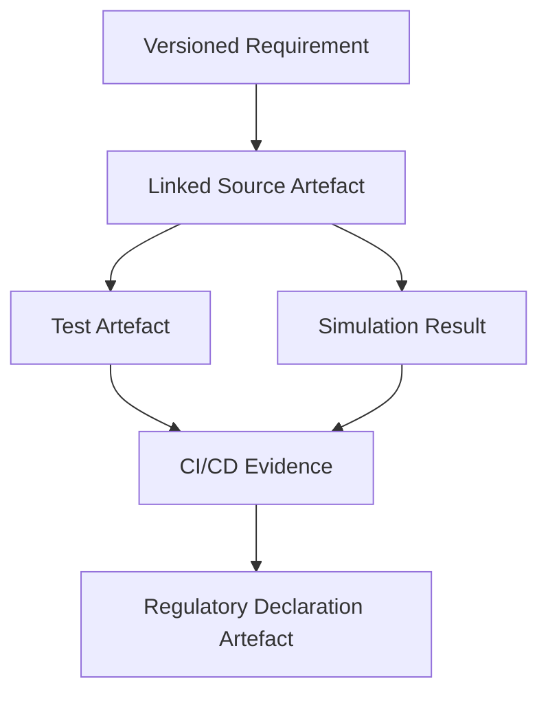

### Purpose and Framing of the Case Studies

The preceding chapters have established the conceptual and procedural foundations of the Cornerstone Framework, articulating its principles, core governance constructs, and practical methods for traceable, outcome-driven engineering. Yet, abstract models and normative prescriptions are only fully realized when subjected to the particularities of real product development projects—where the interplay of diverse artefacts, tooling landscapes, and cross-disciplinary teams exposes the subtleties, strengths, and necessary adaptations of any methodology. This section introduces the deliberate presentation of narrative case studies, each selected to illuminate how Cornerstone’s hybrid philosophy performs across varied product architectures, regulatory contexts, and organizational scales.

The rationale for these case studies is twofold: firstly, to validate the universality and adaptability of the Cornerstone approach; secondly, to surface the nuanced technical, organisational, and lifecycle considerations that emerge in practical settings. By situating the abstract mechanisms of artefact-centric traceability, adaptive governance, and outcome-based measurement within the texture of real-world product flows, the framework’s core architectural patterns—such as versioned artefact stores, policy-as-code pipelines, and federated metric instrumentation—can be critically examined for their actual impact, integration boundaries, and emergent trade-offs.

#### Case Study Selection and Representational Scope

To expose the breadth and agility of Cornerstone, the case studies have been chosen to span the spectrum from pure digital products (e.g., SaaS platforms), through hybrid embedded systems (typifying firmware-hardware-software integrations), to complex electromechanical assemblies subject to stringent regulatory constraints. In each instance, the aim is not merely to demonstrate technical compliance or abstract “success,” but rather to reveal the unique artefact patterns, governance calibrations, and estimation behaviours that arise, along with the interaction of technical artefacts and organisational policy layers.

This deliberate diversity surfaces several axes for comparative analysis. For instance, whilst the centrality of Docs-as-Code and artefact versioning is a common thread, the implementation detail—such as the granularity of traceability matrices, use of automated evidence gathering in CI/CD, or the calibration of policy-as-code for lightweight versus heavyweight governance—is shaped by factors such as regulatory intensity (e.g., medical device standards versus consumer IoT), lifecycle velocity, and cross-domain integration density. The workflow realities and resistance points—such as integrating legacy physical artefacts or refactoring team estimation practices—are addressed not as edge-cases, but as inherent system properties requiring reasoned architectural and policy responses.

#### Mechanism and Thematic Structure

Each narrative study methodically traces the lifecycle of critical artefact classes (e.g., requirements, design documents, source code, simulation models, manufacturing specifications), elucidating Cornerstone’s impact at the seams where disciplines meet: the translation of user-centric outcomes into versioned requirements, the propagation of traceability through source and physical artefact flows, the instrumentation of estimation buffers, and the surfacing of compliance evidence by automated pipelines. The studies examine both the steady-state (how the framework establishes predictable, traceable delivery) and exception paths (mechanisms for managing change, reconciling legacy systems, or responding to emergent risk). Where appropriate, practical organizational integration points—such as role-specific artefact responsibilities, handoff structures, and policy-driven escalation paths—are explained in the context of Cornerstone’s governance spectrum.

At the architectural level, diagrams and workflow representations will pinpoint the mechanisms by which artefact states, policy assertions, and evidence artefacts flow between disciplines and repositories. For example, the relationship between a versioned requirements artefact, linked source commits, automated test artefacts, and regulatory declaration dossiers can be succinctly illustrated by a directed acyclic graph (DAG) structure, embodying the dual principles of traceability and auditability. Such representations serve not only as documentation of process, but as concrete guides for practitioners seeking to implement or adapt the framework in their own contexts.

#### Practical Integration and Lifecycle Realities

A central aim in presenting these case studies is to provide a grounded view of both the enabling and limiting factors of the Cornerstone approach. The analysis addresses integration considerations such as harmonizing schema across discipline-specific toolchains, automating artefact capture within heterogeneous CI/CD pipelines, and propagating governance state changes through policy-as-code. Furthermore, the studies elucidate organizational touchpoints—policy stewardship roles, artefact ownership models, and the reconciliation of artefact flows during scaling or regulatory audits.

Beyond technical integration, the studies explore key lifecycle tensions: the calibration of documentation rigor to avoid both under- and over-governance; the practicalities of policy evolution in the presence of legacy artefacts; and the measurement of outcome metrics across partial product boundaries. Failures—be they due to traceability breakdown, artefact orphaning, or estimation misalignments—are not omitted, but instead analysed for root cause and policy response, reinforcing the framework’s empirical, feedback-driven orientation.

#### Concluding Framing

In sum, these case studies anchor the previous theoretical exposition in the complexities of practice, demonstrating how Cornerstone’s artefact- and policy-centric philosophy mediates the competing demands of rigor, adaptability, and flow. By documenting both the mechanics and realities of workflow adoption, technical integration, and governance calibration, they illuminate a path forward for engineering organizations seeking reproducible, value-aligned delivery in the face of ever-increasing complexity and cross-domain interdependence.