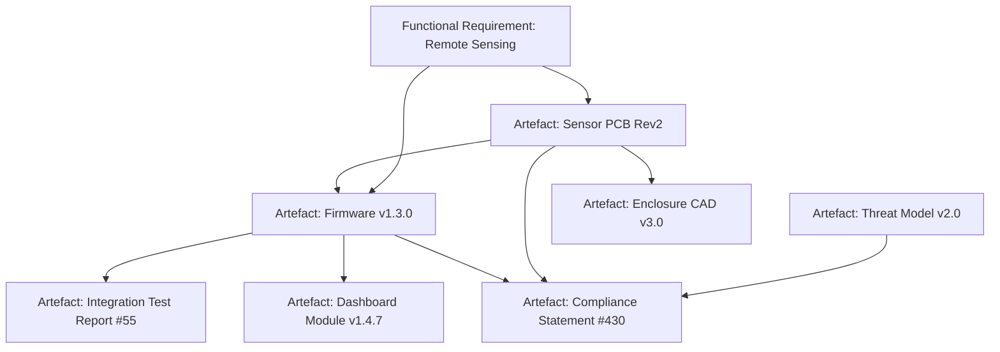
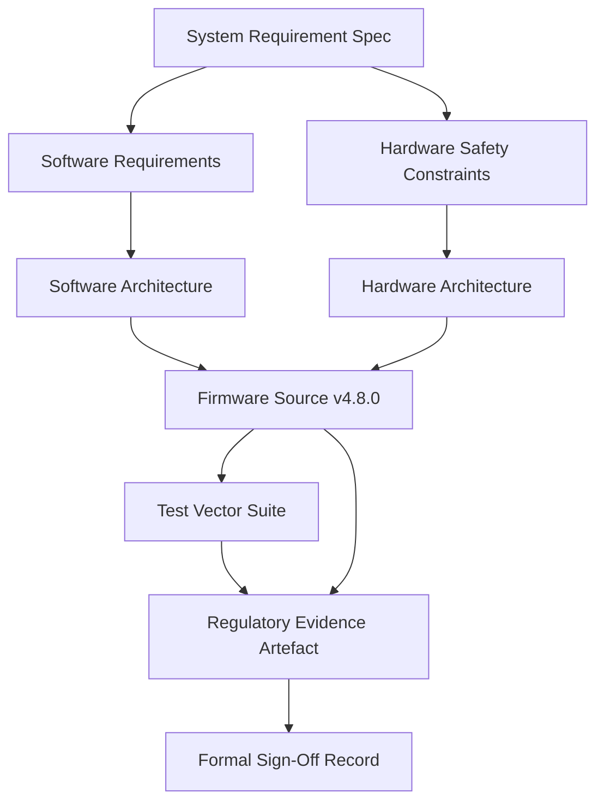

# Case Studies in Artefact-Centric Product Delivery

This section examines the practical application of the Cornerstone framework in three diverse product environments: an end-to-end IoT system for critical infrastructure monitoring, a regulated defence embedded avionics subsystem, and a mass-market consumer electronics platform. Each case study explores how artefact-centric traceability, adaptive governance, and policy-driven estimation enable reproducibility and value alignment. In doing so, they illuminate the distinctive integration points, organizational adaptations, and lifecycle challenges that surface across disciplinary boundaries. The analyses emphasize how artefact behaviors and policy propagation modulate delivery rigor, reinforce compliance, and guide adaptive learning, rather than prescribing surface-level process compliance.

---

## 1. Critical Infrastructure IoT System

### Context and System Overview

A multi-disciplinary team is tasked with developing a secure, remote sensing platform designed for continuous monitoring of water treatment facilities. The solution comprises distributed sensor nodes (embedded and ruggedized), edge gateways, cloud data stores, analytics services, mobile clients, and a suite of operator dashboards. Non-functional requirements—cybersecurity hardening, resilience, regulatory data retention, and low-latency alerting—impose cross-domain constraints. The project spans firmware, hardware, mechanical packaging, edge and cloud software, and user-facing applications, all governed within a single delivery program.

### Artefact Classification and Lifecycle Interactions

Under Cornerstone, each major artefact class—requirements, hardware designs, firmware binaries, enclosure models, schema definitions, compliance evidence, integration test results, deployment manifests—enters the traceability mesh as a versioned, policy-governed entity. Each artefact’s lifecycle is closely coupled with cross-domain change: a sensor PCB revision (hardware artefact) can trigger a firmware interface contract update (software artefact) and necessitate a revised compliance signature (evidence artefact). Artefact schemas include version, provenance, policy, and explicit downstream and upstream dependency metadata.

Documentation follows the Docs-as-Code paradigm. For example, the formal threat model is authored as a Markdown artefact with embedded architectural diagrams, reviewed in the same continuous integration (CI) pipeline as the software, and versioned in the same artefact repository as executable code. Hardware CAD releases and test run records are similarly versioned and referenced by hash, not by ambiguous document versions or email chains.

The following Mermaid diagram represents an extract of the cross-domain artefact DAG (directed acyclic graph), showing dependency and traceability relationships for a sensor board revision:



Each node is accessible through the artefact store; state transitions (such as "release pending", "approved", "superseded") are audited and policy-validated.

### Adaptive Governance: Dynamic Rigor Throughout the Lifecycle

Cornerstone’s governance calibration is manifest in the selective application of policy artefacts as the program evolves. Early feasibility sprints operate under a Lightweight regime; device interface requirement artefacts are loosely specified, with wide latitude afforded for rapid prototyping. As the system pivots into structured engineering and early regulatory engagement, governance shifts to Balanced: hardware, firmware, and cloud schemas are aligned against policy-as-code, enabling cross-discipline schema harmonization. Artefact reviews are required for critical dependencies, with trace matrices generated to satisfy both regulatory and internal audit needs.

When subsystems approach productionization—particularly as regulatory audits and security certifiers require formal evidence chains—a subset of artefacts, such as compliance test results, regulatory submission packages, and approved threat models, become subject to Heavyweight governance. These artefacts must meet stricter review gates, multi-factor approval, deeper provenance checks, and formal sign-off by policy stewards. The governance state of each artefact is itself versioned, and policy updates are atomic—they only apply forward, ensuring trace and rollback capability for compliance audits.

Practical application reveals that, where governance footprints are dynamically calibrated, team velocity is preserved during high-uncertainty exploration, yet robustness and compliance evidence mature automatically as artefact classes cross policy thresholds.

### Estimation, Buffers, and Feedback Loops

Estimation practices in this environment are shaped by the inherent cross-domain unpredictability. Firmware development (subject to hardware bring-up constraints) and enclosure production (constrained by manufacturing lead times) each maintain artefact-scoped buffers, explicitly versioned and policy-tracked. These buffers absorb deviation arising from factors such as component obsolescence, field-reported firmware issues, or evolving cybersecurity requirements. Using historical artefact state transitions, empirical buffer calibration enables more reliable forecasting for subsequent cycles; for example, the time delta between PCB release artefacts and successful firmware sign-off is tracked and exposes recurring bottlenecks in hardware-firmware integration.

As artefact interdependencies are tightly versioned and instrumented in the artefact store, discrepancies between forecasted and realized state transitions feed into automated feedback loops. Policy-as-code rules periodically re-tune buffer artefacts, adjusting rigor to discipline-specific drift, risk events, or workflow changes—closing the loop between estimation, delivery, and policy governance.

### Failure Modes and Adaptation

Adoption surfaces several principal failure modes. Early attempts to apply production-grade governance to all artefacts result in over-documented, slow-moving feasibility sprints; recognition of this anti-pattern leads teams to refine their governance calibration, deferring Heavyweight rigor to policy triggers linked to artefact readiness. Additionally, failure to harmonize artefact schemas between mechanical, hardware, and cloud teams results in traceability gaps—detected when compliance artefacts cannot be generated without manual reconciliation. Localization of schema definitions into a federated but harmonized structure eliminates such bottlenecks. Artefact orphaning (e.g., firmware builds released before hardware review) is mitigated by making artefact dependency checks mandatory in CI pipelines, enforcing policy-as-code invariants upstream of release.

The net effect is a reproducible, traceable, and value-aligned delivery pipeline, in which artefact-centric governance supports both rapid exploration and rigorous compliance, and in which estimation is empirically tuned by cross-domain artefact histories.

---

## 2. Defence Embedded Avionics Subsystem

### Context and Program Architecture

In this example, a cross-organizational consortium is contracted to deliver the mission management subsystem for a next-generation airborne surveillance platform. The system integrates real-time flight control logic, fault-tolerant interconnects, secure storage elements, and a multi-domain communication gateway—spanning safety-critical embedded firmware, COTS hardware, custom mechanical mounts, middleware, and human-machine interfaces.

Defence and aviation standards (e.g., DO-178C, DO-254, MIL-STD-882, ISO 15288) dominate program constraints. Artefacts not only require detailed versioning, but must support formal configuration audits, evidence traceability through requirement–design–code–test links, and demonstrable policy conformance for each lifecycle phase.

### Artefact Behaviour under Rigid Regulation

The artefact catalogue is broad and hierarchical: high-level operational requirements are decomposed into software item requirements, hardware safety flows, derived regulatory constraints, and extensive verification artefacts. Each artefact—from system requirement specifications to FMEA reports, source code captures, test vectors, code review records, and signed-off builds—must be persistently traceable.

Artefact lifecycles, rather than being monolithic, are described as tightly-coupled state machines. As artefacts mature, their governance mode evolves according to policy artefacts codifying stage gates mirroring the V-model: preliminary artefacts (e.g., high-level requirements, architectural options) are managed with Balanced governance; as design is baselined and enters implementation, artefacts shift to Heavyweight. Each artefact’s state transition—such as "draft" to "baselined", "implemented" to "verified", or "approved" to "released"—is versioned and tied to explicit digital signatures, role-based approvals, and policy checksum validations.



Each relationship is enforced by policy-as-code and audited in a central artefact registry, itself validated through periodic CCB (Configuration Control Board) audits.

### Policy-Driven Workflow and Organizational Integration

The scale and criticality of the program result in federated artefact repositories mapped to discipline and supplier boundaries. Policy artefacts codify handoff responsibilities, approval chains, and cross-organizational review cadences. Role-based access is governed as codified policy: engineering, safety, security, and quality teams each have defined artefact stewardship responsibilities. For instance, a hardware failure analysis artefact must be cross-signed by both hardware leads and reliability authorities; software verification artefacts may require regulatory witness and external validation scripts, all instantiated as versioned artefacts.

Continuous integration is divided by discipline: software artefacts traverse deep automated test pipelines, while hardware artefacts—subject to longer lead times—are gated on simulation artefact passage and physical verification runs. Their state transitions are harmonized through policy, ensuring that, for example, software cannot progress to final acceptance unless the dependency chain from hardware test artefacts to software integration outcomes is “green” in the artefact store.

### Estimation Under Policy Regimes

Estimation in this regulated environment acquires an additional policy dimension. Buffers are not ad hoc, but must be justified as artefact policies, reviewed and updated at every stage gate and configuration review. Program management artefacts—such as schedule estimates, risk registers, and buffer artefacts—reference empirical artefact histories for their calibration. For instance, every failed verification artefact event increases the risk-weighting for future test buffer artefacts, capturing the recursive feedback prescribed by Cornerstone. Artefact review histories are themselves valued as evidence artefacts, satisfying external audit requirements.

Policy-as-code imposes risk-sensitivity on estimation decisions. Regulatory change, observed through the emergence of new compliance artefacts or changes in standards, propagates policy updates not only to artefacts directly affected, but also to buffer artefacts farther up the chain, as dictated by dependency metadata in artefact stores.

### Failures, Trade-offs, and Practical Outcomes

Applying artefact-centric, policy-driven delivery to defence environments necessitates organizational and tooling transformation. Early in adoption, the most common failure mode surfaces as partial digitalization: artefacts may be recorded in digital repositories, but legacy approval, review, or CCB processes remain manually decoupled, resulting in inconsistent traceability. A further challenge is artefact schema drift between suppliers or teams, most acutely observed in test and verification artefact formats; this is often remedied by formalizing schema harmonization as a policy-governed meta-artefact.

Trade-offs are evident: while artefact histories and automated traceability matrices reduce cost and regulatory risk in the long run, upfront overhead increases, especially during initial policy migration and schema standardization. However, the gains in cross-organizational alignment, reduced audit risk, and empirically managed estimation accuracy ultimately validate the approach.

In sum, artefact-centric practice under Cornerstone allows disciplined, adaptive delivery within rigid regulatory regimes, harmonizing organizational responsibility, estimation, and compliance in a reproducible digital backbone.

---

## 3. Mass-Market Consumer Electronics Platform

### Environment and System Complexity

The final case study concerns the rapid delivery and iterative scaling of a consumer “smart speaker” ecosystem. This includes an embedded audio device, companion mobile applications (iOS and Android), cloud-based personalization services, and integration with third-party ecosystems. Market and timing pressure is extreme: time-to-market is measured in quarters, with competitive advantage hinging on device launch synchronicity, software-app update cycles, and the rapid introduction of differentiating features.

Engineering teams are distributed globally across embedded software, app development, cloud, and hardware mechanical design. Consumer standards (EMC, WEEE), app-store policies, and certain privacy regimes add governance complexity, but nowhere near the stringency of regulated domains.

### Artefact Governance for Flow and Traceability

Rapid delivery is achieved by applying Cornerstone’s artefact-centric model for velocity, without sacrificing traceability or reproducibility. Artefact classes comprise device firmware builds, app versions, audio processing pipeline configurations, cloud API contracts, industrial design source files, regulatory compliance declarations, field diagnostics, and usage analytics. Each artefact includes version, originating team, dependency relations (such as firmware-to-app or app-to-cloud contract maps), governance state, and outcome metric links.

Docs-as-Code is ingrained: all public documentation (for end-user help and internal interfaces) lives in markdown, subjected to the same CI/CD pipelines as code. Artefact ownership, review policy, and release gating are explicit and automated. Artefact policies reflect the practicalities of the market: critical launch artefacts (e.g., final firmware, bill-of-materials, app build manifest) can be moved to Heavyweight governance for the brief period around release candidate builds, and then de-escalated post-launch as product stabilization allows.

A sketch of the artefact landscape and trace flows for a new feature release is illustrated in the following Mermaid diagram:

```mermaid
graph TD
    FEAT201[Feature Requirement: Multi-room Sync]
    FW220[Device Firmware Build v2.2.0]
    APPIOS[App Build (iOS) v3.1.0]
    APPANDROID[App Build (Android) v3.0.9]
    CLOUDAPI[Cloud API v1.4.0]
    UXDOC[UX Spec Doc v1.1]
    TEST302[Integration Test Run #302]
    COMPL501[Regulatory Self-certification #501]

    FEAT201 --> FW220
    FEAT201 --> APPIOS
    FEAT201 --> APPANDROID
    FW220 --> TEST302
    APPIOS --> TEST302
    APPANDROID --> TEST302
    FW220 --> COMPL501
    CLOUDAPI --> APPIOS
    CLOUDAPI --> APPANDROID
    UXDOC --> APPIOS
    UXDOC --> APPANDROID
```

Every artefact referenced in the release pipeline is surfaced through the artefact store, enabling formal handoffs across teams and propagating traceability through continuous delivery.

### Dynamic Governance and Policy Application

Governance agility is essential. Early-stage ideation and rapid prototyping occur under Lightweight governance; cross-functional squads iterate on interface agreements and app flow definitions with minimal review overhead. As code and assets stabilize and cross into integration pipelines, artefact state transitions trigger escalated review gates—Balanced governance—particularly at the boundaries between firmware, app, and cloud teams.

Automated policy-as-code mechanisms support this shifting landscape. For each release candidate, a versioned governance artefact enforces dependency checks, CI sign-off, and explicit regulatory artefact verification. Artefact histories and traceability evidence are surfaceable for audit, troubleshooting, or field incident review, closing the loop between rapid delivery and operational traceability.

Post-launch, feedback artefacts originating from field diagnostics or analytics events are linked back to design and implementation artefacts, enabling root-cause trace and live policy recalibration. This is of particular importance in the context of rapid hotfix and minor version cycles, where outcome-based metrics (e.g., field failure rates, regression time-to-repair) take precedence over raw feature counts.

### Estimation, Buffers, and Adaptability in Practice

Given the compressed timelines, estimation artefacts in this context are highly adaptive. Rolling buffer artefacts are maintained for high-change dependency classes—such as firmware-to-app contracts and cloud API interface stubs. These buffers are calibrated using both near-term artefact transition histories and cross-release analytics; buffer “debt” (where actual overrun exceeds planned buffer) is treated as a policy signal for governance review prior to the next sprint or cycle.

Where estimation deviates from realized artefact flow—e.g., repeated schedule slippage due to underestimated app–cloud contract integration—metrics propagate into artefact review histories, making resource or buffer adjustments a formal, versioned decision. Policy artefacts trigger lightweight post-mortem reviews and buffer adjustments, reinforcing traceable and adaptive estimation without undermining velocity.

### Failure Manifestations and Organizational Learning

Common failure patterns include artefact orphaning—where, for instance, firmware features are shipped that lack synchronized documentation or cloud support. Initial resistance to explicit artefact ownership or review policy is often observed where teams are globally distributed and culturally diverse. However, surfacing traceability as a delivery enabler, rather than bureaucratic overhead, reduces friction; feedback artefacts supporting positive outcome measurement drive voluntary policy adoption.

Other trade-offs include the extent to which governance can be relaxed to accelerate delivery. Over-reliance on Lightweight policy, especially in the final approach to launch, surfaces as inadequate defect detection or incomplete compliance reporting. Artefact-based policy recalibration, driven by outcome artefact flow and post-launch incident analytics, helps restore balance without regressing to rigid process handbooks.

Collectively, artefact-centric delivery supports rapid adaptation and robust release governance, yielding a delivery system fit for competitive consumer markets yet resilient to real-world traceability and reproducibility demands.

---

## Cross-Case Analysis and Synthesis

Through these case studies, the operational modes of the Cornerstone framework are manifest across three axes: domain-driven governance adaptation, artefact-centric boundary management, and empirical, feedback-driven estimation.

* In the high-compliance world of defence avionics, artefact-centric policy unifies digital and organizational traceability scaffolds, overcoming complexity at the price of initial investment and risk of residual manual processes.
* The IoT infrastructure scenario reveals the necessity of dynamically calibrated governance footprints and deep schema harmonization, aligning multi-disciplinary artefact behavior to both innovation and regulatory imperatives.
* Consumer product delivery demonstrates how velocity and adaptability can be reconciled with lightweight yet rigorous artefact governance, provided that feedback and estimation flow through versioned artefact mechanisms.

In all environments, artefact visibility, federated policy governance, and the empirical encoding of both estimation and compliance underpin Cornerstone’s reproducible, adaptive product development. These case studies validate the framework’s capacity to mediate rigor, adaptability, and value flow—anchoring sustainable delivery, regardless of system complexity, compliance demand, or organizational scale.