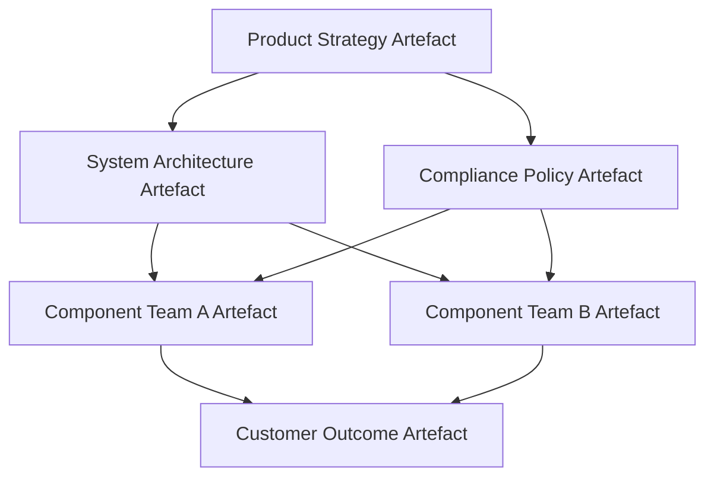

### Scaling Product Delivery Beyond Team-Level Agility

#### Introduction

The widespread adoption of agile methodologies has profoundly shaped how engineering teams structure their work, prioritize value flows, and adapt to changing requirements. However, the origin and canonical implementations of agile—most notably described in frameworks such as Scrum and XP—were consciously crafted for small, cross-functional teams operating within relatively tight scopes. The strengths of such team-level agility are significant: short feedback loops, direct stakeholder communication, minimal coordination overhead, and high adaptability to emergent needs. Yet, when the context shifts to large-scale programmes—spanning dozens or hundreds of contributors, multidisciplinary domains, and complex regulatory or lifecycle constraints—these approaches expose fundamental limitations. Scaling is not a linear extrapolation of team-level practices; rather, it introduces qualitatively new forces, failure modes, and coordination challenges that must be addressed at both the architectural and governance layers.

#### The Nature of Scaling: Emergent Complexity and Dependency Networks

At its core, scaling invokes the challenge of managing emergent complexity. Within a single agile team, dependencies are mostly internal and explicit; architectural and delivery decisions can be made in a context where shared understanding is relatively easy to maintain, even as team composition or scope evolve. In contrast, in large systems-of-systems or platform programmes, the dependency network becomes both wider and deeper. Teams begin to specialize along domain or component boundaries—firmware, hardware, cloud, safety, compliance—each with its own artefact classes, policies, and cadences.

Complexity reveals itself in several forms: the sheer explosion of artefacts, cross-team (and cross-organisation) dependencies, version coordination, and the emergence of interface contracts that must be honoured across evolving implementations. Coordination is no longer an exercise in intra-team stand-ups or retrospectives; it requires durable, structured alignment mechanisms. Informal coordination practices fail to scale, and synchronous communication—feasible in small teams—quickly becomes a bottleneck across large federations of teams.

This dynamic is further compounded by the need for robust cross-disciplinary traceability, regulatory compliance, and outcome measurement. Increasing scale introduces more artectual boundary surfaces and raises the likelihood of drift—both in artefact schema and alignment with intended outcomes. Unmanaged, this leads to integration failures, misaligned deliverables, and value erosion.

#### Alignment as a Systemic Concern

In small teams, alignment is relatively straightforward. High-bandwidth communication and shared context minimize the risk of divergent goals or interpretations. At scale, alignment cannot rely on osmosis or charisma; it must be made tangible and persistent through process, governance, and artefact-centric documentation. This is essential not only for technical consistency but also for the realization of strategic objectives, regulatory mandates, and customer value.

The Cornerstone framework frames alignment as a system-wide architectural concern, not merely a management issue. Architectural intent and systems goals are codified as versioned artefacts—architectural blueprints, interface contracts, policy definitions—linked through traceable dependency chains. This creates an explicit fabric through which teams, regardless of their immediate context or discipline, can discover the contractually agreed interfaces, compliance constraints, and product-level objectives guiding their implementation.

Mermaid Diagram: Scaled Alignment and Dependency Relationships

Here, even as teams C and D operate semi-autonomously, their artefact outputs are aligned to both common architectural direction (B) and overarching compliance and outcome artefacts (E, F). The structure embodies the move from broadcast alignment to traceably codified alignment.

#### Dependency Management: Beyond Sprint-Level Coordination

Team-level agility emphasizes local optimization through manageable work-in-progress (WIP) limits, frequent increments, and minimal external dependencies. Large-scale delivery environments, conversely, cannot avoid high-order dependency networks. These dependencies frequently span discipline boundaries, technical stacks, and organizational units. Management techniques must therefore transition from informal tracking to explicit, artefact-based dependency modelling, governing both logical (data, interface, protocol) and policy (compliance, quality, architectural) relationships.

Within the Cornerstone framework, dependencies are first-class artefacts: interface definitions, contract specifications, and compliance requirements are all versioned and traceable. Explicit dependency chains are constructed and regulated, with state transitions (e.g., interface freeze, policy escalation) captured as policy events or workflow artefacts. This enables not only forward planning and integration forecasting, but also change-impact analysis and managed decoupling.

Importantly, dependency management at scale carries both architectural and workflow implications. From an architectural perspective, strong encapsulation and well-defined interfaces become not just desirable, but vital for controlling integration risk and enabling incremental delivery. From a workflow perspective, the governance system must prevent "invisible" dependencies, instead surfacing all material links through artefact traceability, audits, and synchronized planning cycles.

#### Documentation as a Foundation for Distributed Understanding

Documentation at team-level is often streamlined—user stories, lightweight architectural sketches, in-line comments—reflecting the immediacy and context-sharing possible within a small group. At scale, such informality undermines coherence and becomes a source of fragmentation and technical debt. The distributed nature of large programmes, often exacerbated by geographic and organizational boundaries, demands durable, discoverable, and consistently versioned documentation.

Cornerstone’s adoption of Docs-as-Code serves as an architectural pillar for scalable documentation. Artefacts are treated as code: versioned, reviewed, traceable, and linked into delivery workflows. This approach standardizes the management of requirements, design specifications, interface contracts, and compliance evidence, ensuring they evolve in step with system changes. Automated validation (schema checks, policy enforcement), continuous documentation builds, and in-line review histories provide assurance that shared understanding remains current and actionable.

The practical engineering reality is that documentation goes beyond mere compliance; it is the backbone of federated development. Interface agreements, policy constraints, estimation baselines, and change rationales must be accessible and trustworthy—not only to satisfy regulatory scrutiny, but to mitigate integration friction and promote cross-team empathy.

#### Team-of-Teams Collaboration: Federation, Not Coordination

Traditional scaling strategies often default to expanded coordination structures: more meetings, cross-team stand-ups, escalation roles. While necessary to some degree, these mechanisms scale poorly and create bottlenecks. Cornerstone advances a federated team-of-teams model, wherein independently managed teams are bound not by centralized control, but by contractually explicit artefact relationships and policy-driven governance.

This federated approach thrives on artefact-centric interfaces: teams publish versioned outputs (e.g., firmware binary, verified interface contract), expose consumption points (e.g., test stubs, compliance artefacts), and reference upstream definitions (e.g., architectural intent, regulatory policy). Governance mechanisms ensure that teams retain autonomy in delivery methods while aligning outputs to system-wide objectives and compliance standards.

Practically, this shifts the locus of integration risk from dynamic organizational negotiation to statically encoded artefact dependencies. Failure modes are less likely to materialize as late integration surprises and more likely to be surfaced as policy violations, unfulfilled interface contracts, or traceability breaks—each of which can be detected, audited, and remediated incrementally.

#### Failure Modes and Trade-offs in Scaling Scenarios

Scaling introduces not only new modes of operation but also distinctive failure mechanisms. The most pervasive include integration breakdowns, artefact drift, compliance gaps, and the ossification of value delivery pipelines. These failures are seldom the result of poor individual performance; rather, they emerge from misaligned artefact flows, incomplete or ambiguous dependency traces, and lax documentation discipline.

Architectural trade-offs at scale invariably pit autonomy against alignment, speed against rigor, and flexibility against compliance. For example, highly modular component teams gain delivery velocity, but risk diverging interface assumptions unless governed by robust contract artefacts and synchronized policy transitions. Conversely, over-centralized dependency management can throttle adaptation and reduce resilience to change. Recognizing and balancing these trade-offs is a core responsibility of systems and technical leaders implementing the Cornerstone framework.

#### Lifecycle Variation and Organisational Implications

Programme scale imposes variable rigor across the delivery lifecycle. Early stages—prototyping, conceptual design—may admit loosely-coupled artefact flows and experimental iterations, while later stages—regulatory review, customer delivery—demand stringent, audit-ready documentation and strict dependency management. Artefact policy thus adapts dynamically, calibrated by lifecycle phase, risk profile, and compliance threshold. This was evident in the preceding case studies, where policy rigour rebalances in response to failure, discovery, or regulatory triggers.

Organisationally, scaling compels new roles and responsibilities. Artefact stewards, policy owners, and compliance architects emerge as vital actors, mediating cross-team dependencies and ensuring schema harmonization. Team-of-teams operation demands new protocols for artefact handover, design negotiation, and outcome validation—protocols that are themselves encoded and versioned within the governance layer. This marks a departure from purely people-centric or process-driven scaling models, cementing artefact flow as the operational backbone.

#### Conclusion: Scaling as Emergent Systems Engineering

Scaling product delivery is not the mere repetition of team-level agility at higher numbers. It is a systems engineering undertaking wherein artefact flow, dependency management, policy governance, and documentation discipline collectively underpin programme coherence, adaptability, and value realization. The Cornerstone framework provides both the architectural vocabulary and practical mechanisms to encode alignment, surface dependencies, institutionalize collaboration, and sustain flow as scale magnifies. Adopting such an artefact-centric scaling philosophy positions organizations to navigate complexity, absorb risk, and deliver outcomes—regardless of technical or organizational scale.