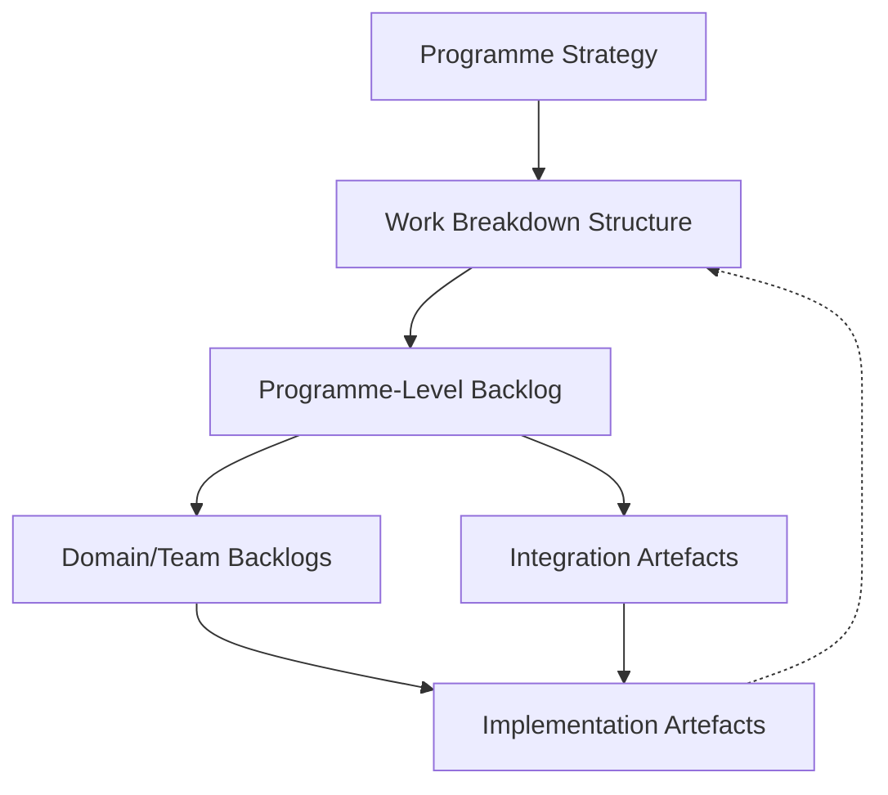

# Strategic Planning, Work Breakdown Structures, and Programme-Level Backlogs

## The Rationale for Strategic Alignment in Large-Scale Programmes

The expansion of product development efforts from the scope of individual or small cross-functional teams to the complexity of large-scale programmes fundamentally alters the means and mechanisms by which work must be organized, aligned, and executed. The artefact-centric, policy-driven approach central to the Cornerstone framework does not dispel the inherent challenges of scale—rather, it provides the scaffolding needed to maintain traceability, compliance, and alignment as organizations engage in the parallel development of multiple subsystems, often across distinct engineering domains.

Central to this undertaking is a systematic approach to planning that bridges high-level strategy with the discoverable realities of iterative delivery. At the heart of such planning lies the articulation of value streams, the decomposition of objectives into actionable elements, and the orchestration of dependencies across distributed delivery teams. The classical tools for such endeavors—strategic planning, the work breakdown structure (WBS), and programme-level backlogs—remain invaluable, but their application and evolution within a hybrid, artefact-centric framework require precision, rigorous traceability, and a more explicit architecture for flow.

### The Nature of Strategic Planning Within Cornerstone

Strategic planning in the Cornerstone context is both the periodic crystallization of organizational intent and an ongoing process of adaptation mediated by versioned, policy-governed artefacts. Unlike linear, monolithic planning models, the Cornerstone framework acknowledges that strategy and its instantiations (programme objectives, milestones, value propositions) must be consistently versioned, auditable, and directly mappable to the flow of dependent artefacts beneath them. This principle ensures that strategic intent remains accessible to mechanisms of reconciliation with operational reality, regulatory evolution, and empirical feedback from ongoing development work.

Cornerstone does not relegate strategic artefacts to static documents or presentations. Instead, strategic objectives, key results, and initiative definitions are discoverable, versioned artefacts—governed under a policy engine, discoverable to delivery teams as sources of truth, and mapped explicitly to downstream design, requirements, and validation flows through traceability mechanisms. This architectural treatment transforms them from aspirational guides into operational levers; their versioned changes, rationale, and policy-status surface the dynamic negotiation between ambition, feasibility, and emergent risks.

### Mechanisms for Programme Alignment

In multi-domain, large-scale programmes, explicit alignment mechanisms are essential to avoid the dissipation of intent into fragmented execution. Cornerstone’s emphasis on artefact-centricity extends upwards: programme strategies are structured such that their decomposition—via work breakdown structures and programme-level backlogs—can be explicitly traced to the evolving set of requirements and architecture artefacts at the discipline, sub-system, or team level.

Alignment, in this context, is operationalized through the following mechanisms:

- **Traceability from Strategy to Systems:** Using versioned links, each decomposed planning artefact is explicitly connected to system-level and domain-level requirements, architectural decisions, and interface contracts. This allows for dynamic impact analysis when strategic pivots occur, and for empirical surfacing of misalignment where downstream artefacts diverge from upstream strategic rationale.
- **Policy-Driven Acceptance Criteria:** Each planning artefact—be it an objective, milestone, or WBS element—incorporates machine-executable policy hooks that define completion, compliance gates, and escalation conditions. This ensures that misalignment is surfaced not only through traceability breaks but also through policy enforcement failures.

## The Role of the Work Breakdown Structure (WBS) in Artefact-Centric Programmes

The WBS remains one of the few enduring planning constructs that has systematically demonstrated value in bridging the gap between intent and execution in large engineering efforts. Within the Cornerstone philosophy, its role is not diminished but rather reframed: the WBS is elevated from a static, up-front planning device to a living, policy-governed artefact—fully versioned, explicitly mapped into the dependency and traceability landscape.

### Decomposing Complexity: From Programme to Work Segments

A well-articulated WBS decomposes large, ambiguous programme objectives into a hierarchy of actionable work segments. In traditional practice, the WBS serves as a taxonomic tool, organizing scope without dictating schedule or resource allocation per se. The artefact-centric model extends this by requiring each WBS element to function as a traceable artefact—specifying not only “what” is to be delivered, but the policy boundaries and dependency fingerprints that define its fit within the broader systems context.

This structuring creates explicit surfaces for cross-team or cross-domain interaction, making dependencies, integration obligations, and shared milestones discoverable artefacts themselves. When the WBS is governed under docs-as-code and policy-as-code infrastructure, each alteration (for example, a change in a work segment’s definition due to evolving architectural understanding) is captured as a versioned change, with rationale and upstream/downstream impact made transparent.

### Dynamic Maintenance: The WBS as a Living Artefact

Large programmes rarely proceed in strict accordance with a static plan; requirements evolve, technical risks are surfaced, and feedback loops from early integration or prototyping provoke necessary adjustments. Cornerstone mandates that the WBS remain a living artefact—proactively maintained, versioned, and reconciled against empirical delivery progress and discovered constraints. This enables both auditability and adaptive re-planning.

The practical requirement for such dynamic maintenance introduces specific mechanisms:

- **Bidirectional Traceability:** All WBS elements maintain trace links to both their strategic rationale (often through programme objectives or value streams) and the artefacts they decompose into (requirements, designs, code, test evidence). Changes in downstream artefacts (e.g., evidence of infeasibility) may initiate upstream reconsideration and WBS reversioning.
- **Policy Snapshots and Historical Audibility:** The full version history of the WBS is preserved, including the policy context in which each revision was made. This provides robust support for regulatory examination, compliance traceability, and post-mortem analysis.
- **Integration with Programme Backlogs:** The structure and state of the WBS are synchronized with the evolving programme backlog, ensuring that backlog items reflect both the current decomposition of work and policy boundaries on scope or acceptability.

This demand for continuous, rigorous upkeep counters the tendency found in traditional programme management to allow the plan to drift from reality. Instead, the WBS in a Cornerstone context is an operational artefact—not merely a project artefact—embedded in daily delivery tooling and processes.

## Programme-Level Backlogs: Orchestrating Flow, Dependencies, and Value Realization

The programme-level backlog is where the dynamic equilibrium between planning granularity and delivery adaptability is most forcefully negotiated. In contrast to team-level backlogs, which are tightly focused on immediate and tactical work, the programme-level backlog serves as the fulcrum for cross-domain alignment, dependency management, and outcome-focused steering.

### Structure and Behaviour of the Programme-Level Backlog

Within the Cornerstone framework, the programme backlog is constituted as a versioned, policy-governed artefact that aggregates, prioritizes, and connects work items originated from multiple sources: strategic objectives, decomposed WBS elements, integration needs, risk retirements, and compliance-critical deliverables. This aggregation is not a mere roll-up of team-level tasks but is constructed with organizational context and dependency visibility.

A key distinction in this approach lies in the explicit mapping and exposure of dependencies—both vertical (traceability from objective down to implementation artefact) and horizontal (inter-team, cross-domain integration points). This dependency graph is dynamic and updatable; deviations, blockages, and traceability breaks are made visible, enabling early detection and systemic orchestration of mitigation actions.

By treating the backlog as a central artefact—subject to the same change management and policy-control processes as other critical artefacts—Cornerstone ensures that backlog health (e.g., unbroken traceability, policy compliance, dependency clarity) becomes a continuously monitored signal, not an incidental byproduct.

#### Mermaid Diagram: High-Level Artefact Flow

The following Mermaid diagram illustrates the canonical relationships among programme strategy, WBS, and the programme-level backlog, underscoring traceability and dependency flow:

This diagram depicts strategy driving the WBS, which decomposes into the programme backlog. The backlog then feeds both domain/team-level backlogs and integration artefacts. Implementation artefacts contribute feedback to both the WBS and integration artefacts, closing the traceability and feedback loop.

### Integration of Backlog and Artefact Governance

Programme-level backlog management cannot be decoupled from artefact governance. Every item in the backlog is maintained as a traceable artefact, mapped back to its WBS segment, strategic rationale, and corresponding documentation. Docs-as-code approaches serve as the backbone for managing this information: every backlog modification, prioritization shift, or dependency reordering is preserved as a versioned change, with contextual commentary and policy justifications.

Programme-level backlogs in the Cornerstone philosophy are not solely concerned with the flow of feature or requirement delivery. They are equally the central nervous system for emergent risk management, compliance tracking, and surfacing of technical and integration debt—all treated as first-class backlog items whose resolution, deferral, or risk acceptance states are policy-governed and traceable.

### Managing Dependencies and Interfaces Across Backlogs

The orchestration of dependencies—one of the most persistent failure points in large programme delivery—is handled by establishing explicit, artefact-centric dependency contracts at the programme backlog level. Each dependency and interface commitment is made a versioned artefact, linked bidirectionally to the WBS, backlog items, and affected deliverables. Changes in interface definitions, for instance, trigger not only downstream technical work updates but also surface upstream in the programme backlog, promoting proactive re-allocation or risk mediation.

This approach requires sophisticated tooling and disciplined stewardship. Dependency and interface definition artefacts must be discoverable across the toolchains used by heterogeneous teams (mechanical, software, firmware, QA, etc.). Automated policy checks—executed as part of the docs-as-code pipeline—validate that integration points remain unbroken, dependencies are continuously managed, and risk accrual does not escape visibility.

## Artefact-Centric Programme Planning in Practice: Realities and Trade-offs

Strategic planning, WBS decomposition, and programme backlog management within the Cornerstone framework are neither bureaucratic hurdles nor optional overlays; they are the mechanism by which large-scale delivery upholds both adaptability and discipline. However, these mechanisms introduce practical considerations and trade-offs that must be acknowledged.

### Integration Points and Workflow Realities

At scale, programme-level artefact governance demands multiple integration points with existing enterprise systems—requirements databases, PLM/ALM tools, CI/CD pipelines, and regulatory compliance trackers. The necessity for bi-directional traceability means that programme artefacts often must federate information from heterogeneous sources, increasing orchestration complexity. Achieving seamless integration typically requires investment in custom tooling or middleware; standardization efforts (e.g., OSLC, ReqIF, SysML for requirements and architecture), while helpful, rarely eliminate all ad hoc translation needs.

A critical assumption underlying this approach is that delivery tooling and organizational culture can support disciplined artefact hygiene: strict version control, policy-managed reviews, and traceability as a required property of work, not a retrospective fix. In environments where teams or functional groups maintain local autonomy over tooling or process (common in federated delivery), establishing clear protocols and contracts for artefact interchange becomes even more vital.

### Policy Calibration and Change Propagation

One pragmatic reality is that dynamic policy enforcement—such as automated gates for backlog state transitions or WBS modifications—can generate significant friction if not judiciously calibrated to domain context and programme phase. For example, overly restrictive policy at early design phases may suppress necessary exploration, while lax policy late in development may allow traceability to degrade or compliance evidence to lag behind delivery. Cornerstone anticipates this by requiring policy artefacts themselves to be versioned and context-dependent, with escalation mechanisms for justified exceptions.

Changes at the WBS or strategic level—common in response to integration findings, customer feedback, or regulatory shifts—demand rapid and reliable propagation throughout dependent artefacts and backlog items. The practical challenge is to architect systems that support cascading change impact visibility while preventing tool-based overload or signal loss. Automated notifications, dependency graphs, and heated traceability dashboards can help, but require disciplined configuration and stewardship to prevent both alarming noise and missed risk signals.

### Lifecycle Realities and Programme Evolution

Strategic objectives, WBS elements, and backlog content are all subject to drift as programmes evolve through exploratory, development, integration, and sustaining phases. The effective application of the Cornerstone model implies continuous reconciliation: strategic artefacts are regularly revisited in light of delivery feedback, WBS elements are pruned or expanded based on emergent technical evidence, and backlog priorities are actively surfaced against evolving risk and value landscapes.

This lifecycle reality reinforces the conceptual discipline that artefacts at all levels—strategic, WBS, backlog, downstream technical—are part of a living, adaptive system. The cost of this adaptiveness is increased administrative overhead and the requirement for skilled stewardship. Its value is the reduced likelihood of strategic misalignment, missed dependency, or late-phase compliance and integration derailment.

## Organisational and Architectural Implications

The structural and workflow implications of artefact-centric strategic planning are substantial. Architecturally, a significant emphasis is placed on the clarity of artefact boundaries, the management of interfaces as first-class artefacts, and the construction of feedback flows not only among technical artefacts but also among planning and policy artefacts. This supports both vertical accountability (from strategic intent down to code or validated design evidence) and horizontal coordination (across disciplines, teams, or subsystems).

Organisationally, federated team-of-teams structures are rendered more effective by the explicit contract boundaries surfaced through WBS decomposition and backlog integration. Ownership of artefact classes—responsibility for maintenance, policy compliance, and traceability—becomes a key coordinator of team boundaries and interaction models. Stewardship roles for policy artefacts, WBS artefacts, and backlog health become institutionalized within the programme governance structure, providing the attention and expertise needed for sustained alignment.

The artefact-centric view of planning makes explicit the need for disciplined interfaces between not only technical systems but organisational units: programme boards, compliance authorities, enterprise architecture, and delivery teams all act through versioned artefact contracts. Feedback mechanisms from backlog health metrics, policy enforcement exceptions, and traceability break alerts allow for real-time escalation and cross-boundary collaboration.

## Failure Modes and Mitigation

Despite its rigor, the artefact-centric scaling approach is not immune to classical programme failure modes. Common patterns include WBS drift (failure to keep decomposition up-to-date with actual work), backlog bifurcation (undiscovered divergence between programme and team backlogs), and escalation latency (slow propagation of policy or dependency breaks to relevant parties). The Cornerstone response is to embed auditability, discoverable policy enforcement, and automated traceability health checks as normal operating properties of the programme artefact flow.

Cultural failure points—such as slow or reluctant adoption of artefact hygiene, or misalignment of local optimization incentives with systemic alignment—require sustained leadership attention, the explicit socialization of traceability and policy hygiene as delivery values, and the visible prioritization of corrective stewardship when misalignment is surfaced.

## Standards and Cross-Industry Convergence

Many of the core mechanisms described here align with, and are supported by, established standards in systems and programme management: PMBOK’s structured WBS principles, INCOSE’s definitions of traceability and requirement hierarchy, ISO 9001’s emphasis on documentation and auditability, and the emergence of OSLC and ReqIF for artefact interchange at the enterprise level. The Cornerstone model does not require wholesale abandonment or duplication of these, but provides a modular, artefact-centric interpretation that enables their integration into modern, federated, agile-informed delivery organizations.

## Conclusion

In the context of large-scale, multi-domain product development, strategic planning, WBS decomposition, and programme-level backlog management acquire new structural and operational depth within an artefact-centric, policy-driven framework. Each construct becomes a living, versioned artefact—not a static plan. The interplay between these artefacts underpins alignment, dependency management, compliance, and adaptability, allowing organizations to navigate complexity without surrendering to either rigidity or chaos. In the Cornerstone framework, the discipline of artefact-centric programme planning is both an engineering and organisational cornerstone—foundational to sustained, auditable, and value-driven delivery at scale.