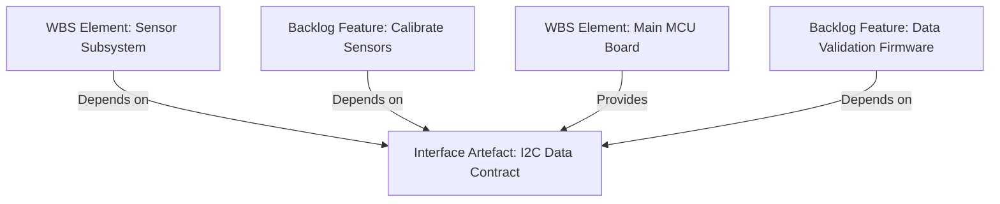
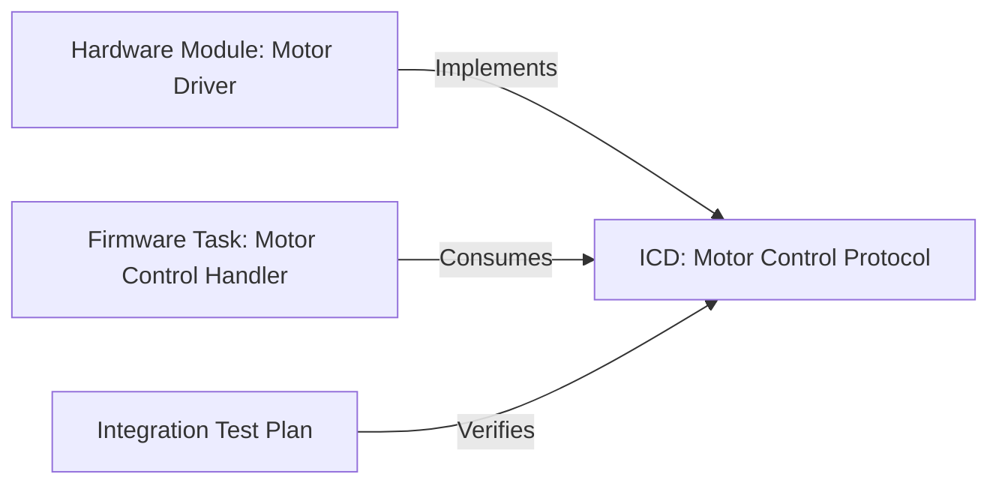

### Dependency Mapping, Interface Control Documents, and Integration Cadences

Scaling contemporary product programmes—particularly those straddling software, firmware, hardware, and systems domains—demands a discipline that is neither default linearity nor unmanaged concurrency. It demands the explicit surfacing, documentation, and orchestration of dependencies and interfaces at a level congruent with both product risk and delivery ambition. Within the Cornerstone framework, these disciplines are not exceptional activities but institutionalized, policy-governed artefacts that enable robust, predictable, and traceable integration across heterogeneous domains and teams. This section examines three architectural cornerstones of scalable delivery: dependency mapping, interface control documents (ICDs), and the cadence of integration itself.

---

#### 1. The Rationale and Context for Explicit Dependency Mapping

At the heart of large-scale, multi-disciplinary programmes lies a rich lattice of dependencies. These exist not only in the traditional sense—where one work product, component, or deliverable is required for another—but also across more nuanced, often cross-domain boundaries. Examples include the need for stable hardware prototypes before firmware validation, or for defined service APIs prior to front-end implementation. In complex organisations, such dependencies may be obscured by asynchronous processes, tool fragmentation, or conflicting local optimisation.

**Dependency mapping** formalizes the identification, articulation, and stewardship of these linkages as artefacts in their own right. Within the Cornerstone operating model, dependencies are not merely attributes of backlog items or Gantt links in schedules. Instead, each dependency is versioned, traceable, and policy-governed. This affords several critical behaviours required at scale:

- *Discoverability*: All stakeholders can query, audit, and surface dependencies relevant to a programme increment, release train, or integration event.
- *Bidirectional Traceability*: Each dependency artefact is referenced both from the consuming and providing entities—be they WBS elements, backlog features, or interface artefacts—enabling impact analysis and change propagation.
- *Governance and Policy Enforcement*: Dependency hygiene can be verified (e.g., confirmed, at risk, blocked), automated tests and checks can be associated, and exceptions must be explicitly registered and justified.

This artefact-centric dependency mapping reconciles otherwise divergent tools, schedules, and documentation methods. The mapping itself becomes a *systemic integration point*, capable of being federated across domains and enabling more reliable integration.

**Mermaid diagram—Conceptual Dependency Mapping Across Artefacts:**

Here, the `Interface Artefact: I2C Data Contract` is a nexus explicitly referenced by both upstream planning (WBS, backlog) and downstream features, rendering the web of dependencies visible and auditable.

---

#### 2. Interface Control Documents (ICDs) as Policy-Governed Artefacts

The formal, versioned specification of interfaces is a non-negotiable requirement for effective integration at scale. While superficial interface documentation may suffice for isolated subsystems, the realities of federated, cross-domain development introduce profound risks when interfaces are left implicit, ad hoc, or scattered across informal communications. As systems complexity grows, so too does the need for ICDs as living, governed artefacts.

**Definition and Role of ICDs**  
An Interface Control Document, in the context of Cornerstone, is a structured, versioned artefact that defines the contract—functional, logical, electrical, mechanical, or data—between two or more system entities. These may include software APIs, hardware connectors, firmware service layers, or cross-domain protocol agreements. Critically, ICDs are not static specifications frozen at design review; rather, they are dynamic, traceable artefacts with controlled lifecycles, supporting staged evolution and continuous integration.

**ICDs and Bidirectional Traceability**  
Each ICD is explicitly referenced by both the upstream (provider) and downstream (consumer) artefacts in the systems architecture—each WBS element, backlog entity, or compliance metric references the ICD via stable identifiers. This policy ensures that any change or non-conformance can trigger automated impact analysis, alerting all dependent parties before integration events and thereby reducing the likelihood of late-stage integration failures.

**ICDs as Compliance Artefacts**  
In regulated domains, ICDs are practice-mandated (e.g., per ISO/IEC/IEEE 15288 for systems, ISO 26262 for automotive, DO-178C for avionics). Aligning the Cornerstone ICD artefact lifecycle with such standards ensures both compliance and auditability. Automated checks on ICD compliance—such as schema validation for data contracts or automated pinout checks for hardware—can be integrated into continuous integration/continuous deployment (CI/CD) pipelines, enforcing conformance as code is merged or hardware is released.

**Mermaid diagram—Artefact-centric Traceability for ICDs:**

This diagram illustrates how an ICD can serve as a canonical reference, connecting implementation artefacts and verification plans. This model also supports federated ownership scenarios, where provider and consumer teams may reside in different organisational silos or even partner companies.

---

#### 3. The Practicalities and Dynamics of Integration Cadence

The cadence of integration—when and how frequently subsystems, components, or features are brought together to form a working system—determines the tempo of delivery risk discovery. Traditional approaches have relied on scheduled gates, stage-based milestones, or periodic physical build events. While these still serve a purpose, Cornerstone advocates a model in which integration is not a singular event but an orchestrated, policy-driven stream of activities, underpinned by the continuous alignment of artefacts.

**Integration Cadence as Policy**  
Integration frequency is not arbitrarily determined, but rather is a function of programme architecture, dependency mapping maturity, and the stability of ICDs. Critical path components or those with high integration risk are integrated more frequently—sometimes even continuously—while stable or legacy interfaces may follow a more relaxed cadence. Integration policy itself becomes an artefact: explicitly defined, versioned, and discoverable. It specifies for each interface or system boundary the minimum required integration frequency, verification requirements, and escalation paths for integration failures.

**Aligning Integration Cadence to Dependency Realities**  
The explicit visibility of dependency mapping and ICD maturity enables programme leadership to calibrate integration cadence pragmatically. For example, where interface volatility is high or architectural uncertainties are unresolved, more frequent integration—supplemented by simulation artefacts or stubs—mitigates the risk of architectural misalignment propagating downstream. Conversely, for stable, well-characterised interfaces (ideally those with mature, policy-evidenced ICDs), integration may be throttled, reducing noise and integration overhead.

**Tooling and Artefact Flow for Integration Events**  
A practical integration event involves not merely the assembling of subsystems but the automated orchestration of artefacts: dependency checks, ICD validation, configuration baseline enforcement, and the execution of integration verification matrices. Integration tooling leverages artefact contracts—machine-readable representations of dependencies, ICDs, and integration requirements—enabling automated compliance checks, rollback strategies, and fast feedback to all impacted backlog entities.

---

#### 4. Architectural and Organisational Implications

The application of these disciplines—dependency mapping, ICD stewardship, and engineered integration cadence—has pronounced architectural and organisational effects. Architecturally, explicit dependency artefacts and interface documents decouple the architecture from the vagaries of delivery plans. This separation enables a modular, refactorable architecture where dependencies, interfaces, and their associated risks are first-class, queryable citizens of the delivery system. Organisationally, federated teams—often operating with differing toolchains and lifecycles—can sustain synchronisation through shared artefact contracts and centrally governed policies.

**Coordination Across Teams and Boundaries**  
Team-of-teams collaboration is often jeopardized by implicit assumptions—about timing, dependency resolution, or interface readiness. In Cornerstone, the formalization of integration points as artefacts addresses this by providing a stable, versioned reference for contractual alignment. When dependencies or ICDs change, the downstream impact is quantifiable and immediately surfaced to all affected teams.

**Trade-offs and Lifecycle Realities**  
While the artefact-centric approach increases traceability and auditability, it also introduces lifecycle management overhead. Versioning, artefact stewardship, and policy enforcement require both cultural adoption and periodic investment in process and tooling. However, this is balanced by measurable reductions in late-stage integration failures, rework, and regulatory compliance risk. In practice, most real-world organisations must navigate hybrid states—legacy projects transitioning toward artefact discipline, or federated external partners adapting to the same policy ethos. Transition plans and layered policy enforcement support this heterogeneity while promoting convergence toward systemic discipline.

---

#### 5. Failure Modes and Countermeasures in Dependency and Interface Management

The most common integration failure modes in complex programmes can be traced to three sources: untracked or ambiguous dependencies, unmanaged or evolving interfaces, and misaligned integration cadence. Untracked dependencies may take the form of shadow workflows, informal agreements, or tribal knowledge—none of which are sustainable at scale. When interfaces are allowed to evolve implicitly, or when their ICDs are allowed to drift from implemented reality, integration events reveal incompatibilities late, necessitating costly rework or architectural compromise. Integration cadence misalignment—where teams integrate too infrequently, or at incongruent intervals—leads to unbounded integration risk accumulating between events.

Cornerstone's artefact-centric model embeds countermeasures directly into the governance scaffolding: dependency and interface artefacts are subject to automated health checks (e.g., "unconfirmed dependency", "outdated ICD"), while integration events are policy-audited and exceptions are logged as first-class artefacts. These feedback mechanisms are surfaced both at the programme and team levels, closing the loop between engineering reality and governance aspiration.

---

#### 6. Standards, Traceability, and the Empirical Flow of Integration Knowledge

Artefact-centric, policy-governed dependency and interface management aligns with and extends established engineering standards. Practices such as interface control (as per ISO/IEC/IEEE 29148 and 15288), dependency logs (PMBOK), and integration verification matrices (CMMI, INCOSE SE Handbook) are not only respected but instantiated as living digital artefacts discoverable across the product lifecycle. Docs-as-Code infrastructure—discussed elsewhere in Cornerstone—ensures that the knowledge encoded in dependencies, ICDs, and integration policy is versioned, discoverable, and integrated into the daily flow of engineering work, rather than relegated to static repositories or neglected wikis.

Over the course of a programme, the flow of integration knowledge becomes itself an empirical artefact. Trends in integration failure rates, dependency churn, interface stability, and backlog impact can be captured, interrogated, and used to recalibrate both delivery approach and architectural assumptions. This allows Cornerstone teams to move beyond anecdotal or intuition-driven integration management toward measurable, data-driven adjustment. Such feedback, when institutionalised, forms a virtuous cycle: surfacing emerging complexity early, driving continuous improvement, and ensuring that integration discipline is not a one-time investment but a persistent organisational capability.

---

#### 7. Practical Application: A Synthesis Across the Product Lifecycle

Practically, applying these disciplines requires the synthesis of three streams: engineered artefact management, federated team collaboration, and adaptive integration cadence. At project inception, primary architectural work must produce explicit dependency maps and ICD templates. As backlog items are shaped and decomposed, they inherit and refine these dependency and interface artefacts, ensuring bidirectional traceability. Throughout product development, teams operate against a backdrop of continuous integration events, each orchestrated not through ad hoc schedules but through policy-governed, artefact-driven cadence. With each program increment, the artefact ecosystem is reviewed: dependencies are validated, ICDs are versioned and signed off, and integration policies are recalibrated based on empirical integration performance.

This approach is both rigorous and flexible. It provides a scaffolding that can be queried, extended, and federated, but does not preclude domain-specific variance or tailored adaptation where necessary. The artefact-centric, policy-driven regime is not intended as an additional administrative burden but as the underpinning of scalable, reliable, and compliant product delivery—capable of absorbing the complexity and volatility endemic to modern, multi-disciplinary engineering programmes.

---

In summary, scalable product delivery in the Cornerstone model is fundamentally grounded in the explicit, versioned, and policy-governed orchestration of dependencies, interfaces, and integration cadence. These are not abstract best practices, but operational, queryable, and auditable artefacts—enabling alignment, accountability, and adaptivity as teams of teams pursue sophisticated product ambitions across technical and organisational frontiers.