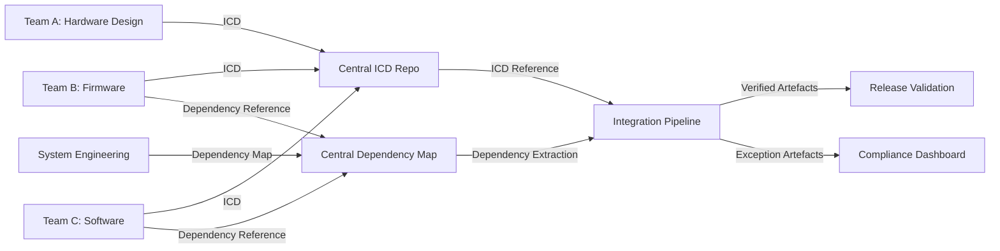

# Standardising Key Artefacts While Maintaining Flow

## Introduction: The Necessity of Artefact Standardisation

As multidisciplinary engineering programmes expand in scope and organizational complexity, the assurance of alignment and interoperability across artefacts assumes critical importance. Within the Cornerstone framework, artefacts—such as dependency maps, interface control documents (ICDs), and integration cadence policy artefacts—are foundational entities around which programme flow is organised and governed. Yet, the value of these artefacts is tightly coupled to their standardisation: only by harmonising their structure, semantics, and governance can an engineering organisation realise consistent, predictable integration across federated teams and domains. However, standardisation must serve, not constrain, the fluid, adaptive delivery that is central to modern engineering programmes. The significant challenge, therefore, lies in standardising artefacts without stifling flow—a goal achieved through judicious application of architecture, process, and automation embodied in the Cornerstone philosophy.

## The Role of Artefact Standardisation in Large-Scale Delivery

At a programme scale, artefact standardisation provides the scaffolding necessary to coordinate work across autonomous teams, specialties, and external partners. Standardised artefacts constitute a lingua franca: they capture intent, constraint, and contract in a format invariant across team boundaries. For instance, a dependency map elucidates critical path relationships in the same formal language whether interpreted by a systems engineer or a software architect; an ICD specifies interface semantics in terms equally consumable by a firmware developer or an external supplier.

Such invariance is essential for automation and traceability. Standardised artefacts enable programmatic ingestion into CI/CD pipelines, automated compliance checks, and digital audit—each of which is fundamental to the Cornerstone model of artefact-centric governance. Furthermore, standardisation underpins traceability: by employing consistent identifiers, structured schema, and explicit version semantics, artefacts can be reliably referenced, evolved, and audited across the product lifecycle. The benefits extend to regulatory compliance, since digitally instantiated artefacts can be mapped to requirements frameworks (e.g., ISO/IEC/IEEE 15288), audit trails, and verification matrices without translational ambiguity.

Yet, strict standardisation alone risks introducing rigidity that opposes the need for flow: the continuous progression of collaborative engineering, rapid feedback loops, and the ability to adapt artefacts in response to evolving programme knowledge. The pursuit, therefore, is not artefact uniformity for its own sake, but a principled balance between rigor and adaptability—a balance enabled by Cornerstone’s approach.

## Artefact Schema and Policy: Enablers of Scalable Flow

Rather than imposing monolithic artefact templates or process bottlenecks, Cornerstone advocates for the definition of artefact *schemas* and corresponding *governance policies.* An artefact schema constitutes a core set of required structure, fields, and semantics that ensure the artefact is consistently interpretable across domains. Policies, meanwhile, govern the lifecycle and quality requirements—versioning, change control, traceability, and review standards.

A well-defined ICD schema, for instance, would require explicit delineation of interface endpoints, protocols, version compatibility, requirements references, and compliance assertions. Similarly, a dependency map schema prescribes how relationships, directionality, rationale, and health metadata are encoded. The use of federated, extensible schemas—not rigid templates—facilitates localisation: teams can extend artefacts with domain-specific metadata while maintaining global interpretability.

Policies operate on these artefacts both automatically and through human review. CI/CD integrations can enforce required fields, verify version lineage, and flag invalid dependencies. Human governance—via architectural boards or compliance reviews—interprets exceptions, arbitrates standard evolution, and resolves semantic ambiguity.

Through these mechanisms, Cornerstone establishes a contract: artefacts must conform to schemas and lifecycle policy, but their instantiation remains as fluid, modular, and evolvable as the programme demands. As a result, artefacts become both durable records and living documents of engineering knowledge.

## Maintaining Flow: Avoiding the Pitfalls of Rigidity

One of the most significant risks in standardisation initiatives is the emergence of process deadlock—where the friction of producing, reviewing, and updating artefacts impedes the flow of engineering work. This risk is present in both over-standardisation (excessive formalism or approval bottlenecks) and under-standardisation (ambiguity, drift, or lack of trust in artefact integrity).

The Cornerstone framework addresses these risks by embracing the principles of *progressive elaboration* and *policy-driven exception handling*. Artefacts are not burdensome static deliverables, but are iteratively elaborated as the programme progresses and understanding deepens. For example, initial dependency maps may reflect only core, high-level relationships, gaining detail as design and implementation mature. Likewise, ICDs may begin as interface intents, accumulating protocol detail and compliance assertions in step with integration milestones.

Policy-driven exception handling is crucial for sustaining flow. Artefacts may, by policy, be permitted certain incomplete or provisional states, provided that exceptions are visible, reviewed, and resolved by pre-defined gates (e.g., prior to integration or release). Automated checks ensure that artefact health is continuously surfaced; exception logs and dashboards render gaps or non-conformances explicit, enabling timely resolution without halting work. Thus, standardisation becomes a safety net—guarding against unrecognised risk—rather than a procedural drag.

## Federation and Cross-Domain Artefact Interoperability

Large programmes are, by necessity, federated: teams across disciplines, sites, and even organisations each contribute artefacts that must interoperate smoothly. Standardisation here is an interoperability problem: artefacts must be intelligible and actionable outside of their originating context.

Cornerstone addresses this by defining *federated artefact contracts*. Each artefact, while locally elaborated, is expressed in a common schema and governed by a shared lifecycle policy. Cross-references—such as ICDs between hardware and software, or dependency map links spanning platform teams—are technically and procedurally validated. Artefacts must possess globally unique identifiers, forward and backward compatibility constraints, and explicit provenance, supporting robust integration across decoupled domains.

This federation extends to organisational boundaries. External partners or suppliers may contribute artefact instances (e.g., third-party ICDs, externally maintained dependency subgraphs) that are subject to the same ingest and conformance processes as internal artefacts. Contracts are thereby instantiated in code, not merely in legal or procedural documents, substantially reducing the latent risk in partner integration.

The below Mermaid diagram depicts the federated flow of artefacts across domains and teams in the Cornerstone model:

Here, all teams elaborate artefacts locally but synchronize them to central stores, enabling integration pipelines to enforce global standards, verify cross-domain alignment, and surface exceptions for compliance or risk review.

## Docs-as-Code: Enabling Evolvability and Automation

A foundational architectural element supporting flow-preserving standardisation is the adoption of the docs-as-code paradigm. Under this approach, artefacts are not static office documents or isolated tool artifacts; rather, they are encoded as text or structured files (YAML, JSON, or domain-specific languages) under version control, subject to the same workflow, change management, and review as code artefacts.

This practice affords several key advantages aligned with Cornerstone philosophy. Firstly, versioning is transparent and immutable: any artefact revision can be traced, audited, and, if necessary, reversed. This is paramount in traceability and compliance contexts, particularly under regulatory requirements that mandate equivalence between technical artefacts and delivered products.

Secondly, artefact validation and conformance can be automated within CI/CD workflows. Schema conformance, dependency integrity, ICD completeness, and integration readiness are all evaluable by machine, providing immediate feedback and automated gatekeeping without requiring manual intervention. Exceptions and non-conformances surface as actionable artefacts (exception logs or dashboard issues), accelerating the discovery and correction of defects before they propagate.

Moreover, docs-as-code enables distributed collaboration. Teams can propose, review, and merge artefact changes using familiar code-centric tooling and workflows (e.g., pull requests, merge reviews). Artefact health thus becomes a shared team responsibility, embedded into daily engineering habits, rather than a dispersed or after-the-fact compliance task.

## Trade-Offs: Standardisation Versus Local Autonomy

Despite the evident advantages, standardisation entails trade-offs, particularly with respect to local autonomy and agility. Engineering teams, driven by domain specificity or local practices, may seek to optimise artefact structures, field semantics, or process cadence for their unique context. Overly prescriptive global standards can, if rigidly enforced, act as a drag on innovation and responsiveness; conversely, insufficient standardisation leads to tool and process fragmentation, integration friction, and unmanageable technical risk.

Cornerstone reconciles these tensions via its federated schema approach, which authorises local extensions so long as core schema and lifecycle policy are upheld. For example, a hardware design team may extend ICDs with manufacturing-specific performance data, provided these additions do not obscure or override any globally required fields or semantics. Policy may dictate which artefact extensions are advisory and which must be globally adopted as standards evolve.

Furthermore, the framework recognises that not all artefact structure or process can, or should, be fully standardised upfront. Progressive formalisation—starting with loose conventions and gradually tightening through empirical feedback (e.g., recurring integration issues, compliance findings)—enables continuous calibration. Artefact structure thus evolves organically, guided by operational need, rather than being fixed by initial decree.

## Organisational Implications and Leadership Alignment

The successful operationalisation of artefact standardisation in Cornerstone is contingent on an organisational culture that values both programme coherence and engineering autonomy. Leadership must articulate clearly where standardisation is non-negotiable (e.g., traceability requirements, regulatory compliance, critical-path interfaces), and where teams are empowered to specialise and innovate.

This cultural posture is reinforced through active architectural governance: cross-functional boards, empowered by visibility into artefact health dashboards, arbitrate exceptions, resolve semantic ambiguity, and drive standard evolution in response to empirical integration outcomes. Metrics such as ICD compliance rates, dependency health, and integration throughput are communicated transparently to technical leaders, supporting evidence-based decision-making.

Importantly, standardisation initiatives must secure buy-in not through dogma, but by demonstrably improving the work of engineering teams—removing ambiguity, accelerating integration, and surfacing actionable knowledge. Incentives should align with maintaining healthy artefact flow: teams are recognised for clean integration boundaries, artefact completeness, and proactive exception management.

## Practices to Support Flow Under Artefact Standardisation

Within the Cornerstone framework, several practical mechanisms ensure that standardisation advances, rather than inhibits, delivery flow:

- **Progressive Artefact Lifecycle Management:** Artefacts advance through defined states (draft, provisional, reviewed, approved), with policy clarifying permissible actions and required evidence at each gate.
- **Automated Health Scanning and Feedback:** Validations, completeness checks, and health metrics run continually, surfacing risks as they emerge rather than at episodic reviews.
- **Exception Artefact Logging:** Gaps, incomplete artefacts, or non-conformances are not hidden or deferred, but are explicitly logged and tracked as actionable exception artefacts. Their resolution becomes part of programme flow, not a side task.
- **Empirical Retrospectives and Policy Evolution:** Regular review cycles assess which standards serve flow and quality, and which require adjustment; artefact policies and schemas are evolved in response to integration outcomes, not in isolation.

Again, neither excessive formalism nor unchecked autonomy alone suffices. Flow is optimised when each engineer and team is guided by clear artefact expectation, empowered to progress work without recurrent compliance friction, and supported by data-driven, rapid feedback on artefact health.

## Conclusion: Artefact Standardisation as an Enabler of Flow

When carefully architected and embedded in supportive organisational processes, artefact standardisation is not an impediment to flow, but its principal enabler at scale. Far from replicating the rigidity or inertia of traditional documentation-driven delivery models, Cornerstone’s artefact-centric, policy-governed approach yields a living framework in which knowledge is discoverable, traceable, and actionable across disciplines and teams.

By harmonising artefact schema and lifecycle policy—while enabling local extension and progressive elaboration—the framework ensures that delivery cadence, integration health, and technical alignment are continually maintained. Advanced by docs-as-code automation and proactive governance, standardisation becomes an evolutionary force: surfacing risk and knowledge early, resolving ambiguity continuously, and enabling federated teams to move rapidly without sacrificing integrity or compliance.

This sustained balance—rigorous in core, adaptable in edge—defines the operational heart of Cornerstone at scale. It is through this contract that engineering ecosystems transcend the limitations of both static documentation and undisciplined local practice, forging instead a path of sustained, organisation-wide flow.