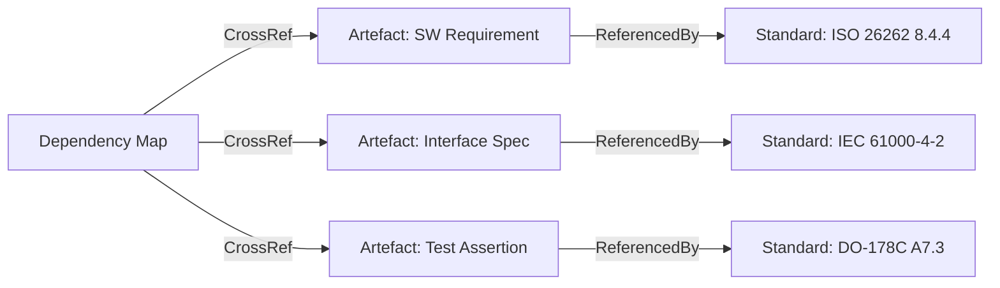
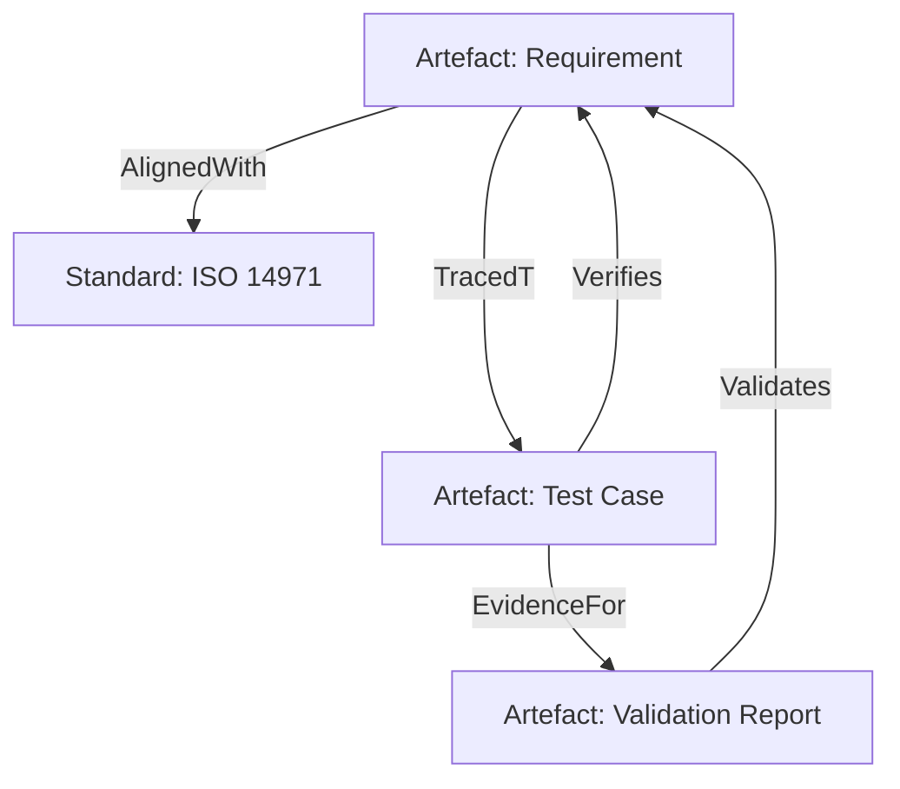

### Mapping to Standards, Formal Verification & Validation, and Engineering Evidence

#### The Imperative of Standards-Based Alignment

Product development in complex, multidisciplinary domains seldom exists in an unconstrained vacuum. Across industries such as aerospace, automotive, medical devices, and critical infrastructure, adherence to externally defined technical standards and regulatory frameworks is foundational. These standards—whether voluntary consensus specifications or legally codified regulations—capture historical engineering knowledge, industry best practices, safety mandates, and interface conventions intended to promote reliability, interoperability, and acceptance. They encompass not only technical requirements but also, increasingly, prescribe expectations for engineering management procedures, documentation, risk analysis, traceability, and auditability.

The Cornerstone framework recognises this operational reality. It incorporates mechanisms for artefact standardisation and lifecycle control specifically to enable traceable, auditable alignment with such external standards and compliance obligations. Schema-governed artefacts within the Docs-as-Code paradigm form the basis both for programmatic conformance checking and for the systematic accumulation of verifiable engineering evidence. This capability extends beyond internal consistency; it is directly leveraged to establish demonstrable compliance, authoritative documentation, and V&V artefacts as required by regulatory bodies, certification agencies, and customer contracts.

#### Artefact Models as the Backbone for Compliance Mapping

Artefact schemas and lifecycle policies within the Cornerstone framework are expressly designed to reference external standards and requirement sets. Each artefact, governed by a schema, can explicitly declare its associated external standard, section, clause, or testable statement. Dependency maps, Interface Control Documents (ICDs), and integration policy artefacts are not merely internally useful—they function as crosswalks between engineering knowledge and external compliance requirements.

For example, a software safety requirement artefact can be parameterised to directly reference ISO 26262 clauses for automotive, or IEC 62304 for medical software, encapsulating both the rationale and the precise conformance assertion. Similarly, hardware interface artefacts can indicate conformance with EMI/EMC standards, or with relevant IPC or MIL specifications. This mapping is not incidental; artefact schemas typically include mandatory fields for external requirement traceability, ensuring that standardised artefact libraries facilitate both automatic and manual compliance tracking.

Mermaid diagram: Artefact Mapping to Standards

The diagram above illustrates how artefacts act as referential anchors to standards, with dependency maps aggregating these references to visualise coverage and gaps.

#### Policy-Driven Conformance and Engineering Control

Cornerstone’s policy mechanisms transform this artefact-to-standard mapping into actionable compliance management. Schemas enforce required fields such as external standard references, test coverage declarations, and compliance status assertions. Policies can programmatically validate that all artefacts in a given lifecycle state (for instance, “Ready for Integration”) possess mapped evidence for each externally mandated requirement. This “artefact completeness” enforcement is extensible: policies can be selectively tightened or relaxed as knowledge matures, risks emerge, or audit priorities shift.

Crucially, policies support the institutionalisation of compliance without paralysing flow. Exception artefacts—explicit, time-bounded deviations from standards mapping or completeness—are logged as first-class entities, mandate rationale, and trigger review workflows. This mechanism preserves delivery velocity and fosters developmental transparency, while avoiding undocumented circumvention that would undermine downstream V&V or regulatory audit.

Artefact policy conformance operates both in pre-merge (“gatekeeping”) roles via CI/CD and in ongoing post-integration monitoring, supplying empirically grounded metrics. These form the backbone of quality dashboards, readiness reviews, and audit preparation activities.

#### Formal Verification & Validation Anchored in Artefact Logic

Verification and Validation (V&V) processes are a mainstay of robust engineering and are foregrounded in standards from ISO 9001 to DO-178C to FDA guidance for medical devices. V&V demands not only that a system is built right (verification), but also that the right system is built (validation)—and that both are demonstrated through credible, auditable evidence.

Cornerstone operationalises V&V through its artefact model. Every artefact type (requirement, interface, risk, test, nonconformance) has a lifecycle state tied to the progression of V&V: for a given requirement artefact, for example, its associated test assertion artefact declares the means (demonstration, analysis, inspection, test) by which compliance will be determined. Each test case, result or simulation ran is itself a first-class artefact, governed by versioned schema, uniquely traceable back to the originating requirement and to the relevant standard or external mandate.

Evidence of V&V is thus continuously accumulated as a lattice of traceable artefacts—far superior to traditional static design documents or manually maintained trace matrices. Artefact-centric V&V not only automates large portions of the traceability burden but also ensures that test strategies, design reviews, coverage analysis, and findings are programmatically linked, change-controlled, and auditable.

Mermaid diagram: Traceability for V&V

This diagram highlights how requirement artefacts trace to tests, connect to standards, and yield evidence objects for validation.

#### Evidence Accumulation and Integrity

Engineering evidence is only as credible as its integrity, provenance, and accessibility. In the Cornerstone model, Docs-as-Code underpins a rigorous evidence management strategy: all artefacts and their history are version-controlled, meaning every change is attributable, reviewable, and, if needed, revertible. Evidence artefacts—including test results, simulation logs, and review minutes—are treated no differently from code or requirements in terms of change control, schema enforcement, and lifecycle tracking.

This practice confers significant organisational and technical benefits. It eliminates the risk of “orphaned” evidence losing linkage to its requirements, ensures that regression and retest outcomes are mapped longitudinally, and establishes a living evidence record rather than a static snapshot. Such fine-grained, automated evidence chains materially reduce preparation effort and error risk during regulatory audits or certifications: auditors can browse, search, and replay engineering evidence directly, with artefact completeness and conformance metrics programmatically generated.

Furthermore, the artefact model enables digital signatures and artefact attestation. This enhances evidentiary trustworthiness, as artefacts can be cryptographically signed upon status transition (e.g., “Validated”), providing robust assurance against post-hoc tampering or unrecorded alteration—a key concern in highly regulated fields.

#### Integration with Third-Party Assessment and Certification

Many high-integrity product domains require formal engagement with third-party assessors or certification authorities. Here, the artefact model in Cornerstone provides not just internal discipline, but also extensible mechanisms for inter-organisational evidence exchange. Artefact schemas can be “federated” to support ingestion and consumption by external partners, while access-controlled repositories ensure granular visibility and exportability tailored to audit scopes.

Because artefacts are governed by open, schema-driven formats, external reviewers can automate conformance checks, redline completeness gaps, or cross-check external references at scale. Integration logs, interface contracts, and change requests comprise a machine-readable evidence backbone for external assessment. This capability stands in contrast to bespoke, ad-hoc evidence hand-offs that historically frustrate both internal and third-party auditors.

#### Architectural and Organisational Considerations

While the above mechanisms deliver powerful compliance and evidence benefits, their effectiveness depends on robust architectural and organisational integration. From an architectural perspective, the artefact management system must be tightly coupled with source code, CI/CD pipelines, simulation environments, and external requirements repositories. This integration allows real-time state changes, triggers evidentiary artefact generation, and harmonises code, test, and compliance progress.

Organisationally, disciplined policy maintenance is required. Standards evolve, mandates change, and lessons from integration or audit events must feed back into artefact schema and policy updates. Coordination across federated teams and supply chain partners entails regular schema version negotiation and alignment of lifecycle policies. Failure modes include schema drift (where local extensions outpace global agreement), artefact debt accumulation (where exceptions become de facto standards), and policy ossification (where inflexible policies impede flow and adaptation). Cornerstone thus prescribes active artefact policy governance, empirical metrics, and retrospectives to sustain alignment and institutional learning.

#### Workflow Realities: Continuous Conformance in Practice

The translation from compliance mapping and V&V theory into engineering reality necessitates workflow adaptation. In day-to-day development, engineers interact less with abstract standards and more with artefacts that encapsulate specific compliance or V&V obligations. Continuous integration jobs—governed by artefact schema policies—run automated conformance checks as artefacts are updated or merged. Reviewers operate on pull requests with both human-readable summaries and machine-validated compliance status. Exception artefacts serve as workflow signals, facilitating early risk identification and prompt corrective or mitigation action.

Over time, as artefact health dashboards mature, compliance becomes a routinised facet of normal development activity. Surprises at formal gate reviews or audits diminish: coverage gaps, incomplete mapping, or stale test evidence surface early and can be triaged continuously. This shift from “compliance as a periodic scramble” to “compliance as continuous flow” is a distinctive operational advantage enabled by the Cornerstone artefact discipline.

#### Trade-Offs and Constraints

Adopting such a standards-mapped, artefact-centric approach involves certain trade-offs. There is a necessary upfront investment in schema engineering, toolchain integration, and change management discipline. Teams must balance schema rigidity against necessary project-specific extensions. Overlap or inconsistency in external standards may require decisions about primary compliance targets and mapping strategies. In federated programs, negotiating schema alignment and policy synchronisation across diverse partners adds complexity.

However, these costs must be weighed against the risks intrinsic to large-scale, high-integrity engineering: silent compliance gaps, evidence loss, audit failures, reputational or regulatory exposure, and escalating cost of late-stage remediation. Where regulatory velocity or complexity is highest, the continuous compliance discipline embedded in the Cornerstone model demonstrably reduces these risks, enabling both technical agility and outcome assurance at scale.

#### Evolving Standards, Continuous Policy Adaptation

The standards landscape is not static. New regulatory expectations, industry best practices, and emerging frameworks routinely reshape compliance objectives. In response, artefact schemas and associated lifecycle policies are regarded as living structures—evolving through empirical feedback, integration retrospectives, audit findings, and lessons learned from exceptions.

Cornerstone prescribes a meta-process for standards evolution: artefact health and exception metrics highlight recurrent impedance or risk, prompting policy re-examination. Policy change itself is managed through artefact versioning, with deprecation, migration, and grandfathering patterns allowing ongoing development to progress uninterrupted even as standards shift. Organisational learning is codified not in static playbooks, but in the evolving DNA of artefact schemas and governance policies.

#### Summary: Standards and Evidence as Catalysts for Reliable Flow

Through explicit mapping to external standards, disciplined artefact lifecycle control, and programmatic evidence management, the Cornerstone framework transforms regulatory and compliance obligations from passive documentation burdens into active enablers of reliable product delivery. Artefact standardisation, grounded in schemas and policies, institutionalises V&V and compliance as integral, continuous elements of engineering workflows—promoting not mere formalism, but genuine risk reduction, transparency, and trust in both product and process. The operational result is a model where flow is not stifled by compliance, but sustained and validated by it; where every artefact, from requirement to test log, participates in an integrated lattice of engineering knowledge and verifiable evidence; and where evolving standards are absorbed as living components of the product delivery system itself.