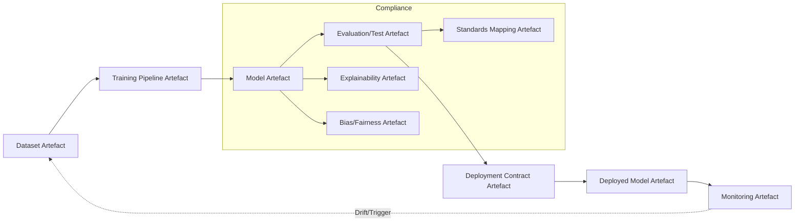

---

## Integrating Artificial Intelligence and Machine Learning within Cornerstone Lifecycle Management

The intersection of artificial intelligence (AI) and machine learning (ML) with modern product development introduces both transformative capabilities and new dimensions of risk, verification, and complexity. Within the Cornerstone framework, the integration of AI/ML components must be orchestrated to preserve artefact standardisation, alignment to external standards, verifiable evidence generation, and sustained flow. This requires careful adaptation of lifecycle patterns, artefact schemas, and governance structures to accommodate the distinctive properties of AI/ML systems—particularly their data dependency, non-determinism, and evolving operational characteristics.

### Foundations: Artefact Abstractions for AI/ML Assets

At the artefact level, AI/ML deliverables expand the taxonomy of versioned entities managed within Cornerstone. In addition to conventional source code, interface contracts, and test cases, the lifecycle must explicitly accommodate datasets, feature schemas, model binaries, training pipelines, hyperparameter policies, and lineage meta-data. Artefact schemas for AI/ML entities encode not only the structure and provenance of these assets, but also their binding to requirements, regulatory constraints, and operational performance thresholds.

Cornerstone’s schema-governed approach provides robust scaffolding for these artefacts. Model artefact schemas, for example, must reference associated datasets (by unique artefact identity), training and validation scripts, and recorded metrics from evaluation runs. Dataset artefacts encapsulate meta-data such as sources, curation steps, version, and data quality assertions. Artefacts increasingly record lineage and reproducibility elements—an imperative for both internal traceability and external audit, especially for regulated domains or high-assurance applications.

#### Artefact Lifecycle Extensions for AI/ML

Lifecycle state models for AI/ML artefacts—extended from conventional software workflows—reflect the progressive maturation of models: from initial concept and data curation through prototyping, validation, deployment, and periodic re-training. Schema-governed policies enforce that each lifecycle state transition is triggered only when completeness conditions are satisfied. For instance, moving a model from “prototype” to “validated” requires that test artefacts (such as evaluation results) not only exist but also include metrics meeting pre-established efficacy and fairness thresholds, as specified in corresponding policies.

The flow of artefacts becomes inherently cyclic: deployed models may drive new data collection, necessitating subsequent re-training and formal version increments across both datasets and models. Exception artefacts capture and govern deviations (e.g., temporary operation with partially validated data), with lifecycle states and time-bounded justifications facilitating continuous compliance and risk management.

### Standards, Explainability, and Assurance in AI/ML Pipelines

Unlike deterministic code modules, AI/ML artefacts are deeply entwined with data and statistical behaviours, mandating expanded compliance and evidentiary consideration. Emerging standards such as ISO/IEC 23053 (framework for AI system lifecycle processes), ISO/IEC TR 24028 (AI trustworthiness), and sector-specific requirements (e.g., FDA’s Good Machine Learning Practice for Medical Devices, automotive ISO/PAS 21448—SOTIF for safety of intended functionality) drive the need for explicit mapping between artefacts and external compliance points.

Artefact schemas embed these mappings as first-class references. For example, requirements artefacts articulated in terms of “accuracy must exceed 95% on dataset artefact X” are linked directly to test artefacts reporting those metrics, and to model artefacts recording model lineage and hyperparameter configurations. Where explainability is mandated, artefact schemas require inclusion of explainability artefacts—such as model interpretability reports, SHAP value analyses, or counterfactual evaluations—documented, version-controlled, and linked to both models and downstream system integration artefacts. 

Where bias, fairness, or robustness claims are made, artefact schemas enforce the inclusion of dataset distribution reports, adversarial test results, and performance evaluations across stratified population groups. The lifecycle of these compliance artefacts is governed by policies requiring re-certification upon material change in data, configuration, or operational context.

### Integration with Automation, CI/CD, and Digital Evidence

Within a Cornerstone-enabled pipeline, artefact-centric automation supplements and reinforces AI/ML governance. Each commit, pipeline execution, or artefact release triggers automated completeness and compliance checks, evaluating artefact schemas for mandatory fields (e.g., dataset version, test results, metrics thresholds). Model evaluation runs produce test artefacts as part of the CI/CD process, with results recorded in machine-readable, schema-validated artefact files.

Practically, this demands tight technical integration between ML orchestration platforms (such as Kubeflow Pipelines, MLFlow, or Data Version Control) and the Docs-as-Code paradigm underpinning standard artefact management. Ideally, artefact schemas for AI/ML assets are shared across both domains, enabling systematic, automated ingestion of evidence and artefact lineage into the versioned Cornerstone artefact repository. This avoids the pitfalls of ad-hoc “off-repo” ML asset tracking and ensures unbroken traceability—a core tenet of reproducible engineering.

This integration is depicted in the following simplified lifecycle diagram using Mermaid syntax:

This diagram visualises the cyclic and interdependent artefact flow intrinsic to AI/ML within Cornerstone: deployment and monitoring events trigger data and model updates, while standards and assurance artefacts are woven throughout the lifecycle from training to operation.

### Continuous Validation, Monitoring, and Feedback Loops

The operational nature of AI/ML systems—characterised by concept drift and emergent failure modes—necessitates integration of continuous validation and monitoring artefacts into the lifecycle. Artefact schemas for monitoring capture not only raw outputs (such as prediction distributions, latency metrics, error flags) but also derived indicators of data drift or model degradation. Policies can define alert thresholds which, if transgressed, require raising exception artefacts and initiating model or dataset review.

These monitoring artefacts function as first-class evidence objects—versioned, linked to deployed model artefacts, and surfaced within CI/CD or operational dashboards. This holistic evidence string, extending from initial requirement through in-field monitoring, delivers continuous assurance to both internal stakeholders and external auditors.

Workflow realities dictate that ML practitioners interact with artefacts at each developmental and operational stage—curating data, updating models, reviewing compliance artefacts, and consuming continuous operational evidence. By embedding these artefact interactions within normal developer workflows and version control, engineers avoid disjointed, retrofitted documentation cycles, instead achieving fluid, responsive compliance and system improvement.

### Architectural and Organisational Implications

Institutionalising artefact-centric management for AI/ML requires architectural investment. ML pipelines, storage backends, and compliance automation must be integrated with the versioned artefact infrastructure central to Cornerstone. Policies must govern not only static conformance but also time-dependent phenomena—such as periodic re-training, revision windows for data use, and scheduled audits of monitoring artefacts.

Organisational alignment is critical. In federated environments, AI/ML artefact schemas must support both central standards and local, domain-specific augmentation (for example, different feature schema requirements between medical, automotive, or consumer contexts). Schema evolution, version management, and exception logging must be collective, empirical, and feedback-driven to accommodate the rapid pace of AI/ML technique innovation.

Trade-offs arise: higher artefact and process fidelity imposes initial documentation and integration cost, but amortises risk, accelerates audit cycles, and facilitates robust handoff between teams—including transitions from model developers to maintainers and field support. Failure modes to anticipate include artefact drift (where operational models diverge from test artefacts), dataset staleness, insufficiently granular artefact schemas, and over-constraining policies that inhibit ML innovation.

### Constraints, Variations, and Future Directions

Cornerstone’s approach nonetheless admits variability in AI/ML artefact management informed by system criticality, regulatory burden, and operational context. Highly regulated fields (such as medical, automotive, or finance) demand comprehensive artefact capture, explainability, and systematic stress evaluation, governed by evolving external standards and internal policies. Conversely, consumer product development may emphasise rapid iteration, with artefact policies tuned for leaner compliance and faster feedback cycles.

Furthermore, emerging AI/ML paradigms—such as federated learning, continual learning, or the embedding of large language models—require dynamic extension of artefact schemas and lifecycle states. Artefact policies must adapt to govern not only classic ML model assets, but also distributed model weights, differential privacy artefacts, or prompt configuration for generative AI components. The core Cornerstone philosophy—schema-driven, version-controlled, policy-governed artefacts as the foundation of flow and compliance—proves robust across these evolutions, with the critical requirement that artefact definitions, lifecycle policies, and automated tooling keep pace with domain advances.

---

**In summary**, integrating AI/ML systems within the Cornerstone framework demands expansion and rigorous governance of artefact types, schema definitions, and lifecycle policies. By leveraging the artefact-centric ethos, AI/ML development achieves traceable compliance, intrinsic evidence integrity, and continuous flow, commensurate with the needs of modern, multi-disciplinary engineering. Automation mediates the complexity of cyclic, data-driven workflows; robust schema and policy stewardship ensures robustness in the face of evolving standards and technologies. As AI/ML grows as a cornerstone of engineered systems, the integration of artefact-based lifecycle management will increasingly underpin sustainable, auditable, and continuously adaptive development.