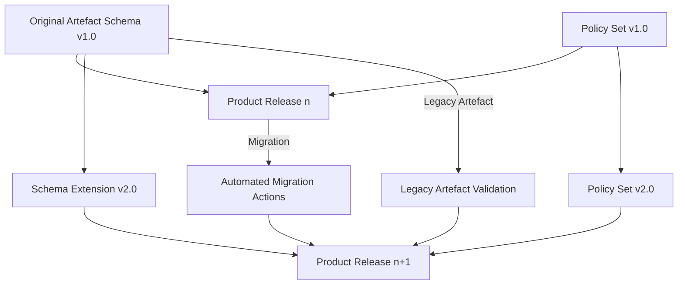

### Sustaining Framework and Product Evolution

#### Contextualising Long-Term Evolution

The development of products and frameworks within multidisciplinary engineering environments is not a finite process; rather, it is an enduring endeavour that demands continuous adaptation. Products, once delivered, enter contexts that are subject to ongoing technological shifts, changing regulatory landscapes, evolving stakeholder expectations, and emergent operational realities. Likewise, the frameworks that govern product development—such as Cornerstone—must persistently accommodate the accumulation of lessons learned, new methods, and enduring operational feedback. The long-term sustainability of both product and framework hinges on their capacity for adaptive evolution, disciplined iteration, and artefact-driven governance.

#### Mechanisms of Framework Evolution

Cornerstone’s architecture rests fundamentally on artefact-centric models, policy schemas, and lifecycle orchestration. These mechanisms are intentionally designed not as static templates, but as extensible substrates. The use of schemas—whether YML, JSON Schema, or domain-specific metadata structures—supports both backward compatibility and controlled evolution of artefact definitions over time. Policy definitions and workflow automation—embodied in CI/CD pipelines, validation engines, and compliance checks—are intended to be versionable entities that can adapt to new standards, operational requirements, or regulatory statutes without disrupting existing product lines.

When extending frameworks to encompass new domains such as AI/ML, quantum systems, or integrated cyber-physical platforms, it is critical that schema and policy extensibility remain disciplined. Evolution must be bounded by robust migration and deprecation practices, maintaining traceability between artefact versions and states. Governance automation—whether realised through repository hooks, schema validators, or pipeline integrations—must similarly evolve in a modular, version-aware manner to avoid brittle dependencies.

#### Evolution of Product Artefacts

Products governed by the Cornerstone framework are, by design, not defined solely by code or hardware blueprints, but by an ecosystem of first-class artefacts. The long-term evolution of a product’s artefact set mirrors the changing state of technology, operational insight, and compliance requirements. For example, the introduction of new diagnostic capabilities, telemetry formats, or ML-powered subsystems drives the emergence of new artefact schemas and policy states. Each evolution must preserve the chain of internal traceability; requirements, design decisions, compliance evidence, and operational data must remain consistently linked regardless of artefact proliferation.

This artefact-centricity supports practical mechanisms such as staged migrations—where legacy artefact states and schemas can coexist, evaluated by versioned policy rules until full transition is achieved. Automated validation within the development pipeline must be able to distinguish between legacy, transitional, and new artefact formats, ensuring that ongoing product releases remain policy-conformant while minimising flow disruption.

Below, a conceptual lifecycle is diagrammed using Mermaid to illustrate the evolution of artefact schemas, policies, and workflow integration over time:

This diagram captures the interplay between evolving artefact schemas, the introduction of new policies, and migration processes ensuring that both legacy and new artefacts are validated within subsequent product releases.

#### Architectural Strategies for Sustainable Evolution

Sustainable evolution requires that technical and organisational architectures are engineered for both stability and flexibility. Technically, versioned interfaces, modular dependency structures, and clear schema contract boundaries minimise regression risks and reduce integration overhead during upgrades. Artefact repositories should be capable of supporting coexistence of multiple schema versions, facilitating parallel development streams and progressive adoption. Automated lineage tracking—anchored in artefact metadata—guarantees that the rationale behind schema, policy, and product shifts is never lost, supporting both institutional memory and external audits.

On an organisational level, ongoing maintenance of artefact definitions and policy logic demands formal ownership and stewardship. Teams must allocate explicit capacity for framework evolution—whether to support new standards (such as ISO/IEC 22989 on AI system lifecycle or IEC 61508 for functional safety), address operational gaps, or remediate emergent risks. Feedback loops from operational telemetry, compliance reviews, and post-market surveillance must feed directly into change proposals for artefact schemas and governance logic.

#### Managing Change and Minimising Regression

A core challenge is to manage the inherent tension between innovation and stability. Cornerstone addresses this through the formalisation of exception artefacts and controlled deprecation workflows. Exception artefacts—versioned and time-bounded—allow teams to introduce managed, risk-assessed deviations from standard policies, ensuring that time-sensitive product evolution is not stymied by procedural bottlenecks. Deprecation workflows, likewise, provide clear transition states and end-of-life artefacts, ensuring that legacy components do not silently accumulate technical debt or compliance vulnerabilities.

Automated completeness and conformance checks—embedded within build and deployment pipelines—are updated to reflect evolving schema and policy logic, detecting gaps introduced by artefact or requirement drift. Monitoring artefacts in production systems—tracking phenomenon such as ML model drift, integration breakages, or security threat emergence—act as sentinels that can trigger revision of both artefacts and underlying framework policies.

#### Trade-offs and Practical Realities

While artefact-centric evolution and framework extensibility offer sustained clarity and compliance, they also introduce overhead. The effort required to define, version, and maintain artefact schemas, policy rules, and automation logic is non-trivial. This investment, however, is offset over the long term by gains in auditability, reduced integration ambiguity, and process stability. Continuous evolution is most effective in organisations that operationalise dedicated roles for framework stewardship, maintain cross-disciplinary schema councils, and treat artefact metrics as first-class indicators of systemic health.

Real-world constraints also require tailoring forward-evolution practices based on context. Highly regulated environments may demand explicit backward compatibility for regulated artefacts over extended timeframes, while rapid-iteration or technology-forward sectors may prioritise migration velocity over legacy support. The underlying principle remains consistent: evolution is not an afterthought but an integral, artefact-governed function within the product and framework lifecycle.

#### Embracing Emerging Technology and Sustainability

Looking forward, the Cornerstone philosophy must remain responsive to the continued emergence of disruptive technologies—whether in AI, distributed hardware, or sustainable materials. Artefact schemas may, for instance, need to encode carbon accounting metadata, circularity metrics, or explainable AI rationale as new priorities surface. The artefact- and policy-driven architecture of Cornerstone ensures that such expansion can be achieved with discipline and traceability, maintaining flow while embedding new dimensions of compliance, assurance, or sustainability.

The framework’s focus on schema, policy, and automation as modular, versioned artefacts uniquely positions it to accommodate the demands of product and framework longevity. As product portfolios and regulatory topologies grow in complexity, this approach delivers the means to balance robust historical traceability against the imperative for continuous, forward-compatible evolution.

---

In summary, the enduring effectiveness of both products and development frameworks is anchored in their ability to evolve—deliberately, traceably, and sustainably. Through artefact-centric lifecycle management, disciplined schema and policy evolution, and the integration of operational feedback, Cornerstone establishes a foundation upon which multidisciplinary engineering efforts can persistently adapt, excel, and remain modern in the face of accelerating change.