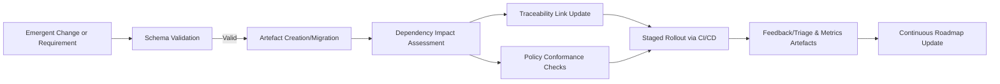

### Future-Proofing and Adaptability in Cornerstone

Cornerstone’s approach to product development emphasizes not only immediate project velocity and compliance, but also steadfast resilience amid inevitable technological and market evolution. In multidisciplinary engineering environments—where hardware lifecycles, software paradigms, and regulatory frameworks continually shift—the ability to future-proof systems is not reducible to discrete choices of tooling, nor is adaptability a matter of informal process. Rather, these properties emerge from architectural intention, policy-driven workflows, and the artefact schema discipline at the heart of Cornerstone.

#### Defining Future-Proofing within Artefact-Centric Workflows

Conventional interpretations of future-proofing often conflate technology selection with guarantees against obsolescence. However, Cornerstone reframes future-proofing as the ongoing capacity to accommodate, absorb, and govern change, using formal artefact schemas as the primary lever of control. In this framing, every product-defining element—requirements, interfaces, compliance assertions, deployment topologies, and even exception rationales—exists as a versioned, introspectable artefact. This approach enables the organisation to retain explicit knowledge of historical states, intent, and boundary assumptions, thereby facilitating controlled evolution without reliance on institutional memory or ad hoc reengineering.

The principle underpinning this model is schema-constrained flexibility. Artefact schemas encode both structural intent and permissible mutation paths, defining what constitutes an allowed change and how such change is governed, rolled out, or rolled back. Via explicit schema migrations, Cornerstone ensures that architectural and requirements artefacts remain tractable even as business objectives or platform technologies change. Critical to future-proofing is the notion that all emergent demands—be they regulatory realignments, new integration requirements, or deprecation of legacy interfaces—are processed as artefact-governed, traceable workflows, not informal exceptions.

#### Adaptability as a Structural, Not Opportunistic, Property

Adaptability within Cornerstone is not the mere byproduct of flexible teams or modular code. It is systematically enabled by the artefact- and policy-centric contract that shapes development. The continuous roadmap, for instance, is not a static Gantt chart but a structured, version-controlled artefact with formalized dependencies, milestone assertions, and exception capture. Impact analysis, automated dependency validation, and schema-based change risk assessment are all native capabilities, not bolt-ons.

Where legacy approaches treat adaptation as a reactive endeavor—initiated upon encountering resistance or external change—Cornerstone anticipates adaptability through controlled mechanisms. All inter-team and inter-domain boundaries are formalized by well-defined artefact schemas; interface changes, migration plans, and deprecation schedules are made explicit, versioned, and enforceable. This guards against technical drift and minimizes the risk of informal, undocumented accommodation that often accumulate as technical debt or compliance liabilities.

A schematic illustration of adaptive workflow is instructive:

This diagram shows how Cornerstone operationalizes adaptability by enforcing artefact validation and impact modeling before any change is propagated across dependent systems.

#### Mechanisms for Sustainable Evolution

Sustaining future adaptivity in an artefact-centric model demands constant vigilance against ossification and uncontrolled sprawl. The uniform application of schema migrations maintains the viability of artefacts as true sources of record, but periodic rationalization—merging, archiving, or retiring artefacts under policy—guards against artefact bloat. Artefact deprecation lifecycles, formally modeled and staged, prevent systems from accruing unmaintainable historical baggage, and allow for the negotiated sunsetting of features or integrations in step with business and operational needs.

Moreover, embedding organisational feedback, field telemetry, and customer input as artefacts closes the adaptive feedback loop. Telemetry artefacts feed performance and usage data back into the roadmap and architecture, permitting trailblazed adaptation schedules keyed to real-world signals rather than speculative risk models. For regulated domains, this continuous ingestion of compliance status, audit findings, and policy change artefacts ensures that future adaptations occur with ongoing regulatory alignment, rather than being deferred to disruptive compliance retrofits.

#### Navigating Evolution in Regulated and Heterogeneous Environments

In regulated industries, future-proofing must reconcile adaptability with prescriptive controls and traceable decision-making. Here, artefact-centric policy implementation bridges the gap: migration and deprecation events are logged as rationale-bearing artefacts, which serve as compliance evidence and audit points. Versions of requirements, designs, and validation outcomes are retained under schema-constrained workflow, establishing a verifiable lineage for each increment of change.

Heterogeneous product stacks—integrating mechanical, hardware, firmware, and software artefacts—present particular challenges for adaptability, due to disparate life cycles and development cadences. Cornerstone enables the segmentation of artefact schema domains, allowing sector- or technology-specific rules to coexist within a shared meta-architecture. Cross-domain interfaces, migration processes, and release dependencies are explicitly modeled, reducing the risk of hidden coupling or timeline slippage.

#### Practical Constraints and Organisational Considerations

The artefact- and schema-centric future-proofing strategy introduces nontrivial up-front and ongoing effort: artefact schemas require disciplined evolution, tooling must support introspection and migration, and organisational roles must be adapted for artefact stewardship. Change control processes become more visible and auditable, but also more rigid; the cost of unplanned, informal experimentation may rise, particularly where artefact boundaries are poorly conceived or enforced. Conversely, the ability to conduct explicit, low-regret reversions or adaptations compensates for these constraints, especially as product scale and regulatory stake increase.

From an engineering management perspective, sustaining future-proof adaptability is as much about cultural alignment as technical enablement. Teams must internalize the value of explicit schema boundaries and policy-driven change, resisting the urge to shortcut artefact processes for speed at the cost of long-term agility. Investment in artefact automation, impact analysis, and schema management is best viewed not as overhead, but as enabling infrastructure—the price of system longevity and sustainable competitive velocity.

#### Trade-offs and Lifecycle Realities

No future-proofing approach is absolute; by constraining change to artefact-governed, policy-aligned paths, some informal agility and spontaneity is sacrificed. Yet this trade-off is deliberate: Cornerstone exchanges opaque, high-risk improvisation for transparent, recoverable decision-making, in which the full lineage of motivation, dependency, and effect is always knowable. This positions organisations to face not only the next generation of technology or compliance shift, but also the inevitable transitions in ownership, team composition, and domain understanding that occur across real product lifecycles.

In summary, Cornerstone’s future-proofing and adaptability emerges not from any single technology or process, but from the systemic rigor of artefact schemas, contracted policy, and workflow formalism. By instituting these practices as operational norms, organisations achieve a durable, proactive posture towards change: ready to accommodate evolution, defend compliance, and sustain clarity—no matter how the environment shifts.