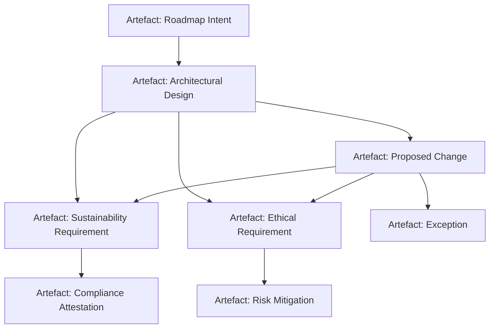

### Sustainability and Ethics in Artefact-Governed Product Development

The sustainability and ethical dimensions of product development have gained unprecedented salience within contemporary engineering, driven by increasing regulatory scrutiny, environmental imperatives, and the systemic impacts of digitalisation. The artefact-centric, schema-driven model underlying Cornerstone introduces rigorous new mechanisms for embedding, evidencing, and operationalising these considerations at both strategic and executional levels. In this section, we delineate how the artefact-governed methodology addresses the practical requirements of sustainable engineering and responsible innovation, how these concerns are expressed and enforced within artefact schemas and process contracts, and the inherent tensions, trade-offs, and integration challenges that arise in real-world settings.

#### Embedded Sustainability: Artefact Lifecycle and Environmental Accountability

Sustainable engineering demands systematic recognition of long-term resource implications, system boundaries, embodied emissions, and the end-of-life trajectories of products and platforms. Within the Cornerstone framework, artefact schemas are extended to capture environmental performance requirements, lifecycle certifications (such as ISO 14001 or IEC 62430), and material provenance as first-class contract elements. Such environmental commitments—whether energy efficiency thresholds, recycled content targets, or thresholds for hazardous materials—are articulated as schema-bound properties and policies, referenced explicitly in the artefact dependency network.

Versioned artefacts enable traceable environmental commitments and reveal deviations across roadmap increments. Each material change, architectural migration, or release increment that impinges on sustainability dimensions is subject to artefact-governed change control processes. For example, a proposed hardware redesign affecting PCB substrate selection would instantiate or update artefacts explicitly referencing RoHS, REACH, or WEEE compliance artefacts. The dependency and exception tracking mechanisms inherent to Cornerstone’s process model ensure that any deviation from sustainability claims is reviewable, auditable, and mapped to rationale-preserving exceptions.

This provides a closed-loop mechanism for maintaining alignment with sustainability objectives across iterative product revisions. The artefact-centric traceability network, by integrating lifecycle assessments (LCAs) and compliance attestations as structured artefacts, directly supports environmental auditability and facilitates the system-level management of product carbon footprints, material flows, or regulatory disclosures.

#### Ethical Considerations: Traceable Intent, Responsible AI, and Compliance

Ethical design and responsible innovation extend beyond environmental impacts to encompass issues of privacy, autonomy, user safety, transparency, and fairness—particularly acute in domains deploying embedded AI/ML, connected systems, and autonomous functionality. Traditional documentation approaches and implicit policy conformance are insufficient where ethical risks and obligations must be systematically managed, defensibly evidenced, and continuously updated.

Cornerstone’s artefact-governed methodological core addresses these needs through schema-encoded ethical requirements and structured exception artefacts. For instance, privacy requirements (referencing ISO/IEC 27701, GDPR, or sector-specific privacy standards) can be specified as properties within artefact schemas. These are then referenced in system architecture contracts, implementation artefacts, and test artefacts—ensuring that privacy risk mitigations and data minimisation guarantees are explicit, version-controlled, and traceable across all product layers.

A particular value arises in AI/ML system governance. Model fairness properties, auditability requirements, and explainability obligations are modelled as schema-bound artefacts, with change control and testing procedures linking evolving models to ethical impact assessments and compliance verification artefacts. Structured exception artefacts capture the rationale where full conformance is infeasible, providing a transparent, reviewable record as required by standards such as ISO/IEC 24028 (AI Trustworthiness).

This artefact-traceability model directly supports responsible innovation: ethical requirements and regulatory boundaries are embedded in the fabric of product contracts and technical process, rather than relegated to after-the-fact documentation or external oversight. However, it necessarily imposes upfront effort in schema definition, property extraction, and dependency matrix formulation, and requires disciplined change management within multidisciplinary teams.

#### Artefact Network as Ethics and Sustainability Control Plane

In practice, the interconnected artefact network functions as a dynamic control plane—not merely a documentation mechanism—enabling near-real-time feedback and adaptation concerning ethical and sustainability dimensions.

For example, when an architectural decision threatens an established ethical or sustainability constraint (such as substituting a material with higher environmental impact, or deploying a less interpretable AI algorithm), the artefact dependency graph propagates the impact to dependent artefacts (such as compliance attestations, risk mitigations, or external disclosures). The change management process can thus enforce reviews, require explicit exception artefacts, or trigger roadmap re-evaluation steps.

This capability may be visualized as follows:

The diagram illustrates how changes within architectural artefacts cascade through sustainability and ethical requirement nodes, updating compliance artefacts, risk mitigations, and—where necessary—explicit exception artefacts. These flows maintain evidentiary chains vital for regulatory and ethical audit.

#### Organisational Implications, Integration Frictions, and Lifecycle Realities

Embedding sustainability and ethical accountability within artefact schemas and process contracts has real and often non-trivial implications for engineering culture, workflow design, and cross-functional collaboration. Unlike traditional compliance, which is often addressed through post hoc audits or external reviews, the Cornerstone approach positions these obligations as live constraints on all product changes. This shift may encounter resistance from teams unaccustomed to schema-intensive workflows or wary of disclosing exceptions and ethical trade-offs so explicitly.

A frequent integration challenge involves harmonising disparate discipline perspectives—environmental specialists, security engineers, ethics officers, and risk managers—within a shared artefact and dependency schema. Effective schema modelling must account for both objective criteria (regulatory thresholds, emissions data) and subjective or context-contingent assessments (ethical risk, AI explainability adequacy), necessitating careful boundary definition, governance policy, and tooling support.

Lifecycle realities further complicate matters. As sustainability and ethical norms evolve, artefact schemas and process policies themselves must be versioned, migrated, and reconciled, presenting complex migration management demands. For example, the emergence of stricter regulatory standards or revised environmental science may necessitate migration artefacts and exception audits across historical versions, with substantive process and resource implications.

Despite these complexities, embedding these dimensions into the artefact-centric product flow yields clear advantages: explicitness, traceability, and adaptability. The development organisation is able to demonstrate not only adherence to external standards, but also a repeatable, internally governed process for ethical and sustainable innovation—capable of surviving leadership transitions, technology shifts, and the ongoing evolution of external standards.

#### Trade-offs, Adaptation, and Future Trajectories

The integration of sustainability and ethics within an artefact-governed hybrid framework does not abolish trade-offs, but instead renders them visible, discussable, and rationally manageable. Inevitably, sustaining velocity while defending ethical and sustainability commitments requires operational negotiation: in hardware, substitutions for rare-earth elements may conflict with cost or performance; in AI, tighter interpretability constraints may entail lower short-term model performance.

By externalizing such negotiations into artefact contracts and exception tracking, the Cornerstone framework aids in managing resource and priority tensions in a controlled, resilient fashion. Incremental improvements to schemas and artefact orchestration tools can further reduce the friction of compliance, improve transparency, and lower the operational cost of responsible innovation.

As sustainability and ethics continue to shape the landscape of product engineering, artefact-governed methodologies offer a structured, evolutionary path—one that maintains technical adaptability, regulatory audibility, and organisational continuity under continuous change. The discipline imposed by schema-driven artefacts ensures that responsible development is not a transient initiative, but a sustained operational practice embedded in the very fabric of product evolution.