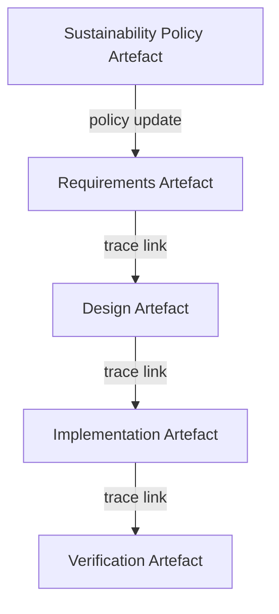

### Predictability, Agility, Quality, and Risk: Outcomes of Artefact-Centric Governance

In transitioning to an artefact-centric, schema-driven model such as Cornerstone, organisations often seek tangible improvements in four perennial concerns: predictability, agility, quality, and risk reduction. These attributes are not isolated performance goals; rather, they are tightly interdependent, each reinforcing and being reinforced by the principled governance approach that underpins Cornerstone. By systematically embedding structure and traceability within the product lifecycle, Cornerstone addresses these outcomes both as emergent properties and as intentional design outputs of the engineering process.

#### Mechanisms of Predictability

Predictability within hybrid delivery frameworks is frequently compromised by vague requirements, uncontrolled changes, and fragmented knowledge. Cornerstone mitigates these failure modes through explicit, versioned artefact schemas that encode the formal contract for each product element—requirements, design rationales, implementation decisions, and verification data—within a traceable artefact network. This artefact network, underpinned by clear schema semantics and life-cycle state management, provides engineers and managers with unambiguous visibility into the scope and dependencies of work at any point in time.

By making all change proposals, exceptions, and their rationales concrete and auditable, surprise rework is minimised. When, for example, a sustainability requirement is updated or a new regulatory constraint is introduced, impact analysis flows automatically through the web of dependent artefacts. All affected teams are systematically notified, and compliance workflows are triggered based on the properties encoded in the artefact schemas. Such mechanisms transform an inherently uncertain environment—typified by asynchronous, cross-domain dependencies—into a managed, observable system that enhances the accuracy of planning and execution.

#### Enabling Agility Without Sacrificing Control

While structural predictability is an essential foundation, modern product development demands rapid adaptation to new information, market conditions, and emerging risks. Purely sequential models, even those with nominal traceability, struggle to reconcile agility with robust governance. The hybrid nature of Cornerstone enables iterative change at both macro and micro levels, with artefact schemas accommodating “just enough” structure to enable progress without constraining innovation or responsiveness.

Cornerstone’s partitioned artefact network supports loosely coupled development flows, allowing teams to iterate architectural concepts, implementation details, or compliance measures in parallel. Schemas are designed to be extensible: new policy constraints—for instance, updated RoHS thresholds or AI fairness criteria—can be introduced as first-class properties and migrated through the artefact network without wholesale process disruption. The Docs-as-Code paradigm further underlines this flexible rigor, enabling in-line contributions, automated feedback, and continuous integration of documentation and technical artefacts.

Mermaid Diagram: Artefact-Driven Impact Propagation  

This diagram illustrates how a policy change in sustainability propagates through requirements, design, implementation, and verification artefacts, driving coordinated updates across domains.

#### Embedded Quality Assurance

Quality, in the hybrid artefact-centric paradigm, is achieved not through after-the-fact review but by structuring quality goals, constraints, and acceptance criteria directly within artefact schemas and their interrelations. Verification artefacts are not merely reports but schema-bound entities that encode explicit assertions of test coverage, conformance with policies, negative test evidence, and rationale for any exceptions. This networked approach means quality becomes a continuous, auditable property of the evolving product baseline, rather than a late-stage gate.

Importantly, architectural discipline is enforced through schema-based architecture artefacts, mandating rationale for structural decisions, trade-offs, and the alignment of interface contracts. Cross-domain quality—encompassing software, hardware, AI, and mechanical systems—is governed via artefact inheritance, policy referencing, and integration of industry standards such as ISO 26262 for functional safety, IEC 60601 for medical devices, or EN 50128 for railway automation. This creates a compositional quality regime that is both contextually aware and durable across lifecycle transitions.

#### Proactive Risk Reduction

Risk, in traditional models, is frequently managed via static registers or isolated process gates, leading to blind spots and ineffective mitigations. Cornerstone reconceptualises risk as a dynamic property encoded, managed, and monitored through artefact relationships. Every identified risk—be it technical, regulatory, operational, or ethical—is instantiated as an artefact or as policy-bound metadata within relevant artefact schemas. Mitigation activities, rationales for waivers, and supporting evidence for effectiveness all become first-class, versioned, and auditable entities.

Automated dependency analysis within the artefact network exposes latent risk propagation pathways—such as architectural decisions with systemic implications for safety or privacy—triggering workflows for impact assessment or mandated escalation. This continuous, evidence-driven approach operationalises risk management as a living system activity, tightly coupled to the ongoing evolution of the product and its requirements context.

#### Integration Points and Real-World Constraints

The transition to artefact-centric hybrid delivery is not without friction. Integrating schema-driven artefact management systems with legacy tools, informal communication patterns, or siloed domains may surface resistance or temporary complexity. It is essential to harmonise artefact schemas with existing design environments (such as CAD/EDA, firmware repositories, requirement management systems), and to invest in schema migration, interface, and mapping strategies. Pragmatic trade-offs—such as limiting the granularity of artefact capture for highly exploratory or early-stage activities—may be necessary to prevent bureaucratic overhead.

Organisational enablement is equally critical. The Cornerstone approach requires both ongoing leadership commitment to artefact governance and a culture of technical accountability. Adoption must be managed as a process of iterative capability-building, with initial pilots surfacing context-specific constraints, schema adaptations, and training needs. Over time, as schemas and supporting tooling mature, operational friction subsides and the system’s predictive, adaptive, high-quality behaviours become self-reinforcing.

#### Synthesis: Sustainable Outcomes through Disciplined Delivery

The artefact-centric, schema-bound philosophy at the heart of Cornerstone delivers integrated gains in predictability, agility, quality, and risk reduction by transforming documentation, requirements, and governance into live, interacting components of the engineering process. Traceable artefact networks, governed by explicit, extensible schemas, reconcile the need for control with the realities of rapid change and cross-domain innovation. Quality and risk become continuous properties, embedded in the evolving product fabric, rather than retroactive concerns.

By framing sustainability and ethics as integral artefact properties—not as afterthoughts or parallel initiatives—Cornerstone fundamentally improves the resilience and adaptability of organisations building complex, integrated products. This disciplined approach creates the capacity for predictable delivery and responsive adaptation, underpinned by enduring quality and authentic risk control, providing a robust foundation for future-facing product innovation.