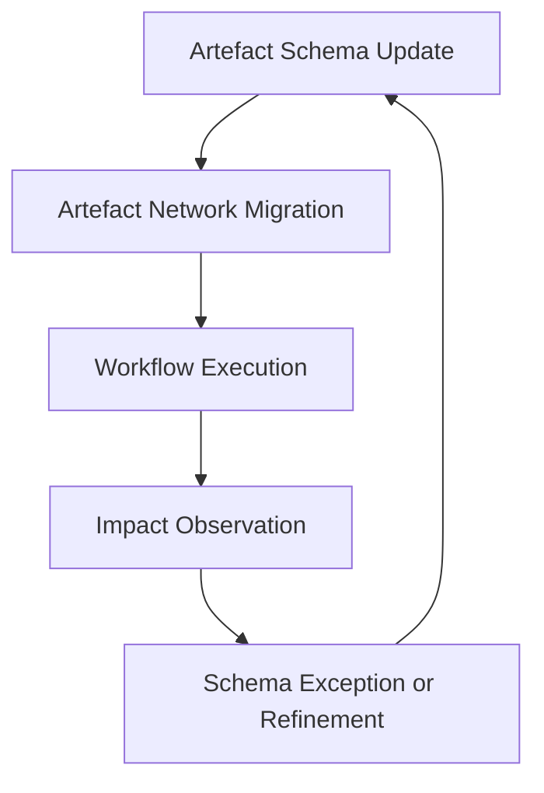

# Closing Guidance, Future Direction, and Continuous Learning

## Sustaining the Cornerstone Mindset

The adoption of Cornerstone as a hybrid delivery framework extends beyond procedural transformation; it demands a sustained evolution in mindset, infrastructure, and organisational practice. Its schema-driven, artefact-centric foundation shifts the locus of governance and assurance from static documentation and periodic compliance to an active, always-on control plane, where compliance, risk, and value flow are continuously negotiated within the artefact network itself. Sustaining this capability requires cultivating both technical and cultural resilience, orienting teams not only to adhere to schemas and process contracts but to continue maturing them in response to shifting internal and external demands.

Embedding sustainability and ethical accountability—now first-class artefact properties—does not simply add another compliance layer. Rather, it reconfigures compliance as an auditable, evolving thread tightly interwoven with architectural decisions, iterative adaptation, and product rationale. Retaining this integration over the product lifecycle demands constant vigilance: schema versions must track shifting standards, and exception handling routines must remain transparent and recoverable amidst architectural change. This recursive governance ensures that as products, technologies, and regulatory landscapes co-evolve, so too does the integrity of the artefact network.

## Mechanisms for Continuous Adaptation

Cornerstone’s strength lies in its ability to treat organisational change and process improvement as artefact network operations. By capturing process contracts, rationale, and exceptions as artefacts, it enables meta-level reflection—organisations can analyse, version, and incrementally improve not only products, but also the delivery frameworks, checklists, and policy rules governing their development. This recursion creates an institutionalised cycle of learning, traceability, and alignment between intent and action.

Practically, this means an organisation can pilot a new sustainability criterion by extending the relevant artefact schema, enforcing the extension via network policies, and monitoring impact through dependency-driven propagation. Should the change surface unforeseen friction, an exception artefact may be issued, rationalising the deviation and enabling post-hoc process or schema adaptation. In this way, continuous improvement is not episodic, but a persistent property of the delivery system.

### Diagram: Continuous Improvement Feedback in the Artefact Network

This diagram depicts the reinforcing feedback loop between artefact schema updates and operational workflows, with post-execution insights enabling exception handling or further refinement. The artefact network thus becomes both the domain of product logic and the substrate for organisational learning.

## Integration with Existing Ecosystems

Transitioning to a hybrid governance paradigm such as Cornerstone necessarily intersects with legacy systems, established practices, and varied organisational maturities. Integration is rarely achieved by abrupt displacement; more often it is negotiated through deliberate interfacing, progressive schema migration, and phased harmonisation with extant toolchains. Artefact-centricity can be introduced incrementally, initially surrounding selected domains (such as system requirements or verification management) before expanding into broader compliance or risk management workflows.

This migration poses concrete engineering challenges: artefact schemas must abstract and normalise data flowing from heterogeneous sources, necessitating robust data modelling and interface contracts. Tooling must support both human and automated artefact producers, brokers, and consumers—accommodating everything from structured model transformations to in-line Docs-as-Code contributions. Organisationally, roles and responsibilities must shift from document-owners to artefact stewards; process ownership becomes a matter of policy governance embedded in the artefact network, rather than manual oversight.

Failure to align interfaces and roles in this transition can create shadow processes, fragmented compliance evidence, and misplaced accountability. Therefore, successful adoption calls for a holistic change management approach—engaging cross-functional teams, investing in schema literacy, and reinforcing outcome-driven leadership that values traceability, rationale capture, and disciplined artefact stewardship.

## Trade-offs, Failure Modes, and Lifecycle Realities

The deployment of Cornerstone introduces powerful mechanisms for clarity and control, but also brings several architectural and operational trade-offs that must be explicitly managed. Schema rigidity and artefact granularity, for example, can affect system adaptability: schemas that are overly prescriptive may stifle exploration and innovation, while underspecified schemas risk ambiguity and compliance gaps. Tooling complexity can present an onboarding barrier, particularly where artefact network integration intersects with legacy data or informal knowledge flows.

Furthermore, artefact-centric delivery can highlight latent weaknesses in organisational discipline. The approach assumes some level of baseline maturity—a capacity for systematic artefact authoring, versioning, and review. Where such practices are new, initial artefact networks may be incomplete or inconsistently maintained, risking brittle compliance chains or auditability gaps. Automated dependency analysis is a force-multiplier for risk detection, but only insofar as artefact interrelations are faithfully modelled and maintained.

Cornerstone mitigates these issues through disciplined schema evolution and exception handling. Artefact inheritance, policy linking, and Docs-as-Code integration all serve to progressively strengthen the network without demanding immediate wholesale transformation. Organisations are encouraged to prioritise integration points that magnify value—such as risk-to-requirement traceability in regulated systems or sustainability metrics in environmental audits—while building the supporting literacy and automation progressively.

## Continuous Learning and Organisational Evolution

At its core, Cornerstone instantiates the principle that resilient, future-proof engineering is a function of continuous, adaptive learning—codified not in static guidelines, but in versioned, rationale-rich artefact networks. This architectural approach encourages a culture where process contracts, design intent, compliance, and operational feedback are treated as artefacts with lifecycles of their own. Teams and leaders become stewards of both technical and organisational knowledge, jointly responsible for the integrity and adaptability of delivery ecosystems.

Standards such as ISO 9001, ISO 26262, and GDPR become not external impositions, but directly referenceable artefact properties, enabling transparent, in-line alignment with global best practices. The artefact network, underpinned by Docs-as-Code, fosters a living documentation environment in which learning, audit, and adaptation are continuous system properties.

In this context, continuous learning is not restricted to technical methods, but extends to ethical reasoning, sustainability evaluation, and adaptive governance itself. As each artefact network evolves, the system’s ability to absorb new regulatory, societal, or market constraints without erosion of traceability or quality becomes a defining property of organisational competence.

## Looking Forward

Cornerstone is not a static methodology, but a framework for harmonising the evolving complexities of contemporary product development with the enduring principles of systemic clarity, traceable rationale, and adaptive control. Its hybrid nature intentionally accommodates both stable governance and dynamic evolution, empowering organisations to balance predictability with agility in the face of ongoing technical, regulatory, and societal change.

The path forward is one of deliberate, iterative evolution: piloting Cornerstone in domains of highest friction, nurturing artefact literacy, continuously refining schemas, and institutionalising stewardship of both products and the processes that govern their creation. The ultimate measure of success is not compliance alone, but the ability to continuously learn, adapt, and create with integrity—building not only robust products, but resilient, responsible, and future-ready engineering organisations.