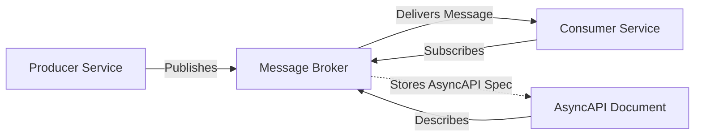
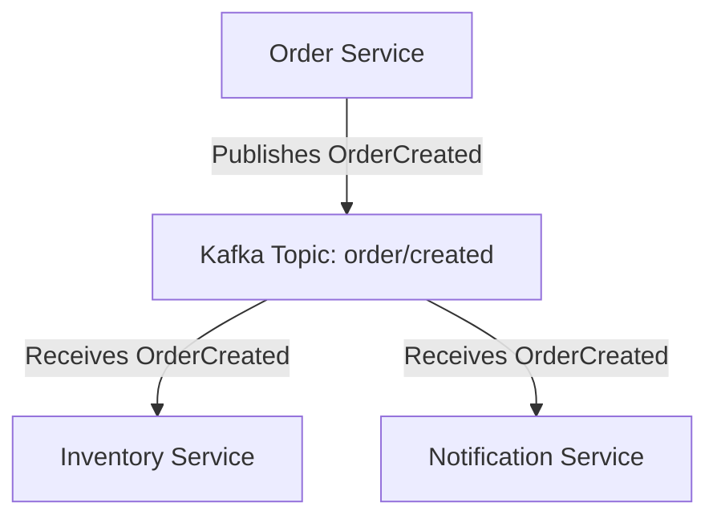
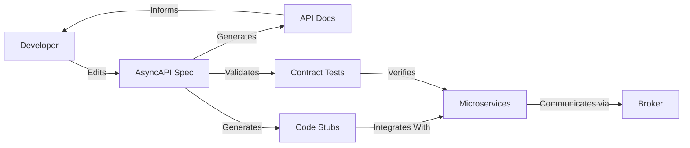

# AsyncAPI: Engineering Overview

## Introduction and Technical Context

The **AsyncAPI Specification** is an open standard for describing and documenting asynchronous, event-driven APIs. Similar in spirit to OpenAPI (formerly Swagger), which targets request-response and RESTful interfaces, AsyncAPI focuses on messaging systems—where data flows asynchronously between producers and consumers via message brokers or intermediaries. Its goal is to standardize the development, maintenance, and documentation of event-driven microservices and message-based architectures, ensuring consistency, reliability, and improved developer experience for asynchronous API ecosystems. AsyncAPI is widely adopted for systems based on protocols such as **MQTT**, **AMQP**, **Apache Kafka**, **WebSockets**, and others.

An async API, within this context, is a communication interface where message exchanges may occur independently of direct client requests, typically embracing patterns such as publish/subscribe, message queues, and stream processing.

## Core Concepts and Specification Structure

### The Nature of Asynchronous APIs

Traditional APIs (HTTP/REST, gRPC, etc.) use **synchronous, request-response** patterns: the client sends a request and waits for a response. Conversely, **asynchronous APIs** decouple the act of sending a message from receiving a response. Producers and consumers interact by publishing or subscribing to events using message brokers. These systems frequently underpin:

- Event-driven architectures (EDA)
- Microservices communication
- IoT messaging
- Streaming data pipelines

**Key characteristics:**

- **Loose coupling:** Sender and receiver need not be aware of each other's state or existence.
- **Scalability:** Supports high-throughput and dynamic workloads.
- **Resilience:** Can buffer messages and support retries, avoiding message loss during transient failures.

### AsyncAPI Document Structure

AsyncAPI uses a YAML or JSON document format comprised of several key top-level fields, modeled after the OpenAPI Specification but containing constructs tailored to event-driven architecture:

- `asyncapi`: Specification version.
- `info`: Metadata about the API (title, version, description, etc.).
- `servers`: Connection and protocol information for message brokers.
- `channels`: Communication paths or "topics" for messages, akin to queues, subjects, or streams.
- `messages`: Definitions of the payloads exchanged.
- `components`: Reusable schemas, security definitions, bindings, and message traits.

**Example (simplified):**
```yaml
asyncapi: '2.6.0'
info:
  title: Sensor Data API
  version: '1.0.0'
servers:
  prod:
    url: mqtt://broker.example.com
    protocol: mqtt
channels:
  temperature/reading:
    subscribe:
      message:
        $ref: '#/components/messages/TemperatureReading'
components:
  messages:
    TemperatureReading:
      payload:
        type: object
        properties:
          value:
            type: number
          timestamp:
            type: string
            format: date-time
```

### Key Entities

#### 1. **Servers**

Define brokers’ connection details (host, protocol, port, security). Protocol-specific information (e.g., MQTT, Kafka, AMQP) may be provided via **protocol bindings**.

#### 2. **Channels**

Represent communication endpoints (topics, queues, routing keys). Channels may have `publish`, `subscribe`, or both, mapping to producer or consumer roles.

#### 3. **Messages**

Abstract the payload structure exchanged. Messages point to JSON Schema or Avro schemas that define data contracts.

#### 4. **Components**

Reusable elements: message schemas, common headers, traits, security schemes, and protocol bindings, referenced throughout the document.

#### 5. **Bindings**

Protocol-specific meta-configuration providing details such as topic names, QoS levels, partitions (Kafka), or operation settings. This allows the AsyncAPI document to remain protocol-agnostic at the abstract level, yet highly expressive for concrete deployments.

### Conceptual Model Diagram



**Mermaid: Event-Driven Messaging Overview**

## Key Workflow: Describing an Asynchronous API with AsyncAPI

### 1. **Define Context and Goals**

- Identify message flows in your system: What services/events/brokers are involved?
- Determine protocols (e.g., Kafka, MQTT).
- Establish required topics, queues, or event streams.

### 2. **Draft the AsyncAPI Document**

- Assign metadata under `info`.
- List all brokers or endpoints under `servers`.
- Define `channels` to represent every communication path.
- Describe each `message`—define payloads formally, leveraging reusable `components` where possible.
- Configure protocol-specific `bindings`.

### 3. **Validate**

- Use tools like the [AsyncAPI CLI](https://github.com/asyncapi/cli) or online editors to validate specification syntax and structure.
- Catch and resolve schema or binding errors early.

### 4. **Generate Artifacts**

- **Documentation:** Human-readable interactive docs.
- **Code Generation:** Stubs, SDKs, test harnesses, and interface definitions in various languages.
- **Contract Testing:** Verification tools to ensure implementations conform to the defined contracts.

### 5. **Iterate and Evolve**

- AsyncAPI documents are living contracts—update and version them alongside evolving event-driven systems.

## AsyncAPI in Practice

### Supported Protocols

Out-of-the-box, AsyncAPI supports (but is not limited to):

- **MQTT** (widely used in IoT and telemetry)
- **AMQP** (Advanced Message Queuing Protocol; e.g., RabbitMQ)
- **Kafka** (high-throughput distributed messaging)
- **WebSockets** (bidirectional communications, often for web and real-time apps)
- **STOMP, NATS, JMS, SNS/SQS** (variously supported via plugins or bindings)

This diversity is achieved via a flexible binding and extensibility model.

### Practical Example: Microservice Event Streaming

**Scenario:** E-commerce order service publishes an `OrderCreated` event to a Kafka topic. Inventory and notification services subscribe to this topic to take action.

#### Example AsyncAPI Channel Declaration

```yaml
channels:
  order/created:
    subscribe:
      summary: Receive new order events
      operationId: receiveOrderCreated
      message:
        $ref: '#/components/messages/OrderCreated'
```

#### Example Message Schema

```yaml
components:
  messages:
    OrderCreated:
      payload:
        type: object
        required: [orderId, items]
        properties:
          orderId:
            type: string
          items:
            type: array
            items:
              type: object
              properties:
                sku:
                  type: string
                quantity:
                  type: integer
          timestamp:
            type: string
            format: date-time
```

### System Overview Diagram



**Mermaid: Microservice Event Streaming Process**

### Workflows Supported

- **Event Publication:** Producers send events to brokers as defined in AsyncAPI.
- **Subscription:** Consumers receive messages by subscribing to one or more channels/topics.
- **Message Transformation:** Brokers may route, filter, or transform messages as required.
- **Schema Validation:** Enforced at runtime or during testing, ensuring consumer-producer contract adherence.

### Integration with Other Standards

**AsyncAPI vs. OpenAPI:**

- OpenAPI models synchronous APIs (HTTP/REST/gRPC).
- AsyncAPI models asynchronous interactions (Kafka, MQTT, etc.).
- System architectures frequently employ *both*: REST for command/query, AsyncAPI for event/data streaming.

**Relevant Standards:**

- **RFC 7519 / JSON Schema:** Used for message payload definitions.
- **Protocol RFCs/specifications:** Kafka, MQTT, AMQP, WebSockets, etc.

## Engineering Considerations

### Integration Points

- **Developer Tooling:** AsyncAPI surfaces a growing ecosystem—editors, linters, code generators, document viewers.
- **CI/CD Pipelines:** Integrate validation, contract testing, and codegen in build processes.
- **System Documentation:** Auto-generates up-to-date visual and textual references for distributed teams.

### Performance Implications

- **Serialization Costs:** Payload schemas influence performance; JSON, Avro, Protobuf may exhibit different tradeoffs.
- **Broker Throughput:** AsyncAPI supports high-throughput brokers, but design choices (topic partitioning, message size) affect scalability.
- **Schema Evolution:** Documenting explicit schema versions in AsyncAPI enables careful migration and compatibility checks.

### Implementation Challenges

- **Protocol Nuances:** AsyncAPI aims for protocol-agnostic modeling but protocol-specific semantics (QoS, partitions, durable subscriptions) require precise configuration in bindings.
- **Complex Topologies:** Highly interconnected channel graphs can be hard to model—engineers should modularize schemas and adopt clear channel naming conventions.
- **Diffs and Versioning:** Maintaining backward-compatible changes across multiple AsyncAPI documents can be complex.

> :warning: **Warning**
>
> Inconsistent or missing protocol bindings may result in ambiguous interpretation of channel or message semantics, especially when targeting multiple broker technologies.

### Common Pitfalls

- **Overly Generic Schemas:** Weak or vague payload schemas defeat the purpose of contract-driven development.
- **Neglecting Security:** Not specifying security schemes in AsyncAPI may leave broker endpoints vulnerable.
- **Code Generation Misuse:** Blind trust in code-generated stubs can introduce errors if AsyncAPI docs are incomplete or incorrect.

> :bulb: **Tip**
>
> Start with a minimal AsyncAPI document and incrementally refine message schemas and bindings as your understanding of the event domain matures.

### Engineering Decisions

- **Channel Partitioning:** How to segment message flows for scalability and isolation.
- **Schema Registry Integration:** Tying AsyncAPI message schemas to schema registries (e.g., Confluent for Apache Kafka).
- **Multi-Protocol Support:** Whether to maintain a single AsyncAPI doc per protocol or to combine using multi-server/multi-binding features.

## Architectural Patterns with AsyncAPI

### Event-Driven Microservices

AsyncAPI is instrumental in rapidly documenting and scaling event-driven systems, where microservices interact via loosely coupled events. Each service publishes and/or subscribes as defined in the AsyncAPI document, and the system topology can be visualized and maintained systematically.

### Command-Query Responsibility Segregation (CQRS)

AsyncAPI can model the "event-side" of CQRS, documenting which domain events are emitted (and their payloads), independently from synchronous query-side APIs.

### IoT Device Messaging

IoT platforms frequently leverage MQTT, for which AsyncAPI can express detailed endpoint, security, and payload configuration, facilitating device provisioning and data ingestion at scale.

## Diagram: AsyncAPI Ecosystem Integration



**Mermaid: AsyncAPI Tooling and Integration Workflow**

## Security and Compliance

AsyncAPI supports standard security patterns, including:

- **Basic Authentication** (e.g., username/password for MQTT)
- **OAuth 2.0/JWT** (for brokers supporting token-based security)
- **API Keys**
- Broker-specific mechanisms

These are configured per server via the `securitySchemes` component and referenced as required.

> :octagonal_sign: **Caution**
>
> Relying solely on protocol-level security may be insufficient—engineers should explicitly document and enforce security requirements in AsyncAPI specs.

## Limitations and Future Directions

### Limitations

- Limited support for protocols not natively modeled (some require community-contributed extensions).
- Complex/event-rich systems may produce unwieldy specifications difficult to maintain without strong governance and tooling.
- Not a replacement for runtime message validation or enforcement—AsyncAPI is a design, documentation, and (optionally) code-generation artifact.

### Ongoing Developments

- **AsyncAPI 3.x:** Evolving to better support streaming, more complex patterns, and expanded protocol coverage.
- **Improved Tooling:** Interactive visual editors, schema diffing/versioning support, contract testing enhancements.
- **Tighter Integrations:** With OpenAPI and service discovery registries.

## Conclusion

AsyncAPI represents a significant advance in making asynchronous, event-driven systems more understandable, manageable, and maintainable. By providing machine-readable documentation, rigorous message and channel definitions, and integration with modern development tooling, AsyncAPI accelerates the development and operation of robust, loosely coupled distributed systems. Its utility spans microservices, IoT, streaming applications, and anywhere asynchronous message exchange is foundational.

By adhering to the AsyncAPI specification, engineering teams can:

- Foster stronger contract-driven development,
- Minimize integration risk,
- Achieve better documentation and test coverage,
- Scale systems confidently as event throughput and complexity increase.

AsyncAPI's adoption will likely increase alongside the continued rise of event-driven and cloud-native architectures.

---

> :information_source: **Note**
>
> More detailed diagramming (e.g., per-protocol workflow, schema evolution flowcharts) can be considered for inclusion in system-specific AsyncAPI documentation.