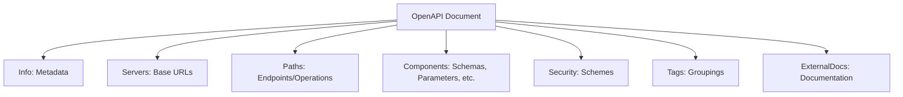
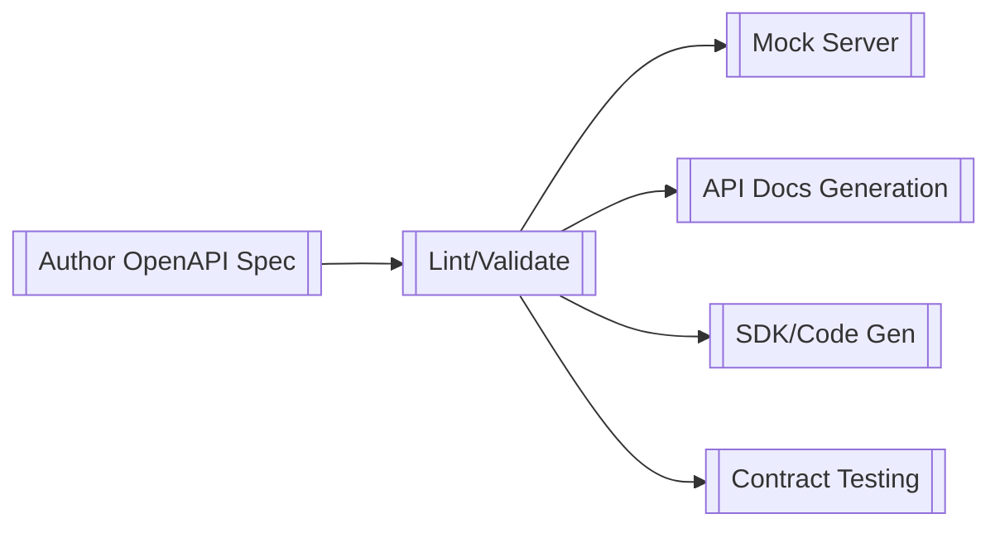
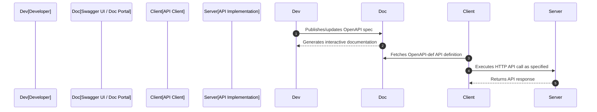

# OpenAPI: An Engineering Overview

## Introduction

OpenAPI is an industry-standard specification that provides a language-agnostic way to describe RESTful HTTP APIs. Originating from the Swagger project, OpenAPI enables both humans and computers to discover, understand, and utilize the capabilities of a service without access to source code or additional documentation. The current standard—OpenAPI Specification (OAS)—is maintained by the OpenAPI Initiative, part of the Linux Foundation. Its adoption is widespread in cloud-native technologies, enterprise API platforms, and modern web application architectures.

OpenAPI definitions drive tooling for API documentation, code generation, testing, mocking, validation, and client/server stubs—streamlining API lifecycle management and enhancing the interoperability of distributed systems.

---

## Technical Context and Purpose

RESTful APIs, popularized in the last two decades, lack a formal, built-in mechanism for describing their operations, resources, and data contracts in a machine-readable format. The OpenAPI Specification addresses this gap by offering a rich and standardized schema for documenting REST interfaces.

OpenAPI documents are typically authored in YAML or JSON. They precisely describe endpoints, input/output data structures, authentication schemes, response status codes, and other relevant metadata. Tools across the software stack—from API gateways to developer portals—use these specifications to drive automation and validation.

---

## Core Concepts and Key Components

### The OpenAPI Document

An OpenAPI definition (document) declares the structure and semantics of an API. Its top-level structure consists of several required and optional fields:

- **openapi**: Version of the specification.
- **info**: Metadata about the API (title, description, version).
- **servers**: List of base URLs for the API.
- **paths**: Endpoints, verbs, and their operations.
- **components**: Reusable objects (schemas, parameters, responses).
- **security**: Applicable global security schemes.
- **tags**: Grouping of operations.
- **externalDocs**: Links to extended documentation.

A minimal OpenAPI schema example in YAML:
```yaml
openapi: 3.1.0
info:
  title: Sample API
  version: "1.0"
  description: A minimal OpenAPI Specification example
paths:
  /users:
    get:
      summary: List users
      responses:
        "200":
          description: Successful response
          content:
            application/json:
              schema:
                type: array
                items:
                  $ref: '#/components/schemas/User'
components:
  schemas:
    User:
      type: object
      properties:
        id:
          type: integer
        name:
          type: string
```

---

### Paths and Operations

The core of OpenAPI consists of `paths` and their respective `operations`. Each path (such as `/users`) maps to one or more HTTP methods (GET, POST, PUT, DELETE, etc.). Operations include details about parameters, request bodies, responses, and additional metadata.

- **Path Object**: Represents an endpoint/resource path.
- **Operation Object**: Defines HTTP method, summary, responses, parameters, security, tags, and more.

#### Example Structure

```yaml
paths:
  /pet:
    post:
      summary: Add a new pet
      operationId: addPet
      requestBody:
        content:
          application/json:
            schema:
              $ref: "#/components/schemas/Pet"
      responses:
        "200":
          description: Pet added
```

---

### Schemas and Data Types

Using the `components` object, OpenAPI allows for reusable schema definitions using JSON Schema draft 2020-12 (as of OpenAPI 3.1). Schemas define the shape and validation constraints of objects and primitives used in requests and responses.

- **Primitive Types**: string, integer, number, boolean, array, object.
- **Complex Types**: Objects with properties, nested structures, enumerations, arrays.

**Example schema definition:**
```yaml
components:
  schemas:
    Error:
      type: object
      required:
        - message
      properties:
        message:
          type: string
        code:
          type: integer
```

---

### Parameters and Request Bodies

Parameters may be supplied via path, query, header, or cookies. Request bodies are defined for applicable HTTP methods (such as POST and PUT).

- **Parameter Object**: Location (`in`: path, query, header, cookie), name, schema, required/optional.
- **RequestBody Object**: Content-type, schema, examples.

---

### Responses

Each operation specifies response codes, associated descriptions, and content schemas.

- **Response Object**: HTTP status code, description, headers, content (media type and schema), and examples.

**Example:**
```yaml
responses:
  "404":
    description: Not found
    content:
      application/json:
        schema:
          $ref: "#/components/schemas/Error"
```

---

### Security Schemes

OpenAPI describes authentication and authorization mechanics via security schemes, supporting:

- API keys (in header, query, or cookie)
- HTTP authentication (Basic, Bearer)
- OAuth 2.0 flows
- OpenID Connect

Each scheme is defined in `components.securitySchemes`, and operations can opt-in/out at various scopes.

**Example:**
```yaml
components:
  securitySchemes:
    ApiKeyAuth:
      type: apiKey
      in: header
      name: X-API-Key
```

---

### Full Document Block Diagram



---

## OpenAPI Workflow in Practice

### Authoring and Testing

1. **Specification Authoring**  
   - Authored manually (YAML/JSON) or generated from source code annotations (e.g., with libraries such as Swagger Core).
   - Tools like Swagger Editor, Stoplight, and Redocly support interactive editing and validation.

2. **Linting and Validation**  
   - Static analysis tools (e.g., Spectral) enforce style rules, completeness, and spec conformance.

3. **Mocking and Prototyping**  
   - Tools read the OpenAPI file to spin up mock servers (e.g., Prism, WireMock).
   - Enables front-end and client engineers to develop against simulated endpoints.

4. **Documentation Generation**  
   - Automated doc portals (Swagger UI, Redoc, ReDocly, etc.) display interactive API reference directly from the OpenAPI file.

5. **Code Generation and SDKs**  
   - OpenAPI Generator, Swagger Codegen produce client libraries and server stubs in various languages.

6. **Testing and Validation**  
   - Contract testing frameworks validate implementation compliance with the defined spec (e.g., Dredd, Schemathesis).



---

## Integration Points and Common Engineering Considerations

### Tooling and Automation

OpenAPI’s machine-readable nature supports continuous integration pipelines, automated testing, deployment, and compliance auditing.

- **DevOps/CD Pipelines:** Validate, test, and bundle spec files on code commits.
- **API Gateway Integration:** API gateways (e.g., Kong, Apigee, AWS API Gateway) consume specs for route configuration, policy enforcement, and documentation delivery.
- **Backward Compatibility:** Automated diff tooling (e.g., openapi-diff) detects breaking changes between API versions.
- **Security Scanning:** Automated checks spot risks such as missing authentication or excessive exposure.

> **GitHub Alert (Tip)**  
> Use OpenAPI with Git hooks or CI pipelines to enforce that all API changes are accompanied by updated documentation and validation checks. This reduces the risk of undocumented or non-compliant endpoints reaching production.

---

### Versioning and Evolvability

- **Spec Versioning:** The `openapi` version field governs OAS syntax compatibility. Backwards-incompatible changes (e.g., 3.0.x to 3.1.x) require explicit updates.
- **API Versioning:** The API itself may be versioned (e.g., `/v1/resource`), described in `servers` or as a parameter.

> **GitHub Alert (Caution)**  
> Always maintain versioned specifications for stable public APIs. Failure to do so can create ambiguity and break client integrations as the API evolves.

---

### Documentation Consistency

- **Single Source of Truth:** OpenAPI facilitates “contract-first” or “design-first” practices, ensuring that API behavior aligns with documentation.
- **Drift Prevention:** Automated tests and generation prevent implementation drift from the intended contract.

---

### Security and Privacy

- **Authentication Coverage:** Ensure every operation specifies necessary security schemes.
- **Data Exposure:** Use request/response schema definitions to prevent unintentional exposure of internal fields.

---

### Performance Considerations

- **Schema Complexity:** Excessively complex or deep schema objects can degrade editor or codegen tool performance.
- **Large Specs:** APIs with hundreds of endpoints and schemas may require modularization via `$ref` and externalized components.

---

## OpenAPI Ecosystem and Notable Variations

### Relationship to Swagger and Other Standards

- **Swagger:** The predecessor (2.0) to OpenAPI; now a deprecated synonym for OAS but still widely referenced.
- **RAML, API Blueprint:** Competing/alternative API description formats.
- **JSON Schema Compatibility:** Since OpenAPI 3.1, OAS fully supports referencing standards-compliant JSON Schema.
- **AsyncAPI:** A parallel initiative for asynchronous/messaging-based APIs.

### Modularization and Large-Scale Management

- **Splitting Specifications:** Using `$ref` to externalize and modularize definitions, supporting multi-team, large API landscapes.
- **Vendor Extensions (`x-*`):** Mechanism for adding tool-specific hints and custom metadata without violating spec compliance.

---

### Example: API Call Flow Using OpenAPI-driven Tooling



---

## Limitations and Common Pitfalls

### Expressiveness Constraints

- **Non-RESTful Patterns:** GraphQL, gRPC, or event-driven APIs are not directly supported.
- **Embedded Business Logic:** Cannot express workflow, business rules, or deep validation logic—only request/response contracts.

### Implementation Divergence

- **Contract Drift:** Implementations may deviate from the spec unless enforced via contract testing.
- **Documentation Rot:** Stale OpenAPI files can misrepresent the running implementation.

> **GitHub Alert (Warning)**  
> Always align your runtime implementation with the published OpenAPI spec. Discrepancies can lead to security issues, client errors, and loss of trust in the documentation.

---

## OpenAPI in the Broader API Landscape

OpenAPI is now integral to the modern API stack, serving as the common “interface definition language” (IDL) for RESTful HTTP APIs. In the context of microservices and distributed systems, OAS enhances discoverability, onboarding, architectural governance, and automation across dev, ops, and QA tooling.

It should be viewed as a core contract artifact—versioned, reviewed, and managed with the same rigor as source code.

---

## Summary Table: OpenAPI Key Attributes

| Attribute              | Description                                            |
|------------------------|--------------------------------------------------------|
| Specification Standard | OpenAPI Specification (OAS), maintained by OAI         |
| Description Format     | YAML or JSON                                           |
| Supported API Styles   | RESTful HTTP APIs                                      |
| Schema System          | JSON Schema draft 2020-12+ (as of OAS 3.1)             |
| Security Schemes       | API Key, HTTP Auth, OAuth2, OpenID Connect             |
| Main Use Cases         | Documentation, codegen, contract testing, mocking      |
| Notable Tools          | Swagger UI, Redoc, OpenAPI Generator, Spectral, Dredd  |
| Limitations            | REST-only, no workflow/business logic, no async APIs   |

---

## Conclusion

OpenAPI provides a rigorous, machine-processable foundation for the description and lifecycle management of RESTful HTTP APIs. Its specification harmonizes developer experiences, underpins robust contract-first engineering workflows, and supports automation across the API ecosystem.

For software engineers building, consuming, or governing HTTP APIs, mastery of the OpenAPI standard—and the associated patterns and tooling—is essential for achieving reliability, transparency, and integration velocity in modern distributed systems.

---