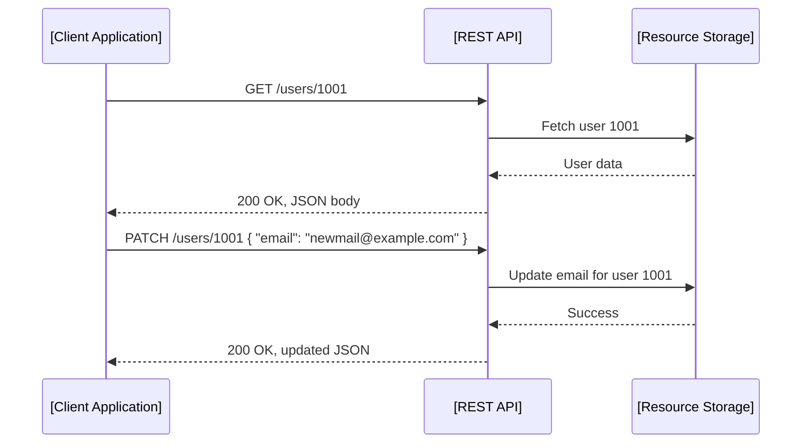
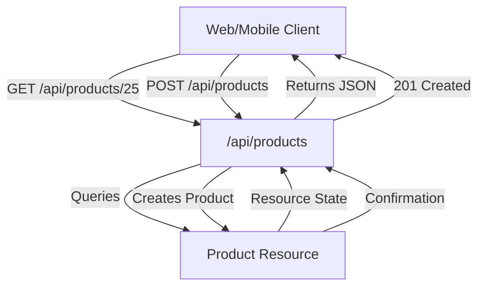

# Introduction

Representational State Transfer (REST) is a widely adopted architectural style for designing networked applications, particularly web APIs, around the concept of resource-based communication over HTTP. REST leverages the existing features of the HTTP protocol to create scalable, stateless systems that expose resources to clients via standard, predictable interfaces. 

Originally defined by Roy Fielding in his 2000 doctoral dissertation, REST has become the de facto paradigm for building web services and APIs, subsequently influencing standards, tooling, and implementation patterns across the web ecosystem.

# REST in Context

REST is not a protocol, library, or specification, but an architectural style defined through a set of constraints and principles. While it is protocol-agnostic in theory, most practical implementations utilize HTTP as the transport mechanism. RESTful systems facilitate interaction between clients (such as web browsers, mobile applications, or server-side consumers) and servers that house resources, encouraging a clear separation of concerns and scalability at web scale.

REST is often compared to other architectural approaches such as RPC (Remote Procedure Call) and SOAP (Simple Object Access Protocol). While RPC models focus on method invocation, REST focuses on resource manipulation, promoting statelessness and uniformity in interface.

# Core Concepts

## Resources

A resource is any piece of data or object that can be uniquely identified and manipulated on the server. Resources are abstract entities, such as users, files, products, or documents. Each resource is identified by a unique URI (Uniform Resource Identifier).

**Example Resource URIs:**
- `/users/1234`
- `/orders/5678/items`
- `/documents/report.pdf`

## Representations

A representation is a particular serialization of a resource’s state, transmitted over the network. Clients interact with resources by exchanging representations, typically in XML, JSON, or other text/binary formats.

**Example:**
A GET request to `/users/1234` might respond with JSON:

```json
{
  "id": 1234,
  "name": "Jane Doe",
  "email": "jane@example.com"
}
```

Resource “state” on the server may change as a result of client actions (e.g., updates), and clients may submit changes as new representations.

## Uniform Interface

REST defines a uniform interface between clients and servers, realized through a standardized set of operations, usually the HTTP methods:

- **GET**: Retrieve a resource representation.
- **POST**: Create a resource or submit data for processing.
- **PUT**: Replace an existing resource with a new representation.
- **PATCH**: Partially update a resource.
- **DELETE**: Remove a resource.

This mapping enables visibility, evolvability, and decoupling between client and server.

## Statelessness

Each HTTP request in REST must contain all of the information necessary for the server to understand and fulfill the request. The server does not store any client context between requests.

> **Alert**
> **Caution:** Implementing truly stateless APIs requires careful engineering regarding authentication, session management, and caching.

## Client-Server Separation

RESTful systems cleanly separate concerns between client and server. Clients are responsible for user interface and user state. Servers manage resources and enforce business logic. This allows client and server development and evolution to proceed independently as long as the contract (the API) remains stable.

## Layered System

REST allows a system to be composed of hierarchical layers—such as proxies, gateways, and caches—enabling load balancing, security enforcement, and other concerns. Intermediate components may modify requests or responses.

## Cacheability

Responses to client requests must define themselves as cacheable or non-cacheable to prevent clients (or intermediaries) from reusing stale or inappropriate data. HTTP headers such as `Cache-Control`, `Expires`, and `ETag` are used for this purpose.

> **Alert**
> **Tip:** Proper HTTP caching can significantly improve REST API scalability and performance.

## Code-On-Demand (Optional)

Servers may optionally provide executable code (e.g., JavaScript) to clients. This is the only optional REST constraint and is rarely used in most API implementations.

# REST Architectural Overview

## High-Level Interaction Model

Below is a simplified interaction diagram expressing the primary data flow and relationships in a RESTful system.

```mermaid
flowchart LR
    Client[Client Application]
    API[REST API Endpoint]
    Resource[Resource Storage]
    Proxy[Proxy/Load Balancer]
    Cache[HTTP Cache]
    
    Client -- "HTTP Request" --> Proxy
    Proxy -- "Forward Request" --> API
    API -- "Validate/Process" --> Resource
    Resource -- "Data" --> API
    API -- "Response (Representation)" --> Cache
    Cache -- "Cached Response" -.-> Proxy
    Proxy -- "HTTP Response" --> Client
```

# REST and HTTP: Implementation Details

In practice, HTTP is the primary transport protocol for RESTful systems. Key HTTP concepts relevant to REST include:

## HTTP Methods and Resource Operations

| HTTP Method | Typical REST Operation | Idempotent? | Safe?  |
|-------------|-----------------------|-------------|--------|
| GET         | Read                  | Yes         | Yes    |
| POST        | Create / Submit       | No          | No     |
| PUT         | Create / Replace      | Yes         | No     |
| PATCH       | Partial Update        | No          | No     |
| DELETE      | Remove                | Yes         | No     |

## HTTP Status Codes

RESTful APIs use standard HTTP status codes to signal outcome and errors:

- **200 OK**: Successful GET, PUT, PATCH, or DELETE.
- **201 Created**: New resource created (POST/PUT).
- **204 No Content**: Successful action—no body returned.
- **400 Bad Request**: Malformed or invalid client input.
- **401 Unauthorized**: Authentication required.
- **403 Forbidden**: Access denied.
- **404 Not Found**: Resource does not exist.
- **409 Conflict**: Request could not be completed due to resource state.
- **500 Internal Server Error**: Server-side processing error.

## Content Negotiation

HTTP provides headers for clients and servers to negotiate representation formats (e.g., JSON, XML). Key headers include:

- `Accept`: Client specifies preferred response format (`Accept: application/json`)
- `Content-Type`: Server or client specifies format of payloads being sent

**Example Request:**
```http
GET /orders/1234 HTTP/1.1
Host: api.example.com
Accept: application/json
```

## Hypermedia and HATEOAS

RESTful APIs may provide links and controls in resource representations, allowing clients to navigate between resources dynamically. This principle—Hypermedia as the Engine of Application State (HATEOAS)—is a constraint in Fielding’s model, though often omitted in practice.

**Example JSON with Hypermedia links:**
```json
{
  "id": 42,
  "name": "Inventory Item",
  "_links": {
      "self": { "href": "/items/42" },
      "update": { "href": "/items/42", "method": "PUT" },
      "delete": { "href": "/items/42", "method": "DELETE" }
  }
}
```

# Example Workflow: RESTful Resource Manipulation



# REST Constraints: Engineering Implications

## Uniform Interface

- **Advantage:** Predictable, decoupled design—clients and servers can evolve independently.
- **Challenge:** Mapping complex business operations to CRUD-like methods may be unnatural; avoids RPC “action” endpoints in favor of resource semantics.

## Statelessness

- **Performance:** Reduces need for server-memory-per-client; supports scalability.
- **Engineering Issue:** Requires all state (such as authentication tokens or pagination cursors) to be provided by the client, often leading to token-based authentication (e.g., OAuth 2.0 Bearer tokens in `Authorization` headers).

## Cacheability

- **Performance:** Enables use of intermediary caches, reducing load and latency.
- **Implementation:** Requires correct caching headers, cache purging on updates, and attention to data consistency.

## Layered System

- **Modularity:** Allows introduction of security layers (e.g., API gateways), caching infrastructure, logging, and analytics without impacting clients or resource servers.

## Hypermedia

- **Dynamic Discovery:** Allows clients to discover API capabilities at runtime—useful for highly dynamic or generic clients.
- **Practical Consideration:** Most modern APIs provide only basic hypermedia support due to implementation complexity and limited client adoption.

# Typical REST API Design Patterns

## Resource Naming

Resource URIs should be:

- **Noun-based:** `/products/123`, not `/getProduct`
- **Hierarchical:** `/stores/15/products/123`
- **Consistent and predictable**

## Response Formats

JSON has become the predominant response format for REST APIs, though XML, YAML, and binary formats are also encountered.

## Filtering, Sorting, Pagination

APIs for resource collections commonly implement:

- Filtering: `/products?category=shoes`
- Sorting: `/products?sort=price_desc`
- Pagination: `/products?page=2&limit=50`

## Error Structure

REST APIs often use consistent error objects, typically structured as:

```json
{
  "error": {
    "code": "invalid_request",
    "message": "Required field is missing",
    "details": { ... }
  }
}
```

## Versioning

Techniques include:

- URL Versioning: `/v1/users/123`
- Header Versioning: `Accept: application/vnd.api+json;version=2.0`
- Media Type Versioning (via `Accept`)

> **Alert**
> **Note:** Fielding argues proper REST APIs may not require explicit versioning if hypermedia is fully leveraged, but in practice, explicit versioning is common to maintain backward compatibility.

# Security and Authentication

RESTful APIs are typically stateless, so authentication cannot rely on per-client server sessions. Instead, common patterns include:

- **HTTP Basic/Auth:** Simple but with security risks if used without HTTPS.
- **OAuth 2.0 Bearer Tokens:** Industry-standard approach for delegated authentication and authorization.
- **API Keys:** Often used, but should not be considered fully secure.

TLS (HTTPS) is essential for all production-grade REST APIs to protect credentials and payloads.

# Standards and Specifications

- **RFC 7231 (HTTP/1.1 Semantics and Content):** Outlines HTTP request methods, status codes, and resource representation.
- **RFC 3986 (URI Generic Syntax):** Defines URI formats.
- **OpenAPI Specification:** Though not a REST standard, OpenAPI (formerly Swagger) is widely used for describing RESTful APIs in a machine-readable way.

# Practical Considerations and Pitfalls

## Integration Points

REST APIs commonly serve as integration points for:

- Web applications (JavaScript/TypeScript front-ends)
- Mobile apps
- Microservices
- External partners or third-party developers

> **Alert**
> **Tip:** Use OpenAPI (Swagger) for precise, discoverable API documentation and contract generation.

## Performance Implications

- Over-fetching or under-fetching data (e.g., returning large collections or missing fields) due to coarse, fixed endpoints.
- N+1 request patterns when APIs are not designed to support embedding or bulk retrieval.
- Network latency and bandwidth impacts—optimize with paging, filtering, and response shaping.

## Implementation Challenges

- Correctly handling partial updates (`PATCH`)
- Crafting resource models for complex domains
- Mapping business transactions to HTTP semantics

## Common Pitfalls

- Treating HTTP as a raw transport for RPC-like calls (“REST over RPC” antipattern)
- Ignoring caching headers, resulting in poor performance or stale data
- Failing to use proper HTTP status codes and error reporting
- Exposing internal implementation details (poor abstraction)

# Simple RESTful API Example



# Notes on Extensibility and Evolution

RESTful APIs can be extended and evolved over time by:

- Adding new fields or links (if clients can ignore unknown fields)
- Creating new resources or endpoints
- Using content negotiation to introduce new representations

Care must be taken not to introduce breaking changes, particularly to resource URIs and contract.

# REST vs. Other Styles

While REST is the most widely used architectural style for web APIs, several alternatives exist, including:

- **GraphQL:** Query-driven data access, client-specified queries
- **gRPC:** Protocol Buffers-based, strongly-typed RPC
- **SOAP:** XML-based, contract-first web services

REST remains popular due to its alignment with existing web infrastructure, ease of use, and flexibility.

# Summary Table: REST Features and Constraints

| Feature           | Description                                         |
|-------------------|-----------------------------------------------------|
| Resource-based    | Data modeled as addressable resources (URIs)        |
| Uniform interface | GET, POST, PUT, PATCH, DELETE via HTTP              |
| Stateless         | No session state retained on server                  |
| Cache support     | HTTP headers control client/intermediary caching     |
| Layering          | Supports intermediaries (proxies, caches, gateways) |
| Hypermedia        | Optionally provides links to related resources       |
| Extensible        | Evolves via new endpoints, fields, or representations |

# Conclusion

REST provides a robust, scalable, and interoperable architectural foundation for web APIs by centering on addressable resources, stateless interaction, and a uniform interface over HTTP. It is grounded in the foundational standards of the web, aligns with HTTP semantics to maximize compatibility and caching, and remains central in modern API design and integration. While alternative paradigms and technologies exist, REST continues to underpin much of today's web and API ecosystem, shaping best practices in distributed systems engineering and influencing the design of related standards such as OpenAPI and OAuth 2.0.