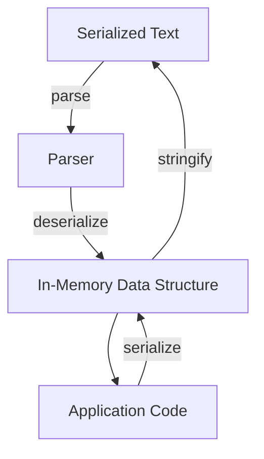
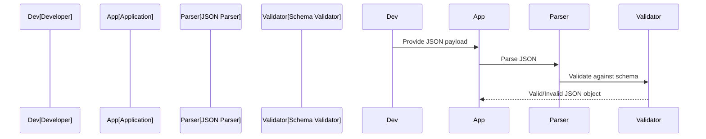
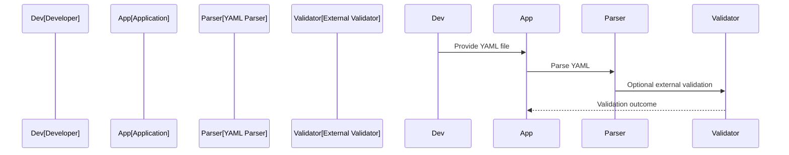
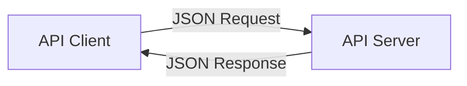
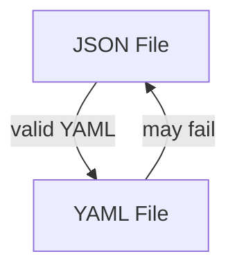

# JSON and YAML: Structured Serialization Formats

## Introduction

JSON (JavaScript Object Notation) and YAML (YAML Ain't Markup Language) are widely adopted serialization formats, primarily used for data interchange, configuration management, and application integration across modern software systems. Both formats serialize structured data as human-readable plain text, enabling interoperability between heterogeneous environments and programming languages. Their roles are fundamental in API payloads, configuration files, continuous integration pipelines, and data storage.

This primer presents a technical overview of both formats, including structure, syntax, capabilities, implementation considerations, and use cases.

---

## Serialization in Modern Software

**Serialization**—the process of translating structured in-memory data into a format suitable for storage or transmission—enables data exchange between heterogeneous systems, processes, and services. A serialization format must balance human readability, expressiveness, parsing efficiency, extensibility, and interoperability.

JSON and YAML serve overlapping but distinct niches in this landscape:

- **JSON** is predominant in API communication, streaming, and web applications.
- **YAML** excels in configuration, templating, and settings files, particularly where human authorship and readability are important.

---

## Format Overview

| Format | MIME Type                 | Primary Use Case     | Human Readability | Specification        |
|--------|---------------------------|----------------------|-------------------|----------------------|
| JSON   | `application/json`        | APIs, data exchange  | Good              | [RFC 8259](https://tools.ietf.org/html/rfc8259) |
| YAML   | `application/x-yaml` (unofficial)<br>`text/yaml` (deprecated) | Configuration, templating | Excellent           | [YAML 1.2 Spec](https://yaml.org/spec/1.2/spec.html) |

---

## Syntax and Structure

### JSON

- **Origin**: Standardized subset of JavaScript object notation.
- **Data types**: Object, Array, String, Number, Boolean, null.
- **Syntax rules**: Strict, unambiguous, minimal.
- **Encoding**: Unicode, supports UTF-8 natively.

**Example: Person Record in JSON**

```json
{
  "firstName": "Jane",
  "lastName": "Doe",
  "age": 34,
  "isEmployed": true,
  "skills": ["Python", "API Design", "Data Modeling"]
}
```

### YAML

- **Origin**: Human-centric configuration and data exchange.
- **Data types**: Mapping (dictionary), Sequence (list), Scalar.
- **Syntax rules**: Whitespace significant (indentation), minimal syntax, supports comments.
- **Encoding**: Unicode, typically UTF-8.

**Example: Person Record in YAML**

```yaml
firstName: Jane
lastName: Doe
age: 34
isEmployed: true
skills:
  - Python
  - API Design
  - Data Modeling
```

### Core Comparison

| Feature              | JSON                        | YAML                         |
|----------------------|----------------------------|------------------------------|
| Comments             | No                         | Yes (`#`)
| Multiline Strings    | Escape with `\n`, awkward  | Pipe (`|`) and folded (`>`)
| Anchors and Aliases  | No                         | Yes (`&` and `*`)
| Custom Data Types    | No                         | Yes (via tags)
| Order Guarantee      | No (specification-agnostic)| Preserves mapping order (1.2+)
| Streaming            | No (one document only)     | Yes (--- and ... delimiters)
| Spec Ambiguity       | Low                        | Higher for complex constructs

---

## Data Model

Both formats represent hierarchical data, but differ in expressiveness and complexity.

**Mermaid Diagram: Abstract Data Model for JSON and YAML**



---

## Parsing, Validation, and Tooling

### JSON

JSON is simple to parse, with parsers available in virtually every programming language. It is easy to validate against a schema (such as [JSON Schema](https://json-schema.org/)), which is formalized and supported by automated tooling.

**Validation Workflow Example:**



### YAML

YAML's parsing complexity is significantly higher due to features such as anchors, references, and multi-document streams. While there are robust parsers for major languages, behavior can diverge with edge cases or extensions. Schema validation is less standardized but possible (e.g., [YAML Schema](https://datatracker.ietf.org/doc/html/draft-everson-yaml-schema-01)).



---

## Features Comparison

### Comments

- **JSON:** Does not support comments. This ensures data/metadata separation but is less convenient for human-edited documents.

  > [!WARNING]
  > Comments are not allowed in strict JSON. Parsers may reject files with comments. Avoid using in configuration.

- **YAML:** Supports comments with the `#` character. Useful for configuration files and documentation within data files.

### Anchors and References

- **YAML** can reuse data fragments via anchors (`&`) and aliases (`*`):

  ```yaml
  base: &base
    db: my_database
    host: localhost

  development:
    <<: *base
    db: dev_database
  ```

  > [!NOTE]
  > Diagram to be added later: Example showing YAML anchor and alias expansion.

- **JSON** has no native concept of anchors or references.

### Multiline Strings

* YAML supports multiline literals, making it more suitable for complex templates.

  ```yaml
  description: |
    This is a description
    that spans multiple lines,
    preserving all line breaks.
  ```

* JSON must encode newlines as `\n` escapes.

---

## Document Structure and Streaming

### Single vs Multi-document

- **JSON:** Always represents a single data structure per document.
- **YAML:** Supports multiple documents within a single file, delimited by `---` (document start) and `...` (document end).

  ```yaml
  # YAML. Two documents in one file:
  ---
  name: staging
  url: https://staging.example.com
  ---
  name: production
  url: https://prod.example.com
  ...
  ```

---

## Integration with APIs

### API Payloads

**JSON** has become the de facto data format for RESTful APIs due to its predictable structure, ease of parsing, and native support in JavaScript environments (such as browsers and Node.js).



**YAML** is less common in direct API payloads, but is frequently used in:

- **API specifications** (OpenAPI, AsyncAPI definitions)
- **Configuration files** for API management
- **Data import/export** for API-based tools

### Configuration

Both formats are used in configuration, with YAML being especially favored in:

- Kubernetes manifests (`.yaml`)
- Continuous integration pipelines (e.g., GitHub Actions, Travis CI)
- Application config for DevOps tooling (Ansible, Docker Compose)

**JSON** sees use in:

- npm's `package.json`
- Some cloud service configurations
- Application default configuration files

---

## Standards and Specifications

### JSON

- **RFC 8259** – The current formal standard, specifying detailed syntax and semantic rules for interoperability.
- **ECMA-404** – “The JSON Data Interchange Syntax,” a concise syntactic definition.
- **JSON Schema** – Declarative schema definition and validation.

### YAML

- **YAML 1.2** – Most current specification; aligns closely with JSON's data model for compatibility.
- **YAML Schema (Drafts)** – Community-driven, not as mature as JSON Schema.

---

## Encoding and Unicode

Both JSON and YAML support Unicode. JSON requires that text be encoded in UTF-8, UTF-16, or UTF-32 without a byte order mark (BOM). YAML typically defaults to UTF-8.

---

## Extensibility and Custom Types

**JSON** does not directly support custom types; it represents fundamental types only (object, array, string, number, Boolean, null). Metadata must be encoded within the data, e.g., `{ "type": "date", "value": "2023-12-01" }`.

**YAML** allows **tags** for typing:

```yaml
birthdate: !!timestamp "2023-12-01"
```

This enables features like custom data loading and type coercion when supported by the parser.

> [!CAUTION]
> YAML tag handling is implementation-defined. Support for custom tags is inconsistent across tools.

---

## Constraints, Pitfalls, and Security

### Parsing Ambiguity

- **JSON**: Rigid grammar yields predictable parsing and security.
- **YAML**: Complex features (references, merges, tags, type inference) can lead to parsing discrepancies between tooling and environments.

### Security Considerations

- **Deserialization Vulnerabilities**: YAML parsers (especially in “unsafe” modes, e.g., PyYAML's `load` instead of `safe_load`) may allow execution of arbitrary code due to YAML’s extensibility.

  > [!WARNING]
  > Always use safe YAML parsing modes. Avoid loading untrusted YAML unless the parser is explicitly safe.

- **Denial of Service**: Both formats can be abused with crafted inputs (e.g., recursive structures in YAML, deep object trees in JSON).

- **Injection Risks**: Ensure data serialized for APIs or config files cannot serve as a vector for code or command injection.

---

## Implementation Challenges and Interoperability

- **Whitespace Sensitivity (YAML)**: Indentation errors can cause subtle, hard-to-detect bugs or misconfigurations.
- **Loss of Type Information (JSON)**: All numbers are treated as “Number”; distinction between integer and float is not explicit.
- **Order Preservation**: Native mapping/dictionary order is preserved in YAML 1.2 and recent JSON libraries, but not guaranteed in older specs.
- **Stream Parsing (YAML)**: Multi-doc streams are not consistently or reliably supported across parsers.

---

## Typical Workflows and Usage Patterns

### JSON

- Serialization and deserialization of API payloads
- Configuration files for JavaScript-centric applications
- Data interchange between backend services

**Common tools and libraries:**

- `JSON.parse` / `JSON.stringify` in JavaScript
- `json` module in Python
- `encoding/json` in Go

### YAML

- Authoring configuration for infrastructure tools
- Writing declarative system manifests (e.g., Kubernetes, CI/CD)
- Human-authored files where commenting and readability are critical

**Common tools and libraries:**

- PyYAML, ruamel.yaml (Python)
- js-yaml (JavaScript)
- go-yaml (Go)

---

## Format Conversion and Interchange

Because YAML 1.2 is a strict superset of JSON, any valid JSON is also valid YAML. Libraries can usually read JSON-in-YAML files seamlessly; the reverse is not true.



> [!TIP]
> For maximum interoperability, restrict YAML usage to the JSON-compatible subset if cross-tool support is needed.

---

## Performance and Scalability

- **JSON:** Faster parsing and serialization due to simple syntax and mature optimizations.
- **YAML:** Parsing is slower and more memory-intensive, especially for large or complex documents.
- **Binary Alternatives:** For efficiency-critical applications (e.g., microservices at scale), consider binary serialization (e.g., Protocol Buffers, Avro) rather than plain text formats.

---

## Engineering Considerations

### Choosing Between JSON and YAML

| Use Case                       | Preferred Format  |
|---------------------------------|------------------|
| API payloads                    | JSON             |
| Config files (human-edited)     | YAML             |
| Inter-service communication     | JSON             |
| Declarative infrastructure (IaC)| YAML             |
| Data interchange (ad hoc)       | JSON             |

### Integration Points

- **API Gateways / Proxies:** JSON parsers enforce stricter payload validation.
- **CI/CD Pipelines:** YAML is standard for workflow descriptions (e.g., GitHub Actions), which require readable, maintainable configuration.
- **Specification/Model Files:** OpenAPI, AsyncAPI, Kubernetes, Docker Compose use YAML for expressiveness.

---

## Summary Table: Capabilities At a Glance

| Capability              | JSON                  | YAML                   |
|-------------------------|-----------------------|------------------------|
| Human-readability       | Good                  | Excellent              |
| Machine parsing         | Excellent             | Good                   |
| Schema validation       | Formalized            | Limited                |
| Comments in document    | No                    | Yes                    |
| Support for anchors     | No                    | Yes                    |
| Multidoc streams        | No                    | Yes                    |
| Custom data types       | No (workarounds)      | Yes (tags)             |
| Security risks          | Low                   | Higher (unsafe loads)  |
| Parser availability     | Universal             | Very common            |
| Config file popularity  | Moderate              | High                   |
| API payload popularity  | Ubiquitous            | Uncommon               |

---

# Conclusion

JSON and YAML are central to modern software engineering, each excelling in specific domains but sometimes encroaching on the other's territory. Understanding their data models, syntactic constraints, tooling support, and security considerations is critical for engineers building interoperable, secure, and maintainable systems. JSON's universality and rigidity make it ideal for APIs and machine-machine communication, while YAML's readability and expressiveness empower human-centric configuration and declarative infrastructure.

Choose the right format based on use case, team needs, and operational environment. Where possible, constrain YAML usage to interoperable subsets if downstream tooling is not strongly YAML-native. Secure all parsing, especially with YAML, and validate at boundaries.

> [!NOTE]
> For the latest updates, refer to RFC 8259 (JSON), YAML 1.2 Specification, and the documentation for your chosen libraries and frameworks.