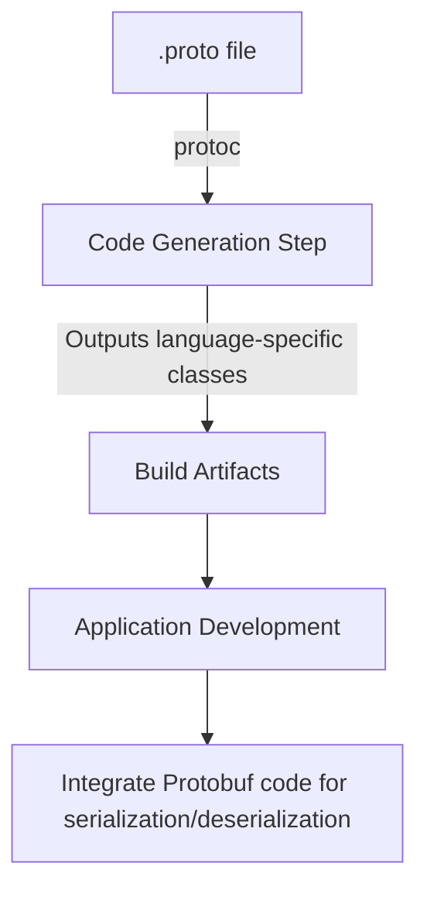
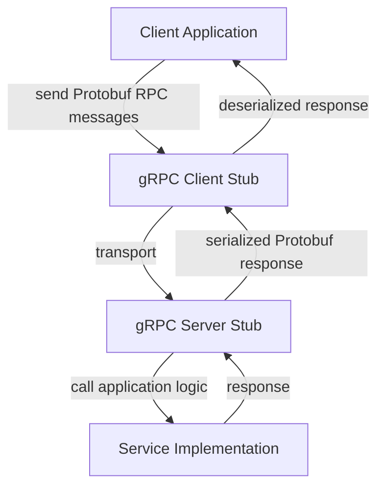

# Protocol Buffers (Protobuf): A Technical Primer

## Introduction

Protocol Buffers, often shortened to Protobuf, is a language- and platform-neutral mechanism for serializing structured data. Developed by Google, Protobuf is engineered for efficiency, extensibility, and interoperability, serving as the foundation of internal and external high-performance remote procedure call (RPC) and data exchange systems. It is most widely recognized as the default serialization protocol underlying [gRPC](https://grpc.io/) and is integral to many distributed systems requiring compact, fast, schema-rigid data interchange.

Protobuf serializes data into compact binary formats, in contrast to human-readable formats like JSON or XML. This document details its core concepts, architecture, workflows, supported features, practical engineering concerns, and typical usage scenarios within modern software systems.

---

## Conceptual Overview

### What is Protocol Buffers?

Protocol Buffers is a binary serialization protocol that uses explicitly defined schemas to describe the structure and types of exchanged data. A schema is expressed in the “.proto” language, which specifies messages (records), fields, field types, and rules about how messages are composed and evolved.

A typical workflow with Protocol Buffers involves:

1. Defining data structures and services in a `.proto` file.
2. Generating source code for desired programming languages using the `protoc` compiler.
3. Encoding and decoding Protobuf messages in applications using the generated code and Protobuf libraries.

Protocol Buffers can be viewed as a more efficient, schema-based, and extensible alternative to legacy mechanisms like XML and more modern, less compact systems like JSON.

---

## Core Concepts and Structure

### The .proto Schema

At the heart of every Protobuf system is the schema file with a “`.proto`” extension. This file is used to declare message types, enumerations, field attributes, nested types, and (optionally) service interfaces for use with RPC.

**Example: Simple Person Message**
```protobuf
syntax = "proto3";

message Person {
    string name = 1;
    int32 id = 2;
    string email = 3;
}
```

**Key components:**

- **syntax:** Protobuf supports `proto2` and `proto3` (the latter being the current standard). The “syntax” directive must come first.
- **message:** Defines a structured type (a record or class).
- **fields:** Define field names, types, and unique “tags” (the field numbers used in both the schema and wire encoding).
- **enumerations and nested types:** Supported for more complex data models.
- **services:** Can define RPC services with their input/output messages.

**Note:** Field numbers are critical—they determine both wire compatibility and serialization ordering.

### Supported Data Types

Protobuf supports a concise set of scalar types, including:

| Field Type | Description                      | Range / Size            |
|------------|----------------------------------|-------------------------|
| double     | 64-bit floating point            | IEEE 754                |
| float      | 32-bit floating point            | IEEE 754                |
| int32      | 32-bit signed integer            | -2^31 to 2^31-1         |
| int64      | 64-bit signed integer            | -2^63 to 2^63-1         |
| uint32     | 32-bit unsigned integer          | 0 to 2^32-1             |
| uint64     | 64-bit unsigned integer          | 0 to 2^64-1             |
| sint32     | 32-bit signed (zigzag-encoded)   | -2^31 to 2^31-1         |
| sint64     | 64-bit signed (zigzag-encoded)   | -2^63 to 2^63-1         |
| fixed32    | 32-bit fixed-width unsigned      | 0 to 2^32-1             |
| fixed64    | 64-bit fixed-width unsigned      | 0 to 2^64-1             |
| sfixed32   | 32-bit fixed-width signed        | -2^31 to 2^31-1         |
| sfixed64   | 64-bit fixed-width signed        | -2^63 to 2^63-1         |
| bool       | Boolean                          | true/false              |
| string     | UTF-8 encoded                    | Variable length         |
| bytes      | Arbitrary byte array             | Variable length         |

Repeated fields, maps (associative arrays), and nested messages are also natively supported.

### Message Serialization and the Wire Format

Protocol Buffers serializes messages into a compact binary format known as the protocol buffer wire format. The serialization process encodes each field uniquely as:

- A field key (wire type and tag number)
- Field value (encoded according to type)

The result is a non-self-describing, very compact binary blob. Information about structure has to be interpreted according to the corresponding schema. The exact encoding rules are publicly documented in the [Language Guide](https://protobuf.dev/programming-guides/encoding/) and the [official specification](https://protobuf.dev/programming-guides/encoding/).

#### Supported Encoding Types

- **Varint:** Efficient for small integers, applies to int32, int64, uint32, uint64, sint32, sint64, bool, enum.
- **Fixed64:** For fixed64, sfixed64, double.
- **Length-delimited:** For string, bytes, embedded messages, and packed repeated fields.
- **Fixed32:** For fixed32, sfixed32, float.

#### Message Evolution and Compatibility

A key architectural feature of Protocol Buffers is schema evolution:

- **Forwards compatible:** Receivers can ignore unknown fields; they are preserved and can be re-emitted.
- **Backwards compatible:** Unknown fields in received messages get ignored by older implementations.
- **Mandatory rules:** Field numbers must not change once assigned; fields must be added with new unique numbers. Reserved keywords can block accidental reuse of old numbers or names.

---

## Protobuf Toolchain and Workflow

### The Protocol Compiler (`protoc`)

Most interactions with Protobuf start with the protocol compiler, `protoc`, which ingests `.proto` files and outputs source code:

```bash
protoc --python_out=. person.proto
# For multiple languages:
protoc --java_out=./java --cpp_out=./cpp person.proto
```

Supported output languages include (but are not limited to) C++, Java, Python, Go, C#, and JavaScript.

### Code Generation

The code generator produces type-safe classes and (optionally) service stubs and clients tailored to each language runtime. These classes provide:

- Message construction and population
- Serialization to and from the binary wire format
- Merge, compare, and default value management
- (For `proto3`) Support for JSON conversion with standardized field mapping

### Typical Build and Integration Pipeline



**Engineering Note:** Protobuf-generated code is normally checked into source control so all clients/servers agree on the schema version. Some organizations use language-specific plugins or integration into build systems (e.g., Bazel, Gradle, CMake).

---

## Protobuf in Practice

### Message Definition: Example

```protobuf
syntax = "proto3";

message Address {
  string street = 1;
  string city = 2;
  string country = 3;
}

message Person {
  string name = 1;
  int32 id = 2;
  string email = 3;
  Address address = 4;
  repeated string phone_numbers = 5;
}
```
In this case:
- `repeated` allows multiple values in order (like an array).
- Nested messages (`Address`) encapsulate related data cleanly.
- Fields are explicitly tagged. Additional fields could be added later (using new numbers).

### Serialization and Deserialization

The application serializes and deserializes messages using generated classes. The process is automatic and schema-driven. For example, in Python:

```python
import person_pb2

# Serialization
p = person_pb2.Person()
p.name = "Alice"
p.id = 101
out_bytes = p.SerializeToString()

# Deserialization
q = person_pb2.Person()
q.ParseFromString(out_bytes)
```

### Forward and Backward Compatibility

Messages can be safely extended (e.g., by adding new fields) over time. Consumers unaware of new fields will safely ignore them, maintaining robust evolvability in distributed systems.

**Alert**
> Do not reuse or repurpose old field numbers or names. Reserve them if they must remain unused, to prevent accidental schema clashes.

---

## Architecture and Integration

### Standalone vs. RPC Usage

- **Standalone:** Used as persistent storage, inter-service data exchange, or message-passing format in files, databases, event logs.
- **With RPC:** Used for defining request/response contracts in RPC platforms, especially in gRPC, where `.proto` files define both messages and service methods.

#### Protobuf in gRPC Architecture



**Engineering Note:** In multi-language deployments, all interacting parties must use the same (or compatible) `.proto` schema files.

---

## Schema Evolution and Best Practices

### Managing Compatibility

- **Additive:** Always add new fields with unique, previously unused tags.
- **Obsoleting:** Mark obsolete fields as reserved to prevent reuse of tag numbers.
- **Removal:** Do not physically remove fields from protocol definitions until confidently unused in all deployments.
- **Field types:** Be cautious when changing field types; incompatible type changes (e.g., string to int) break wire compatibility.

### Reserved Keywords and Schema Management

```protobuf
message Sample {
  reserved 4, 15, 45 to 49;
  reserved "old_field", "legacy_field";
}
```

This prevents new fields from conflicting with removed or renamed fields.

---

## Protobuf Variants and Options

### proto2 vs proto3

- **proto2:** Older syntax, supports optional/required fields, “extensions,” and richer features (but more complex).
- **proto3:** Simpler, no “required” or field presence for scalars (except message fields), always default-valued. Adds native support for JSON mapping and other simplifications.

**Alert**
> Avoid “required” fields in `proto2` when designing for long-term evolution, as they make backward compatibility brittle.

### Well-Known Types

Protobuf includes [well-known types](https://protobuf.dev/reference/protobuf/google.protobuf/) such as `Timestamp`, `Any`, `Duration`, standardizing concepts that would otherwise be reimplemented idiosyncratically.

## Integration Points and Interoperability

- **Language runtimes:** Extensive support in most major runtimes (C++, Java, Go, Python, C#, JavaScript, Dart, Ruby, Objective-C, etc.).
- **JSON Interchange:** `proto3` messages have a standardized JSON mapping, enabling hybrid REST/gRPC APIs.
- **Partial or Unknown Field Support:** Recipients can process only required known fields, ignoring unknowns, for partial compatibility.

---

## Performance and Limitations

### Advantages

- **Efficiency:** Compact, low-latency, low-overhead binary encoding.
- **Extensibility:** Schema-driven evolution with forward/backward compatibility.
- **Speed:** Faster parse/serialize than formats like JSON and XML.

### Limitations

- **Non-self-describing:** Requires schema (`.proto` file) for proper decoding.
- **Difficult Manual Inspection:** Non-human-readable; debugging typically requires decoding tools or proxies.
- **Limited Field Types:** Fewer built-in types than JSON, XML, or Avro; no direct support for date/time, decimal, or complex objects (apart from well-known types).
- **No field ordering:** Deserialization does not preserve field order; intended for structured data exchange, not document-centric storage.

**Caution**
> Never change tag numbers or repurpose deleted field numbers, as it can silently introduce protocol exceptions and data loss.

---

## Typical Patterns and Antipatterns

### Engineering Patterns

- **Central `.proto` management:** Strict control over schema evolution in large deployments.
- **Use in streaming/event systems:** Protobuf used for Kafka, Pub/Sub, or other event-based transports where low overhead and schema evolution matter.
- **Use with REST:** Via JSON mapping of Protobuf messages in API gateways.

### Antipatterns

- **Over-reliance on Extension Fields:** Generally deprecated; prefer strict schema evolution rather than free-form extensions.
- **Inconsistent codegen:** Allowing divergent or manually-edited generated code is a frequent source of breakage.
- **Checking in compiled descriptors:** Prefer to version `.proto` schemas, not compiled binaries, except when strictly necessary.

---

## Protocol Buffers in the Data Interchange Landscape

### Comparisons to Alternatives

| Format    | Encoding     | Schema Required | Human Readable | Typical Overhead | Use Cases                     |
|-----------|--------------|----------------|----------------|------------------|-------------------------------|
| Protobuf  | Binary       | Yes            | No             | Low              | RPC, distributed systems      |
| JSON      | Text         | No             | Yes            | Moderate         | REST APIs, config, logs       |
| XML       | Text         | No             | Yes            | High             | Legacy APIs, documents        |
| Avro      | Binary/JSON  | Yes            | Partial        | Low/Medium       | Big Data, event streams       |
| Thrift    | Binary/Text  | Yes            | No/Partial     | Low              | RPC, service interop          |

Protobuf excels where compactness, schema evolution, and multi-language portability are paramount.

---

## Advanced Features

### Service Definitions and RPC

Using `service` blocks in `.proto` files, Protobuf can describe service methods, method inputs and outputs, and enable code generation for RPC systems.

**Example:**
```protobuf
service SearchService {
  rpc Search (SearchRequest) returns (SearchResponse);
}
```
This enables full contract definition for method calls, their expected arguments, and response types.

### Custom Options and Extensions

Advanced users can define custom options for fields, messages, or files, supporting features like code generation hints, validation frameworks, or annotations.

**Note**
> Diagram to be added later: Custom options flow throughout code generation and runtime.

---

## Conclusion

Protocol Buffers is a foundational technology in high-performance, robust, and extensible data interchange systems. Its schema-based design, binary encoding, and completely language-neutral toolchain make it a preferred choice in distributed systems, complex RPC environments, and anywhere data size or forward-compatibility is of critical concern. Protobuf's impact is evident across gRPC, Google infrastructure, cloud computing, microservices, and event-driven architectures worldwide.

For engineers seeking a serialization format that provides efficiency, extensibility, and cross-language support with mature tooling, Protocol Buffers remains a leading choice for modern systems engineering.