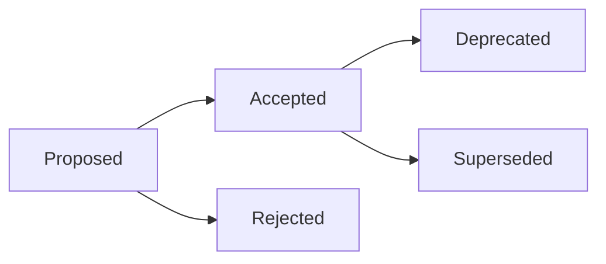
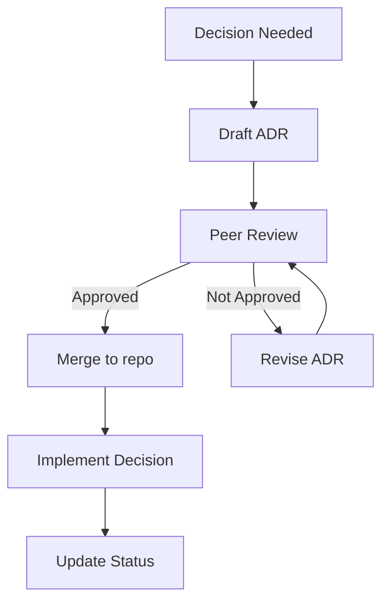
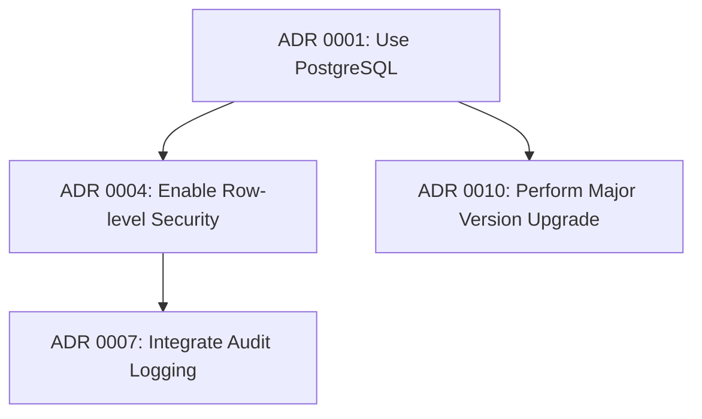

# Architecture Decision Records (ADRs)

## Introduction

Modern software systems involve numerous architectural decisions that influence their structure, quality, scalability, maintainability, and evolution. Architecture Decision Records (ADRs) are a lightweight, structured documentation method designed to transparently capture, communicate, and preserve these significant technical decisions over the lifecycle of a project.

This primer introduces the ADR concept, the rationale for its adoption, the format and lifecycle of an ADR, integration with modern development workflows, and best practices to maximize their value for technical teams.

## 1. Background and Motivation

Architectural decisions are often implicit—encoded as code, configurations, or tribal knowledge among core engineers. Implicit decision-making increases risk in long-term maintenance, onboarding, and audits:

- **Loss of Context:** Over time, the original rationale, constraints, and considered options can be lost.
- **Re-invented Decisions:** New team members or external auditors may repeat past analyses, wasting time.
- **Decision Drift:** As software evolves, earlier decisions are lost, misinterpreted, or contradicted.

ADRs were formalized by Michael Nygard (2011) as concise, versioned, plain-text records—each addressing a single, meaningful architectural decision.

_ADRs are distinct from broader architectural documentation_: they focus on why a key decision was made, how alternatives were evaluated, and what impact it carries for the system.

## 2. Core Concepts and Definitions

### 2.1. Architectural Decision

An **architectural decision** is a choice that has a significant, enduring impact on the system’s structure, quality attributes, or major technology selections. Such decisions are typically hard or costly to reverse and may involve trade-offs or consideration of multiple alternatives.

Examples:
- Selecting an event-driven architecture over a monolithic one.
- Choosing a database technology (e.g., PostgreSQL vs. MongoDB).
- Defining interaction protocols (e.g., REST vs. gRPC).

### 2.2. ADR - Architecture Decision Record

An **ADR** is a plain-text file (usually Markdown) that documents a single architectural decision in a structured format. Each file is version-controlled and stored with the project's codebase.

Key attributes:
- **Atomicity:** One ADR per decision.
- **Immutability:** Past ADRs are rarely edited; status is updated instead.
- **Traceability:** ADRs are chronologically ordered and reference related decisions.

## 3. The ADR Format

### 3.1. Standard Structure

The ADR template, inspired by Michael Nygard's original proposal, is simple and consistent. A typical ADR includes:

| Section           | Description                                          |
|-------------------|------------------------------------------------------|
| Title             | Short, descriptive summary of the decision           |
| Status            | e.g., Proposed, Accepted, Deprecated, Superseded     |
| Context           | Background, forces, and constraints leading to the decision |
| Decision          | The chosen option (with explanation)                 |
| Consequences      | Impacts, benefits, drawbacks, and trade-offs         |
| Alternatives      | Briefly mention alternatives considered              |
| References        | Links or citations to supporting materials           |

**Sample File Structure:**
```markdown
# ADR 0001: Use PostgreSQL as the primary database

- Status: Accepted
- Date: 2024-06-20

## Context
...

## Decision
...

## Consequences
...

## Alternatives
...

## References
...
```

### 3.2. Status Lifecycle

An ADR’s **status** signals whether it is current, obsolete, or replaced. Typical statuses include:
- Proposed
- Accepted
- Deprecated
- Superseded
- Rejected

#### Status Flow Diagram



## 4. ADRs in Practice

### 4.1. Authoring Workflow

ADRs are created as part of normal development processes—often triggered when an architectural decision looms, such as at the start of a new system, or when major refactoring occurs.

#### Typical Workflow



#### Key Practices

- **One decision per ADR:** Avoid "fat" ADRs with multiple unrelated decisions.
- **Collaborative drafting:** Gather feedback from domain experts and stakeholders.
- **Version control integration:** Treat ADRs like code—submit via pull requests, with reviews.
- **Referencing and linking:** ADRs should reference earlier related decisions as appropriate.

### 4.2. Integration with Documentation Workflows

ADRs support "Docs-as-Code" principles: documentation lives with code, uses the same review and versioning mechanisms, and cannot diverge materially from reality.

- **Location:** Place ADRs in a top-level `/adr` (or `/docs/adr`) directory of the repository.
- **Naming:** Files are often prefixed with a serial number for ordering (e.g., `0001-use-postgresql.md`).
- **Traceability:** Link from code and higher-level architectural documents to relevant ADRs.

### 4.3. Team Roles and Responsibilities

| Role              | Responsibility                      |
|-------------------|-------------------------------------|
| Author            | Drafts the initial ADR              |
| Reviewers         | Critique, refine, and approve ADR   |
| Maintainers       | Update ADR status, manage the ADR index |
| Engineers         | Implement and follow ADR guidance   |

### 4.4. Common Constraints and Assumptions

- **Granularity:** Only decisions with meaningful, lasting impact are recorded.
- **Immutability:** ADRs are preserved even if superseded or deprecated for auditability.
- **Transparency:** All significant stakeholders are notified and invited to review.
- **Automation:** Some teams use ADR tooling for templates, indexing, and consistency checks.

## 5. Benefits and Value

### 5.1. Knowledge Persistence

ADRs help teams answer:

- _Why_ was a technical approach chosen?
- _What_ alternatives were evaluated and rejected?
- _Who_ made and endorsed the decision?
- _What_ are the known consequences and possible follow-on actions?

### 5.2. Onboarding and Auditing

New team members can review ADRs for historical context, reducing confusion and onboarding time. ADRs also serve as records for compliance, security, or architectural audits.

### 5.3. Change Management

ADRs help manage evolution; as systems are refactored, conflicting ADRs are deprecated or superseded with new decisions, maintaining a clear lineage of thought.

## 6. Typical Use Cases and Scenarios

| Scenario                             | Example                                               |
|--------------------------------------|-------------------------------------------------------|
| New project startup                  | Deciding on base platform, datastore, modularization  |
| Major refactoring                    | Moving from monolith to microservices                 |
| Technology upgrade                   | Migrating from legacy protocol to RESTful APIs        |
| Security and compliance requirements | Documenting encryption and key management choices     |
| Vendor or open source adoption       | Evaluating and selecting libraries or frameworks      |

## 7. Variations and Extensions

### 7.1. Alternative Formats

ADR templates can be customized to suit organizational needs. Common variants include:

- **Extended context:** Adding sections for business drivers, impacted stakeholders, or architecture views.
- **Decision log:** An index file (e.g., `adr-index.md`) summarizing all decisions.

### 7.2. Linking to Broader Frameworks

In larger organizations, ADRs may integrate with:

- **arc42 templates** for comprehensive documentation.
- **C4 Model diagrams** to visualize impacts of specific decisions.
- **Issue trackers** (e.g., JIRA) or knowledge bases (e.g., Confluence wikis).

### 7.3. Tooling

Several open-source tools support ADR lifecycle management, including:

- **adr-tools** (https://github.com/npryce/adr-tools): CLI for managing ADR files.
- **Madge**: Visualizes decision dependencies when ADRs cross-reference one another.

## 8. Practical Engineering Considerations

### 8.1. Integration Points

- Ensure build pipelines do not block on ADR updates but require review before implementation.
- Automate updates to the ADR index and enforce naming standards with pre-commit hooks.

### 8.2. Performance and Overhead

ADRs should remain lightweight; avoid over-documented or excessively bureaucratic processes. If an ADR process is perceived as overhead, teams may skip documentation, defeating its purpose.

> **GitHub Alert: Tip**
>
> Keep ADRs concise and to-the-point: two pages or less is typical for a well-scoped decision.

### 8.3. Implementation Challenges

- **Adoption:** Initial team buy-in may require training and justification.
- **Consistency:** Periodically review ADRs for coherence, resolve contradictory or obsolete records.
- **Discoverability:** Maintain a searchable index; cross-link ADRs for navigability.

### 8.4. Common Pitfalls

> **GitHub Alert: Warning**
>
> If ADRs are not kept current, their value rapidly diminishes. Treat ADR maintenance as an ongoing responsibility, not a one-off activity.

- Delaying ADRs until after implementation, resulting in incomplete context.
- Using ADRs for trivial or transient decisions.
- Failure to maintain status updates and clear chaining between superseded or related ADRs.

## 9. Example ADR

```markdown
# ADR 0002: Migrate API Communication to gRPC

- Status: Accepted
- Date: 2024-06-20

## Context

The current API leverages REST over HTTP/1.1. As our distributed system grows, we observe increasing latency issues and maintenance overhead associated with multiple endpoints and schema versions.

## Decision

We will migrate primary inter-service communication to gRPC, enabling strong contracts, bidirectional streaming, and more efficient binary serialization.

## Consequences

- **Benefits:** Reduced latency and overhead, better type safety.
- **Drawbacks:** Added complexity for non-gRPC-compatible clients, learning curve for some team members.

## Alternatives

- Remain with REST over HTTP/2
- Evaluate Protocol Buffers over plain HTTP
- Evaluate Apache Avro RPC

## References

- [gRPC Official Docs](https://grpc.io/)
- ADR 0001: Adopt Protocol Buffers for internal APIs
```

#### Example ADR Directory Structure

```plaintext
/docs/adr/
  0001-use-postgresql.md
  0002-migrate-to-grpc.md
  adr-index.md
```

## 10. Decision Traceability and Impact

A critical feature of ADRs is the ability to document dependencies between decisions, supporting traceability and "decision tree" analysis.

#### Example Decision Network



> **GitHub Alert: Note**
>
> When decisions are changed or superseded, update cross-references to maintain chain-of-custody and avoid orphaned ADRs.

## 11. Relationship to Related Standards and Practices

- **arc42:** While arc42 is a template for comprehensive architecture documentation, ADRs provide decision-level granularity. Often, arc42 section 9 ("Design Decisions") will reference the ADR directory.
- **C4 Model:** C4 diagrams (Context, Container, Component, Code) can visually represent the impact of architectural decisions captured in ADRs.
- **Docs-as-Code:** ADRs embody Docs-as-Code by integrating architecture documentation into day-to-day development alongside source code.

## 12. Summary

ADRs are a foundational practice for managing architectural knowledge and ensuring future teams understand the critical decisions shaping software systems. By keeping decision rationale explicit, reviewable, and durable, ADRs support technical excellence, facilitate onboarding, and contribute to auditability and future-proofing of systems.

Their lightweight, version-controlled format aligns with agile and modern DevOps workflows, ensuring documentation travel with code and evolves with the architecture itself.

---

**Note:** For teams seeking to further extend architectural knowledge management, consider integration with broader architectural frameworks and continuous improvement cycles, treating decision documentation as both a technical and organizational asset.