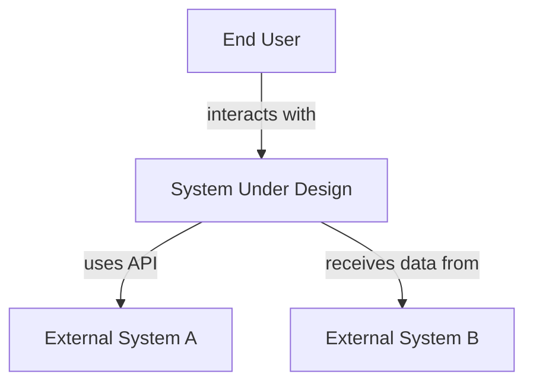
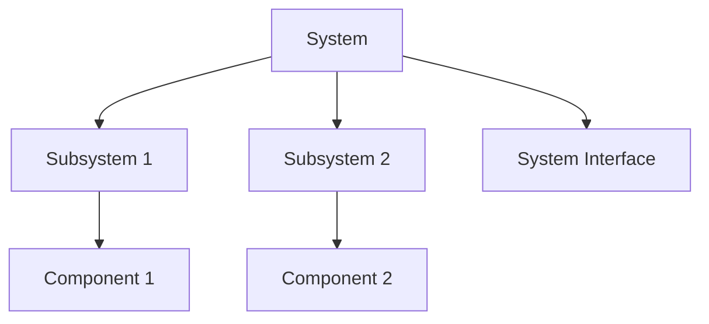
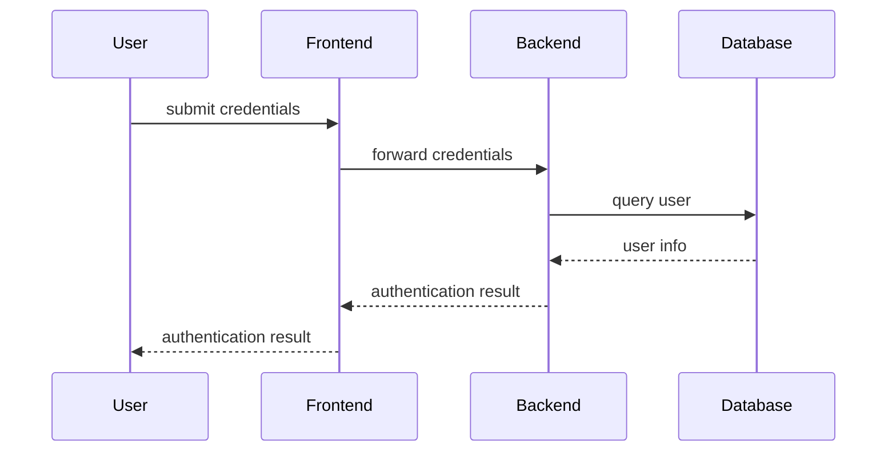
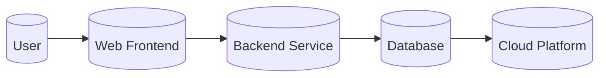
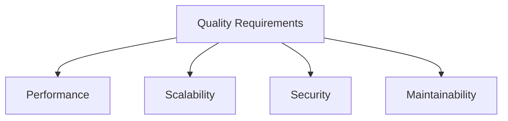
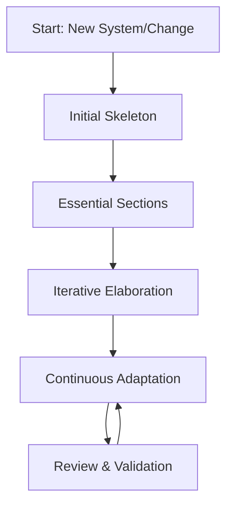

# arc42 Template: Engineering Overview

## Introduction

The **arc42 Template** is a de facto standard structure for documenting the architecture of software systems and technical solutions. Originating from the practical challenges faced by architects in industry environments, arc42 answers the question: *What essential information should a technical architecture document contain, structured in a pragmatic and consistent way?* 

Unlike prescriptive frameworks, arc42 is methodically curated to strike a balance between completeness and efficiency. The template is applicable to virtually any system—ranging from embedded microservices to large-scale enterprise platforms—and is deliberately technology-agnostic. It supports agile, lean, and traditional development approaches, including compliance with regulatory requirements or formal standards such as ISO/IEC/IEEE 42010:2011 for system and software architecture documentation.

This overview systematically describes why, when, and how to use arc42, provides insights into each of its building blocks, explores implementation workflows, highlights practical challenges, and contrasts arc42 with related approaches.

---

## Defining arc42 in Technical Context

### Purpose and Scope

The **arc42 Template** provides a unified structure and common language for capturing, sharing, and maintaining architecture documentation. At its core, arc42 aims to deliver *just enough* documentation—providing necessary context, rationale, and detail without unnecessary verbosity or redundancy.

### Target Audience

arc42 is used by:

- **Software architects** who define and communicate technical vision
- **Engineers and developers** needing to understand system components and interactions
- **Stakeholders** (e.g., testers, operators, managers) requiring architectural context
- **Auditors, reviewers, and compliance officers** needing formalized technical artifacts

### Standards Alignment

arc42 aligns with established architecture documentation standards, in particular:

- **ISO/IEC/IEEE 42010:2011**  
  *Systems and Software Engineering—Architecture Description*  
  arc42 covers architectural viewpoints, stakeholders, and concerns in a structured way, but focuses on practical content.

- **Related Models**:  
  Compatible with C4 Model, ATAM, Views and Beyond, and TOGAF documentation patterns.

---

## arc42 Template Overview

The arc42 Template prescribes a canonical set of sections (building blocks) that together provide comprehensive documentation of a software system's architecture. Each section addresses a specific aspect, concern, or view.

### arc42 Section Outline

The official arc42 structure typically includes the following sections:

1. **Introduction and Goals**
2. **Constraints**
3. **Context and Scope**
4. **Solution Strategy**
5. **Building Block View**
6. **Runtime View**
7. **Deployment View**
8. **Cross-cutting Concepts**
9. **Architectural Decisions**
10. **Quality Requirements**
11. **Risks and Technical Debt**
12. **Glossary**

Below, we explore each section's purpose and common content.

---

### 1. Introduction and Goals

**Purpose:**  
Summarize business context, primary drivers, and the reasons for system development or change. Defines overarching goals, non-goals, and success criteria.

**Typical Contents:**
- Project background  
- Intended users and stakeholders  
- High-level requirements  
- Business drivers

---

### 2. Constraints

**Purpose:**  
Document non-negotiable restrictions on design, implementation, or operation.

**Examples:**
- Regulatory/GDPR compliance  
- Technology mandates (e.g., cloud provider, programming language)  
- Budget, schedule, or resource limits  
- Contractual or legacy system boundaries

---

### 3. Context and Scope

**Purpose:**  
Describe the system’s boundaries and its relationships with external entities (people, IT-systems, or hardware).

**Mermaid Diagram: System Context**

---

### 4. Solution Strategy

**Purpose:**  
Summarize the key architectural approach and fundamental decisions. Define the technology stack, patterns, or paradigms underpinning the solution.

**Topics:**
- Layers and modularity strategy  
- Choice of protocols, patterns (e.g., microservices, event sourcing)  
- Rationale for selected technologies and approaches

---

### 5. Building Block View

**Purpose:**  
Show the static (structural) decomposition of the system as a hierarchy of components or modules, down to a level suitable for the intended audience.

**Mermaid Diagram: Building Block Hierarchy**

---

### 6. Runtime View

**Purpose:**  
Describe dynamic aspects—how building blocks collaborate in typical scenarios. Useful for understanding workflows, processes, and interactions.

**Common Scenarios:**
- User authentication  
- Data processing pipelines  
- Failure recovery

**Mermaid Diagram: Login Sequence (Example)**

---

### 7. Deployment View

**Purpose:**  
Describe the physical realization and allocation of building blocks onto hardware, containers, or cloud resources. Covers operational infrastructure.

**Mermaid Diagram: Simple Deployment**

---

### 8. Cross-cutting Concepts

**Purpose:**  
Detail systemic aspects relevant to multiple parts of the system, such as security, logging, error handling, and configuration.

**Common Cross-cutting Topics:**
- Authentication & Authorization
- Logging strategy
- Internationalization
- Exception handling
- Caching

**Note**
> Diagram to be added later: 'Cross-cutting Concepts Matrix'.

---

### 9. Architectural Decisions

**Purpose:**  
Record significant, project-relevant architectural choices, alternatives, and their rationales. May use a format like “Architecture Decision Records” (ADRs).

**Sample ADR Table:**

| ID   | Decision                      | Status | Rationale                |
|------|-------------------------------|--------|--------------------------|
| ADR-1| Use REST API for integration  | Active | Standardization & scaling|
| ADR-2| Store logs in cloud SIEM      | Active | Compliance requirements  |
| ADR-3| Use microservices architecture| Rejected| Operational complexity   |

---

### 10. Quality Requirements

**Purpose:**  
Document targeted quality attributes (non-functional requirements), such as performance, scalability, security, or maintainability.

**Typical Artifacts:**
- Quality scenario specification  
- Utility trees (from ATAM)

**Mermaid Diagram: Quality Attribute Tree (Simplified)**

---

### 11. Risks and Technical Debt

**Purpose:**  
Identify known risks, system-level technical debts, and non-trivial uncertainties.

**Examples:**
- Use of experimental libraries  
- Areas with limited test coverage  
- External service reliability dependencies

**Tip**
> Regular review and updating of this section accelerates technical risk mitigation and aligns stakeholders.

---

### 12. Glossary

**Purpose:**  
Define important terms and domain-specific vocabulary used throughout the documentation, reducing ambiguity.

**Example:**
| Term          | Definition                         |
|---------------|------------------------------------|
| API Gateway   | Mediates, authenticates, and routes external API requests to microservices. |
| DRY Principle | “Don’t Repeat Yourself” – avoid repetition in code and docs.               |

---

## How arc42 Works in Practice

### Documentation Process Workflow

Implementing arc42 follows an iterative, collaborative process:

1. **Initial Skeleton Creation:**  
   Set up all arc42 sections, even if some are initially empty.

2. **Populating Essential Sections:**  
   Focus first on business drivers, context, solution strategy, and main building blocks.

3. **Iterative Elaboration:**  
   Populate runtime, deployment, cross-cutting, and risk sections as design matures.

4. **Continuous Adaptation:**  
   Update documentation to reflect design evolution, using tooling suitable for the development process (e.g., Markdown, Docs-as-Code, wikis).

5. **Review and Validation:**  
   Engage engineers and stakeholders in reviewing content for clarity and completeness.

**Mermaid Diagram: arc42 Documentation Process**

---

### Integration with Development Practices

- **Agile and CI/CD:**  
  arc42 is compatible with iterative delivery and can be embedded in CI pipelines to validate documentation coverage.

- **Docs-as-Code:**  
  Commonly, arc42 content is versioned along with source code, supporting Markdown, AsciiDoc, or reStructuredText.

- **Architecture Reviews and Audits:**  
  Having standardized arc42 docs facilitates technical and regulatory reviews.

---

### Constraints, Assumptions, and Common Variations

- **Constraint:** The documentation must remain concise; excessive boilerplate undermines clarity.
- **Assumption:** Reviewers and consumers understand standard vocabulary or have access to glossary/definitions.
- **Variation:** Teams may tailor section order, merge sections, or adapt depth for small systems (“arc42-light” variants).

**Caution**
> Blindly filling every section can lead to bloated, less usable documentation. Missing a section is preferred over irrelevant content.

---

## Engineering Considerations

### Integration Points

1. **Tool Support:**
   - Several open-source and commercial tools (Structurizr, docToolchain) support arc42.
   - Integration with issue trackers to link documentation entries (e.g., for ADRs).

2. **Diagram Management:**
   - Use version-controlled diagrams (e.g., Mermaid, PlantUML) for maintainability.
   - Prefer editable diagram sources over binary images.

3. **Traceability:**
   - Quality requirements, risks, and decisions should be traceable to requirements or user stories.

### Performance and Maintenance Implications

- **Up-to-date Documentation:**  
  Outdated architecture docs create technical debt; integrate update processes with release cycles.

- **Level of Detail:**  
  Excessive technical detail can obscure architectural intent; balance is key.

- **Separation of Concerns:**  
  Keep project management artifacts (e.g., schedules) out of arc42 documentation.

### Implementation Challenges

- **Initial Overhead:**  
  Initial adoption may challenge teams unfamiliar with systematic documentation.

- **Consistency:**  
  Sustaining a consistent abstraction level across sections requires editorial discipline.

- **Scalability:**  
  Large projects may warrant further decomposition or distributed authorship.

---

## Comparing arc42 to Related Approaches

### C4 Model

C4 is a visual model for hierarchical architectural diagrams (Context, Container, Component, Code) but does not prescribe full-text documentation structure. arc42 can incorporate C4 diagrams for building-block and context sections, creating a complementary relationship.

### Docs-as-Code

arc42 easily fits the Docs-as-Code paradigm (documentation managed as source), supporting automation, code reviews, and integration with development pipelines.

### ISO/IEC/IEEE 42010

Unlike the standard’s abstract “view and viewpoint” model, arc42 is focused on actionable sections and content, making it more readily usable.

---

## Summary

The arc42 Template offers software engineers a pragmatic, standardized approach to architecture documentation. By enforcing structure, fostering clarity, and reducing ambiguity, arc42 improves communication, supports review/audit, and lowers long-term maintenance costs. Its extensibility, tooling support, and compatibility with modern engineering practices make it suitable for systems of all scales and domains. Proper application demands a balance between completeness and relevance, and an iterative approach aligned with the system lifecycle.

---

**End of Document**