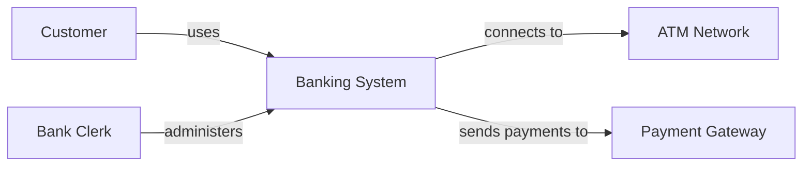
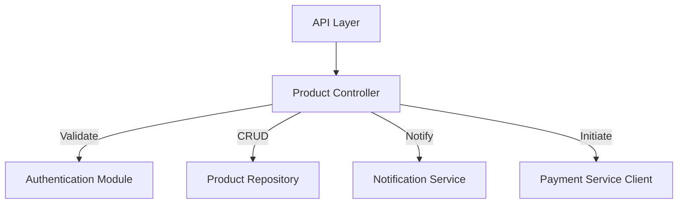
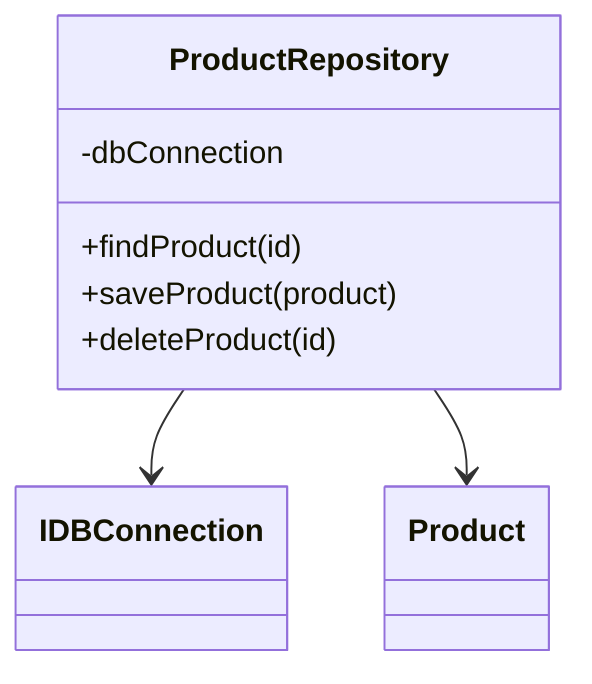
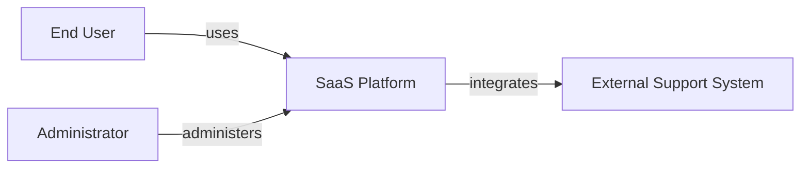
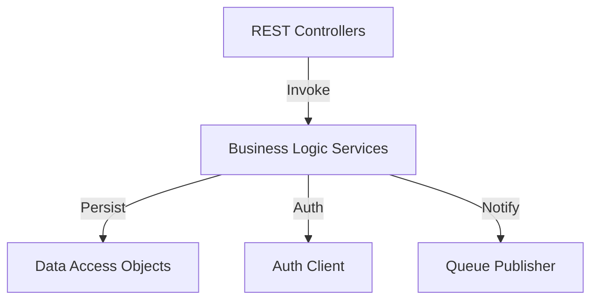

# C4 Model for Software Architecture

## Introduction

The C4 model is a hierarchical approach for describing and visualising the architecture of software systems. Created by Simon Brown, its intent is to address the need for pragmatic and structured diagrams that explain system architecture to both technical and non-technical stakeholders, striking a balance between high-level overviews and low-level implementation detail. "C4" refers to its four primary diagram types—**Context**, **Container**, **Component**, and **Code**—each representing a different level of abstraction.

The C4 model neither replaces formal architecture frameworks nor prescribes specific implementation practices, but rather serves as a systematic notation and methodology for communicating the structure and relationships within software systems.

## Context and Purpose

### Challenges in Software Architecture Communication

Software architecture diagrams are standard tools for documentation and collaboration, yet they are notoriously inconsistent and often ambiguous in practice. Common pitfalls include:

- Diagrams with unclear semantics or mixed abstraction levels
- Overloaded symbols and ambiguous relationships
- Lack of alignment between diagrams and actual codebase

The C4 model was developed to address these issues by introducing a small set of hierarchical diagrams, each with an explicit purpose and level of abstraction.

### Positioning within the Documentation Landscape

The C4 model is particularly aligned with **Docs-as-Code** practices, supports structured architecture documentation efforts (such as the **arc42 template**), and can complement established industry methods like UML or ArchiMate. However, C4 intentionally avoids the complexity of comprehensive notations, focusing on clear, accessible communication over formal specification.

## Core Concepts and Hierarchy

### Overview of Abstraction Levels

The C4 model divides the documentation of a software system into four descending levels of hierarchical abstraction:

1. **System Context Diagram (Level 1):** High-level context, system boundaries, external users, and dependencies.
2. **Container Diagram (Level 2):** Major applications, services, databases, and runtime containers that make up the system.
3. **Component Diagram (Level 3):** Decomposition of a container into its functional components and their relationships.
4. **Code Diagram (Level 4):** Detailed representation, such as class diagrams, focused on internal component structure.

This progression allows architects to progressively refine and communicate architectural details according to audience and purpose.

#### Diagram: C4 Levels of Abstraction

```mermaid
graph TD
    A[System Context (1)] --> B[Container (2)]
    B --> C[Component (3)]
    C --> D[Code (4)]
```

## Level 1: System Context Diagram

### Purpose

The **System Context Diagram** provides a high-level map of the software system's environment:

- Visualizes how the system interacts with external entities (people, systems)
- Communicates the system's responsibilities and boundaries
- Helps clarify integration points and stakeholder concerns

#### Typical Elements

- **The Software System:** The primary subject of the diagram
- **External Persons:** e.g., users, administrators, third-party stakeholders
- **External Systems:** Upstream/downstream dependencies, partner platforms, external APIs

#### Constraints and Conventions

- Diagrams must avoid internal implementation detail at this level.
- Primary focus is relationships and flows to/from the system boundary.

#### Example: Banking System Context



## Level 2: Container Diagram

### Purpose

The **Container Diagram** decomposes the system into separately deployable or operational units ("containers"), such as web applications, APIs, microservices, databases, etc.

- Illustrates major technical building blocks and their responsibilities
- Shows technology choices (e.g., Java service, PostgreSQL database, React web app)
- Documents inter-container communication paths

#### Typical Elements

- **Containers:** Web applications, backend services, databases, message brokers, batch jobs, etc.
- **Communication Flows:** Protocols (HTTP, AMQP, JDBC, etc.), primary data paths

#### Constraints

- Internal details (components/classes) are out of scope.
- Technical stack and integration points should be labeled.

#### Example: E-Commerce Application Container Diagram

```mermaid
graph TD
    Browser[Web Browser]
    WebApp[Web Application (React)]
    APIGateway[API Gateway]
    AuthService[Auth Service (Node.js)]
    ProductService[Product Microservice (Java)]
    Database[Product Database (PostgreSQL)]
    PaymentService[Payment Microservice (Python)]

    Browser -->|HTTPS| WebApp
    WebApp -->|REST| APIGateway
    APIGateway -->|REST| AuthService
    APIGateway -->|REST| ProductService
    APIGateway -->|REST| PaymentService
    ProductService -->|JDBC| Database
    PaymentService -->|HTTPS| PaymentService
```

## Level 3: Component Diagram

### Purpose

The **Component Diagram** zooms further into a single container, outlining its major components (modules, subsystems, classes, libraries) and their interactions.

- Clarifies functional decomposition and internal structure
- Useful for development teams responsible for individual containers

#### Typical Elements

- **Components:** Logical grouping of related functionality (e.g., Controller, Repository, Service)
- **External Interfaces:** APIs, events, third-party libraries/interactions
- **Communication Links:** Method calls, RESTful APIs, event propagation

#### Constraints

- Components should be architecturally significant; avoid representing every class or utility.
- Maintain alignment between component definitions and actual codebase structure.

#### Example: Product Service Component Diagram



## Level 4: Code Diagram

### Purpose

A **Code Diagram** (often class or UML sequence diagram) offers the most granular view, typically auto-generated from source code or modeling tools.

- Explains specific algorithms, relationships, inheritance, and interfaces within a component
- Useful for onboarding, deep dives, or documenting complex logic

#### Common Example: Product Repository (Class Diagram)



#### Note

> :information_source: **Note:** For complex behaviours (e.g., workflows, state transitions), sequence or state diagrams can also be included at this level.

## Practical Use of the C4 Model

### Typical Workflow

1. **Identify the scope of documentation:**
   - Define which products/services require architectural documentation.
2. **Establish boundaries and abstraction levels:**
   - Decide which C4 levels are relevant for each audience.
3. **Iteratively model diagrams:**
   - Start with Context, progress through Container, then Component, and, if needed, Code diagrams.
4. **Maintain links between diagrams and code:**
   - Use consistent naming, refer to actual repositories, and update diagrams as system evolves.
5. **Integrate into documentation toolchains:**
   - Store diagrams in version control, document assumptions and decisions alongside diagrams.

### Practical Engineering Considerations

- **Integration Points:** Ensure that external dependencies and APIs are clearly labeled in Context and Container diagrams.
- **Performance Implications:** Use Container diagrams to highlight synchronous (request-response) vs asynchronous (event) flows.
- **Scalability:** Indicate redundant components or clusters visually where needed.
- **Security:** Show trust boundaries, authentication mechanisms, and sensitive data flows.
- **Version Control:** Diagrams should be source-controlled and evolve with the codebase.

> :warning: **Caution:** Out-of-date diagrams are a primary source of architectural confusion. Always update diagrams alongside meaningful system changes.

### Common Pitfalls

- Mixing abstraction levels within a single diagram (e.g., blending Container and Component details)
- Overloading symbols, resulting in unclear semantics
- Excessive detail that obscures structure and purpose
- Diagrams divorced from reality due to lack of code alignment

### Technology and Toolchain Considerations

The C4 model is notation-agnostic; diagrams can be produced using hand-drawn sketches, digital whiteboards, graphical tools (e.g., diagrams.net), or plaintext formats (e.g., Mermaid, PlantUML). Modern "docs-as-code" pipelines benefit from storing diagrams as code, enabling versioning and review workflows.

> :bulb: **Tip:** Automate validation of diagram syntax in CI/CD pipelines for markdown-based documentation repositories.

#### Example: Embedding C4 Diagram in Docs-as-Code Workflow

```mermaid
graph TD
    Dev[Developer]
    Repo[Documentation Repository (Git)]
    CICD[CI/CD Pipeline]
    RenderedDocs[Published Architecture Docs]

    Dev -->|Edits Markdown & Mermaid| Repo
    Repo --> CICD
    CICD -->|Generates HTML/PDF| RenderedDocs
```

## Relationships to Other Architecture Notations

- **UML:** The C4 model can incorporate or reference UML diagrams, especially at the Code level, but avoids full UML complexity for system-level views.
- **arc42 Template:** C4 diagrams naturally map to key sections in arc42, which prescribes what to document but not how to visualise it.
- **ArchiMate:** More formal and comprehensive, suited to enterprise architecture; C4 is lightweight and implementation-focused.

## Conventions and Best Practices

- **Naming:** Use unambiguous names for containers, components, and interfaces.
- **Legend:** Provide a key for custom or overloaded symbols if departing from C4 defaults.
- **Layered Detail:** Structure documentation so readers can “zoom in” or “zoom out” across levels.
- **Audience Awareness:** Adapt abstraction and language according to readership (e.g., business, technical, operations).
- **Traceability:** Where possible, link diagram nodes directly to code artifacts or documentation sections.

## Domain Variations and Extensions

### Microservices

- Each microservice may warrant its own set of C4 diagrams (Context, Container, and Component).
- Explicitly labeling inter-service communication (REST, gRPC, messaging) is critical.

### Legacy Modernization

- C4 diagrams can help clarify dependencies and integration points when refactoring monolithic systems.
- Useful for incremental migration planning by representing both as-is and to-be architectures.

### Cloud Architectures

- Containers may equate to managed services (e.g., AWS Lambda, Azure Functions).
- Container diagrams should include cloud storage, queues, PaaS offerings, and show boundaries of ownership.

## Example: Partial C4 Model for a SaaS Web Application

### Level 1 (Context)



### Level 2 (Container)

```mermaid
graph TD
    WebUI[Web UI (SPA)]
    AuthService[Authentication Service]
    AppAPI[Application API]
    DataStore[Primary Database]
    NotifService[Notification Service]
    Queue[Message Queue]

    WebUI -->|HTTPS| AppAPI
    AppAPI -->|REST| AuthService
    AppAPI -->|SQL| DataStore
    AppAPI -->|Publish| Queue
    NotifService -->|Consume| Queue
```

### Level 3 (Component inside AppAPI)



## Limitations and Assumptions

- The C4 model provides a useful framework for architectural documentation, but is not a substitute for runtime monitoring, business process documentation, or detailed operational design.
- Diagrams reflect intent, not system state; mechanisms are needed to ensure ongoing validity.
- Implicitly assumes modular architecture; less effective for tightly coupled legacy codebases unless used for refactoring planning.

## Summary

The C4 model addresses the real-world needs of software engineers and architects by providing clear, pragmatic diagrams that communicate the structure of software systems across multiple levels of abstraction. By focusing on the progression from system context to internal code, it bridges the gap between architectural intent and implementation reality. Its lightweight, technology-agnostic approach and compatibility with modern documentation practices make it an effective foundation for software architecture communication, change management, and ongoing system understanding.

Consistent application of C4 conventions, supported by simple tooling such as Mermaid or PlantUML and integration into docs-as-code workflows, enables engineering teams to produce, maintain, and evolve actionable architectural documentation that can be trusted as both an onboarding tool and a reference for ongoing development.