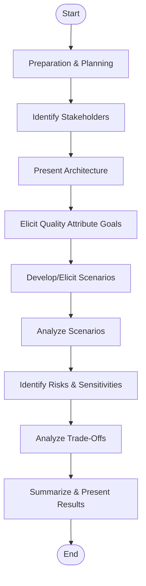
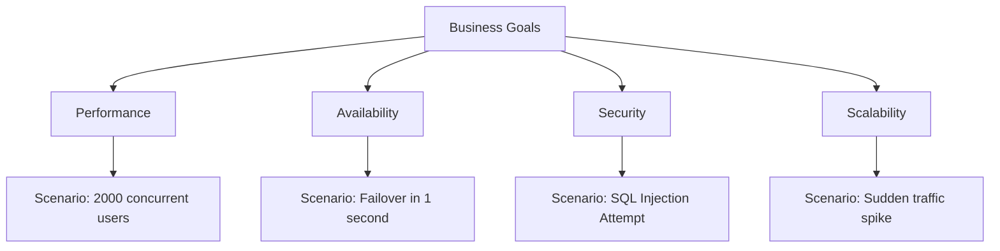
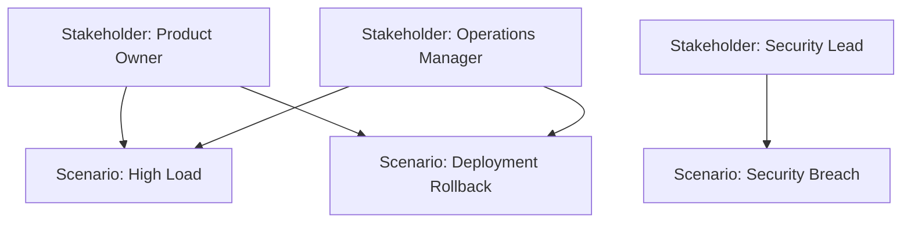

# ATAM (Architecture Tradeoff Analysis Method) Engineering Overview

## Introduction

The Architecture Tradeoff Analysis Method (ATAM) is a structured, scenario-driven analytic process for evaluating the quality attributes and trade-offs inherent in software architecture decisions. Developed by the Software Engineering Institute (SEI), ATAM is rooted in the systematic elicitation and analysis of quality attribute requirements such as performance, security, modifiability, and reliability. This overview introduces ATAM to software engineers, detailing its purpose, key concepts, process steps, core components, and practical considerations in architecture evaluation.

## Technical Context and Motivation

Architecture evaluations are essential in medium-to-large software projects where design decisions have enduring consequences for maintainability, scalability, and risk. Multiple stakeholders—product owners, developers, testers, security experts—bring competing concerns that must be recognized, prioritized, and reconciled. The ATAM addresses this complexity by providing a scenario-based framework designed to:

- Make architectural trade-offs explicit
- Reveal and communicate risks and sensitivities
- Support reasoned judgment in the face of architectural uncertainty

ATAM is typically performed early in the software life cycle—after architectural decisions but before major investments in implementation—to inform stakeholders of potential risks and opportunities for refinement.

## Core Concepts

### Quality Attributes

A central tenet of ATAM is that software architecture directly determines the achievement of quality attributes:

- **Performance**
- **Availability**
- **Security**
- **Maintainability** (modifiability, reusability, etc.)
- **Usability**
- **Interoperability**

These attributes are often in tension and must be prioritized and balanced against one another, given the anticipated use and stakeholders' needs.

### Scenarios

Scenarios are concise, structured statements describing potential uses, behaviors, or changes to the system. They represent real or anticipated situations derived from stakeholder interviews and requirements. Scenarios can be classified as:

- **Use-case scenarios**: Describe normal or exceptional system operation.
- **Change scenarios**: Describe changes in requirements, environment, or technology.

Scenarios drive the ATAM evaluation by focusing analysis on concrete, relevant system behaviors and stresses.

### Trade-offs, Sensitivities, and Risks

Architectural trade-offs arise when improving one quality attribute degrades another. Sensitivities are architectural decisions that strongly influence a quality attribute. Risks are architectural decisions or omissions that may lead to system failure to meet its requirements.

## Roles in ATAM

ATAM involves several key roles:

- **Evaluation Leader**: Facilitates the process, ensures completeness, and maintains neutrality.
- **Architecture Team**: Presents the architecture and answers questions.
- **Stakeholders**: Representatives from management, development, operations, customers, and other interest groups.
- **Evaluation Team**: External evaluators (if any), bringing objectivity and facilitating scenario analysis.

## The ATAM Process

### High-Level Overview

The ATAM evaluation is usually conducted in two main phases, each with a set of defined activities:

1. **Phase 1 — Preparation and Initial Evaluation**: Scoping, stakeholder identification, architecture presentation, and initial scenario elicitation.
2. **Phase 2 — Detailed Evaluation**: Deep-dive scenario analysis, risk and sensitivity identification, trade-off documentation, and presentation of results.

#### Mermaid Block Diagram: ATAM Workflow

### Phase 1: Preparation and Stakeholder Engagement

- **Stakeholder identification**: All relevant parties are identified and invited.
- **Business driver and context presentation**: The context, goals, and strategic forces influencing the project are clarified.
- **Architecture overview**: The architecture team presents a high-level overview of the system under evaluation.
- **Quality attribute refinement**: Stakeholders articulate which quality attributes matter most and why.
- **Scenario gathering**: Stakeholders and evaluators collaboratively build a set of scenarios representing important, likely, and/or extreme conditions.

### Phase 2: Scenario Analysis and Architectural Assessment

- **Scenario walkthroughs**: Each scenario is thoroughly analyzed for architectural support or lack thereof.
- **Attribute-based architecture styles**: For each scenario, relevant architectural patterns (e.g., client-server, layered, microservices) are identified and assessed.
- **Sensitivity identification**: Analyze which architectural decisions (components, patterns, tactics) are highly influential to specific quality attributes.
- **Risk identification**: Highlight decisions, omissions, or architectural features that could threaten the realization of quality attribute goals under certain scenarios.
- **Trade-off analysis**: Explicitly document where achieving one quality attribute impacts others (e.g., increasing logging improves auditability but may reduce performance).
- **Results synthesis**: The evaluation outcomes—including findings, risks, trade-offs, and sensitivity points—are synthesized into a recommendation/report.

### ATAM Deliverables

- **Scenario catalog**: The set of scenarios considered during evaluation.
- **Architecture documentation**: Architecture overview as presented and clarified during evaluation.
- **Quality attribute utility tree**: Identifies, organizes, and prioritizes scenarios by importance and difficulty.
- **Risk, sensitivity, and trade-off lists**: Explicit reference points for future design, implementation, and testing decisions.
- **Actionable recommendations**: Guidance for mitigating risks or further investigating architecture changes.

## Key Components and Architecture

### Utility Tree

The utility tree is a structured tool used in ATAM to organize and prioritize quality attributes and scenarios. It starts with business goals, decomposes to high-level attributes, and further branches to scenarios representing those attributes in action.

#### Mermaid Tree Diagram: Example Utility Tree

Each leaf node (scenario) is assigned qualitative rankings for importance and difficulty, guiding the focus of architectural analysis.

## How ATAM Works in Practice

### Typical Workflow

1. **Initiation**: Organizational management identifies the need for architecture evaluation.
2. **Team Formation**: Internal or external evaluation team is assembled, roles defined.
3. **Preparation**: Gather relevant documentation (architecture diagrams, requirements specs).
4. **Phase 1 Evaluation**: Stakeholder and architecture team meetings, scenario collection, initial risk/benefit identification.
5. **Phase 2 Evaluation**: Deep-dive scenario analysis, group discussions, utility tree refinement, risk and trade-off articulation.
6. **Reporting**: Presentation to stakeholders and delivery of a final evaluation report.

### Constraints and Assumptions

- ATAM assumes architecture is at least partially specified but not final.
- Stakeholder participation is critical—insufficient engagement will invalidate risk and trade-off analysis.
- The process is scenario-driven; the quality of the evaluation is directly dependent on the scenarios' coverage and depth.

### Example Scenario Analysis

Consider a scenario: “The system must serve 2000 concurrent users with a 2s response time.”  
The evaluation team examines supporting architectural elements: load balancers, connection pools, data caches.  
Risks may be identified (overloaded database, single points of failure), and sensitivities pinpointed (connection pool sizing).  
Trade-offs (e.g., performance vs. cost due to hardware scaling) are highlighted for further investigation.

### Variations and Extensions

- **Mini-ATAM**: Lightweight, informal variant for smaller or less critical systems.
- **Remote/Distributed ATAM**: Adapted for teams in multiple locations via online collaboration platforms.
- **Continuous Architecture Evaluation**: ATAM applied iteratively throughout the project lifecycle.

## Integration and Engineering Considerations

### Integration with SDLC

ATAM integrates best during the architecture design phase, following initial requirements analysis but before substantial implementation. It may also be used iteratively, revisited when significant architectural changes occur.

### Artifacts and Documentation

ATAM outputs supplement architecture roadmaps, technical risk lists, requirement traceability matrices, and test plans (particularly for non-functional requirements).

### Performance and Scalability

While ATAM itself is a process rather than a runtime system, its efficacy depends on:

- Timely scheduling to avoid project delays
- Efficient facilitation to keep stakeholders engaged
- Comprehensive but focused scenario analysis to maximize actionable results

### Pitfalls and Common Challenges

> **Warning**
>
> - Inadequate representation of all stakeholder groups can lead to incomplete or biased scenario coverage.
> - Superficial scenario analysis yields vague, non-actionable results.
> - Failure to document or act on identified risks negates much of ATAM’s value.

> **Tip**
>
> - Use the utility tree technique to keep scenario discussions structured and avoid analysis paralysis.
> - Summarize trade-off discussions visually for transparency.

### Engineering Decisions

- **Extent of Evaluation**: Deciding whether to conduct a full ATAM (multi-day workshop) or a lighter process.
- **Selection of Scenarios**: Prioritize based on likelihood, impact, and coverage of quality attributes.
- **Reporting Depth**: Choose detail level by audience—summary findings for executives, deep-dive analysis for architects and developers.

## Relation to Standards

ATAM is consistent with, and complements, industry standards for architecture documentation and evaluation, including:

- **IEEE 1471** / **ISO/IEC/IEEE 42010**: International standards on architecture description and views.
- **ISO/IEC 25010**: Software quality model supporting the definition of quality attributes used in utility trees and scenario analysis.

## Example Mermaid Diagram: Stakeholder and Scenario Relationships

This diagram shows how multiple stakeholders can contribute or be affected by multiple scenarios, ensuring inclusive and comprehensive analysis.

## Summary Table: ATAM Key Activities

| Phase        | Activity                        | Outcome                               |
|--------------|--------------------------------|---------------------------------------|
| Preparation  | Stakeholder identification     | Engagement plan                       |
| Preparation  | Architecture overview          | Common architectural understanding    |
| Analysis     | Scenario elicitation           | Scenario catalog, utility tree        |
| Analysis     | Scenario walkthrough           | Risk, sensitivity, trade-off analysis |
| Analysis     | Risk prioritization            | Actionable recommendations            |
| Reporting    | Results synthesis              | Evaluation report, next steps         |

## Summary

ATAM provides a rigorous, repeatable framework for evaluating and documenting architectural trade-offs in complex software systems. By centering scenarios and quality attributes, and by explicitly surfacing risks and sensitivities, it enables engineering teams to make informed, stakeholder-driven architecture decisions early in the lifecycle. Properly executed, ATAM reduces downstream risks, aligns stakeholder expectations, and contributes to the long-term maintainability and success of software systems.