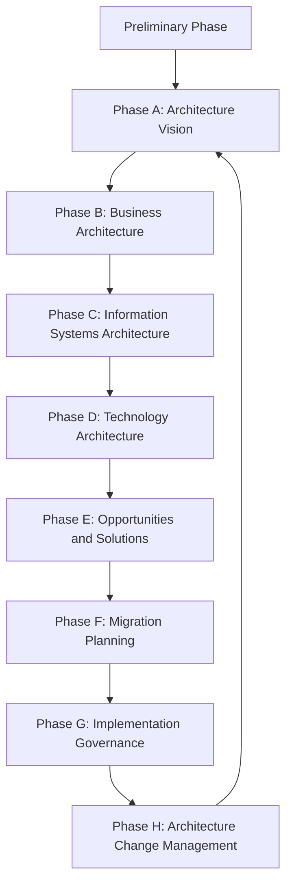
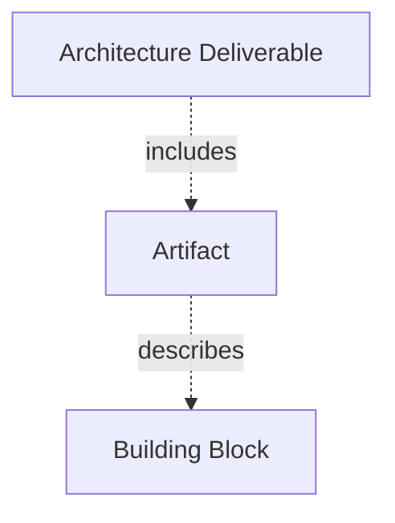
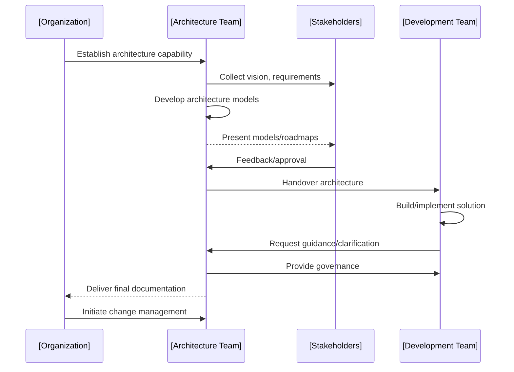

# TOGAF Overview

## 1. Introduction

The Open Group Architecture Framework (TOGAF) is a widely-adopted standard for enterprise architecture (EA). Developed and maintained by The Open Group, TOGAF provides a comprehensive methodology and a common vocabulary for designing, planning, implementing, and governing enterprise information architecture. Its primary purpose is to help organizations align IT goals with business objectives, enable digital transformation, and manage architectural complexity.

TOGAF is used by large-scale organizations across industries, public and private sectors, and is referenced in many IT governance frameworks. It is often implemented alongside related standards such as ISO/IEC/IEEE 42010 (architectural description of system and software), ITIL (IT Service Management), and COBIT (IT governance). It does not prescribe a specific technology or toolset, allowing for adaptation across diverse IT environments.

> **Alert**
> 
> TOGAF is not a software product or platform, but a process model and set of best practices—adaptation to organizational needs is expected and encouraged.

---

## 2. Technical Context and Definitions

### 2.1 Enterprise Architecture (EA)

Enterprise Architecture is both a discipline and a practice focusing on the design and management of an organization’s IT assets, business processes, information flows, and supporting technologies. Its objectives include:

- Ensuring alignment between business goals and IT capabilities.
- Reducing complexity and duplication.
- Facilitating change and innovation.

### 2.2 TOGAF Scope

TOGAF is a generic architecture framework, providing:

- _Architecture development methodology (ADM)_
- _Reference models and tools_
- _A content metamodel_
- _Governance structures_

While applicable to IT architecture, TOGAF also considers business, data, and application architectures and their relationships.

---

## 3. Core Concepts and Key Components

### 3.1 Architecture Development Method (ADM)

The TOGAF Architecture Development Method (ADM) is the core of the framework. ADM is a cyclical, iterative process for developing and managing architectures, divided into a series of phases designed to be repeatable and adaptable. The phases cover everything from establishing architecture vision through implementing and maintaining solutions.

#### TOGAF ADM Phase Flow

#### DESCRIPTIVE PHASE OVERVIEW

- **Preliminary Phase**: Prepares the organization, establishes architecture capability.
- **Phase A – Architecture Vision**: Defines scope, constraints, stakeholders, and high-level requirements.
- **Phase B – Business Architecture**: Models business strategy, governance, organization, and processes.
- **Phase C – Information Systems Architecture**: Specifies application and data architectures.
- **Phase D – Technology Architecture**: Describes technology infrastructure.
- **Phase E – Opportunities & Solutions**: Identifies delivery projects.
- **Phase F – Migration Planning**: Plans transition and prioritizes projects.
- **Phase G – Implementation Governance**: Ensures architecture conformance during implementation.
- **Phase H – Architecture Change Management**: Monitors and manages change in the architecture.

### 3.2 Architecture Content Framework (ACF)

The Architecture Content Framework structures the outputs of architecture work. It organizes deliverables, artifacts, and models, and supports communication across diverse stakeholders.

#### Key Content Elements

- **Deliverables**: Formal outputs (e.g., architecture definitions, roadmaps).
- **Artifacts**: Diagrams, matrices, catalogs describing architecture.
- **Building Blocks**: Modular, reusable design elements.

### 3.3 Enterprise Continuum and Tools

This concept organizes reusable architecture assets, solutions, or patterns on a spectrum from generic to organization-specific.

- **Architecture Continuum**: Ranges from foundational architectures (industry models, standards) to tailored enterprise architecture.
- **Solutions Continuum**: Ranges from generic product implementations to custom, organization-specific deployments.

### 3.4 TOGAF Reference Models

TOGAF provides generic reference models to standardize architectural thinking and communication:

- **Technical Reference Model (TRM)**: A layered model for technology services abstraction.
- **Integrated Information Infrastructure Reference Model (III-RM)**: Focuses on information management, sharing, and integration.

> **Tip**
> 
> Reference models accelerate architecture development by providing widely-understood templates and taxonomies.

---

## 4. TOGAF in Practice

### 4.1 Typical Workflow

1. **Establish Architecture Capability**  
   Prepare the organization, define principles, and assemble a project team.  
2. **Develop Architecture Vision**  
   Capture sponsor needs, analyze context, and articulate the value proposition.
3. **Iterate Through ADM Phases**  
   Progress through Business, Information Systems, and Technology architectures; refine solutions and migration plans.
4. **Govern Implementation**  
   Oversee solution execution against architectural design, resolve deviations.
5. **Monitor and Adapt**  
   Use change management processes to keep architecture aligned with evolving business needs.

#### Example Project Flow in TOGAF ADM

### 4.2 Constraints and Assumptions

- **Adaptivity**: TOGAF prescribes processes, not prescriptive content; organizations adapt artifacts and templates to fit context.
- **Vendor-Neutral**: There are no mandated tools; modeling and documentation approaches vary.
- **Scope**: Designed for enterprise-scale initiatives; small organizations may selectively adopt concepts.

> **Alert**
> 
> Effective deployment requires cultural buy-in and alignment with governance structures. Adoption often fails when treated as a documentation exercise only.

---

## 5. Common Variations and Engineering Considerations

### 5.1 Tailoring TOGAF

- **Partial ADM**: Teams may use only selected phases (e.g., for agile development or fast-moving digital projects).
- **Integration with Other Standards**: TOGAF is frequently combined with Agile, ITIL, SAFe, or Architecture Decision Records (ADRs).
- **Tool Support**: While tool-agnostic, adoption of EA tools (e.g., ArchiMate, Sparx EA, LeanIX) is common for artifact management.

### 5.2 Pitfalls and Challenges

- **Overengineering**: Excessive documentation or rigid adherence can slow value delivery.
- **Disconnect from Business**: Architectures can become irrelevant without continual stakeholder engagement.
- **Governance Gaps**: Weak governance leads to deviation from target architectures and suboptimal outcomes.

> **Warning**
> 
> Architecture models and roadmaps must be kept current and actionable; otherwise, they lose credibility and become shelfware.

---

## 6. Integration Points and Interoperability

### 6.1 Interoperability with Other Frameworks

- **ITIL / COBIT**: TOGAF complements ITIL (service management) and COBIT (IT governance) in the broader IT management landscape.
- **Archimate**: The Open Group’s ArchiMate standard is frequently used to model TOGAF artifacts, providing standardized visual language.

### 6.2 Engineering Decisions

Engineers implementing TOGAF should consider:

- **Degree of Formality**: Adapt rigor to organizational size, culture, and business pace.
- **Artifact Fidelity**: Choose the appropriate level of detail for models and documentation.
- **Toolchain Integration**: Ensure EA toolchains interface well with development, DevOps, and documentation platforms.

> **Tip**
> 
> Lightweight, iterative approaches can be more effective than comprehensive, heavyweight TOGAF implementations for most organizations.

---

## 7. Summary

TOGAF provides a structured approach for engineering enterprise architectures, emphasizing alignment between IT and business, modular reuse, and governance. The core ADM cycle enables systematic, iterative development from initial vision through ongoing change management, with the Architecture Content Framework supporting consistency and communication across artifacts. Effective TOGAF implementation depends heavily on organizational context, cultural readiness, and an appropriately tailored approach.

---

## Appendix: Example ADM Phase Table

| Phase                | Objective                             | Typical Artifacts                 |
|----------------------|---------------------------------------|-----------------------------------|
| Preliminary          | Establish EA capability               | Principles, Charter, Scope        |
| A. Architecture Vision| Define scope & vision                | Vision Document, Stakeholder Map  |
| B. Business Arch     | Business process models               | Business Process Diagrams, Matrices|
| C. Info Sys Arch     | Data/application structures           | Data Models, Application Catalogs |
| D. Tech Arch         | Technology platform definition        | Platform Diagrams, Technology Matrix|
| E. Opportunities/Solutions | Delivery planning                | Solution Portfolio, Gap Analysis  |
| F. Migration Planning| Roadmap sequencing                    | Migration Plan, Dependency Map    |
| G. Implementation Gov| Architecture conformance              | Governance Reports, Test Results  |
| H. Change Management | Ongoing alignment                     | Change Logs, Impact Assessments   |

---

## Additional Visuals

> **Note**
>
> _Diagram to be added later_: Capability Map show-casing the relationship between Business, Information Systems, and Technology architectures.