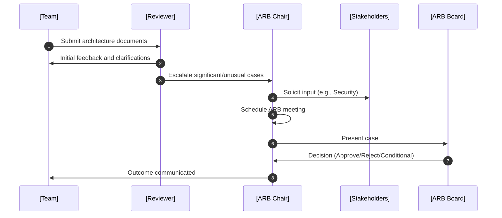
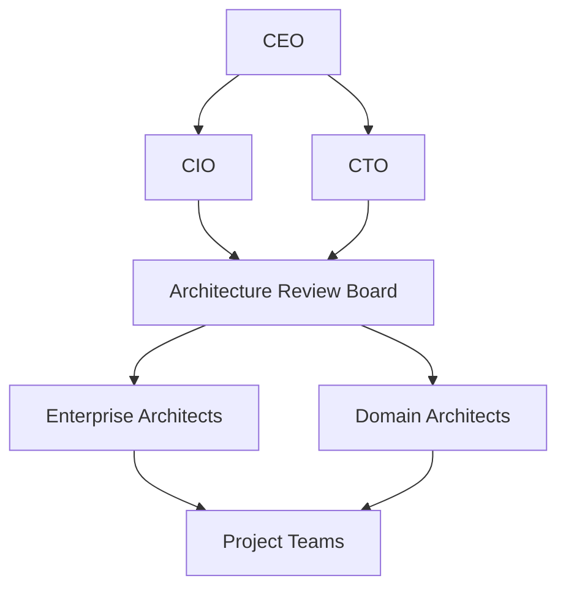

# Architecture Governance

## Introduction

Architecture governance comprises the practices, processes, standards, organizational structures, and decision-making mechanisms that ensure the development and evolution of software architectures are aligned with business objectives, technical strategies, and constraints. Effective governance is essential for organizations seeking greater control over complexity, consistency, risk, compliance, and value realization in large or distributed system landscapes.

This overview provides a foundation for understanding architecture governance within the context of software engineering. It defines core concepts, describes key mechanisms, examines typical practices, illustrates workflows and decision flows, references leading frameworks and standards, and highlights practical concerns.

---

## 1. The Rationale for Architecture Governance

In large-scale or enterprise environments, architectural decisions have far-reaching effects on cost, agility, interoperability, compliance, and maintainability. Architecture governance is motivated by the need to:

- **Align architectural outcomes with organizational strategy.**
- **Ensure compliance** with external regulations and internal standards.
- **Control risk** by evaluating significant changes and their impact.
- **Optimize reuse** of architectural patterns and assets.
- **Enable transparency** and accountability for major decisions.
- **Support consistent execution** across distributed teams or business units.

Without governance, architectures may drift from desired standards, critical risks can go unaddressed, and technical debt often accumulates.

---

## 2. Core Concepts

### 2.1 Architecture Governance Definition

**Architecture Governance:**  
The framework of policies, practices, roles, artifacts, and review mechanisms by which an organization directs and controls the development, implementation, evolution, and deprecation of its architecture.

### 2.2 Related Concepts & Distinctions

- **IT Governance:** Broader oversight of IT investments, projects, and operations. Architecture governance is a subset.
- **Architecture Management:** Day-to-day activities of architecting, as opposed to oversight mechanisms.
- **Architecture Review Boards (ARB):** Formal committees that decide or advise on architecture matters.
- **Architecture Principles:** Foundational rules guiding architecture decisions, often codified as part of governance.
- **Standards & Policies:** Specific, actionable rules adhered to within governed processes.

---

## 3. Key Components of Architecture Governance

The following elements are typically found in a mature architecture governance framework:

### 3.1 Governance Structure

#### a. Roles and Boards

- **Architecture Review Board (ARB):** Primary decision-making or advisory body.
- **Enterprise Architect / Domain Architect:** Accountable for enforcing standards.
- **Project Teams:** Consumers and implementers of governed architecture.

#### b. Stakeholders

- Technology leadership (CTO, CIO)
- Security and compliance officers
- Product/business owners

### 3.2 Policies and Standards

- **Architecture Standards:** Technology stacks, API patterns, infrastructure blueprints.
- **Design Principles:** High-level rules (e.g., "favor loose coupling").
- **Compliance Requirements:** Regulations (GDPR, PCI DSS) or internal mandates.

### 3.3 Processes and Workflows

- **Architecture Review Process:** Regular reviews for new and changed architectures.
- **Exception Management:** Handling non-conforming proposals.
- **Issue Escalation:** Processes for conflict or dispute resolution.

### 3.4 Artifacts

- **Architecture Decision Records (ADRs)**
- **Architecture Documentation:** Diagrams, specifications, rationale.
- **Conformance Reports:** Evidence of compliance and deviations.

### 3.5 Metrics and Monitoring

- **Conformance Metrics:** Frequency of exceptions, review cycle times.
- **Effectiveness Metrics:** Number of security incidents, performance regressions attributable to architectural flaws.

---

## 4. Typical Architecture Governance Workflow

The governance process ensures architectural oversight at critical points. A common workflow is illustrated below.

```mermaid
flowchart TD
    A[Architecture Proposal Submitted] --> B[Initial Review (Architecture Team)]
    B --> C{Meets Standards?}
    C -- Yes --> D[Approve or Recommend Minor Changes]
    C -- No --> E[Request Rework or Raise Exception]
    E --> F{Exception Justified?}
    F -- Yes --> G[ARB Review]
    F -- No --> H[Return for Revision]
    G --> I{Approved by ARB?}
    I -- Yes --> J[Conditional Approval & Track Deviation]
    I -- No --> H
    D & J --> K[Implementation Proceeds]
    K --> L[Architecture Conformance Check (Post-Implementation)]
    L --> M[Record Findings & Lessons]
```

This flow supports both routine and exceptional cases, ensures traceability, and enforces accountability through review gates.

---

## 5. Reference Standards and Frameworks

Several established standards and frameworks guide the design and operation of architecture governance.

- **TOGAF (The Open Group Architecture Framework):**  
  Specifies the Architecture Governance Framework (Chapter 50 of TOGAF 10), including principles, structures, and processes.  
  Reference: [TOGAF Specification](https://pubs.opengroup.org/architecture/togaf-standard/)

- **COBIT (Control Objectives for Information and Related Technologies):**  
  Provides high-level IT governance processes, including architecture controls.

- **ISO/IEC 42010:**  
  Standard for architecture descriptions, supporting governance with structured architectural artifacts.

---

## 6. Implementation Practices

### 6.1 Initiating Governance

- **Draft Principles and Standards:** Engage technical leadership and relevant stakeholders to define core architecture principles.
- **Establish Boards:** Formulate ARB or equivalent with clear terms of reference.
- **Develop Review Processes:** Define submission, review, escalation, and decision protocols.
- **Roll Out Training and Communication:** Ensure teams understand standards, artifacts, and rationales.

### 6.2 Architecture Review Board (ARB) Activities



### 6.3 Decision-Making and Record-Keeping

- **Architecture Decision Records (ADRs):**  
  Structured documents capturing significant architectural decisions, rationale, alternatives considered, and consequences.

- **Governance Tools:**  
  Many organizations use tools such as Atlassian Confluence/Jira, LeanIX, or custom repositories to document, track, and enforce governance.

---

## 7. Common Constraints and Assumptions

- **Organizational Buy-In:**  
  Governance is only effective when respected and adopted by management and engineering teams.

- **Balance Between Control and Agility:**  
  Excessive bureaucracy can stifle innovation or slow delivery; too little leads to architectural inconsistency and risk.

- **Compatibility with Agile Practices:**  
  Modern governance must enable, not block, agile delivery (see “just enough” governance, lightweight reviews).

---

## 8. Variations and Customization

Architecture governance frameworks are tailored by organizations based on size, sector, regulatory environment, and culture.

### Example Customizations:

- **Centralized ARB (Large Enterprises):** All major decisions flow through a core board.
- **Federated Model (Multi-national/Divisional):** Local boards manage local decisions within global standards.
- **Lightweight “Embedded” Governance:** Engineers act as “architecture champions” within squads; ARB only intervenes on high-impact changes.

---

## 9. Constraints, Challenges, and Pitfalls

> :warning: **Warning**  
> Weak governance can result in architectural drift, compliance breaches, operational outages, or security incidents.

### Common Challenges

- **Resistance to Change:** Teams may push back against new review steps or standards.
- **Keeping Standards Current:** Architecture documentation and standards risk obsolescence without continuous updates.
- **Escalation Bottlenecks:** Centralized ARBs can become bottlenecks for delivery.
- **Shadow Architecture:** Teams bypassing governance via unsanctioned tools or solutions.

---

## 10. Integration Points

### With Project Lifecycle

Governance gates are often mapped to critical project milestones (e.g., design review, go/no-go decision, pre-production deployment).

### With Quality Assurance and Security

Architecture governance should include security specialists and ensure security and risk management are embedded in the architecture process.

### With Portfolio Management

Architectural roadmaps and decisions should influence portfolio planning, technology investments, and project prioritization.

---

## 11. Example: Architecture Governance in Agile Organizations

Modern agile environments favor “just enough” governance:

- Lightweight, frequent reviews instead of heavyweight committees.
- Automation of standards enforcement via CI/CD (e.g., static analysis, compliance checks).
- Decentralized decision-making with guardrails.

```mermaid
flowchart TD
    S[Feature Proposal] --> T[Squad Review (Dedicated Architect)]
    T --> U{Meets Baseline Standards?}
    U -- Yes --> V[Proceed]
    U -- No --> W[Request ARB Guidance]
    W --> X[ARB Provides Guardrails]
    X --> V
```

---

## 12. Metrics and Continuous Improvement

- **Cycle Time:** Time to review and decision.
- **Exception Rate:** Frequency and cause of exception requests.
- **Technical Debt Trends:** Relation to governance process.
- **Stakeholder Satisfaction:** Measured via surveys.

Governance processes should be periodically reviewed and refined.

---

## 13. Engineering Considerations

> :bulb: **Tip**  
> Automated tooling can offload repeatable compliance checks—freeing ARBs to focus on significant decisions.

- **Tool Integration:** Integrate with existing developer workflows where possible.
- **Version Control:** Track changes to standards and architecture artifacts under source control.
- **Transparency:** Ensure all decisions and exceptions are recorded for auditability.
- **Documentation Minimums:** Define required and optional documentation to avoid excessive overhead.

---

## 14. Conclusion

Architecture governance is a critical discipline for aligning technical decision-making with organizational strategy, risk appetite, and compliance needs. By providing frameworks, roles, processes, and documentation, organizations can ensure consistency, manage risk, optimize reuse, and support both innovation and agility. Properly calibrated, architecture governance becomes an enabler—rather than a barrier—to engineering effectiveness.

---

## Appendix: High-Level Governance Structure Example



---

> :memo: **Note**  
> Where applicable, supplement this overview with organization-specific artifacts and detailed process models (“diagram to be added later” for company-specific flows).