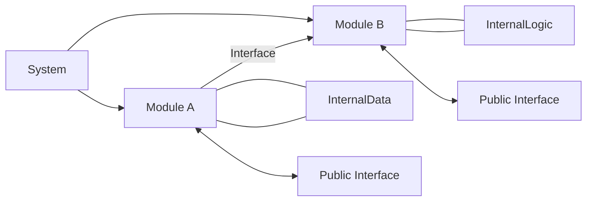
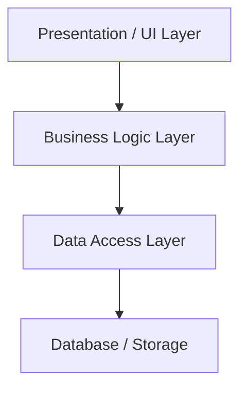
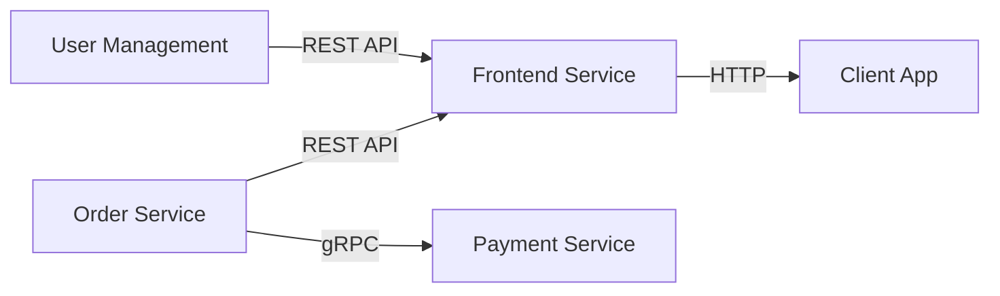
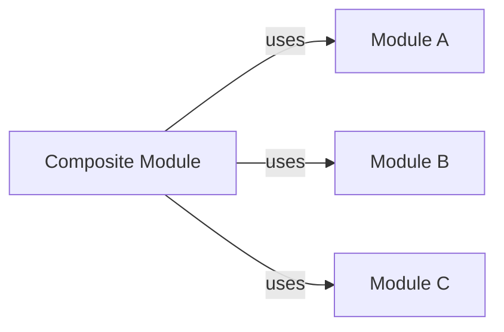
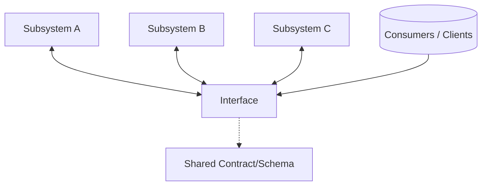

# Software Modularity: Principles and Structures for Designing Modular, Decoupled Systems

## 1. Introduction

Modularity is a foundational principle in software engineering, enabling the construction of large, complex systems through the composition of smaller, self-contained units. Correctly applied, modularity facilitates understanding, testing, maintaining, and evolving software systems. It is closely aligned with concepts such as separation of concerns, encapsulation, and system decomposition, and directly informs architectural paradigms ranging from libraries and components to modern microservices. This primer provides a formal introduction to software modularity: its motivations, core principles, architectural structures, practices, constraints, and engineering considerations.

---

## 2. Definition and Motivation

### 2.1. What Is Modularity?

**Software modularity** is the design technique of dividing a system into distinct, cohesive, and loosely-coupled components—called *modules*—each encapsulating a set of related responsibilities, data, or behaviors. In practice, a module typically provides a well-defined interface, allowing it to interact with other modules while hiding its internal implementation details.

### 2.2. Technical Context

Modularity underpins multiple software engineering concerns:

- **Maintainability:** Isolated modules can be modified, replaced, or extended with minimal impact on other parts of the system.
- **Testability:** Modules facilitate focused unit tests.
- **Reuse:** Well-fired modules can be reused across projects or contexts.
- **Parallelism:** Teams can work on different modules simultaneously due to clear boundaries.
- **Scalability and deployment:** In distributed systems, modularity enables independent deployment and scaling (e.g., microservices).

The principles of modularity apply throughout the software stack: from low-level libraries and language features, through subsystems and layers, up to distributed systems composed of independently deployed services.

---

## 3. Core Concepts

### 3.1. Module (Component)

A *module* is any software entity—a function, object, class, package, service, or application—that can be logically isolated and composed. Effective modules typically have:

- **Cohesion:** Their contents are closely related.
- **Encapsulation:** Internal implementation is hidden behind a clear interface.
- **Replaceability:** They can be updated or replaced with minimal impact outside their boundaries.

### 3.2. Interface

The *interface* is the contract through which a module interacts with others. It defines:

- Inputs and outputs (parameters, return values, messages)
- Public types or protocols
- Error or exception handling behaviors
- (For services) APIs, protocols, or message formats

### 3.3. Coupling and Cohesion

- **Cohesion** refers to how closely the responsibilities within a single module are related. High cohesion is desirable.
- **Coupling** measures the degree of dependency one module has on another. Low (loose) coupling is desirable, as it prevents changes from propagating across the system.

### Mermaid Diagram: Core Modularity Concepts

---

## 4. Modular Structures in Software Systems

Modularity manifests at different levels of system design:

### 4.1. Language-Level Modularity

Object-oriented classes, functional modules, and code packages are the first form of modularity.

- **Encapsulation:** Achieved via private/protected members, visibility modifiers, namespaces.
- **Interfaces:** Defined through language constructs (e.g., interfaces, abstract classes, protocols).
- **Composition:** Modules are composed using dependency injection, composition over inheritance, or pattern-based registrations.

### 4.2. Component-Level Modularity

At the system level, components could be dynamic/shared libraries, plugins, or similar deployable units.

- **Plugin architectures:** Dynamically loaded code at runtime.
- **Shared libraries:** Link-time or runtime separation.

### 4.3. Service-Level Modularity

Fully decoupled networked services (e.g., microservices), communicating over protocol boundaries.

- **APIs:** REST, gRPC, RPC, message queues.
- **Contracts:** Defined with OpenAPI, protobuf, or other interface definition languages (IDLs).

### 4.4. Layered Architectures

Modules are organized in logical layers: presentation, business logic, data access, infrastructure, etc.

---

## 5. Principles of Modularity

Effective modular design is guided by key software engineering principles. Some of the most influential include:

### 5.1. Separation of Concerns

Each module addresses a single, specific concern or responsibility.

### 5.2. Encapsulation

A module’s internal representation is hidden; only its interface is exposed.

### 5.3. Information Hiding

Implementation details are not just encapsulated, but actively prevented from leaking out.

### 5.4. Interface Segregation

Clients should not be forced to depend on interfaces they do not use (cf. SOLID’s Interface Segregation Principle).

### 5.5. Single Responsibility Principle

Each module should have one and only one reason to change.

### 5.6. Open/Closed Principle

A module should be open for extension, but closed for modification.

---

## 6. How Modularity Works in Practice

### 6.1. Designing Modules

#### Typical Workflow

1. **Define Responsibilities:** Specify what each module should do.
2. **Design Interfaces:** Explicitly define what is exposed and what is hidden.
3. **Identify Dependencies:** Minimize and document inter-module dependencies.
4. **Establish Communication Mechanisms:** Select appropriate contracts/protocols (method calls, REST APIs, pub/sub, etc.).
5. **Document Contracts:** Use interface description languages, documentation generators, or schemas.
6. **Test Modules Individually:** Use unit tests, mocks, and dependency injection.

#### Constraints and Assumptions

- There exists a mapping between functional requirements and module boundaries.
- Boundaries are not always obvious; iterative refinement is common.
- Some cross-cutting concerns (e.g., logging, error handling) necessitate special handling.

#### Example: E-commerce Platform

### 6.2. Achieving Loose Coupling

- Use *dependency inversion* to allow high-level modules to avoid depending directly on low-level modules.
- Prefer *interface injection* or *event-driven* communications over direct invocation.
- In distributed systems, favor *contracts* defined in language-neutral ways (e.g., Protobuf, OpenAPI).

> **Note**
> Excessive coupling may be introduced via shared data models (e.g., by sharing internal object schemas outside module boundaries).

### 6.3. Managing Cohesion

- Group related operations and data structures together.
- Avoid “God objects” or “omnibus modules” that aggregate disparate concerns.
- Refactor modules that accumulate unrelated responsibilities.

### 6.4. Composability

Modular systems facilitate composition, letting modules be aggregated into higher-level components to address more complex scenarios.

---

## 7. Architectural Patterns Enabled by Modularity

Modular design is foundational for several architectural patterns. Examples include:

### 7.1. Microservices

Applications are split into independently deployable services, each responsible for a specific domain.

### 7.2. Plugin Architectures

Core systems provide extension points for loading plugins at runtime.

### 7.3. Layered (n-Tier) Architectures

Responsibilities organized into discrete layers with well-defined interfaces.

### 7.4. Component-Based Frontend Design

Frontend systems (e.g., React, Angular, Vue) structure UIs as reusable components.

---

## 8. Modularity in Standards and Protocols

Several standards mandate or encourage modularity:

- **POSIX:** Standardizes interfaces between system modules.
- **RFC 1958 (Architectural Principles of the Internet):** Principle 3 – modularity as key to robust protocol design.
- **OSI Reference Model:** Layered, modular network protocol stack.
- **OpenAPI Specification:** Interface contracts for HTTP APIs encourage API modularity.

---

## 9. Engineering Considerations

### 9.1. Integration Points

Careful definition and documentation of module boundaries are critical. API versioning, backward compatibility, and clear deprecation paths prevent integration issues.

### 9.2. Performance Implications

- Excessive modularization can lead to performance overhead (e.g., excessive network calls or method dispatching).
- Coarse-grained modules may outperform overly fine-grained ones.
- In distributed systems, pay attention to serialization, network latency, and data transfer costs.

> **Caution**
> Over-modularization may degrade performance; balance boundaries with runtime requirements.

### 9.3. Implementation Challenges

- Non-functional requirements (e.g., logging, security) may span multiple modules, requiring cross-cutting solutions (such as AOP, middleware).
- Refactoring monolithic legacy systems into modular architectures is often complex.
- Cyclic dependencies (direct or indirect) can undermine modularity.

### 9.4. Common Pitfalls

- *Leaking abstractions:* Modules expose more than necessary, creating unintended coupling.
- *God modules:* One module accrues most responsibilities, negating decomposition benefits.
- *Assumed stability:* Overestimating the stability of external module interfaces leads to brittle systems.

### 9.5. Engineering Decisions

Factors to consider when defining module boundaries:

- Expected change frequency
- Domain-driven boundaries and ownership
- Team organization and skill
- Deployment and runtime constraints
- Data management strategies

---

## 10. Modularity: A Summary Block Diagram

---

## 11. Conclusion

Software modularity is a discipline that offers measurable benefits for building complex, robust, and maintainable systems. By clearly defining module boundaries, establishing explicit contracts, and minimizing coupling while maximizing cohesion, engineering teams create systems that are easier to reason about, extend, and deploy. However, modularity must be approached in balance; over-decomposition, leaky abstractions, and excessive coupling can neutralize intended gains. Effective modular design consistently applies core principles, is guided by domain understanding and practical engineering considerations, and leverages appropriate structural and architectural patterns.

---