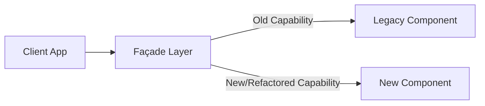
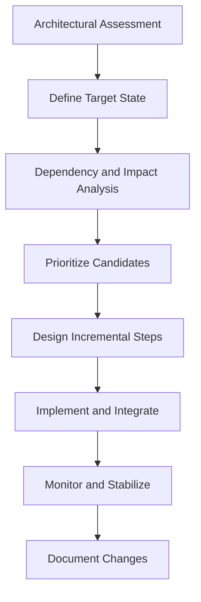
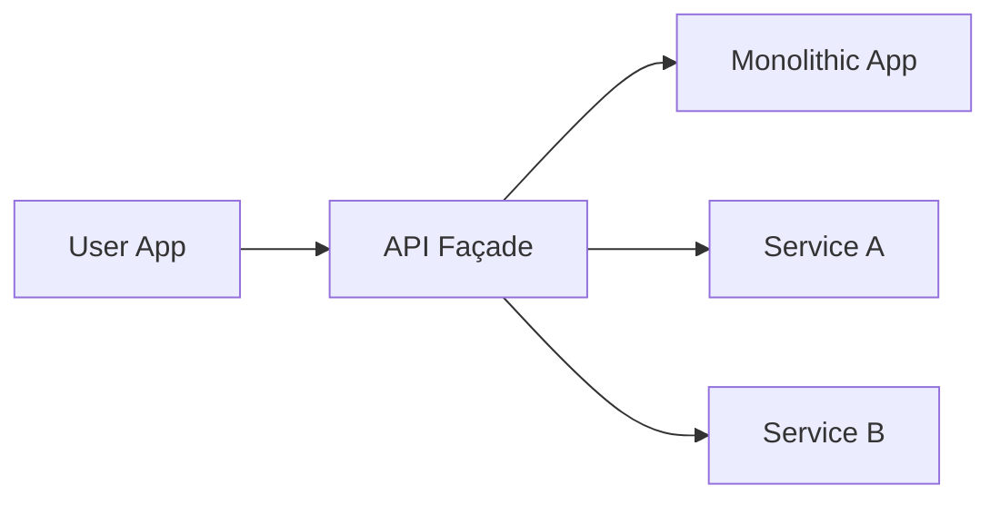
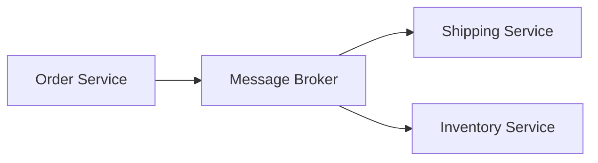

# Architectural Refactoring

## Introduction

Architectural refactoring refers to the disciplined, incremental process of improving a software system’s architectural structure without altering its externally observable behavior. Unlike code-level refactoring, which focuses on functions, classes, or modules, architectural refactoring addresses higher-level constructs such as system boundaries, component responsibilities, data flow, error handling, deployment topologies, and inter-service contracts. It enables software engineers to increase system maintainability, performance, scalability, and alignment with current business or technical requirements, all while minimizing risk and avoiding wholesale rewrites.

Architectural refactoring is necessary as systems age, requirements evolve, or new platform capabilities and industry standards emerge. It is a foundational practice in modern software evolution, underpinning efforts like cloud migration, decomposing monoliths, introducing modularity, and adopting patterns like microservices or event-driven architectures.

## Core Concepts

### What Is Architectural Refactoring?

At its core, architectural refactoring involves systematic improvement of software's architecture to:

- Resolve architectural smells and anti-patterns.
- Address technical debt accumulated at the architectural level.
- Enable easier integration of new features or technologies.
- Improve quality attributes (maintainability, resilience, modifiability, scalability, performance, etc.).
- Mitigate risks inherent in outdated or suboptimal designs.

The key distinction: architectural refactoring targets the composition and interaction of high-level subsystems and components, not just localized code changes.

### Scope: What Constitutes "Architecture" in This Context?

- **Module Boundaries:** Redefining logical separation of code (packages, assemblies, services).
- **Component Interactions:** Modifying control and data flow across modules.
- **Deployment Topologies:** Changing how the system is partitioned and deployed (e.g., from monolithic to distributed).
- **Interface Contracts:** Evolving APIs, message schemas, or data synchronization mechanisms.
- **Non-Functional Concerns:** Refactoring to address scalability, reliability, or security requirements.

## Key Drivers and Motivation

1. **Business Agility Needs:** Support faster delivery or pivoting business requirements.
2. **Technical Debt Reduction:** Address historical shortcuts that now impede progress.
3. **Scalability or Performance Constraints:** Adapt system structure to handle increased load.
4. **Cloud, Platform, or Technology Adoption:** Modernize for containerization, serverless, or cloud-native paradigms.
5. **Incident or Outage Response:** Resolve recurring failures that trace to architectural flaws.

## Methods and Patterns

### Incremental and Safe Refactoring

Architectural changes are inherently risky due to their cross-cutting impact. To mitigate this, engineering teams typically employ the following principles:

- **Incrementalism:** Large changes are decomposed into bite-sized, low-risk steps.
- **Backward Compatibility:** Interfaces and contracts must remain stable during transitions.
- **Testing and Observability:** Extensive automated testing, canary releases, and observability tooling validate correctness.
- **Parallel Running:** New and old architectures might temporarily coexist.

#### Key Patterns

1. **Strangler Fig Pattern:** Gradually replace parts of a legacy system with new services/modules. The legacy system shrinks as the new system grows.

2. **Branch by Abstraction:** Introduce abstraction layers to decouple old and new implementations, allowing parallel development and migration.

3. **Modularization:** Isolate independent domains for separate deployment and independent evolution.

4. **Façade Introduction:** Add a façade to mask underlying complexity during transitions.

5. **Partitioning and Decomposition:** Identify and extract bounded contexts, moving towards more modular or service-oriented architectures as appropriate.

### Mermaid Diagram: Strangler Fig Refactoring

## Typical Workflow: Conducting Architectural Refactoring

1. **Architectural Assessment**
   - Analyze the current system using static/dynamic analysis, code reviews, and architecture decision records (ADR).
   - Identify technical debt, anti-patterns, and architectural smells.
2. **Define Target State**
   - Specify desirable quality attribute goals (using frameworks like ISO/IEC 25010).
   - Capture the target architecture using views, diagrams, and descriptions (e.g., using C4 model).
3. **Dependency and Impact Analysis**
   - Map dependencies at code, data, and deployment levels.
   - Risk assessment for areas sensitive to change.
4. **Prioritize Refactoring Candidates**
   - Evaluate architectural changes based on ROI, risk, and alignment with business objectives.
5. **Design Incremental Steps**
   - Plan phased migration, sequencing steps to minimize business disruption.
6. **Implement and Integrate**
   - Carry out structural changes (e.g., introducing abstraction layers, extracting modules/services).
   - Ensure comprehensive regression testing.
7. **Monitor and Stabilize**
   - Use logging, health checks, and user metrics to observe impact.
   - Roll back or rollback forward as needed.
8. **Document and Institutionalize**
   - Update documentation, models, and ADRs for long-term maintainability.

### Mermaid Diagram: Incremental Architectural Refactoring Workflow

## Common Architectural Smells and Their Refactorings

| Smell                         | Symptom                                               | Refactoring Technique        |
|-------------------------------|------------------------------------------------------|-----------------------------|
| Big Ball of Mud               | No discernible system structure, tight coupling      | Modularization, Bounded Context Extraction |
| God Component                 | One module/class dominates responsibilities          | Responsibility Segregation, Component Extraction |
| Cyclic Dependencies           | Modules depend on one another circularly             | Dependency Inversion, Partitioning  |
| Stovepipe Systems             | Isolated vertical silos, poor reuse                  | Crosscutting Concerns Extraction, Layered Architecture  |
| Hardcoded Environment Config  | Environment information not externalized             | Configuration Migration, 12-Factor Principles |

## Architectural Refactoring in Practice

### Integration Points

- **Legacy Integration:** Safely decouple from or integrate with data stores, message queues, or mainframes.
- **Deployment Pipelines:** Refactoring may require CI/CD adaptation.
- **API Gateways and Façades:** Used to provide transitional compatibility at system boundaries.

### Constraints and Assumptions

- **Availability Requirements:** High-availability systems demand careful planning; traffic shadowing or blue/green deployments can limit risk.
- **Backward Compatibility:** Data migrations and external interface changes must avoid breaking consumers.
- **Organizational Constraints:** Team autonomy or Conway’s Law-related limitations may affect optimal partitioning.
- **Tooling Support:** Advanced code analysis tools (SonarQube, Structure101, Lattix), architectural decision tracking (ADR tools), and automated testing infrastructure are typically prerequisites.

### Compliance with Standards

Architectural refactoring may need to account for:

- **ISO/IEC 25010:** System and software quality models.
- **RFC 2119:** Key words for requirement levels (MUST, SHOULD, etc.) in design documents and ADRs.
- **OpenAPI/Swagger:** For API contract evolutions.
- **Container Orchestration APIs:** Kubernetes manifests, Helm, or other IaC standards if refactoring deployable topologies.

## Variations and Advanced Strategies

### 1. Legacy Monolith to Microservices

- **Context:** The system outgrew its original monolithic design.
- **Approach:** Identify bounded contexts → Extract microservices iteratively → Establish stable APIs/contracts → Gradually sever monolithic dependencies.
- **Constraints:** Data ownership, synchronous vs. asynchronous comms, operational overhead.

#### Mermaid Diagram: Stepwise Monolith Decomposition

### 2. Introduction of an Event-Driven Architecture

- **Context:** Tight coupling and lack of scalability in synchronous communication.
- **Approach:** Refactor component interactions from RPC/REST to message-passing or event-driven models. Employ brokers (e.g., Kafka, RabbitMQ).
- **Benefits:** Improved decoupling, fault isolation, asynchronous processing.
- **Pitfalls:** Message schema governance, eventual consistency, at-least-once vs. exactly-once delivery challenges.

#### Mermaid Diagram: Introducing Message Broker

### 3. Dependency Inversion and Modularization

- **Context:** Tight coupling of core and peripheral components.
- **Approach:** Introduce abstractions/interfaces, invert dependencies, physically separate modules for independent release/testing.

## Practical Engineering Considerations

### Test Strategy

- **Regression and Smoke Testing:** Architectural refactoring may inadvertently affect broad system areas. Automated end-to-end, contract, and performance tests are mandatory.
- **Shadow Traffic and Canary Releases:** Safe rollout patterns validate new architecture against production-like workloads.

> **:warning: Caution**
> Skipping thorough regression or integration testing during architectural refactoring can lead to prolonged outages or subtle data corruption.

### Observability

- **Logging and Metrics:** Provide visibility into both legacy and refactored paths for anomaly detection.
- **Tracing:** Distributed tracing (e.g., OpenTelemetry) to correlate user journeys in hybrid (old/new) architectures.

### Documentation and Communication

- **Arch Decision Records (ADRs):** Record decisions, context, and rationale for future maintainers.
- **Diagrams as Code:** Maintain architecture visuals in version control, using Mermaid or PlantUML.

### Stakeholder Coordination

- **Change Management:** Cross-team communication is critical, especially in organizations with shared platforms or multiple consuming teams.
- **Incremental Delivery:** Celebrate and measure intermediate milestones, not just the “final” target state.

### Organizational and Technical Pitfalls

> **:warning: Warning**
> Attempting a “big bang” rewrite or refactor is the leading cause of failed modernisation projects. Almost all successful strategies favor incremental change.

> **:bulb: Tip**
> Where possible, leverage feature toggles, branch by abstraction, and parallel operations to minimize user impact and enable rollback.

## Challenges and Mitigation Strategies

| Challenge                             | Mitigation Technique                |
|---------------------------------------|-------------------------------------|
| Business Disruption Risk              | Phased Migration, Dual Run          |
| Contract/Interface Breakage           | Stable APIs, Versioning, Façade     |
| Incomplete Requirements               | Iterative Refinement, Prototyping   |
| Team Misalignment                     | ADRs, Regular Syncs, Clear Ownership|
| Hidden Coupling/Data Dependencies     | Automated Analysis, Dependency Mapping|

## Conclusion

Architectural refactoring is a cornerstone practice in software modernisation, enabling legacy systems to adapt to new demands and environments while controlling technical risk and cost. By employing systematic, incremental techniques and rigorously managing dependencies, contracts, and deployments, engineering teams can safely evolve system architectures rather than defaulting to risky, large-scale rewrites.

Successful architectural refactoring depends on blending architecture principles, pragmatic engineering, disciplined change management, and robust tooling. Constraints such as high availability, backward compatibility, compliance, and internal alignment must be carefully navigated. Patterns like the strangler fig, event-driven introduction, and modularization—supported by testing, observability, and documentation—equip teams to iteratively modernise even critical, long-lived systems.

Architectural refactoring is not a one-time effort but an ongoing discipline—vital for maintaining the long-term health, agility, and relevance of evolving software platforms.