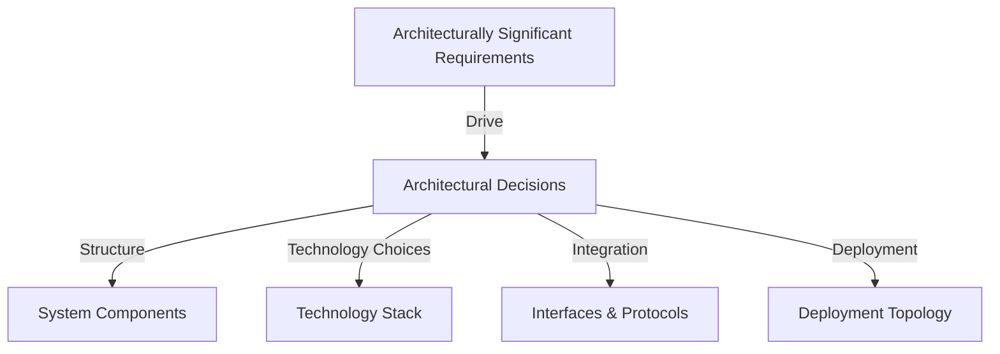
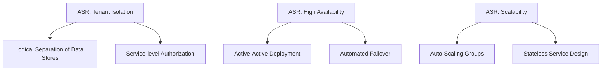
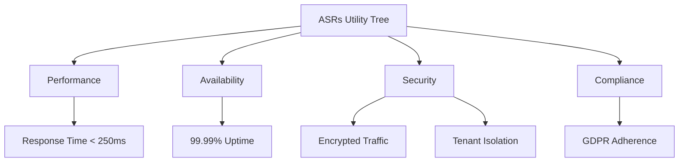

# Architectural Significance & Significant Requirements (ASRs)

## 1. Introduction

Modern software systems are shaped and constrained by a myriad of requirements. While many requirements influence implementation details, a subset—those termed **Architecturally Significant Requirements (ASRs)**—drive fundamental architectural decisions. Correct identification, documentation, and management of ASRs is paramount for effective software architecture, as they substantially define structure, quality, scalability, security, and maintainability.

This engineering overview introduces ASRs, defines their scope, explores their significance in architectural design, and provides practical guidance for managing ASRs within software engineering processes.

---

## 2. Definition and Context

### 2.1. What Are ASRs?

**Architecturally Significant Requirements (ASRs)** are the requirements—functional or non-functional—whose fulfillment will have a measurable impact on a system’s architecture. They are the primary drivers of architectural structure, behavior, and choice of technologies.

ASRs are commonly equated with requirements that:

- Affect the core architectural decisions and rationale.
- Can change the architecture if altered.
- Often map onto key system qualities (e.g., performance, security, availability, scalability).

**ASR Examples:**

- “The system must process 10,000 transactions per second with end-to-end latency below 50 ms.”
- “All data stored must be encrypted at rest and in transit.”
- “The platform must support multi-tenancy, with strict isolation between tenants.”

### 2.2. Technical Context

Architectural design is governed not by every specification or user story, but by ASRs. Standard requirements (such as "show this field on the UI") generally affect lower-level design or implementation, but ASRs force decisions about system decomposition, technology choices, deployment models, and integration strategies.

ASRs often emerge—explicitly or implicitly—from requirements engineering, stakeholder interviews, and risk assessments. Their importance is recognized by methodologies such as *Architecture Tradeoff Analysis Method (ATAM)*, which evaluates architecture in terms of its response to key requirements.

---

## 3. Core Concepts and Structure

### 3.1. Types of ASRs

ASRs can be classified into two broad categories:

- **Functional ASRs**: Business capabilities or functional goals that dictate or impact architecture.
  - Example: "Support real-time collaboration among 1,000+ concurrent users."
- **Non-Functional ASRs** (often called **Quality Attribute Requirements**): Quality goals that drive architectural priorities.
  - Examples: Performance requirements, reliability, security controls, scalability targets, availability, maintainability, and more.

While both influence architecture, it is predominantly non-functional ASRs that impose enduring architectural constraints.

#### 3.1.1. Quality Attributes

Quality attributes—sometimes standardized under ISO/IEC 25010 (Systems and Software Quality Models)—are a prime source of non-functional ASRs. These include:

- **Performance**
- **Availability**
- **Security**
- **Scalability**
- **Usability**
- **Maintainability**
- **Interoperability**
- **Portability**

The following diagram shows the relationship among requirements, quality attributes, and ASRs:

```mermaid
graph TD
    A[All Requirements] --> B[Functional Requirements]
    A --> C[Non-Functional Requirements]
    B -->|Subset| D[Functional ASRs]
    C -->|Subset| E[Non-Functional ASRs]
    D --> F[Architecturally Significant Requirements (ASRs)]
    E --> F
    style F fill:#fffae6,stroke:#403400,stroke-width:2px
```

### 3.2. Properties of ASRs

ASRs are defined by several practical properties:

- **Impact:** An ASR drives architectural structure and choice.
- **Sensitivity:** The architecture is sensitive to changes in ASRs.
- **Rarity:** Only a subset of requirements are ASRs.
- **Conflict Potential:** Multiple ASRs often create trade-offs (e.g., latency vs. security).
- **Traceability:** ASRs must be traceable to high-level architectural decisions.

### 3.3. Identification and Extraction

ASRs are seldom delivered as an explicit, separate artifact. Their identification requires:

- Deep stakeholder engagement and interviews.
- Analysis workshops (e.g., quality attribute workshops).
- Use of scenarios, quality attribute trees, and utility trees (per ATAM).
- Expert judgment.

---

## 4. Role in Software Architecture & Engineering

### 4.1. Driving Architectural Decisions

Unlike ordinary requirements, ASRs force fundamental decisions such as:

- **System decomposition:** Which components are necessary, and how are they structured?
- **Technology selection:** What frameworks, platforms, and libraries are suitable?
- **Deployment:** How will the system be deployed to meet reliability/availability constraints?
- **Integration:** What mechanisms ensure interoperability, security, or performance across subcomponents?

The following diagram illustrates how ASRs influence architectural decisions:



### 4.2. Traceability

A critical aspect of managing ASRs is establishing traceability—from requirements through decisions to architectural views and components. This ensures that architectural decisions remain justified and that future changes in ASRs trigger reassessment.

#### 4.2.1. Mapping Exercise

Engineers should map ASRs to:

- **Views:** Which architectural views are influenced? (e.g., logical, physical, deployment)
- **Decisions:** Which explicit decisions were made to satisfy each ASR?
- **Design Rationale:** What is the rationale for each trade-off?

### 4.3. Stakeholder Communication

Well-recognized ASRs provide a shared language between architects, engineers, and business stakeholders, enhancing alignment and reducing misunderstandings.

---

## 5. Workflow for Managing ASRs

### 5.1. Identification and Documentation

1. **Elicitation:** Extract potential ASRs during requirements gathering.
2. **Validation:** Confirm ASRs through stakeholder interviews and scenario analysis.
3. **Documentation:** Record each ASR, ensuring clarity and testability.
4. **Review:** Conduct architecture reviews to validate coverage.

#### 5.1.1. Scenario-Based Elicitation (ATAM Utility Trees)

Adopting scenario-based approaches (as in ATAM) helps clarify ASRs:

- *Stimulus*: What event triggers the attribute?
- *Response*: What is the expected system reaction?
- *Environment*: Under what context does this matter?
- *Response Measure*: How is success measured?

Example Scenario:
> **Stimulus:** "System receives 10,000 requests per second."
> **Response:** "Maintains average response time."
> **Measure:** "Average response < 100ms, 99th percentile < 200ms."

### 5.2. Prioritization

Given conflicting or numerous ASRs, teams must prioritize by impact, risk, and feasibility. Techniques include:

- Risk assessment matrices.
- Cost-benefit analysis.
- Prototyping and simulation.

### 5.3. Validation and Verification

Architectural prototypes, modeling, and simulations are used to validate whether architectural decisions will satisfy ASRs.

#### 5.3.1. Iterative Reassessment

As systems evolve, revisit ASRs periodically to ensure that architectural decisions remain aligned.

---

## 6. Practical Considerations

### 6.1. Integration with Development Processes

ASRs must be integrated with all stages of the software lifecycle, including:

- **Requirements Engineering:** Upstream identification and change management.
- **Design:** Basis for architectural patterns and trade-offs.
- **Implementation:** Inform design choices and code-level practices.
- **Testing:** Definition of architectural tests (e.g., performance, security).


### 6.2. Constraints and Assumptions

**Common Constraints:**

- Legacy integration.
- Regulatory compliance.
- Resource limitations (compute, team, budget).

**Assumptions:**

- Availability of certain technologies.
- Stability of external APIs or services.
- Ability to trade off attributes (e.g., can sacrifice some scalability for increased security).

**Caution:** 
> :warning:  
> Failing to validate assumptions underlying ASRs may lead to invalid architectural decisions and later project risk.

### 6.3. Trade-Offs and Conflicts

ASRs often conflict (e.g., performance vs. security). Resolving these trade-offs is central to architecture:

- Explicitly document the rationale for decisions.
- Use decision records (e.g., ADRs).
- Validate with stakeholders.

---

## 7. Standards, Frameworks, and Document Types

### 7.1. Standards

- **ISO/IEC/IEEE 42010:** Architecture description standards; underlines the importance of architectural concerns and decisions traceable to stakeholder requirements.
- **ISO/IEC 25010:** Software product quality models; relates quality attributes to requirements.

### 7.2. Documenting ASRs

Common practice includes:

- **ASR Lists:** Tabular listing with requirements, rationale, context, priority, and traceability.
- **Architecture Decision Records (ADRs):** Light-weight documents for tracking individual architectural choices linked to ASRs.
- **Quality Attribute Scenarios:** Structured sentences or tables capturing the context, trigger, and measurement of satisfaction.

---

## 8. Common Variations, Patterns, and Pitfalls

### 8.1. Variations

- **Explicit vs. Implicit Documentation:** Some organizations document ASRs explicitly; others rely on architecture descriptions with implicit references.
- **Granularity:** Level of detail—some ASRs are composite or decompose into finer requirements.

### 8.2. Patterns

- **Quality Attribute Scenarios:** Use structured templates for documenting non-functional ASRs.
- **Utility Trees:** Visual representation (as in ATAM) for organizing and prioritizing ASRs.
- **Incremental Elicitation:** Identify new ASRs as system context evolves.

### 8.3. Pitfalls

- **Overloading:** Treating too many requirements as ASRs dilutes focus.
- **Neglect:** Omitting critical ASRs leads to architectural misfit.
- **Lack of Validation:** Assuming fulfillment of ASRs without verification risks system failure.

**Tip:**  
> :bulb:  
> Regularly review and validate ASRs throughout the project lifecycle to adapt to evolving business, technical, and environmental constraints.

---

## 9. Example: ASRs in a Cloud-Native System

Assume a SaaS platform to be deployed on a public cloud. Example ASRs might include:

- **Security:** Must enforce tenant isolation; all traffic between services must be encrypted.
- **Availability:** System must provide 99.99% uptime with automatic failover.
- **Scalability:** Support dynamic scaling from 10 to 10,000 concurrent users.
- **Performance:** API response times must remain below 250 ms under 95th percentile loads.
- **Compliance:** Data must be stored in accordance with GDPR regulations.

### 9.1. Architectural Influence Example



### 9.2. Visual Example: Utility Tree



---

## 10. Conclusion

Architecturally Significant Requirements are the cornerstone of effective software architecture. Identifying, documenting, and managing ASRs enables engineers to design robust, scalable, and maintainable systems that meet explicit and implicit stakeholder expectations.

Key engineering best practices include close stakeholder engagement, scenario-based elicitation, thorough documentation, traceability, continuous validation, and explicit management of trade-offs. Integrating ASR management into your architecture process is essential for building systems that function, scale, and evolve reliably.

---

**Note:**  
> :bell:  
> Diagrammatic examples provided are representative. For especially large or complex systems, create tailored ASR utility trees and mappings appropriate to the project’s context.