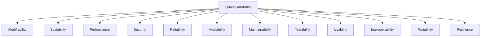
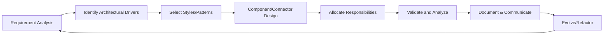
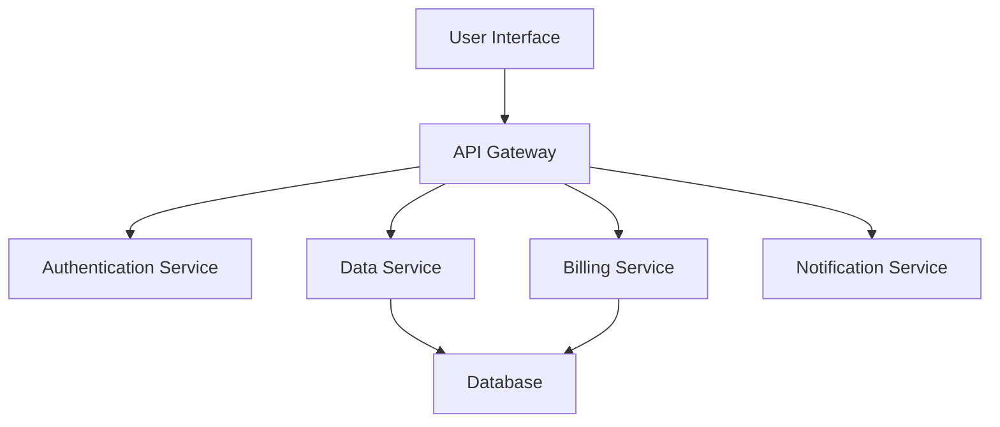
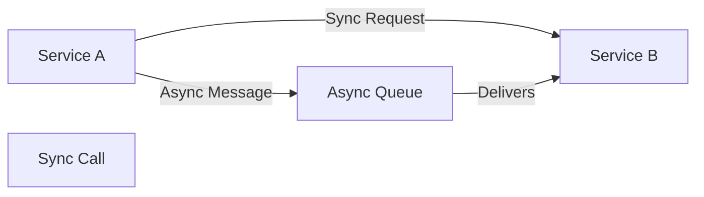

# What Makes a Good Architecture

## Introduction

Software architecture is the high-level structure of a software system, its fundamental components, their responsibilities, interactions, and the guiding principles that shape its design and evolution. A well-designed architecture is essential to building effective, sustainable, and robust software systems. It enables teams to meet functional and non-functional requirements, simplifies management of complexity, and provides a foundation for long-term growth and adaptability.

This overview defines what constitutes a "good" architecture, discusses its core quality attributes, and elaborates on the engineering decisions and considerations involved in architectural design. Connections with established frameworks such as the Architecture Tradeoff Analysis Method (ATAM) and the concept of "architectural significance" will be highlighted.

---

## 1. Defining Software Architecture

Software architecture refers to:

- The set of principal design decisions about the system's structure, organization, and key behaviors.
- The decomposition of complex problems into manageable, interconnected modules or components.
- The specification of high-level abstractions, protocols, and policies governing system design and evolution.

**IEEE 1471-2000** (now ISO/IEC/IEEE 42010:2011) defines architecture as:

> "The fundamental organization of a system embodied in its components, their relationships to each other, and to the environment, and the principles guiding its design and evolution."

## 2. The Role of Architecture in Software Development

Architecture provides a shared technical vision. It helps ensure:

- **Alignment** with organizational and business goals.
- Clear **division of responsibility**.
- **Guidance** for implementation, integration, and deployment.
- The ability to reason about **quality attributes** such as security, performance, and modifiability.

It is not static: successful architecture guides iterative development and adapts as requirements evolve or as constraints and assumptions change.

---

## 3. Core Quality Attributes of Good Architecture

A "good" architecture is characterized by its ability to balance and optimize a set of often competing **quality attributes**. These are also referred to as "ilities" or non-functional requirements. Understanding and documenting these is an essential part of any sound architectural practice.

### 3.1 Common Quality Attributes

| Attribute             | Description                                                                                     |
|-----------------------|------------------------------------------------------------------------------------------------|
| **Modifiability**     | The ease with which the system can accommodate change.                                         |
| **Scalability**       | The system's capacity to handle growth in usage or data.                                       |
| **Performance**       | Throughput, latency, and resource efficiency under expected or peak loads.                     |
| **Security**          | Protection of data and operation from unauthorized access or manipulation.                     |
| **Reliability**       | Consistency and dependability of the system’s operation.                                       |
| **Availability**      | Degree to which the system is operational and accessible when required.                        |
| **Maintainability**   | Ease with which the system can be maintained (bug fixes, updates, improvements).               |
| **Testability**       | Degree to which the system facilitates testing of its components and behaviors.                |
| **Usability**         | The extent to which the system is easy and efficient for end-users (when applicable).          |
| **Interoperability**  | Ability to operate with other systems or exchange information seamlessly.                      |
| **Portability**       | Ability to operate in different environments or platforms with minimal changes.                |
| **Resilience**        | Capability to recover from failures and continue operating.                                    |

### 3.2 Visualizing Quality Attributes and Their Trade-Offs

These attributes often interact or trade off—gains in one can entail costs in another (e.g., optimizing for security may impact performance, and vice versa).

---

## 4. Significant Requirements and Architectural Significance

Not all requirements have architectural significance. Architectural significance is reached when a requirement or constraint requires architecturally impactful design decisions, such as:

- Distribution of components
- Integration patterns (e.g., message queues, RESTful APIs)
- Technology or platform choices
- Data storage and consistency guarantees
- Availability and disaster recovery approaches

Capturing **architecturally significant requirements** early in the process is critical to making informed architectural trade-offs.

---

## 5. The Architecture Design Process

A typical architecture process involves several well-established stages:

1. **Requirement Analysis**: Elicit functional and quality attribute requirements; determine architectural significance.
2. **Architectural Drivers Identification**: Prioritize the most impactful requirements and constraints.
3. **Architectural Style and Pattern Selection**: Choose generalized design patterns (e.g., layered, microservices, event-driven).
4. **Component and Connector Design**: Define major system elements and their interactions.
5. **Allocation of Responsibilities**: Assign system responsibilities to components.
6. **Validation and Trade-off Analysis**: Confirm the architecture supports the targeted quality attributes.
7. **Documentation and Communication**: Create architectural views for stakeholders.
8. **Evolution and Refactoring**: Continually adapt the architecture to changing requirements and lessons learned.

### 5.1 Typical Workflow

---

## 6. Architectural Patterns and Styles

Selecting appropriate architectural patterns is a fundamental part of achieving a system's quality goals.

### 6.1 Common Architectural Styles

- **Layered Architecture**: Separates concerns in horizontal layers (e.g., Presentation, Business Logic, Data).
- **Client-Server Architecture**: Differentiates providers and consumers of services.
- **Microservices**: Independent deployable services communicating via lightweight mechanisms.
- **Event-Driven Architecture**: Reacts to events, enabling loosely coupled components.
- **Service-Oriented Architecture (SOA)**: Exposes business functionality as network-accessible services.
- **Pipe-and-Filter**: Data flows through a sequence of processing elements, common in data processing pipelines.

Each pattern affects quality attributes differently. For example, **microservices** enhance scalability and modifiability but may increase complexity in deployment and integration.

### 6.2 Example: Component-Based Architecture Diagram

---

## 7. Techniques for Architecture Evaluation

Evaluating architecture ensures alignment with business and technical objectives and validates that key quality attributes are adequately addressed.

### 7.1 ATAM (Architecture Tradeoff Analysis Method)

ATAM is a structured process for evaluating architecture decisions relative to quality attribute goals. Its essential steps:

- Identify driving requirements and risks.
- Create and analyze architectural scenarios.
- Expose trade-offs and sensitivity points.
- Document findings and recommendations.

ATAM supports rigor and transparency and is widely referenced in standards and best practices.

---

## 8. Engineering Considerations and Common Challenges

A good architecture accounts for practical concerns encountered during implementation and operation:

### 8.1 Integration Points

- **External dependencies**: Third-party APIs, databases, message brokers—need clear integration contracts and boundary isolation.
- **Backward and forward compatibility**: Essential for minimizing system disruptions during upgrades.

### 8.2 Performance and Scalability

- Characterize expected loads and performance objectives.
- Enable horizontal scaling (stateless components, partitioned data).
- Monitor and optimize critical paths.

> :warning: **WARNING:** Neglecting scalability or over-optimizing prematurely can both lead to costly rework. Calibrate design effort to context and growth expectations.

### 8.3 Implementation Pitfalls

- **Overengineering**: Introducing unnecessary complexity by optimizing for unlikely scenarios.
- **Underengineering**: Ignoring key quality attributes, leading to brittle or inflexible systems.
- **Insufficient documentation**: Hinders onboarding and system evolution.

### 8.4 Common Engineering Decisions

- REST vs. messaging patterns for service communication.
- Consistency models for distributed data (strong, eventual, causal).
- Synchronous vs. asynchronous integration.
- Technology and tooling selection governed by organizational standards, community support, and total cost of ownership.

### 8.5 Diagram: Example Service Integration Patterns

---

## 9. Documentation and Communication

Clear, accessible, and up-to-date **architecture documentation** is essential for communicating intent and constraints to all stakeholders.

### 9.1 Views to Document

- **Logical view**: Major components and their relations.
- **Process view**: Concurrency and threads of execution.
- **Deployment view**: How software elements run on hardware nodes.
- **Development view**: Package/module structure for engineering teams.

Adopt standards such as **C4 Model** or **UML** where possible for consistency.

---

## 10. Sustaining Good Architecture

An effective architecture is not a one-off event but a continuous discipline:

- Be prepared to revisit key decisions as requirements, technologies, and organizational priorities evolve.
- Regularly **review** architectural alignment with evolving business needs.
- Utilize **automation** (CI/CD, testing, monitoring) to enforce architectural intent and catch divergence early.

> :bulb: **TIP:** Regular architecture reviews and lightweight governance processes help prevent architectural decay and ensure long-term system health.

---

## Conclusion

A "good" architecture results from a disciplined, context-aware approach that focuses on balancing critical quality attributes, making architecturally significant decisions explicit, and providing a resilient foundation for ongoing development and change. It promotes clarity, sustainability, and adaptability, serving the system and the organization both today and in the future. By integrating standard practices, well-chosen patterns, rigorous evaluation methods, and a commitment to continuous improvement, software engineers can design and sustain architectures that enable successful, sustainable software systems.