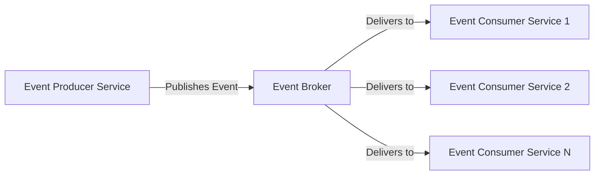
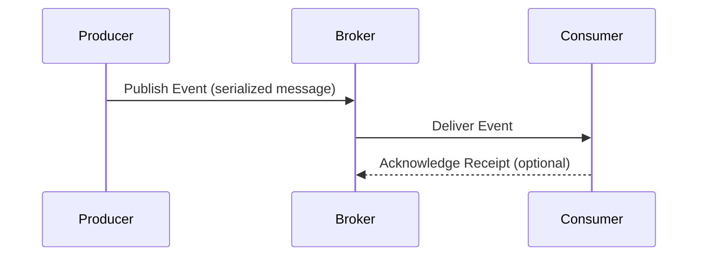
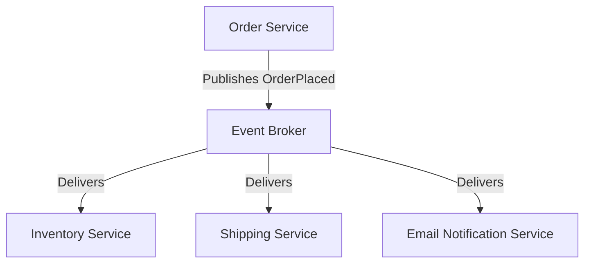
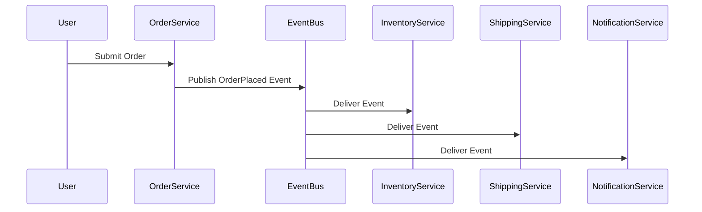

# Event-driven Architecture (EDA): Patterns and Characteristics

## 1. Introduction

**Event-driven architecture (EDA)** is a software design paradigm in which the flow of program execution and communication between decoupled components is determined by events: significant changes in state, triggered actions, or messages. While historically associated with user interfaces and GUIs, EDA has become a foundational style for distributed systems, microservices, cloud-native platforms, IoT backends, and high-throughput data processing pipelines.

EDA can be characterized as asynchronous, decoupled, and highly scalable, often realized through messaging and publish-subscribe (pub/sub) systems, and underpinned by protocols and standards such as MQTT, AMQP, Apache Kafka, and AsyncAPI.

## 2. Core Concepts and Terminology

### 2.1 Events

An **event** represents a state change or an occurrence of interest in a system, expressed in an immutable form (typically as a message or record). Events are self-descriptive and timestamped. Examples include:

- "OrderPlaced"
- "UserRegistered"
- "SensorThresholdExceeded"

Events are generally categorized as either:

- **Notification Events:** Indicate that something happened.
- **State Transfer Events:** Carry information required for the consumer to process the event.

### 2.2 Event Producers and Event Consumers

- **Event Producers:** Components that detect or create events and publish them into the system (e.g., service creating "OrderPlaced" events).
- **Event Consumers:** Components that react to published events by processing, transforming, or triggering subsequent actions (e.g., inventory updating upon order placement).

A single component may act as both producer and consumer.

### 2.3 Event Channels, Brokers, and Buses

- **Event Channel:** A logical conduit for event delivery (e.g., a queue or a topic).
- **Event Broker / Bus:** Middleware responsible for routing, filtering, and delivering events between producers and consumers. It may also offer durability, replay, fan-out, and guaranteed delivery.

**Common Brokers:** Apache Kafka, RabbitMQ (AMQP), NATS, AWS SNS/SQS.

### 2.4 Event Schema and Contracts

Reliable communication in EDA mandates strict definition of event data formats (“event contracts”). Schemas are commonly described using Avro, JSON Schema, Protobuf, or via AsyncAPI specifications.

### 2.5 Event Types

- **Transient Events:** Consumed and discarded after delivery (fire-and-forget).
- **Persistent Events:** Stored and available for late/joining consumers—supporting event sourcing or audit trails.

## 3. Architectural Patterns

EDA supports a variety of architectural patterns:

### 3.1 Simple Event Notification

- Producers publish events whenever changes occur.
- Consumers subscribe and react.
- No assumption of response/acknowledgement.

### 3.2 Event-Carried State Transfer

- Events carry full context, not just notification.
- Useful for eventual consistency and disconnected processing.

### 3.3 Event Sourcing

- Application state is derived solely from a replayable event log.
- Enables auditability and time-travel.

### 3.4 Command Query Responsibility Segregation (CQRS) with EDA

- Commands trigger state changes (and events).
- Query models are updated by consuming events, often via asynchronous processing.

### 3.5 Pub/Sub

- Multiple producers and consumers.
- One-to-many (“fan out”) or many-to-one relationships.

#### Mermaid Diagram: Generic Pub/Sub Event-Driven Architecture

### 3.6 Choreography vs. Orchestration

- **Choreography:** Components react independently to events, leading to emergent process flow.
- **Orchestration:** A central coordinator issues commands/events, dictating process flow (distinct from pure EDA).

## 4. How EDA Works in Practice

### 4.1 Event Publishing and Subscription

1. **Event Occurrence:** A producer detects a business-relevant change.
2. **Serialization:** Event data is converted to a message (structured as per schema).
3. **Publishing:** The producer sends the event message to the broker or event bus, typically via a REST API, SDK, or protocol.
4. **Routing:** The broker categorizes and routes the event (using topics, queues, keys, or attributes).
5. **Consumption:** Subscribed consumers receive and process the event.
6. **Acknowledgement:** Optional, depending on QoS/delivery guarantees.

#### Mermaid Diagram: Event Flow in EDA

### 4.2 Event Delivery Semantics

- **At-most-once:** Events may be lost but never delivered twice.
- **At-least-once:** Events may be repeated; consumers must be idempotent.
- **Exactly-once:** Events delivered once despite failures (difficult and costly).

> **Alert**
> Engineering Tip: Always design consumer logic for idempotence, as at-least-once is the most widely achieved guarantee.

### 4.3 Event Ordering

Maintaining strict event order (FIFO) is hard in distributed systems:

- Some brokers (like one Kafka partition) guarantee in-partition order; others do not.
- Out-of-order delivery may require consumers to buffer and reorder or design for eventual consistency.

### 4.4 Event Replay

Some EDA implementations allow replaying past events by retaining them in log form (event sourcing). This feature enables recovery, audit, and the ability for late-joining services to reconstruct state.

### 4.5 Event Retention and Durability

Brokers may offer mechanisms for persisting events:

- **Ephemeral channels:** No storage after delivery.
- **Durable channels/logs:** Events persisted for configurable windows (Kafka topics, Kinesis streams).

## 5. EDA Technology Stack

### 5.1 Protocols and Standards

- **MQTT (ISO/IEC 20922):** Lightweight pub/sub for IoT and unreliable networks.
- **AMQP (Advanced Message Queuing Protocol, ISO/IEC 19464):** Rich broker-to-broker and client-to-broker protocol, used by RabbitMQ.
- **Kafka Wire Protocol (Apache Kafka):** High-throughput distributed log, widely used in streaming data pipelines.
- **STOMP, HTTP Webhooks, WebSockets:** Alternative approaches for notifications.

> **Alert**
> Note: Ensure compatibility between producer and consumer stacks at protocol and payload levels.

### 5.2 Event Modeling and Specification

- **AsyncAPI Specification:** Open standard for documenting event interfaces in EDA, akin to OpenAPI for REST.
- **Schema serialization:** Avro, Protobuf, or JSON Schema.

### 5.3 Broker Implementations

- **Apache Kafka:** Distributed log system for high-throughput publish/subscribe.
- **RabbitMQ:** Classic queue-based messaging using AMQP.
- **NATS:** Lightweight, cloud-native, distributed messaging.
- **AWS SNS/SQS, Google Pub/Sub, Azure Event Grid:** Managed messaging platforms.

| Broker       | Delivery Model        | Protocol     | Event Retention          | Ordering          |
|--------------|----------------------|--------------|--------------------------|-------------------|
| Kafka        | Pub/Sub/Streams      | Kafka        | Log-based (configurable) | Partition-based   |
| RabbitMQ     | Queue/Exchange       | AMQP         | Queue-based (FIFO)       | Limited           |
| NATS         | Pub/Sub              | NATS         | Optional (JetStream)     | Best effort       |
| AWS SNS/SQS  | Topic/Queue          | HTTPS, SQS   | Varies (SQS durable)     | No guarantee      |
| MQTT Broker  | Topic-based Pub/Sub  | MQTT         | Typically non-persistent | No guarantee      |

## 6. EDA Patterns in Distributed Systems

### 6.1 Asynchronous Service Communication

EDA is a foundation for microservices communication, reducing coupling and scaling bottlenecks.

#### Mermaid Diagram: Microservices with Events

### 6.2 Event Choreography for Business Processes

Distributed workflows are frequently realized through emitting and reacting to domain events. For example, in an e-commerce platform:

- The Order Service publishes "OrderPlaced".
- Inventory Service, Shipping Service, and Notification Service independently subscribe and react.

### 6.3 IoT Telemetry Pipelines

Sensors/device gateways generate streams of events, which are ingested at scale by cloud services for storage, analytics, or actuation.

### 6.4 Real-time Analytics and Data Processing

EDA underpins streaming analytics (e.g., anomaly detection, aggregation) using platforms such as Apache Kafka, Apache Pulsar, or AWS Kinesis.

## 7. Key Engineering Considerations

### 7.1 Decoupling

- **Spatial Decoupling:** Producers and consumers need not be aware of each other's network addresses.
- **Temporal Decoupling:** Components do not need to be online simultaneously for event transfer.
- **Logical Decoupling:** Components rely on event contracts, not direct APIs.

### 7.2 Integration and Interoperability

- Define events via shared schemas; manage schema evolution carefully.
- Use adapter components (“event gateways”) to integrate legacy/non-event-based systems.

### 7.3 Performance, Scaling, and Throughput

- Brokers may become throughput bottlenecks; partitioning and horizontal scaling mitigate this.
- Avoid “event storms” (unbounded event generation); incorporate backpressure and throttling.

### 7.4 Reliability and Fault-tolerance

- Strive for at-least-once delivery; guarantee event durability (persistence) as required.
- Consider replay, dead-lettering, and error handling strategies.

### 7.5 Eventual Consistency

Distributed EDA-based systems are usually eventually consistent, not strongly consistent. Subsystems react to events asynchronously, and state converges over time.

> **Alert**
> Warning: Eventual consistency may surprise engineers expecting strongly-consistent transactional guarantees.

### 7.6 Idempotence and Duplicate Handling

At-least-once delivery leads to potential duplicates—engineers must ensure that consuming the same event multiple times is safe (idempotent handlers).

### 7.7 Observability and Debugging

- Correlate events using IDs for traceability (e.g., distributed tracing with event metadata).
- Log event flow and consumer outcomes for a consistent audit trail.

### 7.8 Security

- Authenticate publishers and subscribers.
- Validate event schemas to prevent malformed/bad-data attacks.
- Implement authorization at topic/queue/channel level.

### 7.9 Message Size and Granularity

- Tune event payload shape to avoid excessive chattiness or excessively large events.
- Avoid including sensitive or unnecessary data in event payloads.

### 7.10 Versioning and Evolution

- Use backward/forward-compatible event schemas.
- Clearly version event types to avoid compatibility issues during deployment and rollover.

## 8. Implementation Challenges and Pitfalls

- **Overusing EDA:** Not all workflows are suitable for event-driven processing; avoid forced adoption where simple request/response suffices.
- **Event Schema Drift:** Failure to version or document event contracts leads to incompatibility.
- **“Lost Event” Scenarios:** Insufficient durability or delivery guarantees can cause silent data loss.
- **Lack of Monitoring:** Events can be dropped or processed incorrectly without adequate observability.
- **Process Coordination:** Some business workflows require orchestration, which EDA alone cannot provide without added complexity.

## 9. Related Standards and Ecosystem

- **AsyncAPI:** Describes asynchronous event-driven interfaces, promoting reuse and interoperability.
- **MQTT:** ISO standardized, broker-based protocol for streaming events and telemetry.
- **AMQP:** Advanced Queuing protocol for brokered message flow, including priorities, transactions, and routing.
- **Apache Kafka:** De facto standard for distributed event streaming and log-based EDA.
- **Cloud-native Message Brokers:** Amazon SNS/SQS, Azure Event Grid, Google Pub/Sub—all provide managed event distribution.

## 10. Typical EDA Workflow Example

### Context

Suppose a retail web application uses EDA for new order processing.

#### Steps (with illustrative Mermaid sequence diagram):

1. **User places order** via Web UI.
2. **Order Service** creates a new order and publishes "OrderPlaced" event.
3. **Broker/Event Bus** delivers event to:  
   - Inventory Service (reserves products)  
   - Shipping Service (prepares fulfillment)  
   - Notification Service (email confirmation to customer)

> **Alert**
> Note: This style supports scaling, resilience, and significant flexibility. However, it also introduces complexity: late or missing events need explicit handling, and observing system state may require tracking multiple services.

## 11. Visualizing Event-Driven Systems

- **Message Flows:** Use sequence diagrams to visualize interactions.
- **Service Topology:** Flowcharts or system diagrams represent the event paths.
- **State Machines:** Express event-based state transitions in actors.

> **Note**
> Diagram to be added later: Example event contract (JSON schema) for an "OrderPlaced" event.

## 12. Summary: Strengths and Constraints

### Strengths

- **Asynchronous and Decoupled:** Reduces service dependencies.
- **Highly Scalable:** Patterns match elastic, distributed systems.
- **Supports Analytics and Reactivity:** Enables event log analysis, replay, and time-travel.
- **Natural Fit for IoT and Stream Processing:** Suitable for telemetry, sensor networks, and analytics.

### Limitations and Constraints

- **Complex Debugging and Traceability:** Asynchronous, distributed flows complicate reasoning.
- **Eventual Consistency, Not Strong Transactions:** State may lag behind reality.
- **Schema Governance is Mandatory:** Prevents drift or corruption.
- **Not Always Simpler:** May introduce cognitive burden for developers and operators.

## 13. Conclusion

Event-driven Architecture provides a robust framework for building responsive, scalable, and adaptable distributed systems. Understanding its patterns, delivery semantics, constraints, and practical considerations empowers software engineers to architect reliable event-based solutions appropriate to a wide variety of problem domains, from microservices backends to real-time analytics to the burgeoning Internet of Things landscape. Successful adoption hinges on robust event contract management, protocol interoperability, strong observability, and engineering discipline regarding consistency, fault tolerance, and integration boundaries.