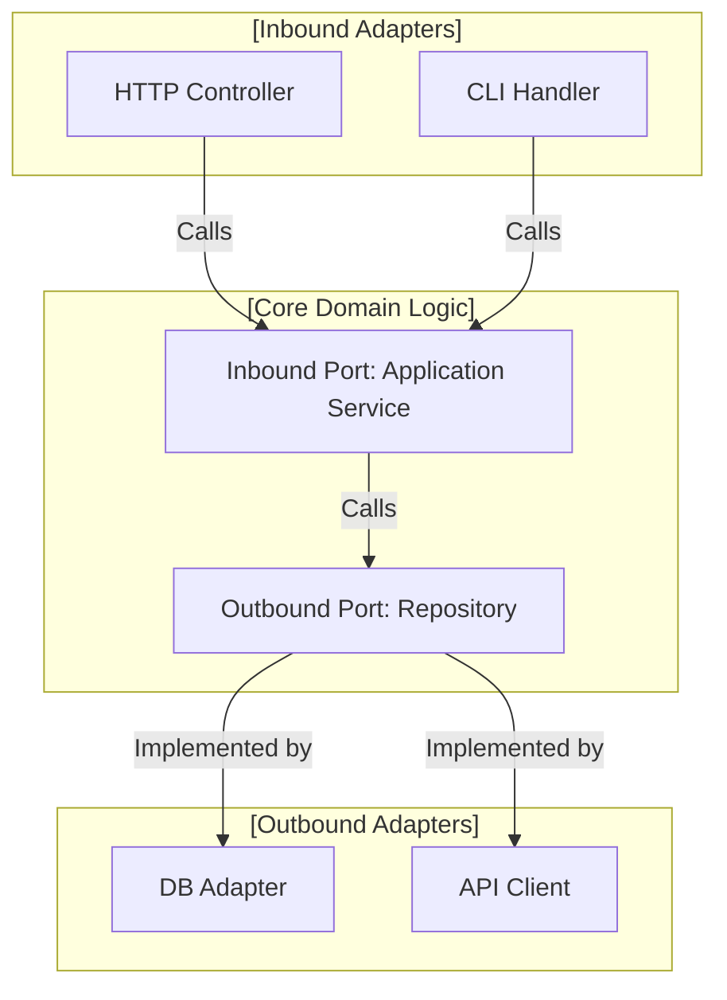
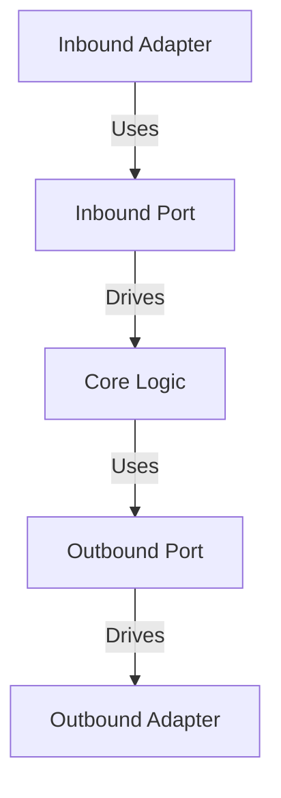
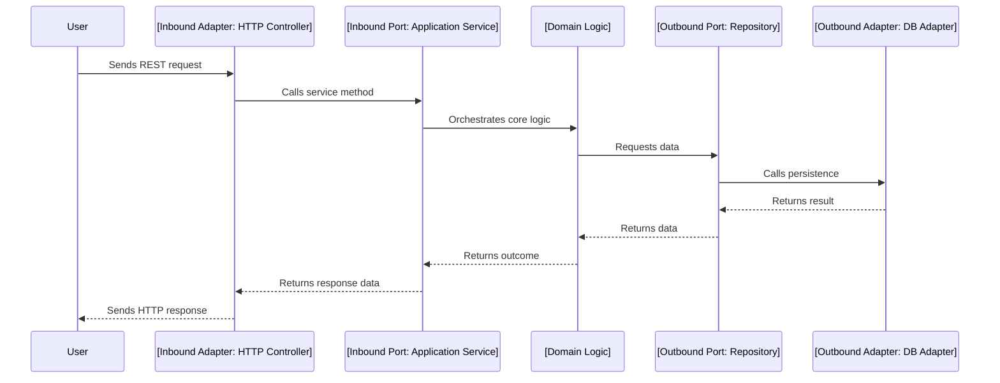
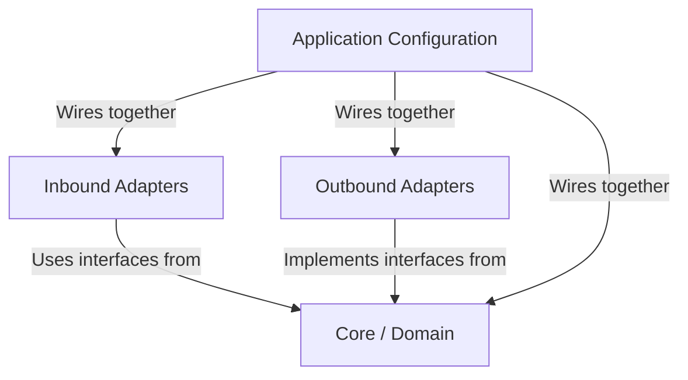
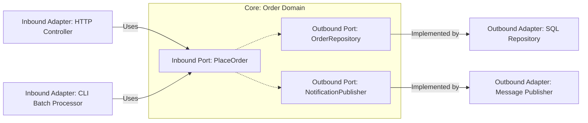

# Hexagonal Architecture

Hexagonal architecture, also known as the **ports and adapters** pattern, is a software architecture style developed to decouple the internal domain logic of an application from its external concerns. By structuring systems around clear boundaries, it facilitates adaptability to changing interfaces, ease of testing, and independence from frameworks, databases, and delivery mechanisms. Hexagonal architecture is particularly relevant to enterprise application engineering, distributed systems, and software designed for longevity and change.

## Technical Context and Motivation

Traditional layered architectures—such as the three-tier (presentation, business, data)—can lead to tightly-coupled systems, where concerns such as data access and user interfaces become entangled with core business logic. Hexagonal architecture was devised (by Alistair Cockburn in 2005) to address these limitations, especially in the context of domain-driven design, microservices, and testable core logic.

In hexagonal architecture, the system is modeled as a central domain surrounded by interchangeable “ports” (interfaces) and “adapters” (implementations). This explicit separation ensures that the internal application logic can evolve or be tested independently from external technologies, delivery mechanisms, and infrastructural concerns.

## Core Concepts

### 1. The Hexagon: Central Domain Application

- **Domain Logic**: Also called "application core" or "business logic," this is the heart of the application. It encapsulates domain-specific rules and behaviors.
- **No Direct Dependencies**: The core has no direct knowledge of how requests enter or results are presented/persisted.
- **Ports**: Abstract interfaces the application exposes or depends upon to interact with the outside world.

### 2. Ports

- **Definition**: Ports are explicit abstract interfaces that define how external agents interact with the application.
- **Types**:
  - **Inbound Ports** (Primary): Define the actions that can be performed on the application (e.g., service interfaces, commands, queries).
  - **Outbound Ports** (Secondary): Represent dependencies the application has on outside services (e.g., persistence, messaging).

**Key Principle:** Application logic depends on ports, not the concrete mechanisms.

### 3. Adapters

- **Definition**: Adapters are concrete implementations that link ports to real-world technologies.
- **Types**:
  - **Inbound Adapters**: Receive external input and map it to the corresponding port (e.g., HTTP controllers, command-line runners, UI event handlers).
  - **Outbound Adapters**: Implement outbound ports for real services (e.g., databases, external APIs, message brokers).

### 4. Side-by-Side Illustration

*Hexagonal Architecture Block Diagram: Separation Between Core, Ports, and Adapters*

## Architectural Structure

The term **hexagonal** is a metaphor: the application core can be visualized as a hexagon, even though any number of sides (interfaces) is possible. Each “side” symbolizes a distinct interaction point (port, adapter).

- The core domain is in the center.
- Ports define contract boundaries.
- Adapters sit outside, connecting the application to users, databases, external systems, or frameworks.

**Mermaid diagram to visualize overall shape:**

## Roles of Ports and Adapters

### Inbound Ports and Adapters

- **Inbound Port**: Defines application use cases (service interfaces or command/query handlers).
- **Inbound Adapter**: Receives input in a particular form (HTTP request, CLI, message) and translates it to call an inbound port.

### Outbound Ports and Adapters

- **Outbound Port**: Abstracts over required external capabilities (persistence, HTTP clients, etc.).
- **Outbound Adapter**: Concretely implements the outbound port, e.g., via a specific database or external service.

**GitHub Alert**
> **TIP:** By depending only on ports (interfaces), the domain logic can be reused in multiple environments or delivery channels (e.g., desktop UI, REST API, batch process) without code changes.

## Typical Workflows

### 1. Handling an Incoming Request

1. An **inbound adapter** receives input (e.g., REST API controller).
2. Translates and hands off the input to an **inbound port** (service interface).
3. **Core domain logic** processes the request, possibly invoking one or more **outbound ports** to retrieve/persist data or interact with external systems.
4. The **outbound adapters** concretely handle these operations (e.g., database access, external API calls).
5. The application returns a response, potentially translated again by the inbound adapter.

### 2. Testing the Core Logic

- **Primary benefit:** All adapters can be replaced by mocks or fakes for unit and integration testing.
- Test code calls inbound ports directly.
- Outbound ports are injected as test doubles, allowing verification of domain logic without external dependencies.

## Implementation Details and Variations

### Adapter Implementation Strategies

- Interfaces (ports) are usually defined in the core module/package.
- Adapters implement these interfaces and are supplied (“wired in”) via dependency injection or explicit configuration.
- *Note*: The hexagonal architecture can exist alongside frameworks (e.g., Spring, .NET) but requires careful inversion of control—framework code should never reside inside the core.

### Module and Package Organization

- **core**: Contains all domain logic, entity definitions, and port interfaces.
- **adapters/inbound**: Controllers, listeners, or handlers translating input for the core.
- **adapters/outbound**: Persistence, messaging, or integration with external systems.
- **config/bootstrap**: Application startup, dependency injection, and adapter wiring.

**Mermaid package diagram placeholder:**

### Extending the Pattern

- **Multiple Adapters per Port:** Multiple inbound or outbound adapters can be attached to the same port (e.g., both a REST and an event-driven inbound adapter).
- **Plug-in Style Extensibility:** New interaction mechanisms are added by providing new adapters; the core remains unchanged.

### Relation to DDD and Microservices

- **Domain-Driven Design (DDD):** Hexagonal architecture complements DDD by reinforcing the primacy of the domain model and its independence from concerns such as infrastructure or user interfaces.
- **Microservices:** The pattern suits microservices by isolating service logic from delivery and infrastructure, facilitating independent evolution, deployment, and testing.

## Practical Engineering Considerations

### Integration Points

- Well-defined port interfaces simplify integration, testing, and maintenance.
- Adapters become the natural place for external dependencies, translation layers, protocol handling, and error recovery.

### Performance Implications

- Layered indirection and abstractions may introduce minimal runtime overhead, but modern compilers/JVMs usually optimize away interface invocation costs.
- Adapter boundaries are ideal points for adding cross-cutting concerns (logging, monitoring, audit, retry).

### Implementation Challenges

- **Boundary Granularity:** Poorly chosen port definitions may lead to leaky abstractions or repetitive adapter code.
- **Over-Engineering:** Not all systems require strict application of this pattern; applying hexagonal architecture to trivial scripts may add unnecessary complexity.

**GitHub Alert**
> **WARNING:** Avoid designing ports that are “anemic” (pass-through) or simply mimic the shape of an adapter. Ports should be explicit contracts for application intent, not just technical facades.

### Common Pitfalls

- **Framework Leakage**: Allowing dependencies from the framework layer (e.g., HTTP, ORMs) into the core domain breaks modularity. Core modules must remain framework-agnostic.
- **Monolithic Ports**: Defining a single, God-object port interface (e.g., “ApplicationService”) is discouraged; define multiple, precise ports per use case or context.
- **Adapters Knowing Too Much**: Adapters should convert from external to internal representations, not encapsulate business logic.

### Typical Engineering Decisions

- Whether to use synchronous or asynchronous adapters at boundaries.
- The granularity of ports (per use case or per domain object).
- How to structure modules to enforce architectural boundaries.
- Testing strategies: units with mocks, integration tests with test adapters, acceptance tests with real adapters on test environments.

## Comparison with Related Styles

- **Layered Architecture**: Layers allow modularization but do not explicitly separate inbound/outbound interactions; dependencies often leak.
- **Clean Architecture (Onion Architecture)**: Very similar; “hexagonal” emphasizes the interface-based boundary, "clean architecture" elaborates on dependency rules and use case/application separation.
- **Service-Oriented**: Microservices focused on external APIs also benefit from hexagonal boundaries for implementation decoupling.

## Example: Applying Hexagonal Architecture

Suppose designing an order management microservice that must support:

- HTTP API for placing/getting orders
- CLI batch processing for daily reporting
- Orders persisted in a SQL database
- Notifications sent to an external message broker

The structure would be:

- Core order domain defining the business logic, request/response types, ports for placing orders and for persistence/notifications.
- Inbound adapters: HTTP controller, CLI handler, both calling the same inbound port.
- Outbound adapters: SQL repository, notification publisher, both wired to outbound ports.

**Mermaid example structure:**

## Constraints and Assumptions

- All communication with the core must occur via ports.
- The domain core has no knowledge of concrete external technologies.
- Adapters may depend on frameworks or libraries but must respect the direction of dependencies (pointing towards the ports).
- Usually, dependency injection is required for adapter wiring.

**GitHub Alert**
> **NOTE:** Dependency inversion is fundamental: interfaces are defined by the application, not external frameworks or technologies.

## Suggested Visuals

If useful for your context, consider system context diagrams that show adapters as plug-ins to the core hexagon, interaction sequence diagrams (for request flows), and dependency graphs that clarify allowed and forbidden dependencies.

**Note**
> Diagram to be added later: “Hexagon with multiple adapters (UI, DB, Messaging, Tests) shown as plug-ins.”

## Summary

Hexagonal architecture (ports and adapters) offers a formal, testable, and maintainable way to organize applications for longevity, adaptability, and clarity of responsibilities. By centering systems around domain logic, with strict boundaries expressed as ports and modular adapters, engineers can build software resilient to change in frameworks, protocols, and delivery mechanisms. This architectural style is especially relevant for complex business domains, microservice architectures, and teams intent on maximizing code reuse, testability, and independence from evolving technology stacks.

When implemented correctly, hexagonal architecture enables the creation of strongly decoupled, modular, and resilient systems—directly addressing widely encountered challenges in modern software engineering.