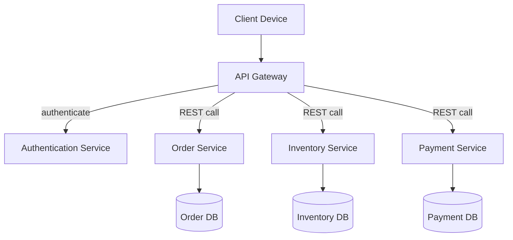
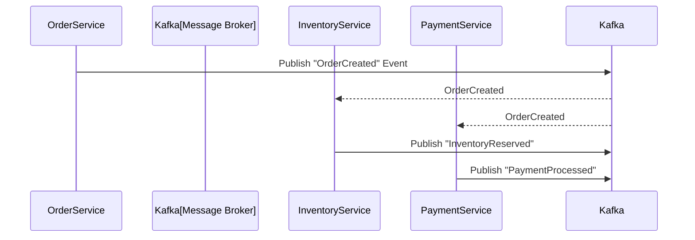
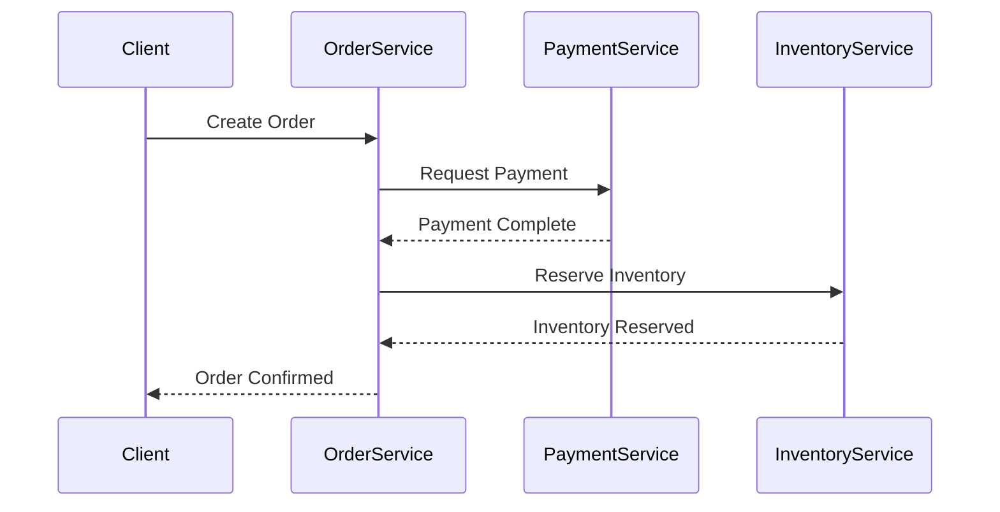
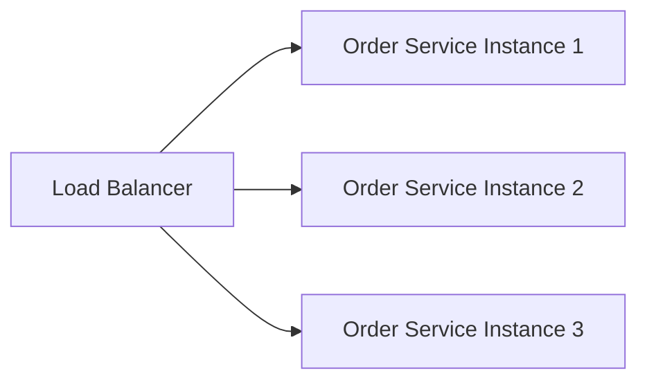
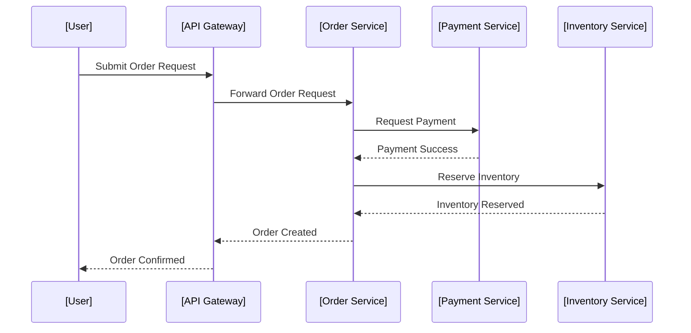

# Microservice Architecture: An Engineering Overview

## Introduction

Microservice Architecture is a software architectural style that structures an application as a collection of small, autonomous services modeled around a business domain. Each service is loosely coupled, independently deployable, and communicates over standard protocols, typically through lightweight APIs. This approach contrasts with monolithic architectures, in which all components and features are tightly integrated and deployed as a single unit.

Microservices have been widely adopted in the industry for building scalable, resilient, and maintainable distributed systems. They support rapid evolutionary change and align well with modern DevOps and continuous delivery practices.

---

## Core Concepts

### Service Decomposition

Microservices divide a large application into a set of small, distinct services. Each service is responsible for a single business capability. For example, in an e-commerce system, Inventory, Order Management, and Payment Processing might each be a separate microservice.

**Key characteristics:**

- **Single Responsibility:** Each service focuses on a specific business area.
- **Autonomy:** Services can be developed, deployed, scaled, and maintained independently.
- **Isolation:** Failures in one service are less likely to cascade organizationally or technically into others.

### Communication

Microservices interact primarily through well-defined APIs, over network protocols such as HTTP/REST, gRPC, or via asynchronous messaging systems.

**Key patterns:**

- **Synchronous** (e.g., RESTful calls, gRPC)
- **Asynchronous** (e.g., publish/subscribe, event-driven messaging systems)

### Technology Heterogeneity

Different services can be built using different programming languages, frameworks, or databases, provided they adhere to shared communication protocols and standards.

### Decentralized Data Management

Unlike monoliths with a single database, each microservice typically owns its data store and is responsible for its data persistence and queries.

---

## High-Level Architecture

The following Mermaid diagram illustrates a typical microservice-based system:

---

## Service Composition and Patterns

### Decomposition Strategies

- **By Business Capability:** Align services with bounded contexts (a DDD concept).
- **By Subdomain:** Particularly common when aligning with larger business units.

**Cautions:**

> :warning: **Caution**  
> Overly granular decomposition can lead to excessive inter-service communication, higher operational complexity, and latency.

### Service Integration Patterns

- **API Gateway pattern:** Single entrypoint for clients; routes, aggregates, and secures inbound requests to microservices.
- **Service Discovery:** Mechanism for dynamically locating service instances (e.g., via Service Registry).
- **Choreography:** Services react to events published by others; promotes loose coupling.
- **Orchestration:** Central coordinator (e.g., workflow engine) manages interactions between services.

---

## Communication Mechanisms

### REST/HTTP

The most common approach for synchronous request/response interactions. Typically conforms to HTTP, using standard verbs (`GET`, `POST`, etc.), media types (e.g., `application/json`), and status codes.

- **OpenAPI Specification:** Defines service contracts for REST APIs, enabling interoperability and automated documentation.

### gRPC

A high-performance, language-agnostic framework leveraging HTTP/2 and Protocol Buffers for schema definition. Suited for internal service communication where efficiency is critical.

### Event-Based Messaging

Used for asynchronous communication and eventual consistency, often implemented using technologies like Apache Kafka, RabbitMQ, or NATS.

#### Event-Driven Architecture Flow (Mermaid)

---

## Data Management and Consistency

### Decentralized Data Ownership

- Each microservice is responsible for its own persistence.
- Promotes decoupling, flexibility in schema evolution, and resilience.

### Distributed Transactions and Consistency

- **Two-Phase Commit (2PC):** Traditional method, rarely used due to complexity and tight coupling.
- **Eventual Consistency:** Services communicate state changes via domain events and synchronize asynchronously.
- **Saga Pattern:** Sequence of local transactions, coordinated using events or commands to achieve eventual consistency.

#### Saga Coordination (Mermaid)

---

## Scalability and Resilience

### Scaling Strategies

- **Independent Scaling:** Each service can be scaled horizontally or vertically according to its own resource requirements.
- **Stateless Design:** Stateless services can be easily replicated with load balancing.
- **Resilient Patterns:** Circuit Breakers, Bulkheads, Retry/Timeout logic protect against failures and overloads.

### Failure Isolation

- Component failures are contained, preventing system-wide outages.
- Employs health checks, self-healing, and failover mechanisms.

---

## DevOps Alignment and Continuous Delivery

- **Small Deployable Units:** Support for frequent releases and rapid iteration.
- **Automated Testing:** Test at the unit, integration, and contract levels.
- **Continuous Integration:** Each microservice can be built, tested, and deployed in isolation.
- **Containerization:** Technologies like Docker simplify environment consistency and service isolation.
- **Orchestration:** Kubernetes and similar platforms manage microservice lifecycle, scaling, and resilience.

---

## Observability and Monitoring

- **Centralized Logging:** Aggregates logs from all services for unified visibility.
- **Distributed Tracing:** Correlates requests across service boundaries (e.g., using OpenTracing, Zipkin, Jaeger).
- **Metrics and Alerts:** Enables proactive detection of failures, anomalies, and performance degradation.

> :bulb: **Tip**  
> Implement correlation IDs in API calls and event payloads to facilitate end-to-end traceability.

---

## Security Considerations

- **Authentication and Authorization:** Centralized via API Gateway or implemented per service. Common protocols include OAuth 2.0 and OpenID Connect.
- **Transport Security:** Enforce TLS/SSL for service-to-service and client-to-service communication.
- **Least Privilege:** Services should access only the resources required.

> :warning: **Caution**  
> Avoid sharing database credentials or configuration secrets between services. Use secure secrets management mechanisms (e.g., HashiCorp Vault, Kubernetes Secrets).

---

## Versioning and Backward Compatibility

- **API Versioning:** Necessary to prevent breaking changes from disrupting consumers.
- **Schema Evolution:** Design events and data contracts to be forward- and backward-compatible whenever possible.

---

## Common Pitfalls and Engineering Trade-Offs

- **Distributed Complexity:** Network latency, partial failures, and eventual consistency increase system complexity.
- **Overhead Cost:** Operating many services may increase monitoring, deployment, and operational effort.
- **Testing Challenges:** End-to-end testing becomes more complex; test automation and sandbox environments are critical.
- **Data Management:** Distributed queries, reporting, and analytics require specialized approaches (e.g., data aggregation, event sourcing).

---

## Governance and Standards

- **Standardized APIs:** Use OpenAPI or gRPC IDL to specify contracts.
- **Schema Registries:** Ensure event formats (e.g., Avro, Protobuf) are registered and versioned.
- **Service Catalogs:** Maintain metadata and documentation for service endpoints, health, and usage.

---

## Architectural Variants

### Service Mesh

An infrastructure layer for service-to-service communication. Handles cross-cutting concerns (e.g., routing, observability, security) outside the application code. Examples: Istio, Linkerd.

### Serverless Microservices

Functions as a Service (FaaS) implement microservice patterns at function granularity, further abstracting infrastructure management.

### Hybrid Approaches

Some architectures blend monolithic and microservice elements (e.g., "modular monolith" or "strangler" patterns) to facilitate progressive migration.

---

## Example Workflow: Placing an Order

---

## Summary Table: Microservice vs Monolithic Architecture

| Characteristic      | Microservice Architecture          | Monolithic Architecture         |
|---------------------|-----------------------------------|-------------------------------|
| Service Scope       | Small, single-responsibility      | Entire application            |
| Deployment Unit     | Independent service               | Entire system                 |
| Data Management     | Decentralized, per service        | Centralized, shared           |
| Technology Stack    | Heterogeneous, per service        | Homogeneous                   |
| Scalability         | Per service                       | Whole application             |
| Failure Isolation   | High                              | Low                           |
| Operational Overhead| High                              | Lower                         |
| Testing Complexity  | High (system integration tests)   | Lower (fewer moving parts)    |

---

## Engineering Considerations

- **Integration Points:** Clearly define API contracts and data exchange formats; automate compatibility checks.
- **Performance:** Optimize serialization formats and minimize dependencies on synchronous interactions.
- **Implementation Challenges:** Invest in automation for deployment, monitoring, and recovery.
- **Team Structure:** Multidisciplinary teams may own services end-to-end.
- **Governance:** Foster alignment on standards, naming, and observability across teams.

---

## Conclusion

Microservice Architecture represents a powerful paradigm for constructing distributed systems that achieve modularity, scalability, and rapid delivery. Proper adoption requires careful attention to service boundaries, operational automation, and robust patterns for communication, data management, and observability. While the complexity increases compared to monolithic approaches, the benefits of agility, fault isolation, and scalability are substantial when engineered thoughtfully.

> :warning: **Note**  
> Transitioning to microservices should be guided by business needs, system complexity, and organizational readiness. Starting with clear boundaries and strong engineering practices is essential for success.