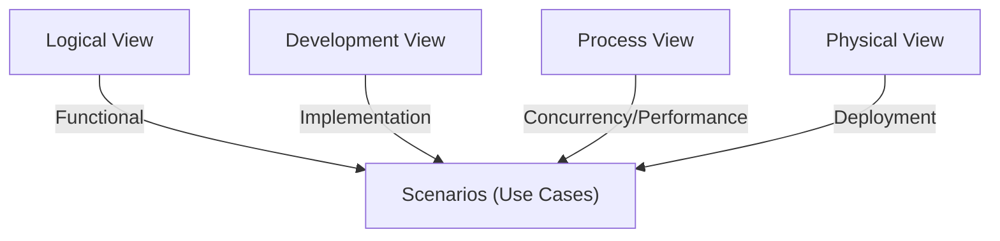
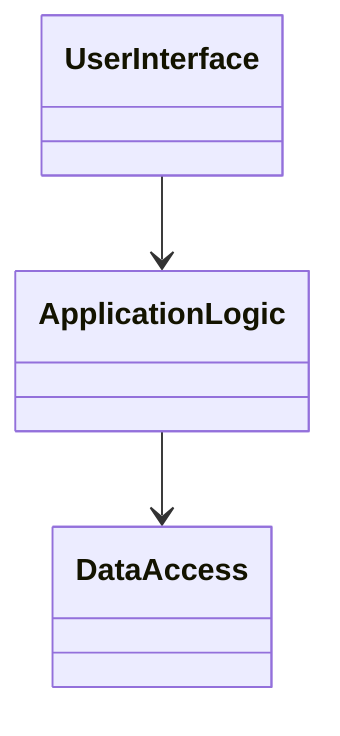
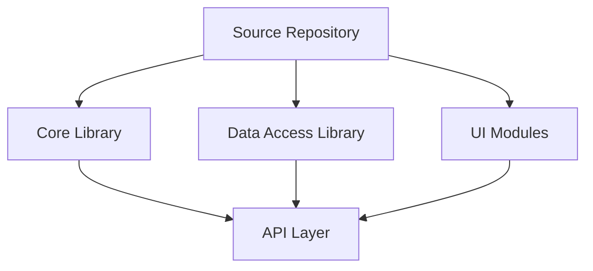
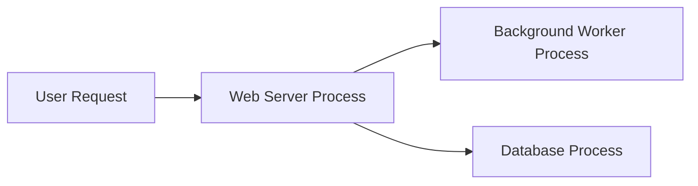
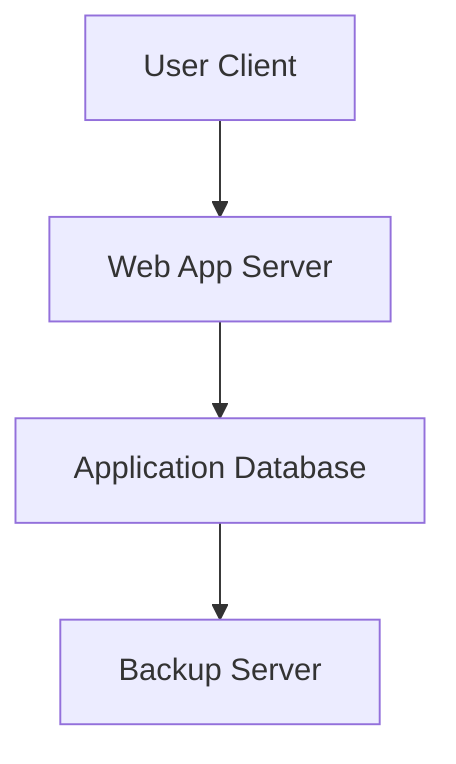
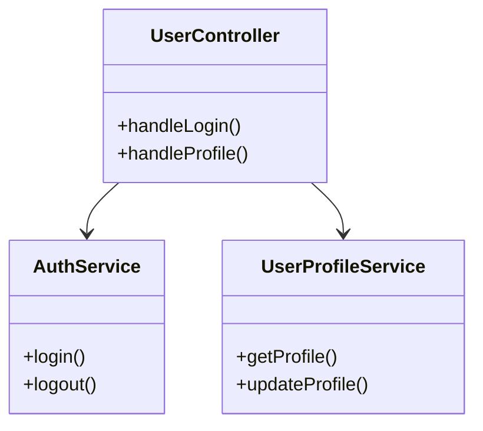
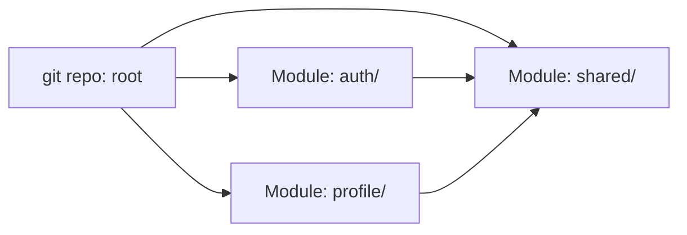
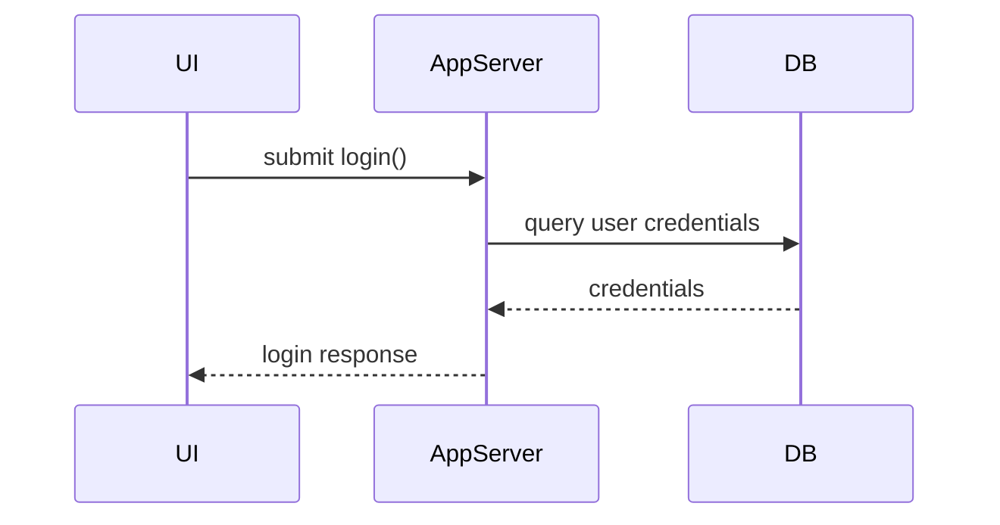

# Introduction

Software architecture views constitute a set of methods, guidelines, and perspectives for representing complex software systems in a structured and comprehensible manner. Given the inherent complexity and multifaceted nature of modern software architectures, it is neither practical nor effective to capture all structural and behavioral details in a single unified diagram or description. Instead, an architect employs distinct “views”—each tailored to address the specific concerns of different stakeholders such as developers, operations, management, and end-users.

This document introduces the principal architecture views: logical, development, process, and physical. It discusses their motivations, constituents, relationships, associated artifacts, practical workflows, and potential pitfalls, referencing relevant standards including ISO/IEC/IEEE 42010. The aim is to provide software engineers with a rigorous framework for understanding, creating, and navigating multiple complementary representations of system architecture.

# The Role and Purpose of Architecture Views

## Context and Definition

**Architecture views** are abstractions or representations of a software system, each emphasizing particular concerns and aspects relevant to specific stakeholders. The primary role of these views is to present manageable perspectives of complex systems, each with its own vocabulary, notation, and focus.

The foundational reference for this approach is the “4+1” view model of architecture, as proposed by Philippe Kruchten, and formalized in standards such as ISO/IEC/IEEE 42010 (“Systems and software engineering — Architecture description”). The standard defines an **architecture view** as representing a system from the perspective of related concerns, and as being constructed according to an architectural viewpoint.

> **Key Principle:**  
> No single view can fully express the architecture; it is the combination of views that provides a comprehensive architectural description.

## Essential Benefits

- Enabling **separation of concerns**: Each view isolates aspects such as functionality, deployment, concurrency, and development organization.
- Increasing **clarity and communicability**: Stakeholders engage with representations meaningful to their roles.
- Supporting **traceability**: Changes in one view can be mapped to impacts on others.
- Reducing **ambiguity** and **misinterpretation**.
- Assisting with **compliance** and **review** processes by formally structuring information.

# Overview of the Main Views

The classic “4+1” view model identifies four base architectural views, plus scenarios to verify and illustrate the system. This primer focuses on the four principal views:

1. **Logical View**
2. **Development (Implementation) View**
3. **Process View**
4. **Physical (Deployment) View**

Each of these addresses different stakeholder concerns and answers different architectural questions.



## Logical View

### Purpose

The logical view represents the system’s functionality in terms of the major components (modules, classes, subsystems) and their relationships. It serves as the primary vehicle for describing *what* the system is required to provide, abstracted from implementation details.

**Primary Stakeholders:** End-users, analysts, architects, and developers.

**Key Concerns:**
- Functional requirements
- Major abstractions
- Responsibilities and collaborations

**Common Artifacts:**
- Class diagrams
- Object diagrams
- Package/module diagrams

**Typical Notations:** UML (Unified Modeling Language), SysML, blocks/boxes-and-lines.



**Description:**  
This diagram illustrates a high-level logical decomposition into `UserInterface`, `ApplicationLogic`, and `DataAccess` components with directed associations.

## Development (Implementation) View

### Purpose

The development view, sometimes called the implementation or module view, focuses on the dynamic structure and organization of the software in the development environment. It showcases *how* the system is constructed from modules, packages, components, libraries, and source code artifacts.

**Primary Stakeholders:** Programmers, build engineers, maintainers.

**Key Concerns:**
- Modular organization of source code
- Dependency management
- Unit-level development and testing boundaries

**Common Artifacts:**
- Component diagrams
- Package structure diagrams
- Dependency graphs
- Layered (tiered) architecture diagrams

**Typical Notations:** UML component/package diagrams, dependency trees.



**Description:**  
This diagram shows a sample module dependency structure as captured in a version control repository: `Repo` contains and builds three internal libraries/modules, all of which provide or use an `API Layer`.

## Process View

### Purpose

The process view models the system’s dynamic aspects, especially concerns tied to concurrency, parallelism, communication, synchronization, and runtime behavior. It details *how* the system’s runtime processes and threads interact, coordinate, and scale.

**Primary Stakeholders:** Performance engineers, system designers, DevOps, testers.

**Key Concerns:**
- Concurrency and parallelism
- Inter-process communication
- Runtime scaling and fault tolerance
- Synchronization and deadlock avoidance

**Common Artifacts:**
- Process/task diagrams
- Communication diagrams
- Sequence diagrams
- State diagrams

**Typical Notations:** UML sequence/activity/state diagrams, thread/process blocks with communications.



**Description:**  
This diagram models user requests arriving at a `Web Server Process`, which delegates operations to a `Background Worker` and interacts with a `Database Process`, illustrating concurrency and interprocess communication.

## Physical (Deployment) View

### Purpose

The physical or deployment view describes the physical arrangement of the system's software artifacts on hardware nodes and communication infrastructure. This view answers *where* the system’s components reside and how they are deployed for execution.

**Primary Stakeholders:** Operations, infrastructure engineers, network architects.

**Key Concerns:**
- Mapping of software elements to hardware
- Network topology and communication routes
- Redundancy, fault tolerance, and performance
- Security zoning and access considerations

**Common Artifacts:**
- Deployment diagrams
- Network topology diagrams
- Infrastructure configuration charts

**Typical Notations:** UML deployment diagrams, infrastructure diagrams using boxes/lines for servers and connections.



**Description:**  
Here, the deployment view represents how a user’s client connects to a `Web App Server`, which in turn interacts with an `Application Database` that is regularly backed up by a `Backup Server`.

# Relationships Between Views

Views offer **orthogonal perspectives** that overlap in artifacts (for example, a class/module may appear in both logical and development views), but are mapped and maintained independently. Consistency and traceability across views are critical for architectural soundness.


> :warning: **Caution:**  
> Inconsistent or outdated mappings between views are a common cause of architectural drift and confusion.

# Integrating Views in Practice

## Workflows and Documentation Practices

Effective architecture documentation leverages structured view-based analysis and description. Some best practices include:

- **Early storyboarding**: Use informal sketches to explore all four views as early as possible.
- **Incremental refinement**: Begin each view with coarse-grained elements, iteratively decomposing as fidelity increases.
- **Mapping and cross-referencing**: Maintain explicit mappings (via traceability matrices or cross-links) between elements in different views.
- **Stakeholder engagement**: Adapt the detail and formality of each view to its primary consumers.

**Tooling:**  
Many modeling and documentation tools, such as Enterprise Architect, Modelio, PlantUML, and Structurizr, provide explicit support for multi-view architecture documentation. Some, such as the arc42 Template and ISO/IEC/IEEE 42010-based approaches, prescribe formal episode/section structures for each view.

## Typical Constraints and Assumptions

- **Evolution:** Views are living documents; they require ongoing alignment as requirements, code, and infrastructure evolve.
- **Granularity:** Excessive detail in any view can obscure its purpose; conversely, too little detail renders it useless for engineering work.
- **Stakeholder focus:** The level of abstraction, vocabulary, and notation should be chosen for the target audience of each view.

> :bulb: **Tip:**  
> Foster a culture of architectural ownership where every contributor understands the view corresponding to their area of responsibility.

# Detailed Examples of View Artifacts

## Logical View Example



**Explanation:**  
This class diagram models core system services (authentication and profile management) and their relationship to a controller. It abstracts away lower-level implementation details.

## Development View Example



**Explanation:**  
The repository hosts three modules: authentication, profile, and shared utility code, with dependencies illustrated by arrows.

## Process View Example



**Explanation:**  
This sequence diagram traces interactions for a login operation across UI, server, and database processes.

## Physical (Deployment) View Example

```mermaid
graph LR
    MobileClient[Mobile App Client]
    APIGateway[API Gateway]
    AppServers[App Servers (Cluster)]
    MainDB[Main Database]
    AnalyticsNode[Analytics Node]

    MobileClient --> APIGateway
    APIGateway --> AppServers
    AppServers --> MainDB
    AppServers --> AnalyticsNode
    AnalyticsNode --> MainDB
```

**Explanation:**  
Depicts deployment across mobile clients, an external API gateway, a cluster of application servers, and specialized database/infrastructure nodes.

# Common Pitfalls and Engineering Considerations

## Pitfalls

- **Inadequate separation between views:** Overlap or confusion between the logical and development views can muddle design rationale.
- **Stale documentation:** Failure to update architectural views as the system evolves leads to misalignment and technical debt.
- **Over-specification:** Attempting to capture every detail in every view is counterproductive; focus on what is architecturally significant.
- **Ignoring runtime scenarios:** The process view is often neglected, risking poor performance and scalability outcomes.
- **Neglecting security and deployment details:** Skipping the physical view can mask vital concerns around redundancy, fault tolerance, and attack surface.

## Practical Engineering Considerations

- **Integration Points:** Clearly show external interfaces, third-party services, and APIs in both logical and physical views.
- **Performance Implications:** Use the process view to evaluate bottlenecks, latency, and patterns such as load balancing, and horizontal scaling.
- **Implementation Challenges:** Complex mapping between logical modules and physical deployment (such as containerized microservices) warrants explicit notation.
- **Common Variations:** Some architectures require customizing or extending classic views (e.g., adding a security view, data view, or regulatory view).

> :warning: **Warning:**  
> Do not rely solely on automatically generated diagrams or code documentation tools. Human-curated architecture views provide vital context, rationale, and intent not present in code.

# Standards and Specifications

- **ISO/IEC/IEEE 42010:** Defines architecture descriptions, views, and viewpoints for system and software engineering.
- **UML (Unified Modeling Language):** Industry-standard notation for expressing architectural elements in all four views.
- **Other Frameworks:**  
    - arc42 Template formalizes views within an architecture documentation structure.
    - The C4 Model provides a modern approach to context, container, component, and code views—complementary to the classic 4+1 model.

# Extensions and Complementary Models

While the “4+1” view model is the standard reference, specialized projects sometimes require additional perspectives:

- **C4 Model:** Replaces and refines the logical view hierarchy (context, container, component, code).
- **Data View:** Focus on data flows, schemas, persistence, and transformation pipelines.
- **Security View:** Exposure of threat models, trust boundaries, and controls.

> :information_source: **Note:**  
> For highly regulated domains (e.g., medical, finance), it is common to add regulatory and compliance-specific views to the architecture documentation.

# Summary

Software architecture views provide a vital structured approach to documenting, analyzing, and communicating complex systems. By employing the logical, development, process, and physical views, engineers are able to disentangle system complexity, address stakeholder needs, and ensure traceable, evolvable, and robust architecture decisions.

To maximize their value:
- Maintain clear boundaries and mapping between views.
- Select the appropriate level of detail for each view.
- Regularly review and update all views throughout the software lifecycle.
- Use appropriate notations and tools that enable collaboration and ease of understanding.

As systems continue to grow in size and complexity, view-oriented architecture description remains a cornerstone best practice for effective software engineering.