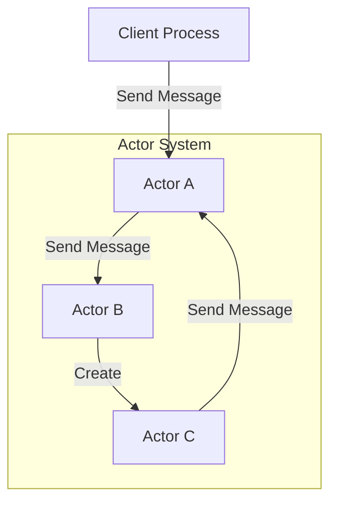
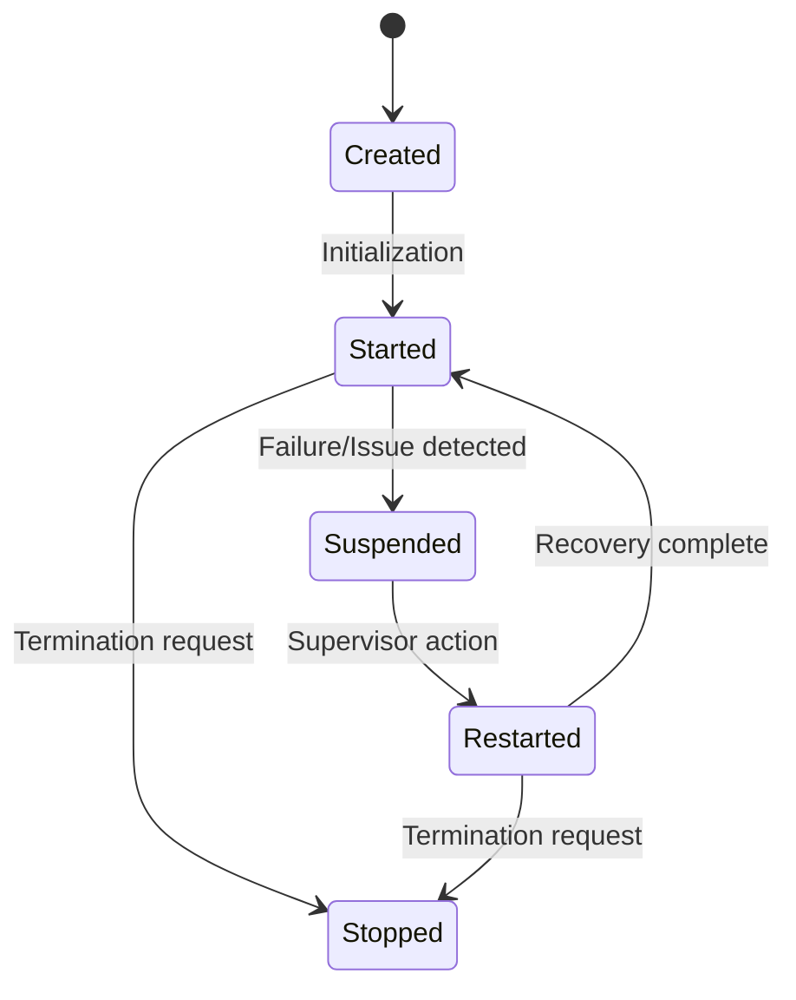
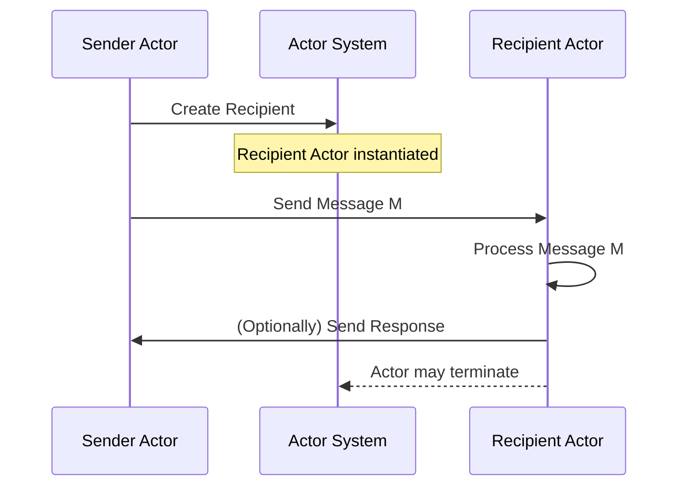
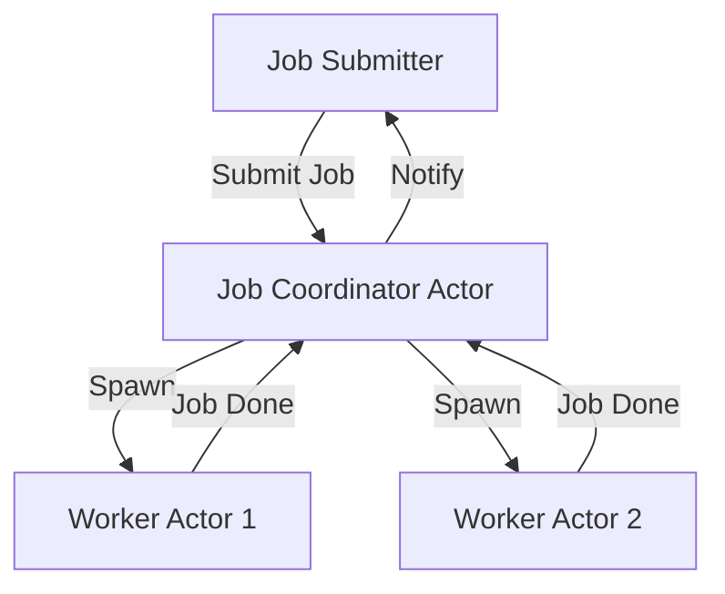
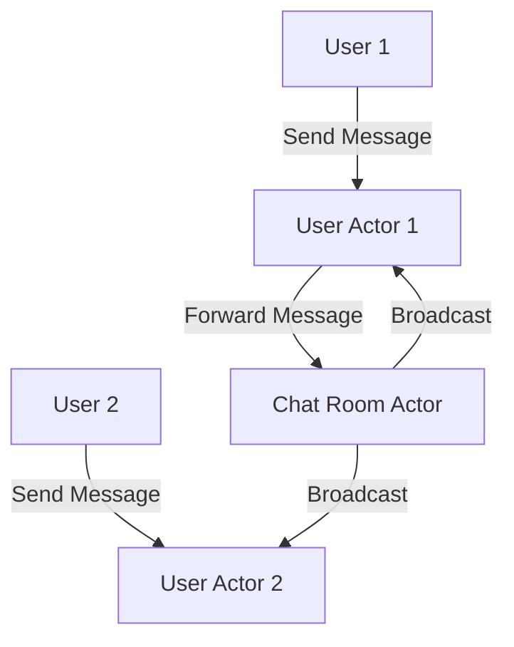

# Actor Model: A Technical Primer

## Introduction

The Actor Model is a fundamental theoretical framework for designing and reasoning about concurrent computation. It describes a system where computation is encapsulated into entities called **actors**, each of which operates independently and interacts exclusively via asynchronous message passing. This paradigm supports decomposition of complex systems into small, reusable, and independent components, providing a robust structure for building distributed and scalable applications.

Originally introduced by Carl Hewitt, Peter Bishop, and Richard Steiger in 1973, the Actor Model has since influenced a wide range of programming languages, frameworks, and architectures—especially those addressing large-scale, concurrent, and distributed systems.

## Context and Motivation

Computing systems are increasingly concurrent and distributed. Traditional approaches to concurrency, such as shared-memory threads and locks, are error-prone and difficult to scale due to race conditions, deadlocks, and visibility problems. The Actor Model provides an alternative paradigm, offering these core benefits:

- **Isolated state**: No shared state between actors by design, mitigating race conditions.
- **Asynchronous interaction**: Non-blocking message passing, decoupling senders and receivers.
- **Location transparency**: Actors can interact regardless of whether they reside on the same machine or a network apart.

These characteristics make the Actor Model well-suited for highly concurrent, resilient, and scalable systems.

## Core Concepts

### Definition of an Actor

An **actor** is a fundamental unit of computation in the model. Each actor is defined by three capabilities:

1. **Receive a message**: Process one message at a time from its mailbox.
2. **Send a finite number of messages**: To other actors, including itself.
3. **Create new actors**: Instantiate further actors.
4. **Designate a new behavior**: Define how to process the next message.

Each actor is uniquely identified (typically via an address or reference).

### Isolation and State

Actors encapsulate private state, which cannot be directly accessed or modified by other actors. State changes are only possible through message processing, which enforces encapsulation and minimizes side-effects.

### Message Passing

Interaction between actors occurs exclusively via asynchronous messages; the sending actor does not block or wait for a response. Message delivery order between two actors is guaranteed, but not globally consistent across all actors.

### Actor System and Hierarchy

Actor systems manage actors' lifecycle and supervision. Actors can form hierarchies, with actors spawning (and usually supervising) child actors. Supervision strategies define how failures are handled—by restarting, resuming, stopping, or escalating the errors of child actors.

### Key Properties

| Property        | Description                                          |
|-----------------|------------------------------------------------------|
| Encapsulation   | Actors' state is not shared, only accessed locally.   |
| Asynchrony      | All communications occur via asynchronous messages.   |
| Location transparency | Sender does not need to know the receiver's context or location. |
| Fault tolerance | Supervision hierarchies enable resilient systems.     |
| Scalability     | Suitable for distributed and parallel architectures.  |

## Architecture and System Overview

A typical actor-based system is illustrated below:

**Description:**  
Actors communicate using messages through the actor system. Actor A receives messages from a client, interacts with Actor B (possibly spawning Actor C), and messages can flow bidirectionally.

## Actor Lifecycle

Actors transition through different lifecycle states:

- **Created**: Spawned by another actor or system.
- **Started**: Ready to receive messages.
- **Suspended**: Temporarily stopped (usually during supervision).
- **Restarted**: Recreated after failure, with optional state recovery.
- **Stopped/Terminated**: No longer processes messages.

## Message Delivery Semantics

- **Asynchronous delivery:** No blocking; the sender does not wait.
- **Best effort:** The system tries to deliver messages but does not guarantee delivery (unless explicitly implemented).
- **Fair queuing:** Mailboxes (actor queues) maintain message order per sender.

Some implementations add **at-most-once** or **exactly-once** delivery semantics, though these are not guaranteed by the model itself.

> **Note**
> Delivery guarantees (such as reliable, ordered, or exactly-once delivery) are implementation-specific and not enforced by the Actor Model specification.

## Typical Workflows

### Actor Creation and Messaging

1. **Actor Creation:** An actor is instantiated, either explicitly by the system or by another actor.
2. **Message Sending:** Actors communicate by sending messages, enqueuing them in the recipient's mailbox.
3. **Message Processing:** The recipient processes messages sequentially, updating its internal state or creating/sending further messages.
4. **Actor Termination:** Actors may terminate voluntarily or by supervision.

## Variations and Implementation Strategies

### Supervision Strategies

Supervisors are actors responsible for monitoring child actors and taking corrective action on failures. Supervision strategies include:

- **One-for-one:** Only the failed child is affected.
- **One-for-all:** All children are affected by a single failure.
- **Escalate:** Supervisor escalates failure to its own supervisor.

### Actor Patterns

- **Stateless actors:** No persistent state between messages.
- **Stateful actors:** Maintain mutable state updated per message.
- **Router actors:** Dispatch messages among a group of actors for load balancing or parallelism.

### Actor Placement and Distribution

Actors can exist on a single node or be distributed across multiple machines. The model enables transparent distribution, simplifying design of geographically distributed systems.

> **Caution**
> Network-partitioning, message volatility, and latency must be addressed by actor frameworks or the application design itself in distributed actor systems.

## Assumptions and Constraints

- **No mutable shared state:** All communication goes through defined message interfaces.
- **Messages are immutable:** To avoid race conditions and maintain consistency.
- **One-at-a-time processing:** Each actor processes one message at a time, sequentially.
- **No implicit ordering:** Unless ensured by the underlying implementation, only sender-to-recipient message order is typically preserved.

## Practical Engineering Considerations

### Integration Points

- **APIs and Protocols:** Actor-based libraries and frameworks often expose APIs for actor creation, messaging, and supervision (e.g., Akka for Java/Scala, Erlang/OTP).
- **Service boundaries:** Actors are suitable for microservices and event-driven system boundaries.

### Performance and Scalability

- **Lightweight actor instantiation:** Most frameworks provide lightweight actors, often implemented as green threads or coroutines.
- **Mailboxes and throughput:** The structure and size of actor mailboxes—and backpressure strategies—significantly affect system throughput.
- **Parallelism:** Number of logical actors is not restricted, but concurrency is often limited by the number of threads or processing cores.

> **Tip**
> Tune mailbox sizes, actor hierarchies, and supervision strategies carefully to avoid bottlenecks and maximize resilience.

### Common Pitfalls

- **Unbounded growth:** Dynamic actor creation without bounds may exhaust system resources.
- **Message loss:** Asynchronous, unreliable delivery may lead to dropped messages (unless managed explicitly).
- **Complex error handling:** Incorrect supervision hierarchies can cause cascading failures.

### Implementation Challenges

- **Distributed coordination:** Achieving exactly-once delivery, consistent state, and failure recovery across nodes is challenging and often expensive.
- **Debugging and monitoring:** Asynchronous and distributed nature of actor systems makes tracing and diagnosing issues nontrivial.
- **Backpressure management:** Systems must deal with slow actors or overloaded mailboxes to prevent resource exhaustion.

## Architecture Examples in Practice

### Example: Distributed Job Processing System

Actors manage job submission, job distribution to worker actors, aggregation of results, and notification upon completion. Supervision ensures failed workers are restarted automatically.

### Example: Resilient Chat System

Here, each user is represented by an actor, and chat rooms are implemented as actors to manage group conversations and broadcast messages safely.

## Comparison to Other Concurrency Models

| Concurrency Model         | Key Concept                   | State Sharing           | Synchronization   | Suitability            |
|--------------------------|-------------------------------|-------------------------|-------------------|------------------------|
| Shared-memory threads    | Mutable shared memory          | Yes                     | Requires locks    | CPU-intensive, complex |
| Message passing (actors) | Isolated, autonomous actors    | No                      | Message queues    | Distributed systems    |
| CSP (Go channels, etc)   | Communicating sequential processes | Restricted, via channels| Channels/select   | Pipeline processing    |
| STM                      | Software transactions over memory| Yes                    | Transactions      | Coordinated updates    |

## Standards and Protocols

While there is no official standards body for the Actor Model, several systems implement the model according to foundational papers and community conventions. Reference implementations include:

- **Erlang/OTP:** Native actor-based runtime for scalable, concurrent systems.
- **Akka:** Actor-based toolkit for JVM languages, following the *Reactive Manifesto*.
- **CAF (C++ Actor Framework):** C++ implementation for distributed & concurrent systems.
- **Microsoft Orleans:** Virtual Actor Model for cloud applications.

> **Note**
> No RFC precisely standardizes the Actor Model, but the model is formalized in the literature (See "A Universal Modular ACTOR Formalism for Artificial Intelligence" by Hewitt, Bishop & Steiger, 1973).

## Design Patterns and Usage

### Typical Use Cases

- **Telecommunications switches** (e.g., implemented in Erlang)
- **Distributed web services and microservices**
- **Real-time analytics and stream processing**
- **Games and simulations** (entity systems)
- **IoT device orchestration**

### Design Patterns

- **Supervisor trees:** For fault tolerance via actor hierarchies.
- **Router actors:** To balance workload.
- **Persistent actors:** Log state changes/messages for fault recovery (event sourcing).

### Key Decisions

- **Actor granularity:** Coarse-grained vs. fine-grained actors impact both resilience and performance.
- **Failure-handling strategies:** Restart, escalate, ignore, or custom error recovery.
- **Distribution and placement:** Co-location for low latency, cross-node for resilience.

## Security Considerations

- **Isolation:** Limits impact of compromised actors but does not enforce security per se.
- **Authorization:** Message interfaces can enforce access controls.
- **Denial of service:** Malicious actors can overload others; rate-limiting and quota management are advised.

> **Warning**
> Actor systems do not provide security guarantees by default; always combine with authentication, authorization, and secure communication practices.

## Summary

The Actor Model offers a robust foundation for building concurrent and distributed applications. Its focus on isolated state, asynchronous messaging, and supervision hierarchies enables the construction of reliable, scalable, and maintainable systems while sidestepping many complexities of thread-based concurrency. Understanding its design patterns, message semantics, engineering trade-offs, and practical implications is essential for leveraging the model in modern software systems.

---

**Diagram to be added later:**  
- Example of complex supervision trees with multiple failure scenarios.

> **Note**
> For further information, refer to authoritative actor-based system documentation and foundational academic papers (Hewitt et al., 1973).