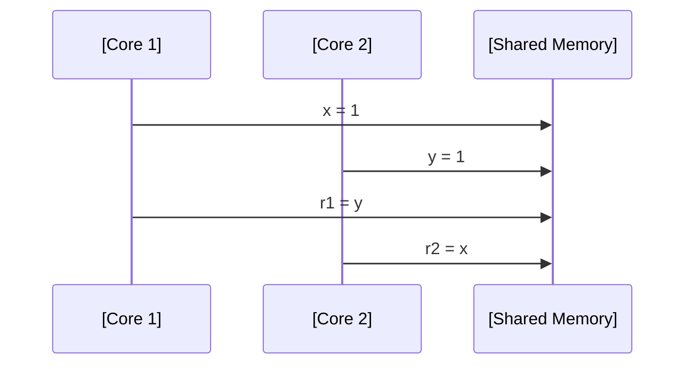
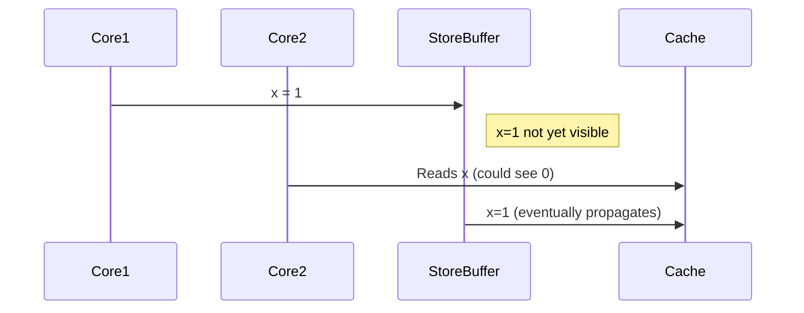
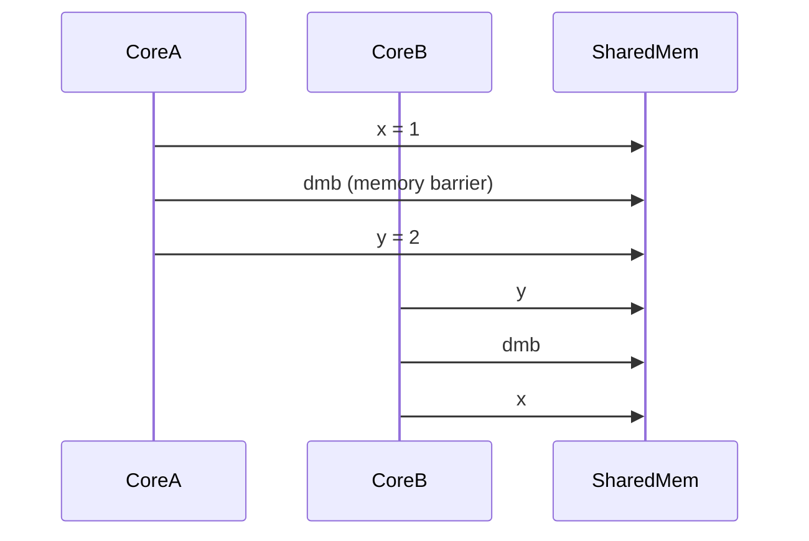
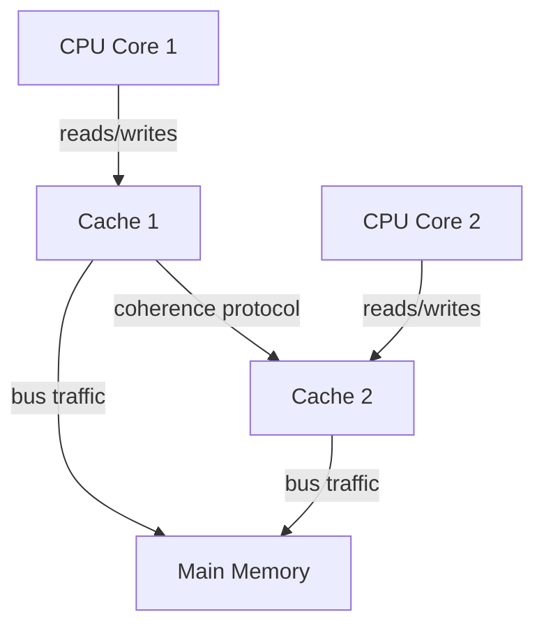
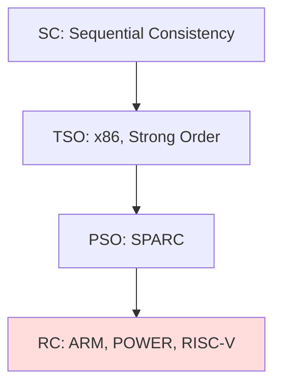

# Memory Models

## Introduction

A **memory model** is a formal specification that defines how memory operations (reads and writes) behave and interact in a computational system—particularly in the presence of concurrency. It provides rules and guarantees about the visibility and ordering of read and write operations across threads and cores in a multicore or multiprocessor environment.

Memory models are fundamental for achieving correct, portable, and performant concurrent systems. They define precisely what programmers and compilers can expect from the hardware or runtime when multiple threads access shared memory, and what optimizations are legal.

## Context: The Role of Memory Models

Memory models reside at the intersection of:

- **Hardware Architecture** (the physical/register-level rules enforced by CPUs, caches, and buses)
- **Programming Languages** (which may specify higher-level or looser guarantees)
- **Compilers** (which translate source code to lower-level machine code, possibly reordering instructions)

They describe constraints on **how changes to memory performed by one thread become visible to other threads**, influencing questions such as:

- When is an updated variable value visible to other threads?
- Under which circumstances can a processor or compiler reorder operations?
- How can programmers enforce ordering constraints?

## Motivating Example

Consider two cores executing the following pseudo-code in parallel on shared variables `x` and `y` (initially both zero):

**Core 1**
```c
x = 1;
r1 = y;
```
**Core 2**
```c
y = 1;
r2 = x;
```
Is it possible, **at the same time**, for both `r1` and `r2` to read 0? 

The answer depends on the system's memory model. Strong models forbid this; weaker models may permit it if they allow stores and loads to be reordered.

## Core Concepts

### 1. Sequential Consistency

**Sequential Consistency (SC)**, as defined by Lamport (1979), is the gold standard model:

> "The result of any execution is the same as if the operations of all processors were executed in some sequential order, and the operations of each processor appear in this sequence in the order issued by its program."

SC guarantees that all memory accesses appear to happen in a single, globally agreed-upon, sequential order.

#### Diagram: Sequential Consistency


Every read and write is ordered, and every core sees all operations in the same order.

### 2. Store/Load Reordering

Modern CPU architectures and optimizing compilers seek to maximize throughput via:

- **Store buffering:** Delaying or batching writes so stores are not immediately visible to all cores
- **Load speculation/pre-fetch:** Loads are issued before previous stores have completed

This may result in execution orders that diverge from program order, especially across threads.

### 3. The Need for Weaker Memory Models

Strict sequential consistency is rarely implemented directly for efficiency reasons. Real-world hardware employs weaker models, such as:

- **Total Store Order (TSO):** (e.g., x86)
- **Partial Store Order (PSO):** (e.g., SPARC)
- **Release Consistency (RC):** (e.g., ARM, POWER, many RISC-V profiles)

Weaker models enable greater parallelism and optimization but require **synchronization primitives** to maintain correctness.

## Memory Ordering Guarantees

### Types of Orderings

- **Program Order:** The order of operations in the source code
- **Coherence Order:** The order of all operations on a single memory location
- **Consistency:** The order in which the effects of operations become visible across cores

### Fundamental Relations


### Fences and Barriers

A **memory barrier** (or fence) is an instruction that enforces ordering constraints:

- **Store barrier:** Ensures all stores before the barrier are visible before any after the barrier
- **Load barrier:** Ensures loads before the barrier complete before loads after the barrier begin
- **Full barrier (mfence, dmb):** Both store and load

## Architectural Memory Models

### x86 / Intel-AMD: Total Store Order (TSO)

#### Key Properties

- Writes by a single core are seen in order by all other cores
- Loads may be reordered ahead of earlier stores to different addresses (due to store buffering)
- Sequentially consistent for **data-race-free** programs

#### TSO vs. SC

```mermaid
graph TB
    A[Sequential Consistency]
    B[Total Store Order (TSO)]
    C[Partial Store Order (PSO)]
    D[Relaxed / Weak]

    A --> B
    B --> C
    C --> D
```
TSO is slightly weaker than SC but still strong compared to ARM or POWER.

#### TSO Example: Store Buffering



### ARM / POWER / RISC-V: Relaxed Memory Models

These architectures provide minimal order guarantees beyond those required for **individual memory locations** (“coherence”), relying on explicit memory barriers.

- **Reads and writes may be reordered almost arbitrarily**
- Synchronization operations (e.g., `dmb`, `isb` on ARM) must be used to enforce orderings between accesses

#### Memory Barriers Example



### SPARC: Partial Store Order (PSO)

PSO allows even more reordering: stores to different addresses by the same core can be seen in any order by others.

## Programming Language Memory Models

### C and C++ (C11 / C++11 and later)

Modern C/C++ standards introduce **well-defined memory models**:

#### Memory Orders

- `memory_order_relaxed`: minimal ordering
- `memory_order_consume` (deprecated): for dependency ordering
- `memory_order_acquire`/`memory_order_release`: establishes happens-before relationships
- `memory_order_acq_rel`: both acquire and release
- `memory_order_seq_cst`: sequential consistency

Atomic operations can specify the desired memory ordering with these constants.

#### C++ Atomic Example

```c++
#include <atomic>
std::atomic<int> x = 0;
std::atomic<int> y = 0;

// Thread 1
x.store(1, std::memory_order_relaxed);
y.store(2, std::memory_order_release);

// Thread 2
int r1 = y.load(std::memory_order_acquire);
int r2 = x.load(std::memory_order_relaxed);
```

Here, the release-acquire pair ensures that if Thread 2 observes `y == 2`, it must also see `x == 1`.

### Java

Java's memory model (Java Language Specification, JSR-133) provides:

- **Volatile fields:** Reads and writes are visible to all threads immediately; acts as a memory barrier
- **Synchronized blocks:** Full ordering before (enter) and after (exit) the block

### .NET

The .NET memory model (CLI/Ecma-335) is similar; it guarantees sequential consistency of volatile fields and method memory barriers like `Thread.MemoryBarrier()`.

## Memory Consistency Terminology

- **Happens-before:** A fundamental partial order indicating that "if A happens-before B, then effects of A are visible to B."
- **Data-race:** Two accesses to the same memory location, at least one of which is a write, by different threads without proper synchronization.
    - Data races result in **undefined behavior** in C++ and unsynchronized behavior in Java.

- **Acquire/Release semantics:** Ensures that operations after a release store in one thread appear to happen after corresponding acquire loads in another.

## Reasoning About Memory Models

### The Problem of Non-Intuitive Behaviors

On relaxed models, optimizations such as reordering, speculative execution, and caches can result in “impossible” or counterintuitive results compared to single-threaded logic.

#### Example: Reordering Pitfall

Suppose Thread A executes:

```c
ready = 1;
data = 42;
```

And Thread B executes:

```c
if (ready)
    print(data);
```
It is possible, on a weakly ordered model without synchronization, for Thread B to observe `ready == 1` but `data == 0` due to reordering of writes by Thread A or caching effects.

> **GitHub Alert**
> :warning: **Warning:** Failing to use proper synchronization primitives results in unpredictable and often erroneous behavior on most real-world multicore hardware.

## Correctness Conditions

### Data-Race Freedom (DRF) Theorems

Many programming language memory models (C++, Java) guarantee **sequential consistency for data-race-free programs** (SC-for-DRF):

- If your program is free of data races (all shared accesses are protected by synchronization), it behaves as if running on sequential consistency—even atop weaker hardware models.

### Synchronization Primitives

Common primitives for memory ordering:

- **Locks (mutexes):** Guarantee mutual exclusion and memory ordering
- **Atomic operations:** Provide fine-grained synchronization without heavyweight locking (e.g., compare-and-swap)
- **Barriers/fences:** Low-level enforcement of specific orderings

Deciding between these primitives involves considering consistency requirements and performance trade-offs.

## Compiler Effects on Memory Models

Compilers may **reorder** operations and **eliminate** apparently redundant loads and stores, provided they do not violate the language's memory model.

- **Volatile** and **atomic** annotations prevent compiler optimizations that would break memory ordering guarantees.
- For correct multi-threaded code, use the tools provided by the language, not hardware or compiler behavior.

## Hardware Implementation Details

### Cache Coherency

Most mainstream CPUs implement either **MESI** or similar cache coherence protocols, which enforce that all processors see a consistent value for each individual memory location.



### Store Buffers

Write operations are temporarily held in per-core store buffers before becoming visible to other cores/memory. Store buffers cause stores to be delayed with respect to loads.

### Speculative Execution

Processors may speculatively execute instructions out-of-order. When incorrect speculation occurs (e.g., due to a mispredicted branch), changes are rolled back.

## Practical Engineering Considerations

### Performance Implications

- **Tighter ordering (stronger models, more barriers) reduces parallelism and throughput.**
- **Excessive use of barriers and atomic instructions impedes performance.**
- Striking a balance between correctness and performance is critical in multicore algorithms.

### Integrating with Lock-Free Data Structures

Lock-free and wait-free algorithms depend heavily on memory ordering. Correctness proofs typically assume a known, portable memory model—programmers must use:

- Standard atomic types and operations with explicit orderings
- Language-provided memory barriers
- Carefully documented guarantees and assumptions

> **GitHub Alert**
> :information_source: **Tip:** When possible, rely on high-level synchronization mechanisms (standard library atomics, mutexes) rather than hand-crafting lower-level memory ordering.

### Portability and Porting Code

- Porting multithreaded code between architectures (e.g., x86 to ARM) may expose hidden bugs due to looser memory ordering on the latter.
- Always use **explicit synchronization** instead of relying on what “happens to work” on one architecture.

### Common Pitfalls

- Unprotected writes to shared variables (data races)
- Relying on observed execution order on one platform/hardware
- Insufficient use of atomic types or memory barriers

## Diagram: Classes of Memory Models



## Standards and Specifications

- **C11 & C++11 Memory Model** (ISO/IEC 9899:201x / ISO/IEC 14882:201x)
- **Java Memory Model** (JLS, JSR-133)
- **ECMAScript Memory Model** (for SharedArrayBuffer/Atomics)
- **ARM Architecture Reference Manual**
- **Intel® 64 and IA-32 Architectures Software Developer’s Manual, Vols. 1-3**
- **RISC-V Memory Model Specification**

## Conclusion

Memory models precisely define the allowable behaviors of memory operations in concurrent environments—across cores, processors, and threads. They are foundational for writing correct, portable, and performant concurrent software.

Engineers must familiarize themselves with relevant models at **hardware and language levels**, the proper use of synchronization primitives, and the risks of relying on accidental behaviors. Understanding and applying memory model guarantees are critical for correct concurrent algorithms, especially as core counts and system complexity scale.

> **GitHub Alert**
> :octocat: **Note:** Real-world concurrency bugs are often due to a misunderstanding or ignorance of the system’s memory model.

**Summary Table: Memory Model Strengths**

| Model     | Hardware Example    | Ordering Guarantees          | Performance Impact    |
|-----------|--------------------|------------------------------|----------------------|
| SC        | (None: Ideal only) | All operations ordered       | High cost, rarely used|
| TSO       | x86, SPARC (early) | Stores reordered, reads before stores | Strong, moderate perf |
| PSO       | SPARC (late)       | Stores/loads reordered       | Weak, higher perf     |
| RC        | ARM, POWER, RISC-V | Minimal ordering, explicit barriers | Weakest, max perf     |

---

**Note**: For critical, production-grade concurrent systems, always review the specific memory model for your language/compiler/hardware in detail before designing lock-free or non-trivial synchronization code.