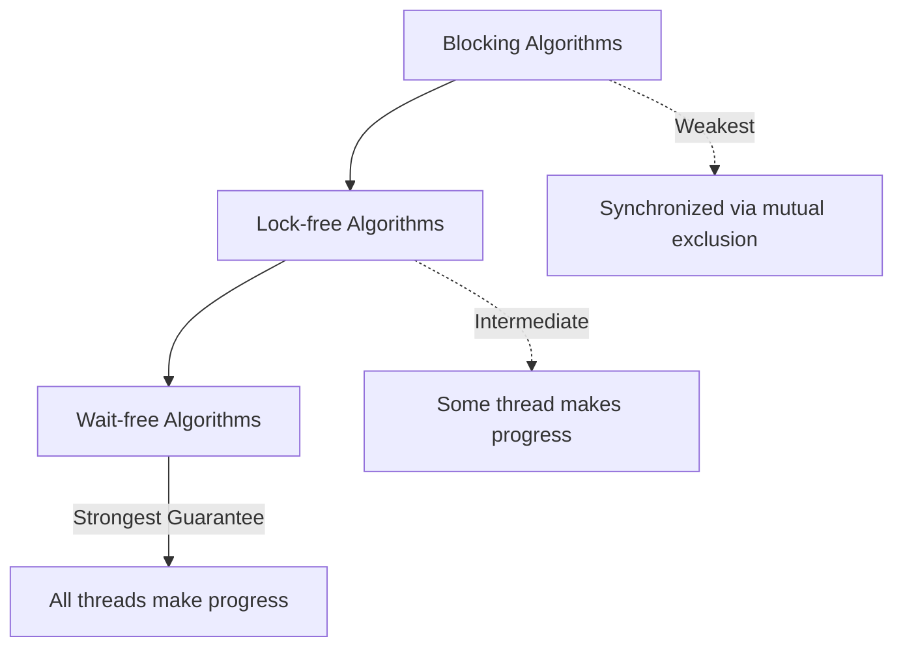
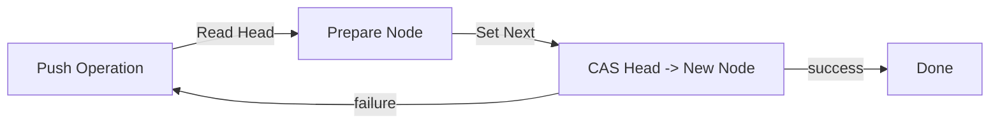
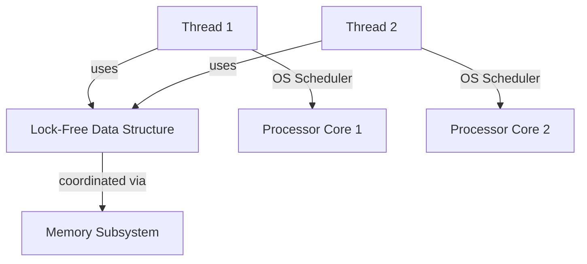
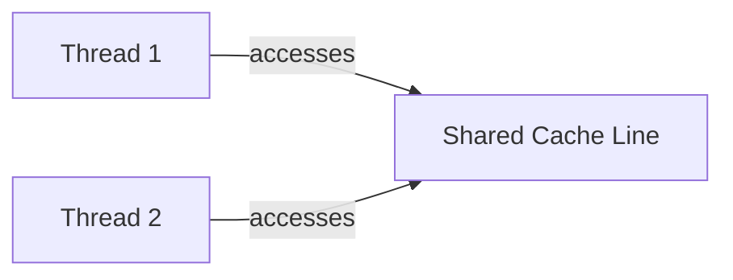
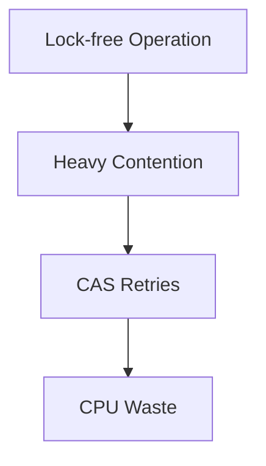

# Lock-free and Wait-free Algorithms

## Introduction

Modern software systems must efficiently handle concurrent access to shared data across threads and processors. Traditional synchronization primitives—such as mutexes, semaphores, and condition variables—enforce mutual exclusion but can introduce contention, deadlock potential, convoying, and priority inversion. 

**Lock-free** and **wait-free** algorithms are advanced synchronization techniques that avoid locks while ensuring thread progress and correctness in multi-threaded contexts. They form the foundation of high-performance concurrent data structures and systems, particularly on multi-core architectures.

---

## Formal Definitions and Context

**Lock-free Algorithm:**  
An algorithm is **lock-free** if, at any point in execution, *some* thread is guaranteed to make progress in a finite number of steps, regardless of the execution or scheduling of other threads. Lock-freedom avoids global process starvation but individual operations may starve indefinitely under contention.

**Wait-free Algorithm:**  
An algorithm is **wait-free** if *every* thread is guaranteed to complete its operation in a finite number of steps. Wait-freedom is a stronger guarantee than lock-freedom, ensuring per-thread progress and immunity to starvation.

**Key Technical Contexts:**  
- Used in **concurrent data structures** (queues, stacks, hash tables)
- Core to **real-time**, **high-throughput**, and **low-latency** systems
- Address hardware-level contention (cache coherency, false sharing, memory models)

Refer to the [C++11 memory model](https://en.cppreference.com/w/cpp/atomic/memory_order) and the [Java Memory Model (JMM) (JSR-133)](https://www.cs.umd.edu/~pugh/java/memoryModel/) for standard memory order semantics.

---

## Core Concepts

### 1. Progress Guarantees

- **Blocking algorithms:** Rely on mutual exclusion; a stalled or failed thread can prevent system-wide progress.
- **Lock-free algorithms:** System-wide progress is guaranteed, even if individual threads are delayed or preempted.
- **Wait-free algorithms:** Per-thread progress is guaranteed irrespective of scheduling or other thread failures.

#### Progress Guarantee Hierarchy



- All wait-free algorithms are lock-free, and all lock-free algorithms are non-blocking.
- The reverse is not true.

---

### 2. Atomic Primitives

Lock-free and wait-free algorithms depend crucially on hardware-supported **atomic operations**. Examples include:

- **Compare-and-Swap (CAS)**: Atomically compares a memory location's value to a given value and, only if they are equal, replaces it.
- **Fetch-and-Add (FAA)**: Atomically adds a value to a memory location and returns the original value.
- **Load-Link/Store-Conditional (LL/SC):** Used in some RISC architectures for similar purposes as CAS.
- **Atomic swap (XCHG):** Exchanges the contents of memory with a register atomically.

Availability and semantics of these primitives vary across ISAs (e.g., x86, ARM, RISC-V).

---

### 3. The ABA Problem

A unique challenge in lock-free/wait-free algorithms is the **ABA problem**: Between the time a thread reads a shared variable and attempts to update it with CAS, another thread may have changed its value back and forth (A→B→A), making the CAS instruction succeed incorrectly.

**Common Solutions:**
- *Tagged pointers*: Augment pointers with version counters.
- *Hazard pointers* and *epoch-based reclamation*: Safe memory reclamation techniques.

---

## Fundamental Architectures and Patterns

### Compare-and-Swap (CAS)-Based Update

Most lock-free data structures in practice employ CAS-based updates. The following block diagram illustrates a typical CAS-based update pattern.

```mermaid
flowchart TD
    A[Thread reads Value] --> B[Performs computation]
    B --> C[Prepares newValue]
    C --> D[CAS(Old, newValue)]
    D -- Success --> E[Commit newValue]
    D -- Failure --> F[Retry Loop]
    F --> A
```

- The retry loop occurs if the CAS fails, indicating the value was modified by another thread.

---

### Memory Ordering

Correctness depends on memory ordering guarantees: ensuring visibility and order of memory accesses across threads.

**Key Ordering Types:**
- *Relaxed*: No ordering constraints.
- *Acquire/Release*: Ensures visibility of prior or subsequent operations.
- *Sequential Consistency*: Strongest; all accesses appear in a single global order.

**Standards References:**
- ISO/IEC 14882:2011 (C++11): `std::atomic` and `memory_order`
- Java SE 5+: `java.util.concurrent.atomic` and `volatile`/`final` semantics

---

### Data Structure Patterns

#### Lock-free Stack

A classic example is the Michael & Scott lock-free stack, often implemented using CAS on the head pointer.



#### Lock-free Queue

Michael & Scott's lock-free queue uses CAS on both head and tail pointers, with two-phase enqueue/dequeue operations.

**Note:**  
Memory reclamation (e.g., retired nodes) requires careful handling to avoid access violations due to the ABA problem. Techniques like hazard pointers or epoch-based reclamation are recommended.

---

## Algorithmic Examples

### Treiber's Lock-free Stack

One of the earliest lock-free algorithms; it uses CAS to manage a singly-linked list for stack operations.

**Push Operation (Pseudo-code):**
```
Function Push(x):
    node = new Node(x)
    do:
        old_head = head
        node.next = old_head
    while not CAS(&head, old_head, node)
```

**Pop Operation:**
```
Function Pop():
    do:
        old_head = head
        if old_head == NULL:
            return EMPTY
        next = old_head.next
    while not CAS(&head, old_head, next)
    return old_head.value
```

---

### Michael & Scott Lock-free Queue

A lock-free FIFO queue implementation also based on CAS.

**Enqueue Operation Outline:**
- Read `tail.next`. If `NULL`, try to link in a new node via CAS.
- Move tail pointer forward using CAS.
- Repeat if CAS fails.

---

### Wait-free Algorithm Techniques

Wait-freedom is much harder to obtain in practice without significant overhead. Common techniques:

- **Universal Constructions** (Herlihy): Construct any object with wait-freedom but often with high practical cost.
- **Operation Counting/Version Stamps:** Ensure that no operation is lost or endlessly retried.
- **Helping Mechanisms:** Threads assist one another with operation completions.

#### Wait-free Queue Example: 
[Lamport's Wait-Free Queue] (bounded, single-producer/single-consumer):

- Employs *proper indexing and cache-line padding* to avoid false sharing.
- Each enqueue or dequeue is a single atomic operation plus a memory barrier—wait-freedom for the single producer/consumer case.

---

## Practical Implementations

### Language and Library Support

- **C/C++:** `std::atomic`, GCC/Clang built-ins (`__atomic` / `__sync`), Boost.Lockfree
- **Java:** `java.util.concurrent.atomic`, `java.util.concurrent` data structures
- **Rust:** `std::sync::atomic`
- **Go:** `sync/atomic`

These libraries offer high-level atomic types and sometimes lock-free/wait-free containers.

---

### Integration with Operating Systems

Integration with OS threads (e.g., POSIX pthreads) is common. Careful mapping of thread affinity, processor core collisions, and context-switching can greatly affect performance.



---

## Engineering Considerations

### Performance and Scalability

Lock-free and wait-free algorithms:
- Reduce context switching and kernel overhead by avoiding blocking syscalls.
- Improve scalability on multi-core systems.
- May suffer from livelock or excessive retries under high contention.

#### False Sharing

Poor alignment of data can force threads to contend for the same cache lines.



**Tip:**  
Apply cache-line padding/alignment to atomic variables to avoid false sharing.

---

### Memory Reclamation

When nodes are removed from concurrent data structures, special care is needed to avoid premature reclamation (use-after-free).

- **Hazard Pointers:** Threads publish which nodes they may still access.
- **Epoch-Based Reclamation:** Nodes are reclaimed only after it's guaranteed no thread can reference them.

---

### Common Pitfalls

- Incorrect memory ordering leads to subtle data races (e.g., on weakly ordered CPUs like ARM/Power).
- ABA problem causes spurious successes of CAS leading to logical errors.
- Insufficient progress guarantees (e.g., lock-free when wait-free is required).
- Underestimating performance impact of contention (excessive CAS retries).



**Warning:**  
Lock-free does not imply bounded resource (CPU) consumption under contention. Design for expected system load.

---

## Summary Table: Blocking vs Lock-free vs Wait-free

| Guarantee      | Progress   | Starvation | Example          |
|----------------|------------|------------|------------------|
| Blocking       | None if thread stalled | Possible      | Mutex-protected list |
| Lock-free      | Some thread | Possible   | Treiber stack    |
| Wait-free      | Every thread | None     | Lamport FIFO     |

---

## Real-world Use Cases

- High-frequency trading systems (ultra-low latency)
- Databases (e.g., queue-based transaction logs)
- Kernel and network device driver rings
- Real-time analytics engines
- Garbage collectors (concurrent marking/sweeping)

---

## Notable References and Standardization

- C++11 and newer: **ISO/IEC 14882:2011**, `std::atomic`
- Java Memory Model: **JSR-133**
- **POSIX Threads (pthreads):** May be used to manage threads interacting with lock-free/wait-free data structures at the user level.

---

## Conclusion

Lock-free and wait-free algorithms represent sophisticated synchronization strategies that eliminate or reduce the reliance on blocking mechanisms, thereby enabling high degrees of parallelism and system throughput. Their application requires rigorous attention to atomicity, memory ordering, and system-level integration; improper implementation may lead to subtle and pernicious bugs. Despite increased implementation complexity, the benefits in performance and scalability often justify their use in demanding concurrent and real-time applications.

---

**Note:**  
For more complex diagrams (e.g., operation helping in wait-free queues, hazard pointer structures), diagrams can be added later.

---