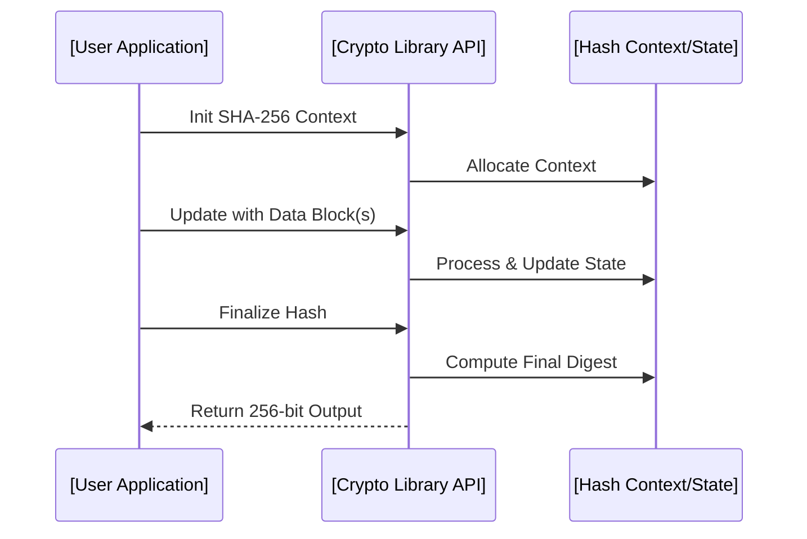

# SHA-256: Technical Primer

## 1. Introduction

SHA-256 (Secure Hash Algorithm 256-bit) is a member of the SHA-2 family of cryptographic hash functions, designed by the National Security Agency (NSA) and published in 2001 by the United States National Institute of Standards and Technology (NIST) as part of FIPS PUB 180-2, later superseded by FIPS PUB 180-4. It is a widely used, collision-resistant, one-way function generating a fixed 256-bit (32-byte) output from variable-length input. SHA-256 serves as a foundational component in digital signatures, blockchain protocols, password hashing, integrity validation, and various other security systems.

## 2. Cryptographic Context and Security Properties

SHA-256 is engineered as a cryptographic hash function, which should be:

- **Deterministic**: The same input always yields the same output.
- **Efficient**: Computationally feasible to calculate for any given input.
- **Preimage resistant**: Given a hash output, infeasible to find an input producing it.
- **Second-preimage resistant**: Given input _x_, infeasible to find another input _y_ ≠ _x_ such that hash(_y_) = hash(_x_).
- **Collision resistant**: Infeasible to find any two distinct inputs that hash to the same output.

These properties underpin SHA-256's role in integrity and authentication schemes.

## 3. Standardization and Motivation

SHA-256 is formally defined in:

- **FIPS PUB 180-4**: Secure Hash Standard (current reference for SHA family algorithms).
- **NIST SP 800-107**: Recommends applications and management of hash functions.

The SHA-2 family was introduced after weaknesses surfaced in the original SHA-1 and MD5 algorithms. As of the time of writing, SHA-256 remains unbroken in terms of finding practical collisions or preimage attacks.

## 4. SHA-2 Family Overview

SHA-2 comprises several hash functions of varying output lengths:

- SHA-224
- **SHA-256** (focus here)
- SHA-384
- SHA-512
- SHA-512/224
- SHA-512/256

SHA-256 is most widely used due to its favorable performance-security tradeoff, especially in software and common hardware architectures.

## 5. Algorithm Structure

SHA-256 is a Merkle–Damgård construction using the Davies–Meyer compression function built from a custom block cipher.

### 5.1 High-Level Data Flow

The hash computation proceeds in the following main stages:

1. **Padding** input data to a multiple of 512 bits.
2. **Parsing** padded input into 512-bit blocks.
3. **Setting** initial hash values ("IV")—eight 32-bit words.
4. **Processing** each block using a compression function involving 64 rounds per block.
5. **Producing** the final 256-bit digest (output).

#### Data Flow Block Diagram

```mermaid
flowchart LR
    InputData[Input Data]
    Padded[Padding to 512-bit Block Boundary]
    Parse[Divide into 512-bit Blocks]
    Initialize[Initialize State (IV)]
    BlockLoop[Process Each Block (Compression Function)]
    FinalHash[Output 256-bit Hash]

    InputData --> Padded --> Parse --> BlockLoop
    Initialize --> BlockLoop
    BlockLoop --> FinalHash
```

## 6. Detailed Algorithm Description

### 6.1 Padding and Message Parsing

SHA-256 processes input data in fixed 512-bit (64-byte) blocks:

- **Padding step**: The message is padded as follows:
  1. Append a single '1' bit to the message.
  2. Append '0' bits until the length is congruent to 448 mod 512.
  3. Append the original message length as a 64-bit big-endian integer.
  This ensures the total length is a multiple of 512 bits.

### 6.2 Initial Hash Value

The initial hash value (H0) is defined in the standard, set as eight 32-bit words:

- H₀ = 0x6a09e667
- H₁ = 0xbb67ae85
- H₂ = 0x3c6ef372
- H₃ = 0xa54ff53a
- H₄ = 0x510e527f
- H₅ = 0x9b05688c
- H₆ = 0x1f83d9ab
- H₇ = 0x5be0cd19

### 6.3 Message Schedule

For each block, a message schedule array W[0..63] of 32-bit words is prepared:

1. **First 16 words (W[0] to W[15])**: Set to the block’s 16 consecutive 32-bit big-endian words.
2. **Extend W[16] to W[63]** by:
   \[
   W_t = \sigma_1(W_{t-2}) + W_{t-7} + \sigma_0(W_{t-15}) + W_{t-16}
   \]
   Where:
   - \(\sigma_0(x) = ROTR^7(x) \oplus ROTR^{18}(x) \oplus SHR^3(x)\)
   - \(\sigma_1(x) = ROTR^{17}(x) \oplus ROTR^{19}(x) \oplus SHR^{10}(x)\)

### 6.4 Compression Function

The compression function processes the schedule with a series of 64 rounds per block, working on eight working variables (a-h).

Each round \( t \) computes:

\[
\begin{align*}
T_1 &= h + \Sigma_1(e) + Ch(e, f, g) + K_t + W_t\\
T_2 &= \Sigma_0(a) + Maj(a, b, c)\\
h &= g\\
g &= f\\
f &= e\\
e &= d + T_1\\
d &= c\\
c &= b\\
b &= a\\
a &= T_1 + T_2
\end{align*}
\]

Where:

- \( \Sigma_0(x) = ROTR^2(x) \oplus ROTR^{13}(x) \oplus ROTR^{22}(x) \)
- \( \Sigma_1(x) = ROTR^6(x) \oplus ROTR^{11}(x) \oplus ROTR^{25}(x) \)
- \( Ch(x, y, z) = (x \wedge y) \oplus (\neg x \wedge z) \)
- \( Maj(x, y, z) = (x \wedge y) \oplus (x \wedge z) \oplus (y \wedge z) \)
- \( K_t \) are 64 fixed round constants.

### Compression Function Diagram

```mermaid
flowchart TD
    Block[512-bit Message Block]
    Schedule[Message Schedule W[0..63]]
    State[Working Vars: a-h]
    Rounds[64 Rounds: Compression Steps]
    Update[Update Hash State]
    NextBlock[Next Message Block or Output]

    Block --> Schedule
    Schedule --> State
    State --> Rounds
    Rounds --> Update
    Update --> NextBlock
```

### 6.5 Digest Output

After processing all blocks, the final values of the hash variables (a-h) are concatenated to produce the 256-bit hash result.

## 7. Application Patterns

### 7.1 Digital Signatures

SHA-256 is frequently used to hash message contents before applying signature algorithms such as ECDSA or RSA-PSS. This is mandated in protocols such as TLS (RFC 5246, 8446), SSH, and document signature standards.

### 7.2 Data Integrity Checks

Many systems (e.g., file download checksums, container images, firmware releases) use SHA-256 to ensure file or artifact integrity.

### 7.3 Password Hashing

While SHA-256 itself is not best practice for password storage (see [NIST SP 800-63B](https://csrc.nist.gov/publications/detail/sp/800-63b/final)), key-derivation and password-hashing schemes (e.g., PBKDF2, HMAC-SHA-256, bcrypt using SHA-256 as a primitive) use SHA-256 internally.

### 7.4 Blockchain

Cryptocurrencies such as Bitcoin use double SHA-256 for block and transaction integrity.

### 7.5 Randomness Derivation

SHA-256 is also used as a building block in deterministic random bit generator schemes (e.g., NIST DRBG).

## 8. Integration and Implementation Notes

### 8.1 Performance Considerations

- **CPU Optimizations**: SHA-256 is optimized for 32-bit arithmetic and can be efficiently implemented both in hardware and software. Many modern CPUs offer instructions (e.g., Intel SHA extensions, ARMv8 Cryptographic Extensions) for acceleration.
- **Memory Usage**: The hash context is small (only a few hundred bytes per operation), making SHA-256 suitable for resource-constrained systems.
- **Parallelism**: SHA-256 itself processes input sequentially (not parallelizable over a single input), but multiple hash computations can be parallelized.

### 8.2 Security Considerations

- **Deprecation of SHA-1**: Use SHA-256 or better (SHA-384/512) per NIST and industry standards.
- **HMAC Construction**: When using a MAC, employ HMAC-SHA-256 as defined in [RFC 2104].
- **Salt and Key Handling**: SHA-256 is not a password hash function. Use a proper key-derivation function (KDF) like PBKDF2/HKDF (using SHA-256 as a primitive).
- **Truncation**: If hash outputs are truncated (e.g., to 128 or 160 bits), collision resistance drops correspondingly. Avoid truncating unless absolutely required.

> [!WARNING]
> Do **not** use SHA-256 for password storage or to protect weak user secrets without a dedicated password hashing algorithm.

### 8.3 Implementation Pitfalls

- **Incorrect Padding**: Implementations must exactly follow the padding scheme or risk interoperability and attacks.
- **Endianness**: SHA-256 is defined for big-endian data; pay attention on little-endian architectures.
- **Streaming and Context Management**: Stateless implementations may risk incorrect results or state reuse issues.
- **Constant-time Operations**: Use constant-time code for any context involving secret data to prevent timing attacks on HMACs or derived constructions.

> [!TIP]
> Use well-vetted crypto libraries (e.g., OpenSSL, libsodium, BoringSSL, cryptography.io, or language-standard libraries) rather than custom implementation.

### 8.4 Interface Overview

Most cryptographic libraries expose a similar workflow:



## 9. SHA-2 Family: Upgrades and Variations

Though SHA-256 remains dominant, SHA-384 and SHA-512 provide longer outputs and are often preferred in high-security contexts. Their structure differs slightly (e.g., processing 1024-bit blocks and using 64-bit operations), impacting both performance and cryptographic strength.

> [!NOTE]
> Diagram of SHA-2 family tree to be added later.

## 10. Known Weaknesses and Futureproofing

- **Cryptanalytic Status**: No published preimage or collision attacks feasible on full SHA-256 as of 2024.
- **Quantum Resistance**: Like most hash functions, SHA-256 offers reduced security under quantum attacks (Grover’s algorithm yields a quadratic speedup, reducing security level to ~128 bits).
- **SHA-3 Transition**: For futureproofing, consider SHA-3 (Keccak) or extendable output functions (XOFs) in long-horizon projects.

## 11. Compliance, Protocols, and Standards

Relevant standards and protocol recommendations:

- **FIPS PUB 180-4**: Official SHA-256 specification.
- **RFC 6234**: SHA-2 hash functions for Internet protocols.
- **NIST SP 800-131A**: Transition guidance on cryptographic hash functions.
- **PCI DSS, GDPR, HIPAA**: Various regulatory frameworks mandate strong one-way hash functions like SHA-256 for certain cryptographic controls.

> [!IMPORTANT]
> Ensure full protocol compliance and monitor the regulatory landscape for changes to approved cryptographic primitives.

## 12. Summary

SHA-256 is a robust, performant, and broadly implemented cryptographic hash function providing strong resistance against collisions and preimage attacks at the time of writing. It is standardized, widely vetted, and central to digital signatures, integrity checks, and blockchain technology. Correct use requires secure integration, faithful implementation per the latest NIST standards, and awareness of future cryptographic developments—including migration paths toward SHA-3 or post-quantum algorithms.

---

This primer aims to provide security engineers with the essential architectural, implementation, and integration knowledge required for secure and effective use of SHA-256 within modern systems.