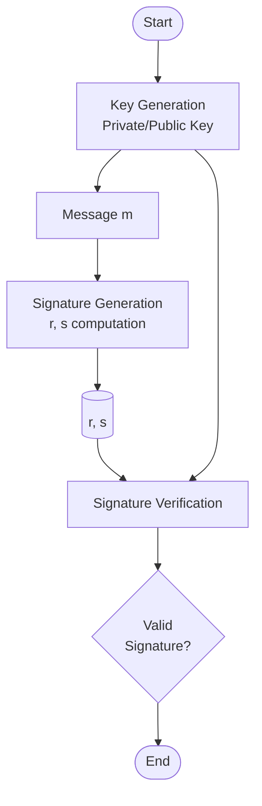
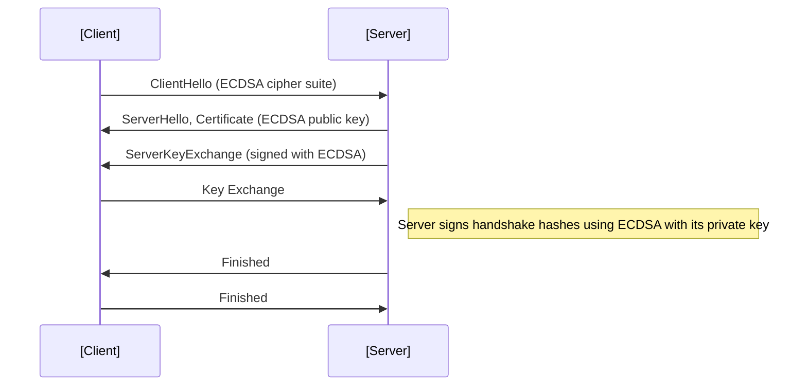
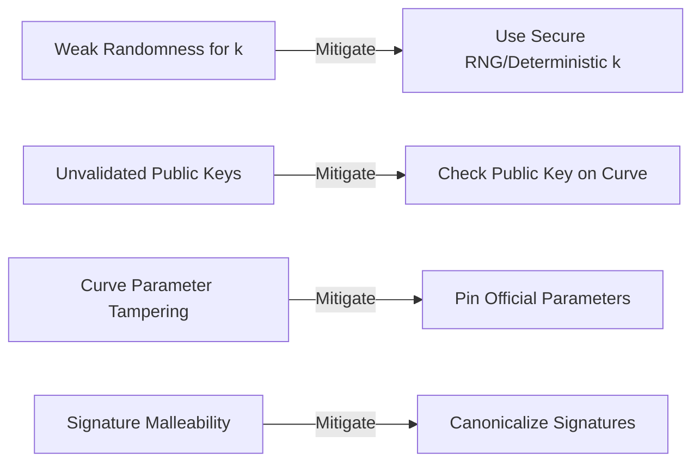

# ECDSA: Elliptic Curve Digital Signature Algorithm

## 1. Introduction

The Elliptic Curve Digital Signature Algorithm (ECDSA) is a widely adopted asymmetric cryptographic algorithm for creating and verifying digital signatures. It leverages the mathematics of elliptic curves over finite fields, offering high cryptographic strength-per-bit relative to older public-key systems like RSA and DSA.

ECDSA is standardized by the U.S. National Institute of Standards and Technology (NIST) in FIPS 186 (currently at revision FIPS 186-5 as of June 2023), and specified in multiple RFC documents (e.g., RFC 4492, RFC 5480). It is a core component of numerous protocols, including TLS, SSH, JWT, Bitcoin, and many modern security systems.

## 2. Technical Context and Rationale

### 2.1 Position within Asymmetric Cryptography

ECDSA falls within the family of digital signature algorithms, which enable:

- **Authentication**: Verifying signer identity.
- **Integrity**: Confirming the content was not altered post-signature.
- **Non-repudiation**: Preventing signers from denying their signature.

Compared to traditional algorithms like **RSA** and **DSA**, ECDSA offers:

- Shorter key lengths for equivalent security (e.g., 256-bit ECDSA ≈ 3072-bit RSA).
- Faster computations, particularly beneficial on resource-constrained devices.
- Smaller signatures, reducing protocol overhead.

### 2.2 Use Cases

- Authentication in TLS/SSL (Elliptic Curve Cipher Suites).
- Signing in cryptocurrencies (e.g., Bitcoin, Ethereum).
- Document and message signing (e.g., with JSON Web Tokens or X.509 certificates).
- Code signing and software attestation.

## 3. Mathematical Foundations

### 3.1 Elliptic Curves over Finite Fields

Let \(\mathbb{F}_q\) denote a finite field with \(q\) elements (typically \(q = p\) for prime fields). An elliptic curve \(E\) is defined by an equation:

\[
y^2 = x^3 + ax + b
\]

where \(a, b \in \mathbb{F}_q\), with the condition \(4a^3 + 27b^2 \neq 0\) (to avoid singular curves).

The set of solutions to this equation, along with a special point at infinity (\(\mathcal{O}\)), forms an **abelian group** under a well-defined addition law.

#### Key Properties

- **Group operation**: Point addition and scalar multiplication.
- **Hard problem**: The Elliptic Curve Discrete Logarithm Problem (ECDLP) underpins ECDSA security.
- **Field types**:
  - Recommended: Prime fields (\(\mathbb{F}_p\)) or binary fields (\(\mathbb{F}_{2^m}\)).
  - Standards: NIST P-curves (e.g., P-256, P-384, P-521), Brainpool, Curve25519, secp256k1 (used in Bitcoin).

### 3.2 Security Assumptions

- **ECDLP**: Given points \(P\) and \(Q = kP\), it is computationally infeasible to determine \(k\).
- **Sound curve parameters**: Non-backdoored, well-reviewed curves with no known weaknesses.

## 4. Algorithm Overview and Key Components

ECDSA involves three primary processes:

1. **Key Generation**
2. **Signature Generation**
3. **Signature Verification**

### 4.1 Key Generation

**Inputs**:
- Agreed domain parameters: Curve equation, field, generator point \(G\), order \(n\), cofactor \(h\).

**Steps**:

1. Select a random integer \(d\) in \([1, n-1]\) as the private key.
2. Compute the public key: \(Q = d \cdot G\).

- **Private Key (\(d\))**: Secret scalar.
- **Public Key (\(Q\))**: Curve point, shared publicly.

### 4.2 Signature Generation

To sign a message \(m\):

1. Compute hash \(e = \text{HASH}(m)\), e.g., SHA-256.
2. Select random per-signature value \(k\) in \([1, n-1]\) (**must be unique and kept secret**).
3. Compute point: \(R = k \cdot G = (x_1, y_1)\).
4. Compute \(r = x_1 \bmod n\). If \(r = 0\), restart.
5. Compute \(s = k^{-1}(e + d \cdot r) \bmod n\). If \(s = 0\), restart.
6. Output signature: tuple \((r, s)\).

**Alert:**
> :warning: The value \(k\) must never be reused or predictable, as leaking \(k\) allows private key recovery. Prefer deterministic generation of \(k\) as per RFC 6979.

### 4.3 Signature Verification

Given message \(m\), signature \((r, s)\), and public key \(Q\):

1. Validate \(r, s \in [1, n-1]\).
2. Compute hash \(e = \text{HASH}(m)\).
3. Compute \(w = s^{-1} \bmod n\).
4. Compute \(u_1 = e w \bmod n\), \(u_2 = r w \bmod n\).
5. Compute point: \(R = u_1 G + u_2 Q = (x_1, y_1)\).
6. The signature is valid if \(r \equiv x_1 \bmod n\).

**Alert:**
> :information_source: Signature accept/reject timing can leak information (timing attacks). Always handle signature values and failures in constant time.

### 4.4 Algorithm Workflow

## 5. Domain Parameters and Curve Selection

ECDSA domain parameters must be agreed upon by all communicating parties. These parameters, typically denoted \((p, a, b, G, n, h)\), must be securely and unambiguously defined.

### 5.1 Standard Curves

- **NIST Prime Curves**: e.g., secp256r1 (P-256), secp384r1 (P-384), secp521r1 (P-521).
- **Brainpool**: brainpoolP256r1, etc.
- **Koblitz/SECG**: secp256k1 (notably used in Bitcoin; not NIST approved).
- **Safe Curves**: Edwards curves (Ed25519, not used for ECDSA; but noted for contrast).

**Alert:**
> :bulb: Correct, well-audited parameter sets are critical. Avoid custom or poorly reviewed curves.

### 5.2 Parameter Constraints

- **Order (\(n\)):** Should be a large prime for security.
- **Cofactor (\(h\)):** Preferably small (usually 1).
- **Generator \(G\):** Fixed, agreed point of order \(n\).
- **Field size (\(p\)):** Should meet security margin; e.g., \(p = 2^{256} - 2^{224} + 2^{192} + 2^{96} - 1\) for secp256r1.

## 6. ECDSA in Practice

### 6.1 Workflow Integration

ECDSA signatures are typically used as a primitive in conjunction with hash functions, secure key exchange, certificate authorities, and protocol handshakes.

#### TLS Handshake with ECDSA

### 6.2 Deterministic ECDSA (RFC 6979)

Random \(k\) generation is a frequent implementation pitfall, with catastrophic consequences if compromised. RFC 6979 stipulates a method of generating \(k\) deterministically from the message hash and private key, using HMAC-DRBG, mitigating random number generator failures.

**Alert:**
> :exclamation: Never use a non-cryptographically-secure random number generator for \(k\). Prefer deterministic ECDSA per RFC 6979 to avoid nonce reuse.

### 6.3 Signature Encoding and Interoperability

- ECDSA signatures (\(r, s\)) must be encoded for transmission. ASN.1 DER (Distinguished Encoding Rules) is widely used (e.g., in X.509/PKIX and TLS).
- Some blockchains (e.g., Bitcoin) use direct concatenation or custom encodings.
- Hash function used (e.g., SHA-256, SHA-384) must match agreed-upon strength level and protocol requirements.

**Alert:**
> :information_source: Ensure consistent signature encoding and hash usage across different platforms, as mismatches can cause signature verification failures.

### 6.4 Security Considerations

- **Nonce reuse/prediction**: Leaks private key. This has famously caused real-world attacks (e.g., Android Bitcoin wallets, Sony PlayStation 3).
- **Side-channel attacks**: Timing, power analysis—mitigate with constant-time arithmetic and masking.
- **Invalid Curve Attacks**: Strictly validate curve parameters and public keys during verification.
- **Backdoored/weak curves**: Use only well-reviewed, community-standards-compliant parameter sets.

## 7. Engineering Concerns

### 7.1 Implementation Pitfalls

- **Random number generation**: Must be cryptographically secure for nonces and keys.
- **Parameter validation**: Check all public keys and curve parameters are legal and on curve.
- **Signature malleability**: Standard ECDSA is malleable; can have two valid signatures \((r, s)\) and \((r, n-s)\). Protocols should canonicalize signatures to avoid replay/variant issues.

### 7.2 Efficiency and Performance

- ECDSA is more efficient (per security bit) than RSA for signature generation and verification.
- On constrained devices (e.g., smartcards, embedded IoT), ECDSA enables practical public-key cryptography with acceptable computational cost.
- Hardware acceleration and optimized libraries (OpenSSL, libsecp256k1) can further increase throughput.

### 7.3 Key Management

- Private key protection (in HSMs, TPMs).
- Secure backup and rotation.
- Public key distribution using certificates, CAs, or fingerprint verification.

### 7.4 Integration Guidelines

- Use vetted, actively maintained cryptographic libraries.
- Do not attempt to implement ECDSA primitives manually.
- For protocol design, clearly document:
  - Curve parameters.
  - Hash function.
  - Signature encoding.
  - Key validation processes.

## 8. Protocols and Standards Reference

- **FIPS 186-5**: Digital Signature Standard (DSS), defines ECDSA.
- **SEC 1 and SEC 2**: Standards for ECDSA and curve parameters (by SECG).
- **RFC 5480**: Elliptic Curve Cryptography Subject Public Key Information.
- **RFC 4492**: ECC cipher suites for TLS.
- **RFC 6979**: Deterministic usage of DSA/ECDSA digital signature algorithm.
- **SP 800-186**: NIST recommended elliptic curves.

## 9. Advanced Topics and Variations

### 9.1 Schnorr and EdDSA

ECDSA's canonicalization and malleability issues have led to the development of alternatives:

- **Schnorr signatures**: Similar form, but with provable security properties and simpler structure; now being standardized (see BIP-340 in Bitcoin).
- **EdDSA**: Several advantages over ECDSA, including deterministic nonce generation by design, resistance to certain side-channel attacks, and non-malleability, but note EdDSA is not ECDSA—parameters and implementations differ.

### 9.2 ECDSA in Blockchain

ECDSA is a cornerstone for major cryptocurrencies:

- **Bitcoin**: Uses secp256k1; all transaction authentication relies on ECDSA signature verification.
- **Ethereum**: Also employs secp256k1, but encodes signatures differently.

## 10. Common Pitfalls and Best Practices

- **Best Practices:**
  - Always validate all external curve parameters and points.
  - Use standard, vetted curves.
  - Never reuse nonces.
  - Store private keys securely; consider hardware security modules.
  - Canonicalize signatures.
  - Use constant-time algorithms.
  - Regularly update and audit cryptographic libraries.

## 11. Comparison Table: ECDSA vs. RSA/DSA

| Feature                  | ECDSA (P-256) | RSA (3072) | DSA (3072) |
|--------------------------|:-------------:|:----------:|:----------:|
| Security Level           | 128 bits      | 128 bits   | 128 bits   |
| Public Key Size (bytes)  | 64            | 384        | 384        |
| Signature Size (bytes)   | 64            | 384        | 320        |
| Signature Speed          | Fast          | Moderate   | Moderate   |
| Verification Speed       | Moderate      | Moderate   | Fast       |
| CPU/Memory Consumption   | Low           | High       | Moderate   |
| Widely Supported         | Yes           | Yes        | Declining  |
| Typical Use Cases        | TLS, Blockchain| TLS, S/MIME| Legacy     |

## 12. Conclusion

ECDSA delivers strong, efficient digital signatures suitable for a broad spectrum of application domains, from transport security (TLS) to fintech (blockchain). Its compact key and signature sizes, combined with firm mathematical underpinnings and wide industry support, make it the preferred choice for modern systems requiring asymmetric authentication and integrity. However, secure implementation—especially regarding ephemeral keys and curve parameters—is paramount to preventing catastrophic compromise.

**Note**
> A “mathematical flow of ECDSA signature process” diagram can be added for in-depth illustration if required.

---

*End of primer.*