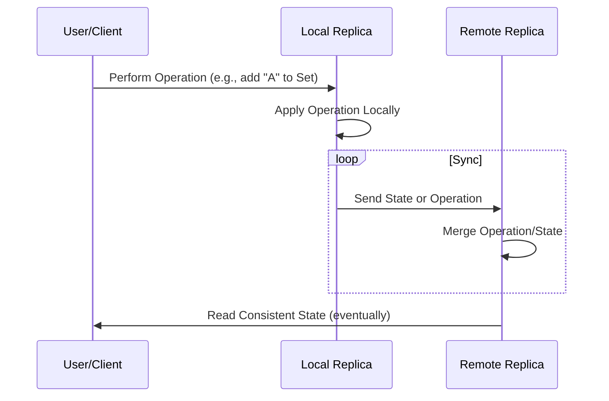
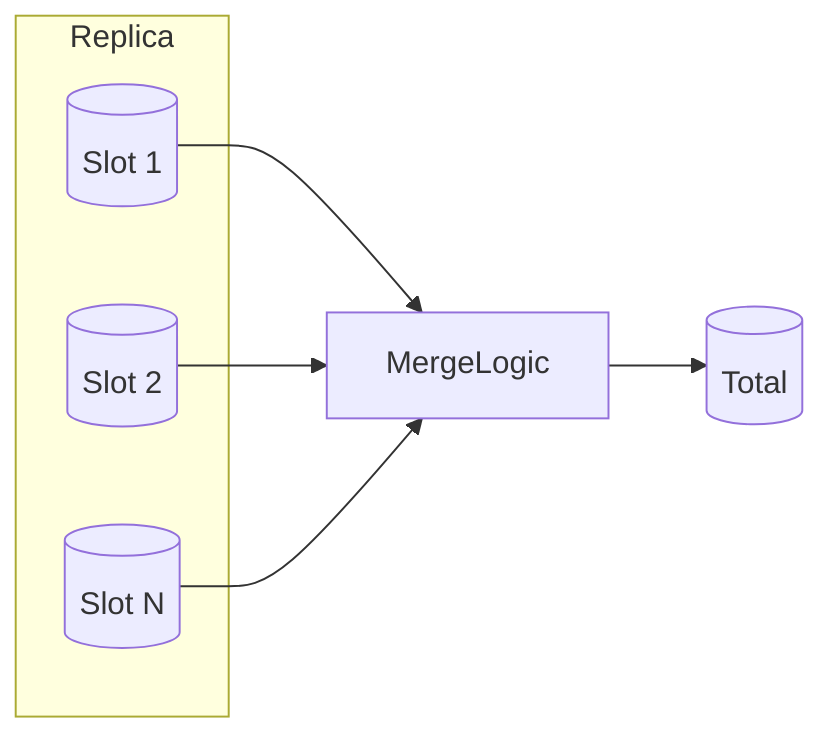

# CRDTs (Conflict-Free Replicated Data Types): A Technical Primer

## 1. Introduction: Context and Definition

Distributed systems, particularly those that span unreliable networks or operate under high availability constraints, must reckon with the dual challenges of data consistency and coordination. Traditional strong consistency models (e.g., linearizability or serializability) often become bottlenecks, as coordinating updates across distributed components incurs significant latency and system fragility, especially under partition. Eventual consistency, an alternative consistency model prioritized in many real-world systems (such as NoSQL databases and collaborative applications), demands mechanisms that ensure convergence—divergent replicas must ultimately agree on state, even in the presence of delays, concurrent updates, and temporary disconnections.

**Conflict-Free Replicated Data Types (CRDTs)** are families of data structures expressly designed for such settings. CRDTs enable multiple replicas to update data concurrently, propagate their local updates asynchronously, and converge automatically—without coordination or conflict resolution—provided only that all updates are eventually delivered. This property is foundational for decentralized architectures, real-time collaboration, peer-to-peer protocols, edge computing, and geo-replicated stores.

**Formal Definition:**  
A CRDT is a data type designed such that, when its state is replicated across multiple nodes, any sequence of local operations (including concurrent mutations) and subsequent state merges leads to a convergent, conflict-free replica state, so long as all updates eventually propagate to all replicas.

## 2. Consistency Models and the Role of CRDTs

CRDTs primarily address **eventual consistency**, a model described in systems literature as "if no new updates are made to a given data item, eventually all accesses will return the last updated value." Importantly, they do so without coordination—meaning:

- No distributed locks required for reads or writes
- Operations can be commutative, associative, and idempotent
- Merges can be computed locally

This is in contrast to consensus-based solutions (e.g., Paxos, Raft) or systems that employ multi-phase commit or distributed locking, which guarantee strong consistency at the expense of availability or partition tolerance (see **CAP Theorem**).

CRDTs do **not** provide strong consistency guarantees such as linearizability or serializability. Instead, they guarantee:

- **Strong Eventual Consistency:** If all operations have been delivered to all replicas, then all replicas will have the same state.
- **Convergence and Monotonicity:** The state only moves forward in the lattice defined by the CRDT, and all state transitions are monotonic (i.e., a replica never "forgets" an update).

CRDTs are especially useful in scenarios where:

- Low-latency local updates are necessary (no round-trips for writes)
- Network partitions, offline work, or intermittent connectivity are expected
- Data needs can be satisfied with eventual convergence

## 3. Core Concepts of CRDTs

CRDTs come in two main forms, both designed to achieve convergence, but by different mechanisms:

### 3.1 State-based CRDTs (Convergent Replicated Data Types, CvRDTs)

- **Full Replica State Dissemination:** Replicas periodically exchange their entire local state (or, with optimization, compact state deltas) with each other.
- **Merge Function:** Each replica defines a deterministic, commutative, associative, and idempotent merge function that combines another replica's state into its own.
- **Gossip Protocols** are often used to disseminate state.

### 3.2 Operation-based CRDTs (Commutative Replicated Data Types, CmRDTs)

- **Operation Dissemination:** Replicas propagate the operations themselves (rather than entire state). Each update is sent as a message to other replicas.
- **Commutative, Idempotent Updates:** All operations must commute when delivered out of order, and must be either reliably delivered exactly once or must be designed to be idempotent.

**Both approaches** achieve strong eventual consistency, but differ in bandwidth, implementation tradeoffs, and requirements for message ordering or reliable delivery.

### 3.3 Common Properties

- **Commutativity:** Operations produce the same result regardless of order.
- **Associativity:** Grouping of operations does not affect the result.
- **Idempotency:** Re-applying the same update does not change the result after the first application.

These properties collectively allow replicas to process concurrent, delayed, or duplicated messages without risk of conflicting or diverging state.

## 4. Architectural Overview

Below is a Mermaid diagram representing the general system architecture of a distributed data store leveraging CRDTs. Each replica accepts user inputs, applies local updates immediately, and later synchronizes with peers.

```mermaid
flowchart TD
    ClientA[User A's Device]
    ClientB[User B's Device]
    ReplicaA[Replica A (CRDT State)]
    ReplicaB[Replica B (CRDT State)]
    Network[Network]
    ClientA -- "Update Op" --> ReplicaA
    ClientB -- "Update Op" --> ReplicaB
    ReplicaA -- "State / Ops" -->|sync| ReplicaB
    ReplicaB -- "State / Ops" -->|sync| ReplicaA
    ReplicaA -- "Local Read" --> ClientA
    ReplicaB -- "Local Read" --> ClientB
    ReplicaA -.-> Network
    ReplicaB -.-> Network
```

In practice:

- Clients interact only with their local replicas.
- Replicas synchronize periodically or opportunistically.
- Synchronization consists of either operations or merged state, depending on CRDT type.

## 5. CRDT Taxonomy: Data Types and Semantics

### 5.1 Registers

**Last-Writer-Wins Register (LWW-Register):**  
Stores a single value with accompanying timestamp or version vector. When merging, the value with the "highest" timestamp or causal version wins.

**Multi-Value Register:**  
Tracks all concurrent values, only converging when conflicts are resolved or become causally ordered.

### 5.2 Counters

- **G-Counter (Grow-only Counter):** Only increments, cannot decrement.
- **PN-Counter (Positive-Negative Counter):** Supports both increment and decrement via separate internal structures per operation.

### 5.3 Sets

- **G-Set (Grow-only Set):** Items only added.
- **2P-Set (Two-Phase Set):** Supports add and remove, but removed items never re-added.
- **OR-Set (Observed-Remove Set) / Add-Wins Set:** Supports add and remove; tracks causal context to correctly resolve concurrent add/remove.

### 5.4 Maps, Sequences, and Advanced Structures

- **LWW-Element-Map:** Key-value map where each key uses an LWW policy.
- **CRDT Lists / Sequences:** For collaborative text editors (e.g., Logoot, RGA); handle positional inserts/deletes.
- **Composite CRDTs:** Maps or sets where elements are themselves CRDTs (recursive composition).

## 6. How CRDTs Work in Practice

### 6.1 Local Updates

Local updates (e.g., user edits, increments, adds) are immediately applied to the local CRDT replica without global coordination or blocking. For example, in a G-Counter, an increment simply increases a local counter shard.

### 6.2 Propagation and Synchronization

Depending on CRDT flavour:

- **State-based:** Replica periodically sends its entire state (or deltas) to peers, who merge the received state into their own.
- **Operation-based:** Replica disseminates each update operation as it occurs.

Both guarantee convergence if all state or all operations eventually arrive, regardless of ordering or duplication.

### 6.3 Conflict Resolution (Implicit by Design)

CRDTs encode all concurrency handling into their merge logic. Unlike with version vectors or operational transformation, no out-of-band resolution is needed.

#### Example: OR-Set Operation Merge

Suppose two replicas concurrently add and remove the same element `x`. Each operation is tagged with a causal identifier; during merge, the set retains or discards `x` according to merge rules (e.g., add-wins, remove-wins), using its metadata to resolve causality.

### 6.4 Typical Workflows



### 6.5 Fault Tolerance and Partition Handling

CRDTs, by construction, tolerate partitions. Local operations proceed even under total network isolation. On reconnect, state/operation dissemination and merge yields the same result as if operations had happened sequentially.

## 7. Data Structure Internals: Implementation Patterns

### 7.1 State-based CRDT Example: G-Counter

A **G-Counter** is an integer counter supporting only increments.

**Internal State:**  
- Each replica maintains an array/vector of counters, one slot per replica.
- On increment, a replica only updates its own slot.
- On merge, maximum value per slot is chosen.



**Increment:** Add 1 to local slot  
**Merge:** For each slot, retain max value (monotonicity).  
**Read:** Sum of all slots.

### 7.2 Operation-based CRDT Example: PN-Counter

Similar to G-Counter, but with two counters (positive and negative).

**Internal State:**  
- P (increment): G-Counter  
- N (decrement): G-Counter  
**Total = P - N**

### 7.3 Set CRDT Example: OR-Set

Each element is associated with (replica, unique-id) pairs.

- **Add:** Add element tagged with a unique identifier.
- **Remove:** Remove all identifiers for an element observed so far.
- **Merge:** Union of add tags; remove applied as tombstones for all known tags.

## 8. Detailed Operational Properties

### 8.1 Commutativity, Associativity, and Idempotency

These algebraic properties make CRDTs highly tractable to formal reasoning:

- **If an operation is replayed any number of times, result is unchanged.**
- **If operations are delivered out of order, result is the same.**
- **If messages are batched or combined, result is the same (for state-based CRDTs).**

### 8.2 Causality Tracking

Some CRDTs (OR-Set, multi-value register, sequence CRDTs) require **causal metadata** to resolve concurrency, typically in the form of version vectors, unique operation IDs, or timestamps.

## 9. Practical Engineering Considerations

### 9.1 Integration Points

- **Databases & Storage:** CRDTs are used in systems such as Riak, Redis (modules), Akka Distributed Data, and Microsoft Azure Cosmos DB.
- **Collaborative Applications:** Real-time editors (e.g., Automerge, Yjs, ShareDB with CRDT backends) often utilize CRDT lists/sequences.

### 9.2 Performance Implications

- **State Size:** State-based CRDTs (especially sets/counters with per-replica slots) may grow linearly with number of replicas or inserted elements.
- **Operation Overhead:** Operation-based CRDTs require reliable operation dissemination; duplicated or out-of-order operations do not corrupt state but may increase network traffic.
- **Metadata Ballooning:** Causality (e.g., version vector) metadata can become large; mitigation strategies include compacting, pruning, or garbage collection.
- **Synchronization Frequency:** More frequent merges propagate convergence quickly, but increase network/CPU utilization.

### 9.3 Implementation Challenges

- **Replica Identity Management:** State-based CRDTs with per-replica slots must maintain persistent, globally unique replica identifiers.
- **Replica Churn:** When replicas appear and disappear, especially in edge or IoT settings, state vectors may leak, requiring compaction strategies.

> **Warning:**  
> Careless CRDT use in open-ended or dynamic replica environments may lead to unbounded state growth, unless garbage collection or state pruning is implemented.

### 9.4 Consistency Guarantees and Limitations

- **No Strong Consistency:** Simultaneous conflicting operations are merged, not serialized; if application invariants require serializability, CRDTs alone are insufficient.
- **Application-Level Invariants:** CRDTs generally satisfy convergence and per-type invariants (e.g., no negative counter for G-Counter), but not arbitrary application invariants (e.g., referential integrity across multiple data types).

> **Note:**  
> Application-level invariants spanning multiple CRDTs may require external validation or additional consistency protocols.

### 9.5 Security Considerations

- **Trust Model:** In open systems, malicious parties could craft CRDT states or operations to corrupt data. CRDT frameworks must pair with authentication and integrity mechanisms.
- **Replay Attacks:** Idempotency mitigates many replay attacks, but unique operation/causal IDs should be unpredictable where adversarial injection is possible.

## 10. Variations and Advanced Patterns

### 10.1 Delta-State CRDTs

Optimized state-based CRDTs propagate only the "delta" (state changes) since the last sync, reducing bandwidth costs. All delta-CRDTs must ensure that the set of deltas is functionally equivalent to applying the full state.

### 10.2 Versioned or Layered CRDTs

CRDTs layered within higher-level structures (e.g., a map of OR-Sets) allow fine-grained sharing, synchronization and garbage collection on per-key basis.

### 10.3 Bounded CRDTs

Some CRDTs propose mechanisms for **bounded state**, limiting causal metadata using time-to-live (TTL), sliding windows, or tombstone expiration, at the cost of possible convergence delay or correctness loss in rare edge cases.

### 10.4 Hybrid Approaches

Combining CRDTs with consensus protocols (e.g., using CRDTs for "soft-state", consensus for configuration or critical sections) leverages the best of both paradigms.

## 11. Protocols and Standards

- **RFC 677 - A Hybrid CRDT Protocol for Geo-Replicated Datasets (IETF)**: Discusses techniques for geo-replicated settings.
- **W3C Linked Data Notifications (LDN):** Uses CRDT-inspired models for web notifications.

While there is no universal standard, many open-source projects (Riak, Redis CRDT modules, Automerge) provide reference CRDT implementations with well-documented APIs.

## 12. Application Examples

### 12.1 Distributed Counter in a Geo-Replicated Store

Suppose a cloud database must maintain a "likes" counter, updatable from any global data center:

- Each replica stores its own slot in a G-Counter.
- Updates applied locally.
- Replica-to-replica synchronization via periodic background jobs.
- All centers will eventually see the total sum correctly, regardless of local increments or network split events.

### 12.2 Collaborative Text Editing

- Text represented as a CRDT sequence (e.g., Logoot, RGA).
- Tools such as Automerge use CRDTs for collaborative JSON documents.
- Users insert, delete, and edit content locally; merges encode intentions without needing operational transformation.

### 12.3 Real-Time Shared Object State

- Multiplayer game state (e.g., player locations or shared resources) can be managed with CRDT maps or sets, enabling lag-tolerant updates without server arbitration.

## 13. Summary

CRDTs profoundly alter the landscape of distributed system design by decoupling convergence from coordination. Their algebraic underpinnings allow engineers to construct data types that resolve all conflicts automatically, provided only that all relevant updates are eventually delivered to all replicas. This unlocks a wide range of applications—from collaborative editing and offline-first mobile apps to geo-replicated databases—where low-latency local operations and resilience to network partitions are paramount.

> **Alert:**  
> CRDTs are a powerful class of data structures, but not a panacea: careful attention is needed to application invariants, metadata management, and security when integrating CRDTs into production systems. For workloads demanding strict serializability or transactional integrity, hybrid architectures combining CRDTs with consensus or transactional protocols should be considered.

---