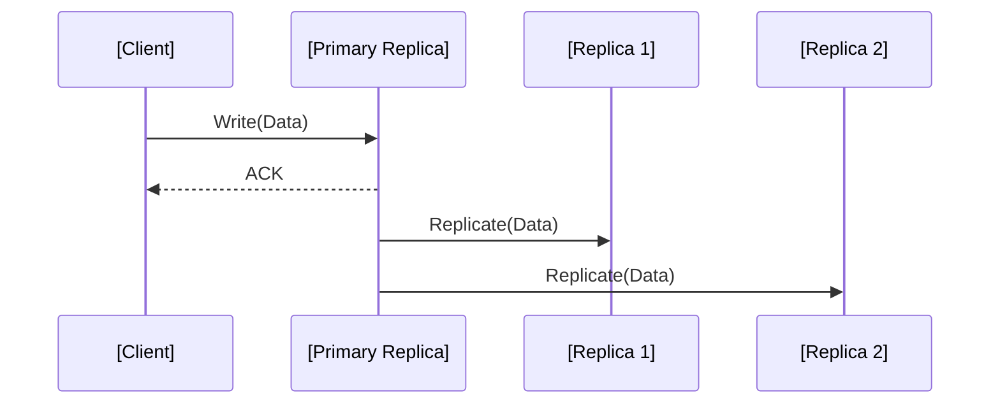
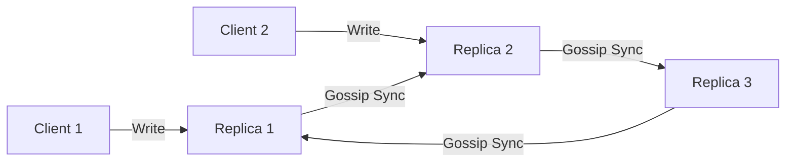
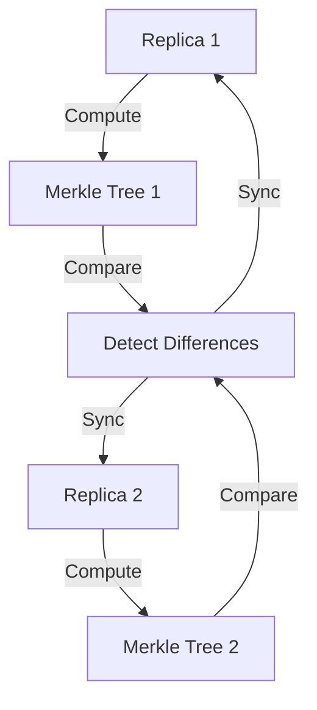
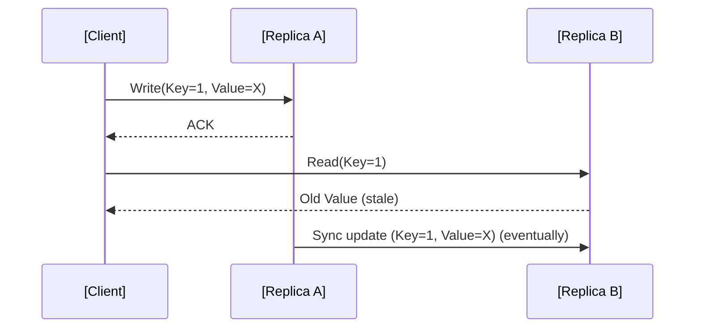

# Eventual Consistency: A Technical Primer

## Introduction

Eventual consistency is a consistency model used in distributed systems to achieve high availability and partition tolerance while relaxing strict synchronization guarantees. Under eventual consistency, system replicas may temporarily diverge, but are guaranteed to converge to the same state if no further updates are made to the data. This model is widely adopted in many modern cloud databases, distributed caches, and globally distributed storage systems.

This document provides a comprehensive introduction to eventual consistency for software engineers, including its motivations, working principles, common variations, relevant technical standards, and engineering considerations.

---

## 1. Background and Motivation

### 1.1 The Challenge of Consistency in Distributed Systems

Distributed systems often maintain multiple replicas of data across nodes for reasons such as fault tolerance, scalability, and geographical proximity. Ensuring that all replicas have the same data at the same time (strong consistency) is costly or impossible under certain failure scenarios—especially under a network partition.

The trade-off between consistency, availability, and partition tolerance is formalized in the **CAP Theorem** (Eric Brewer, 2000):

- **Consistency (C):** Every read receives the most recent write or an error.
- **Availability (A):** Every request receives a (non-error) response—without guarantee that it contains the most recent write.
- **Partition tolerance (P):** The system continues to operate despite arbitrary network partitioning.

Eventual consistency is one of several relaxed or "weak" consistency models designed to provide high availability and partition tolerance, sacrificing strict guarantees for better operational characteristics.

---

## 2. Definition of Eventual Consistency

**Eventual consistency** is defined as a model where, as long as no new updates are made to a given data item, all accesses to that item will eventually return the last updated value. Provided the system continues to operate and propagate updates, all replicas will ultimately converge to the same final (correct) value.

Key characteristics:
- **Temporary divergence:** Replicas may observe or return stale or inconsistent data for a bounded or unbounded period.
- **Convergence:** After updates cease and sufficient time (bounded by propagation and conflict resolution), all replicas present an identical value.

### 2.1 Formal Property

Let D be some piece of distributed data. Eventual consistency states:

> For any two replicas r1 and r2 storing D, if no updates are made to D for a "long enough" period, then r1 and r2 will eventually return the same value on reads.

Note: Unlike strong consistency (such as linearizability or serializability), eventual consistency does not define how long the system may remain inconsistent.

---

## 3. Core Concepts

### 3.1 Eventual Consistency vs Strong Consistency

| Property               | Eventual Consistency                       | Strong Consistency                    |
|------------------------|--------------------------------------------|---------------------------------------|
| Read-after-write       | May see stale values                       | Always sees the latest value          |
| Availability during Partition | High                            | May be unavailable                    |
| Write latency          | Low (asynchronous propagation)             | Potentially high (requires coordination) |
| Use cases              | DNS, caches, social networks               | Relational databases, payments        |

### 3.2 Replication and Update Propagation

Most systems achieving eventual consistency rely on **asynchronous replication**. Updates are applied locally at the primary or coordinator node, then propagated to other replicas in the background.

#### Mermaid Diagram: Asynchronous Update Propagation

- Write is acknowledged to the client as soon as it is applied on the coordinator—not after all replicas are updated.
- Replication to other nodes occurs asynchronously, opening up windows where clients may observe differences between replicas.

### 3.3 Consistency Guarantees

Eventual consistency provides only eventual convergence. The following may NOT be guaranteed (unless additional mechanisms are employed):

- **Read-your-writes:** A client may read stale data immediately after writing.
- **Monotonic reads:** Reads may return values that are "older" than previous reads.
- **Causal consistency:** Update order may not be preserved.

Systems may implement **session guarantees** (e.g., read-your-write, monotonic reads) atop eventual consistency to enhance user experience.

---

## 4. Practical Realizations and Variations

### 4.1 System Architecture Patterns

Distributed systems providing eventual consistency can be architected variously, most commonly:

- **Leader-based (Primary-Secondary):** A single "leader" replica handles writes and distributes updates; followers (secondaries) apply updates asynchronously.
- **Leaderless:** Any replica may accept writes; anti-entropy mechanisms (e.g., read repair, gossip) synchronize state across nodes over time.

#### Mermaid Diagram: Leaderless Eventual Consistency

**Leaderless architectures** (e.g., Amazon Dynamo, Cassandra) use mechanisms such as vector clocks and conflict resolution to merge divergent updates.

### 4.2 Conflict Resolution

Divergent replicas require strategies for resolving conflicting updates. Common approaches include:

- **Last Write Wins (LWW):** Rely on timestamps; the latest timestamp prevails.
- **Version Vectors or Vector Clocks:** Allow concurrent updates to be detected and resolved using causality or application-specific logic.
- **CRDTs (Conflict-Free Replicated Data Types):** Data structures that can be merged in any order and still converge deterministically.

**GitHub Alert**
> ⚠️ **Tip:** Systems that only perform LWW conflict resolution risk losing concurrent updates. Use CRDTs or application-level resolution where possible.

### 4.3 Anti-Entropy and Synchronization

To converge state, eventual consistency systems use **anti-entropy protocols** such as:

- **Read Repair:** During a read, replicas compared and missing updates reconciled.
- **Merkle Trees:** Efficiently summarize replica states to detect and synchronize only divergent data efficiently.
- **Background Sync (Gossip):** Replicas periodically exchange state information and resolve differences.

#### Mermaid Diagram: Anti-Entropy (Merkle Tree Diff)

---

## 5. Assumptions and Constraints

### 5.1 Assumptions

- **Reliable Delivery:** Eventually, all update messages reach all replicas.
- **No Permanent Partitions:** Network partitions eventually heal; otherwise, consistency cannot be restored.
- **Sufficient Storage:** Nodes must store enough metadata (e.g. version vectors) to detect and resolve conflicts.

### 5.2 Timeout and Bounded Staleness

Eventual consistency does not bound the time or number of versions by which data may be stale. Some extensions provide **bounded staleness** or **tunable consistency**, where the system administrator can set parameters for acceptable delay or divergence (e.g., Dynamo’s N, R, W configuration).

---

## 6. Practical Engineering Considerations

### 6.1 Integration Points and Application Fit

Eventual consistency is most suitable where:

- Application logic can tolerate temporary inconsistencies or stale reads (e.g., timelines, product catalogs).
- Absolute recency is less important than availability and partition tolerance.
- Conflict resolution logic is simple or can be moved to the application layer.

**GitHub Alert**
> ⚠️ **Caution:** Eventual consistency is inappropriate for systems with strict transactional requirements, such as financial ledgers or inventory counts.

### 6.2 Latency and Throughput

- Eventual consistency enables lower *write* latency, as coordination is reduced.
- Systems achieve higher write throughput due to asynchronous propagation and lack of synchronization bottlenecks.

### 6.3 Implementation Challenges

- Designing effective, correct conflict resolution strategies.
- Preventing "write amplification" where repeated anti-entropy syncs overload networks.
- Balancing frequency of anti-entropy with acceptable staleness for critical data.

### 6.4 Failure Modes and Observability

- Unobserved failures (e.g., silent data corruption) can cause persistent divergence.
- Monitoring tools must track both the number of inconsistent replicas and staleness metrics.
- Diagnostic logs should include replication lag, vector clocks, and sync timestamps.

### 6.5 Security Considerations

- Asynchronous update propagation may expose time windows where sensitive data is missing, incomplete, or inconsistent across replicas.
- Access control and encryption must be enforced *per replica*, as no consistency guarantee ensures updates to ACLs or data immediately propagate to all nodes.

---

## 7. Related Models and Extensions

### 7.1 Tunable Consistency

Some databases (e.g., Amazon Dynamo, Apache Cassandra) let users tune consistency requirements by selecting read and write "quorum" sizes per operation. This provides a spectrum between "eventual" and "strong" consistency depending on use case.

### 7.2 Causal Consistency

A stronger model, **causal consistency**, ensures that cause-and-effect relationships between updates are preserved, but still allows greater availability than strong consistency. Mechanisms such as vector clocks and session guarantees underlie causal consistency, and in some cases can be layered atop eventually consistent stores.

### 7.3 CRDT-based Eventual Consistency

Using **Conflict-free Replicated Data Types (CRDTs)** ensures that all replicas automatically converge without complex conflict resolution logic, regardless of update order or timing.

**Reference:** 
- _Shapiro, M. et al., “A comprehensive study of Convergent and Commutative Replicated Data Types,” INRIA Research Report, RR-7506, 2011._
- _RFC 677: Entity Tags for HTTP (Use of Merkle Trees for Efficient Consistency Checking)_

---

## 8. Example: Client Read/Write Patterns and Consistency

Consider a client in a globally distributed store with three replicas in different regions.

#### Mermaid Diagram: Read-after-write Anomaly

The client writes a value to one replica, then reads from another. If replication lag exists, the client observes stale state. Eventually, replicas synchronize and future reads reflect the new value everywhere.

---

## 9. Summary Table: Eventual Consistency at a Glance

| Characteristic             | Description                          |
|----------------------------|--------------------------------------|
| Consistency model          | Weak; only convergence is guaranteed |
| Write latency              | Low                                  |
| Read latency               | Variable, may be affected by staleness |
| Partition tolerance        | High                                 |
| Conflict resolution        | Required (LWW, vector clocks, or CRDTs |
| Use cases                  | DNS, social feeds, shopping carts, distributed caches |
| Typical databases          | Dynamo, Cassandra, Riak, Couchbase   |

---

## 10. Conclusion

Eventual consistency is a foundational concept in distributed system design, enabling high-availability, partition-tolerant architectures suitable for a broad class of real-world applications. Its use necessitates trade-offs in application semantics, conflict resolution, and correctness guarantees. Software engineers must understand the workflow, operational constraints, and appropriate use cases to effectively integrate eventually consistent systems.

---

**Note**
> _Diagram to be added later: State diagram of eventual-consistency convergence process._