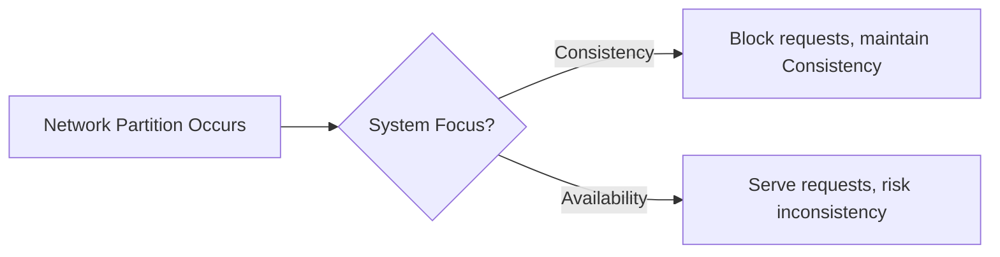
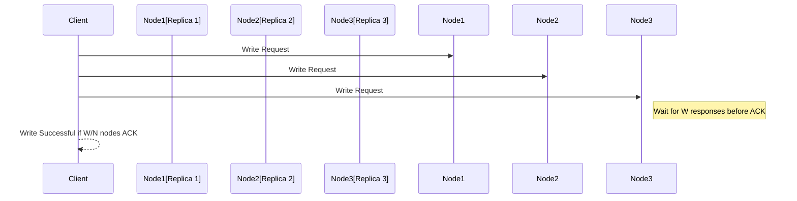
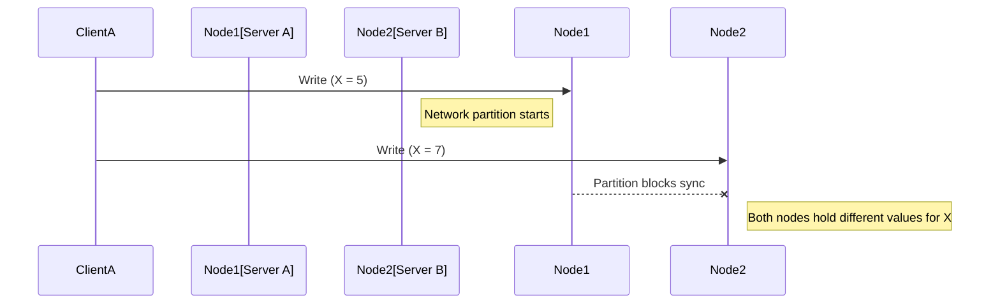
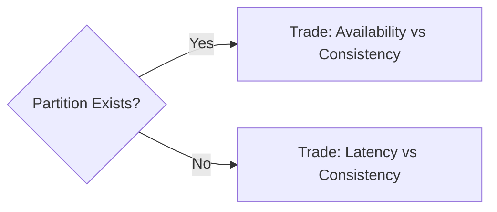

# CAP Theorem: Fundamentals and Trade-offs in Distributed Systems

## Introduction

The CAP Theorem is a foundational result in distributed systems, describing the inherent trade-offs between **Consistency**, **Availability**, and **Partition Tolerance** for any shared-data system subject to network failures or partitions. Formulated by Eric Brewer in 2000 (popularly known as "Brewer's Theorem") and formally proved by Lynch and Gilbert in 2002, the theorem delineates what is achievable in the presence of system partitions.

The CAP Theorem guides engineers in making design decisions about databases and distributed infrastructure, directly influencing architecture, protocols, and system behavior under network failure.

## Technical Context

Distributed systems consist of multiple nodes (servers, processes, or databases) communicating over a network to provide a unified service. Examples include distributed databases, microservices architectures, and replicated key-value stores. In distributed systems, communication failures (network partitions), node failures, or inconsistent state updates are inherent risks.

Complexity arises because engineers wish to achieve:

- **A consistent view of data across all replicas (Consistency)**
- **System availability even if some components fail or are unreachable (Availability)**
- **Correct functioning in the presence of network partitions (Partition Tolerance)**

CAP formalizes the limits on achieving these properties simultaneously.

## Formal Definition of the CAP Theorem

**Statement:** In the presence of a network partition, a distributed system can provide at most two out of the following three guarantees:

1. **Consistency (C):** All nodes see the same data at the same time. After an update completes, all subsequent accesses will return the updated value, or an error if not available.
2. **Availability (A):** Every request (read or write) receives a (non-error) response – without a guarantee that it contains the most recent write.
3. **Partition Tolerance (P):** The system continues to operate, despite any arbitrary partitioning (communication break) of the network.

### Diagram: CAP Triangle

```mermaid
graph TD
    A[Consistency (C)]
    B[Availability (A)]
    C[Partition Tolerance (P)]
    subgraph Legend
    note[At most two properties can be achieved simultaneously during a partition]
    end
    A -- CAP Theorem --> B
    B -- CAP Theorem --> C
    C -- CAP Theorem --> A
```

## Detailed Explanation of Core Concepts

### Consistency

Consistency in CAP refers to **linearizability**—each read receives the result of the most recent write or an error if not available. This is stricter than eventual or causal consistency; it is a guarantee of single-copy correctness. Many distributed systems relax this definition to improve performance or availability.

### Availability

Availability is defined as every request received by a non-failing node in the system must result in a response, without guarantee that it is the most up-to-date data. Availability focuses on successful responses, not correctness, under partitioned operation. Note that in the presence of a partition, both sides of the partition may still serve requests independently.

### Partition Tolerance

Partition tolerance means the system continues to operate, even if network failures prevent some nodes from communicating with others. Network partitions are considered inevitable in large-scale distributed systems (due to failures, scalable architectures, etc.), so practical distributed systems usually require partition tolerance.

## Partition Scenarios and Trade-Offs

Consider a cluster of nodes. A network partition divides nodes into disjoint sets unable to communicate. The system must make a real-time trade-off:

- **Favor Consistency:** Block requests that might yield inconsistent results. Sacrifice availability.
- **Favor Availability:** Serve requests with possibly stale or divergent data. Sacrifice strong consistency.

### Diagram: Partition-Induced Trade-off

```mermaid
graph TD
    subgraph Partitioned_Network
    A1[Node Group 1]
    A2[Node Group 2]
    end
    Client1[Client 1] --> A1
    Client2[Client 2] --> A2
    A1 --x-- A2
    A1 -. "Serve requests?" .-> A2
    %% A1 and A2 cannot synchronize due to partition
    %% Highlight decision: block vs. serve
    A1 --|Block for Consistency| Decision1[Block Requests]
    A2 --|Serve for Availability| Decision2[Serve Stale]
```

## CAP Theorem in Practice

### Practical Implications

#### No Partition, All Three

If no partition occurs, a system can provide consistency and availability simultaneously. This is commonly the case in tightly coupled databases and single-node systems.

#### During a Partition

When a network partition occurs:

- **CA systems** (Consistency + Availability, no Partition Tolerance): Not practical for distributed systems expected to experience failures.
- **CP systems** (Consistency + Partition Tolerance): System remains consistent but may become unavailable to some users (e.g., distributed databases that reject writes on network error).
- **AP systems** (Availability + Partition Tolerance): System remains responsive, but different parts may serve stale/correct data, sacrificing consistency (e.g., eventually consistent databases).

### Examples in System Design

- **CP (Consistency + Partition Tolerance):**
    - HBase, MongoDB (with strong consistency configurations), traditional relational databases using a leader/follower replication during partition (e.g. PostgreSQL with synchronous replication).
- **AP (Availability + Partition Tolerance):**
    - DynamoDB, Cassandra, Couchbase, Riak – These remain available but relax consistency constraints under partitions.
- **CA (Consistency + Availability):**
    - Not attainable if partitions are possible; only applies to single-node systems or those assuming a perfectly reliable network.

### Diagram: System Choices Under Partition



## Consistency Models Beyond CAP

Real-world systems often implement weaker consistency models to offer better availability or partition tolerance. Notable models include:

- **Eventual Consistency:** Updates propagates to all nodes, but reads may be stale for some window of time.
- **Causal Consistency:** Operations that are causally related are seen by all nodes in the same order.
- **Strong Consistency (Linearizability):** All operations appear instantaneously at a single, global point.

**GitHub Alert**
> :bulb: **Tip:** CAP consistency implies linearizability. Other types (eventual, causal, monotonic) are weaker than CAP's notion of consistency, providing alternative design trade-offs.

## Core System Architectures and Protocols

### Quorum-Based Systems

Many distributed storage systems use quorum protocols to balance CAP properties. In a **quorum system**, read and write operations require responses from a minimum subset of replicas (e.g., *W* out of *N* writes succeed; *R* out of *N* reads). The system’s configuration of R (reads) and W (writes) determines its positioning on the CAP spectrum:

- R + W > N gives strong consistency (assuming no network partitions).
- Reducing R or W grants higher availability but permits stale reads.

### Diagram: Quorum Reads and Writes



### Consensus Protocols

Protocols like **Paxos** and **Raft** ensure consistency and partition tolerance, at the cost of reduced availability under partition. They require a majority (quorum) of replicas to agree to commit an operation.

- **Paxos:** Proven, highly fault-tolerant; complex, widely used in databases and coordination services.
- **Raft:** Simplified, understandable variant on Paxos; used in etcd, Consul.

**GitHub Alert**
> :warning: **Caution:** Quorum and consensus systems will become unavailable for certain operations if they cannot reach a majority due to partition or node failure.

### Eventually Consistent Systems

Systems prioritizing availability and partition tolerance (AP) often adopt **eventual consistency**, using background synchronization to resolve inconsistencies post-partition (e.g., **anti-entropy** sync in Dynamo-style databases).

## Implementation Challenges & Engineering Trade-Offs

### Real-World Partition Scenarios

Partitions are not limited to total network failures; they also arise from:

- Packet loss, high latency, or partial outages.
- Process crashes or network saturations.
- Cloud or multi-region communication failures.

**GitHub Alert**
> :warning: **Warning:** Network partitions are not rare events in large distributed systems—engineers should assume they will occur and design accordingly.

### Impact on Application Design

- **Write Conflicts:** AP systems must reconcile divergent updates (e.g., using timestamps, vector clocks, conflict resolution procedures).
- **Latency:** Maintaining consistency (especially strong consistency) often increases response times due to coordination overhead.
- **Consistency Guarantees:** Applications must be designed to tolerate reading stale data or to handle data reconciliation.

### Diagram: Write Conflict in AP System



### Versioning and Conflict Resolution

Common AP-system approaches for conflicts:

- **Last Writer Wins (LWW):** Timestamps to determine latest write.
- **Vector Clocks:** Track causality among updates to enable merging.
- **Application-Defined Merge Policies:** Custom logic at reconciliation time.

### Operational Considerations

#### Monitoring and Failure Detection

Detecting partitions and failover is non-trivial. False positives (assuming a partition due to transient delays) and false negatives (not noticing a real partition) can both yield service unreliability or data loss.

#### System Configuration

Operations such as scaling, node replacement, rolling upgrades, and physical network changes must account for CAP implications; e.g., too-aggressive failover can lead to split-brain scenarios and data divergence.

## Advanced Variations and Theoretical Extensions

### PACELC Model

The **PACELC theorem** extends CAP, recognizing that even when there is no partition (Else), there's a trade-off between **latency** (L) and **consistency (C)**. The PACELC framework:

- **If there is a Partition (P), the system must choose between Availability (A) and Consistency (C).**
- **Else (E), even without a partition, the system must trade off Latency (L) for Consistency (C).**

This addresses real-world requirements for both high availability and low latency.

### Diagram: PACELC Trade-Off



## Constraints, Assumptions, and Limitations

- **CAP does not cover durability (D in ACID), performance, or scalability.** These must be considered separately.
- **CAP assumes partitions are binary events.** In practice, partial failures and performance outliers must also be managed.
- **Single-node and tightly-coupled systems can trivially provide all three properties** but sacrifice potential for scale-out and resilience.
- **CAP does not specify how to handle rejoining nodes or over what time windows inconsistencies might be tolerated** (see Eventual Consistency).

## Typical Engineering Decisions

- **AP or CP?** Choose based on application requirements for uptime versus strict consistency (e.g., user-facing social feeds can often accept AP; financial systems may demand CP).
- **Consistency Guarantees:** Select the weakest consistency compatible with correctness constraints.
- **Partition Handling:** Design for failure; epitomized by the maxim: "Partition tolerance is mandatory in real-world distributed systems."

**GitHub Alert**
> :book: **Note:** There is no single “right way” to apply CAP. Correct trade-offs depend on application semantics, tolerance for stale/duplicate/lost data, and user expectations.

## Conclusion

The CAP Theorem remains a critical theoretical tool for distributed system architects, shaping the understanding and design of fault-tolerant, scalable data infrastructure. Its primary legacy is not in mandating a certain system type but in forcing explicit, informed trade-offs among the desirable properties of consistency, availability, and partition tolerance.

### Key Takeaways

- **CAP Theorem**: Imposes a hard limit—any distributed, shared-data system can only provide two of Consistency, Availability, and Partition Tolerance in the presence of network partitions.
- **Design Choices**: Every major distributed system transparently or implicitly enforces a position on the CAP spectrum. Understanding these choices is essential to balancing correctness, uptime, and user experience.
- **Beyond CAP**: Advanced models, such as PACELC, and practical consistency frameworks allow additional nuance but do not negate the fundamental trade-offs.

**Systems designers should assume that partitions will occur and architect for explicit, composable guarantees accordingly.** 

---

**Note:** Diagram to be added later for a visual comparison of major distributed databases along the CAP spectrum.