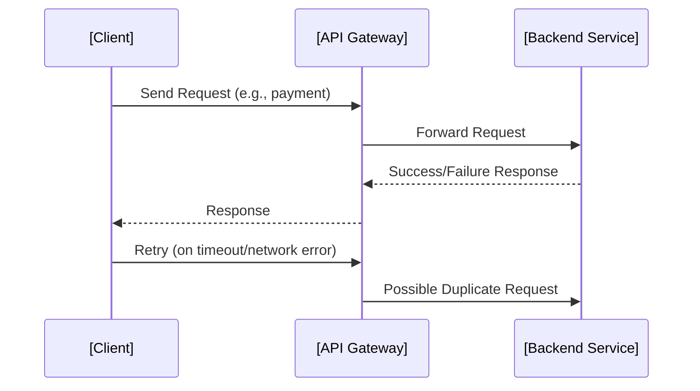
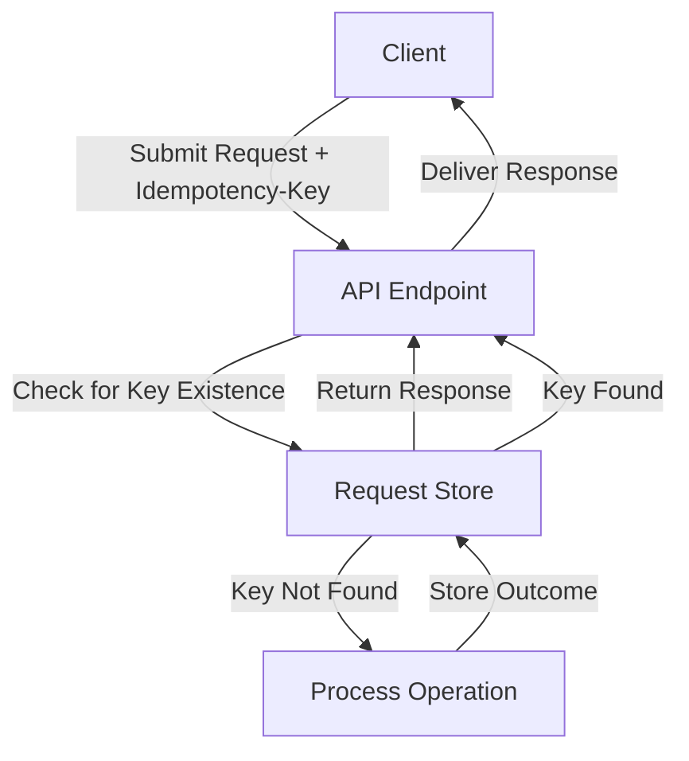
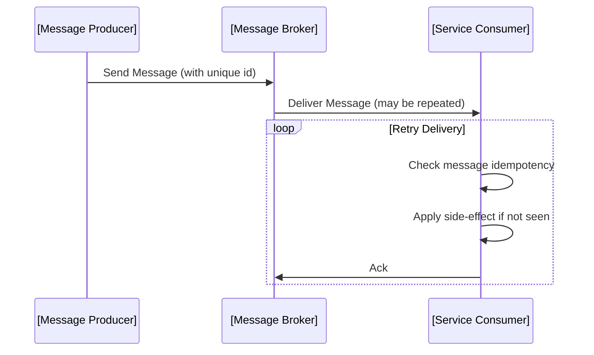
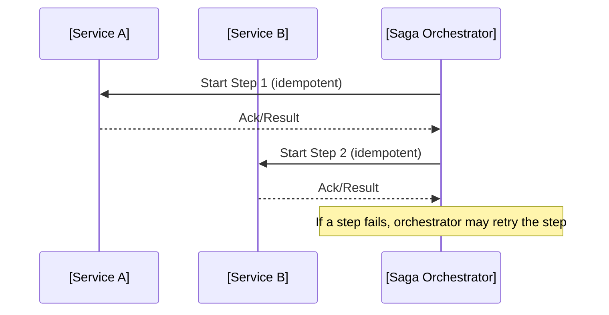

# Idempotency in Distributed Systems

## Introduction

Idempotency is a foundational concept in the design and operation of reliable distributed systems. In its essence, an operation is *idempotent* if performing it multiple times is equivalent to performing it once; repeated execution does not change the resulting state beyond the initial application. This property is critical for building systems that handle retries, duplicate messages, and failures gracefully, ensuring correct results even under adverse network and operational conditions.

This technical primer explores idempotency as employed within distributed systems, examining its precise definition, practical relevance, integration strategies, typical workflows, and prevalent pitfalls. It offers insights into the implications of idempotency for architecture, protocols, and implementation, providing a thorough grounding for software engineers engaging with distributed, fault-tolerant architectures.

---

## Defining Idempotency

### Mathematical Foundation

In mathematics, a function `f` is called idempotent if, for all inputs `x`, the following holds:

```
f(f(x)) = f(x)
```

Translating to distributed systems, an operation (such as an API call, database command, or message handling routine) is idempotent if applying it multiple times with the same parameters and in the same context results in a system state indistinguishable from applying it once.

### Examples

- Setting a user's email address to a specific value (as opposed to incrementing a value).
- Deleting a resource (e.g., an HTTP DELETE request, where repeated deletion is safe because the resource remains deleted).
- Deductive non-idempotent: incrementing a counter (`counter++`), which will produce a different result with each application.

---

## Idempotency in the Context of Distributed Systems

Distributed systems naturally involve a degree of uncertainty and unreliability—messages can be delayed, dropped, duplicated, or reordered due to network issues or component failures. Robust distributed systems aim to offer at-least-once, at-most-once, or exactly-once semantics for operations. Idempotency sits at the intersection of these guarantees, especially underpinning at-least-once delivery semantics.

Consider the following distributed system workflow:



Without idempotency, duplicate requests (due to retries or network issues) can cause unintended side effects, such as double billing, resource leaks, or data corruption.

---

## Core Concepts and Architectural Patterns

### Operation Idempotency

For an operation to be idempotent within a distributed system:

1. **The system must be able to determine whether an operation is a duplicate.**
2. **Replaying the operation must not alter system state if it has already been applied.**

#### Idempotency Key

A widely used mechanism is the notion of an *idempotency key*—a unique identifier that associates a request with a particular logical operation (such as a payment or a resource update). The system stores the key and associated result, returning the cached result for subsequent requests using the same key.



### Operation Types and Idempotency

Operations can be classified by their idempotency characteristics:

- **Naturally idempotent:** E.g., HTTP PUT to set a specific value.
- **Non-idempotent:** E.g., HTTP POST to increment a value, generate an order, or cause a side effect.

For non-idempotent operations, explicit idempotency strategies must be introduced.

### Idempotency in APIs

The HTTP standard addresses idempotency in RFC 7231 (HTTP/1.1 Semantics and Content), explicitly defining certain HTTP methods as idempotent (GET, PUT, DELETE, HEAD, OPTIONS, TRACE), and others (notably POST) as non-idempotent unless otherwise implemented.

#### Example: Payment API

For a payment system, clients might retry API calls due to network timeouts. If the CreatePayment API is not idempotent, the customer could be billed multiple times. Introducing an idempotency key avoids this scenario.

---

## Practical Implementation Approaches

### Idempotency Key Management

- **Client Responsibility:** Clients generate and attach an idempotency key per logical operation/request.
- **Server Responsibility:** Servers must persistently track processed keys and their outcomes for a period sufficient to prevent replay attacks or accidental duplicates.

#### Scope and Lifetime

- **Scope:** Per user/resource/system.
- **Lifetime:** Should cover at least the maximum possible client retry duration, potentially longer in the presence of delayed or retryable delivery.

### Persistence Strategies

Storing idempotency keys stably is crucial. Options include:

- Database tables keyed on idempotency key.
- In-memory caches (with reliability trade-offs).
- Distributed key-value stores.

**⚠️ Caution**
> Do **not** use in-memory storage alone in horizontally scaled systems or with failover, as data loss may cause idempotency to fail.

### Response Replay

When receiving a repeat request with the same idempotency key, the system returns the original result, including errors when appropriate. This ensures delivery semantics are upheld from the client's perspective.

### Failure Modes

**Key expiry:** If keys expire too soon, clients may experience duplicate side effects upon retries.  
**Key collision:** If keys are not globally unique, the wrong result may be returned to a request.

**💡 Tip**
> Use cryptographically strong, client-generated unique identifiers (UUIDv4, ULID, etc.) to prevent collisions.

---

## System Design Patterns and Considerations

### Stateless vs. Stateful Services

- **Stateless services** require external storage for idempotency tracking.
- **Stateful services** can persist idempotency alongside domain state changes (e.g., recording that a transfer has occurred).

### Exactly-Once Semantics

While true "exactly-once" delivery is challenging to guarantee in distributed systems without protocol or infrastructure support, idempotency often suffices when clients can ensure retries lead to safe, single logical outcomes. Protocols such as Apache Kafka's transactional messaging and at-least-once delivery in message brokers leverage idempotency to achieve practical exactly-once results.

### Integration with Message Processing

Distributed systems may process messages (events, commands) multiple times due to redelivery. Idempotency ensures that only the initial processing has side effects, subsequent ones are no-ops.



### Database Write Idempotency

Operations such as "INSERT IF NOT EXISTS" or "UPSERT" provide mechanisms for database-level idempotency, avoiding creation of duplicate records when duplicate messages are processed.

---

## Constraints and Assumptions

### Client Behavior

Clients must consistently reuse the same idempotency key for the same operation across retries. Otherwise, the server cannot correlate duplicate requests, and safety is lost.

### Storage Guarantees

Idempotency key tracking must be resilient to server restarts, crashes, and network partitions for as long as clients might retry requests.

### Performance Impact

- **Write Amplification:** Recording every idempotency key can increase backend writes.
- **Index and Storage Bloat:** Systems must provision storage for potentially large numbers of idempotency tokens, and periodically clean up expired entries.
- **Latency:** Checking and storing keys may introduce additional latency, requiring careful optimization under high load.

**🚩 Alert**
> Neglecting to manage idempotency key storage can degrade service reliability and resource usage over time.

---

## Common Pitfalls

1. **Partial Side Effects:** If an operation makes a partial change before a crash, replaying the "idempotent" operation may apply it again, leading to inconsistent state. Fix by ensuring atomic updates.
2. **Non-deterministic Operations:** Generating random values, timestamps, or using non-deterministic logic during handling of a supposedly idempotent operation will break idempotency.
3. **Improper Key Scope:** Using a key that is too broad (e.g., global) or too narrow (e.g., per request) can result in incorrect correlation. Always use a scope appropriate to the operation's semantics.
4. **Stale Result Return:** Returning outdated results when the resource state has changed since the original request violates client expectations. Bound idempotency key lifetime appropriately.

---

## Variation: Idempotent versus Safe

While idempotency ensures repeated operations don't change outcome, safety refers to an operation not causing harm regardless of state (cf. RFC 7231 for HTTP: a safe method is one that does not modify resources, such as GET). Engineers should distinguish between safe and idempotent when analyzing API operations and workflows.

---

## Idempotency and Eventual Consistency

Idempotency is commonly used in systems designed for eventual consistency, such as replicated databases or CQRS architectures. Since the same event may be replayed, idempotency guarantees each handler produces the correct result even under message duplication, reordering, or system failover.

---

## Idempotency and the Saga Pattern

The Saga Pattern decomposes long-lived, distributed transactions into a sequence of local transactions coordinated asynchronously. Each step must be idempotent to allow for recovery and replay—especially compensating steps.



**🔍 Note**
> [Diagram to be added later: Saga Pattern State Transitions.]

---

## Standards and References

- **HTTP/1.1 Specification (RFC 7231)**: Defines idempotent and safe methods.
- **RESTful API Best Practices**: Encourage explicit idempotency for resource creation/update.
- **Idempotent Receivers (Enterprise Integration Patterns)**: Message handler patterns for ensuring that duplicate messages do not cause duplicate side effects.

---

## Engineering Checklist

To effectively implement idempotency in distributed systems:

- Identify all operations that require idempotency (typically those with external effects or financial implications).
- Define the scope and structure of idempotency keys.
- Ensure keys are generated uniquely by clients for each logical operation.
- Store keys and related outcomes durably and within appropriate scope and lifetime.
- Return precisely the same response for duplicate requests with the same idempotency key.
- Regularly purge expired idempotency keys and results.
- Audit operations for atomicity and determinism.

---

## Conclusion

Idempotency stands as a crucial property for dependable distributed systems, enabling safe retries and simplifying error handling in the presence of network issues, failover, and unpredictable retry patterns. Engineering reliable distributed applications demands a thoughtful approach to idempotency: a clear delineation of key scopes, response handling, state management, and storage. By adhering to these principles and leveraging standard protocols and well-understood patterns, software engineers can ensure robust, fault-tolerant system behavior even in the face of inherent uncertainty in distributed environments.