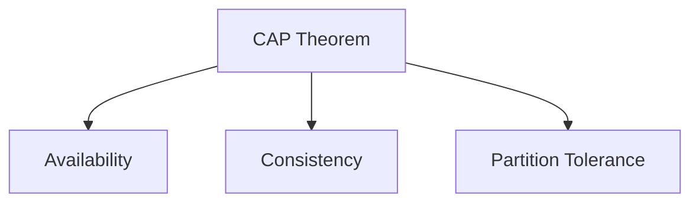
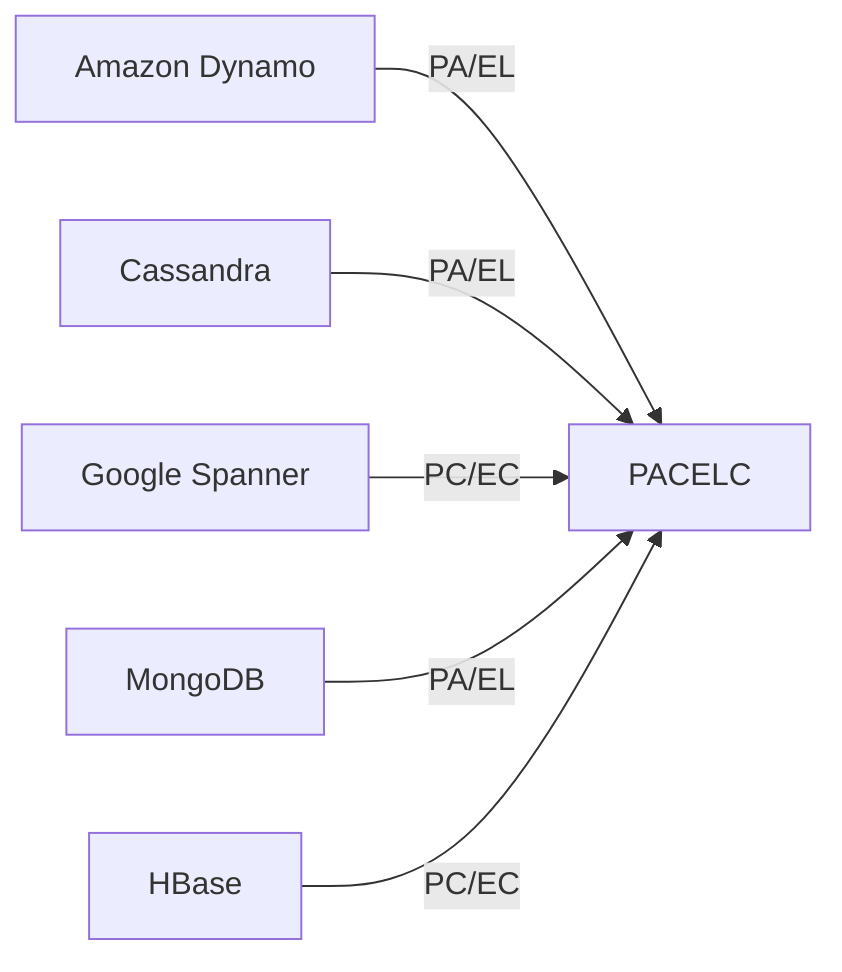
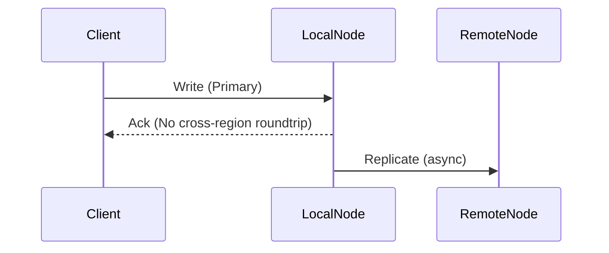
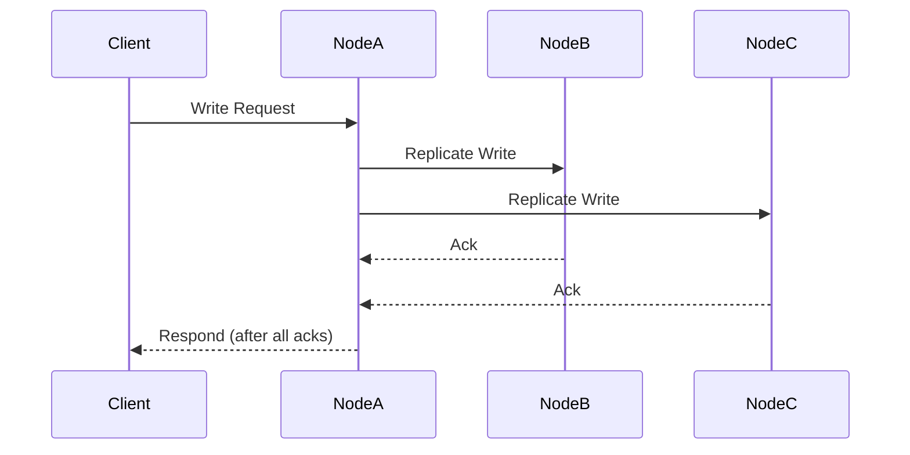

# PACELC Theorem: A Technical Primer

## Introduction and Context

Distributed systems design fundamentally grapples with trade-offs. The CAP theorem—stating that a system can provide only two of Consistency, Availability, and Partition Tolerance at any time—has served as the theoretical underpinning for much of distributed database and system architecture for the past two decades. Yet, as distributed systems evolved in complexity and importance, limitations in CAP's explanatory power became apparent.

CAP only considers trade-offs under network partitions ("when P then CA"). However, it omits trade-offs that exist even when no partition is present. In practical distributed systems, designers must frequently balance latency versus consistency, regardless of partitions.

The **PACELC theorem** addresses this critical gap. Proposed by Daniel J. Abadi in 2010, PACELC extends CAP by explicitly stating that when partitions do not occur, systems must still trade off latency and consistency. The theorem’s logic is encapsulated as:

> **If there is a partition (P), the system must trade off between Availability (A) and Consistency (C); Else (E), it must trade off between Latency (L) and Consistency (C).**

Thus, PACELC stands for **Partition–Availability–Consistency–Else–Latency–Consistency**.

This technical primer unpacks the PACELC model, explains why it matters, and describes its implications for engineers building and selecting distributed systems.

---

## 1. CAP Theorem Recap: Foundation for PACELC

### CAP Precursors

Let us first formalize the **CAP theorem**:

- **Consistency (C):** Every read receives the most recent write or an error.
- **Availability (A):** Every request receives a (non-error) response—without guarantee it contains the latest write.
- **Partition Tolerance (P):** System continues to operate despite arbitrary message loss or failure of part of the system.

The formal proof provided by Gilbert and Lynch (2002, MIT) shows that at any point during a network partition, a distributed system cannot simultaneously provide both Consistency and Availability.

Mermaid diagram below illustrates the original CAP triangle:



### Shortcomings of CAP

CAP only covers decision-making during network partitions. It is silent on normal operation (**no network partitions**), where the tradeoff between how quickly a system responds (**latency**) and how consistent the response is, becomes critical.

---

## 2. Defining PACELC

### The Theorem

The PACELC theorem synthesizes the reality that distributed systems face:

- Under **P**artition: must choose **A**vailability vs **C**onsistency
- **EL**se (no partition): must choose **L**atency vs **C**onsistency

Formally,

> **PACELC:** If there is a partition (P), the system must trade off between Availability (A) and Consistency (C); Else (E), it must trade off between Latency (L) and Consistency (C).

### Core Terms

- **Partition (P):** Loss of connectivity between nodes that may lead to a split network.
- **Availability (A):** The ability to always serve requests, even during partitions.
- **Consistency (C):** All nodes see the same data at the same time.
- **Else (E):** The case when no partition exists.
- **Latency (L):** The time required to serve a request (minimally, the time to replicate data across nodes).
- **Consistency (C) [again]:** In the context of no partitions, refers to how strictly the system guarantees all nodes reflect the latest write in responses.

### PACELC Visualization

```mermaid
flowchart TD
    P["Partition?"]
    A["Favor Availability"]
    C["Favor Consistency"]
    E["Else (No Partition)"]
    L["Favor Latency"]
    C2["Favor Consistency (Else)"]

    P -- Yes --> A
    P -- No --> E
    A -- "A/C tradeoff" --> C
    E -- "L/C tradeoff" --> L
    E -- "" --> C2
```

---

## 3. Classification of Distributed Databases by PACELC

Distributed databases make explicit design choices along both the partition and non-partition tradeoff dimensions. We describe these using **PACELC notation**—for example, "PA/EL" means "during Partition, favors A, Else, favors L."

### Examples

- **Amazon Dynamo:** **PA/EL** (Partition: favors Availability over Consistency; Else: favors Latency over Consistency).
- **Cassandra:** **PA/EL** (configurable, typically optimized for low latency and high availability).
- **Google Spanner:** **PC/EC** (Partition: favors Consistency; Else: favors Consistency, at the cost of higher latency).
- **MongoDB:** Default is **PA/EL** (with tunable consistency).
- **HBase:** **PC/EC** (strong consistency across partitions, latency-tolerant).

#### Database PACELC Matrix



---

## 4. Architectural Implications

### 4.1 System Operation: Partitioned and Non-Partitioned States

A robust distributed system architecture must differentiate system behavior during:

1. **Partitioned State:** Network is split, nodes cannot communicate with each other.
2. **Healthy (Non-Partitioned) State:** Full connectivity.

#### Partitioned State

- **Consistency over Availability (PC):** System rejects some reads or writes to maintain consistency.
    - Example: Google Spanner uses consensus protocols (Paxos, Raft) to guarantee consistency, potentially at the cost of availability during partitions.
- **Availability over Consistency (PA):** System responds to all requests, even if data versions may diverge between partitions.
    - Example: Dynamo-inspired systems accept writes on all partitions and reconcile later via conflict resolution mechanisms.

#### Healthy State

- **Low Latency over Consistency (EL):** Respond as soon as a local replica acknowledges, possibly returning slightly stale data.
- **Consistency over Latency (EC):** Wait for full replica acknowledgment, possibly increasing response times.

### 4.2 Replication Strategies

Replication policies are a major lever for balancing latency and consistency.

- **Synchronous Replication:** Writes must complete on all replicas before being considered committed (favors consistency, higher latency).
- **Asynchronous Replication:** Writes are acknowledged before propagating to all replicas (favors low latency, possible consistency violations).

```mermaid
sequenceDiagram
    participant Client
    participant Node1
    participant Node2

    Client->>Node1: Write Request
    Node1->>Node2: Replicate Data (Sync/Async)
    Node2-->>Node1: Ack (Sync: Wait, Async: Proceed)
    Node1-->>Client: Respond (After Ack if Sync; Immediate if Async)
```

---

## 5. Consistency-Latency Tradeoff in Real Systems

### Read and Write Quorums

Many distributed storage systems use *quorum-based* approaches:

- **Write quorum:** Minimum number of nodes that must acknowledge a write for it to be considered successful.
- **Read quorum:** Minimum number of nodes whose responses are needed to satisfy a read.

**Tuning read/write quorums directly affects L/C tradeoff:**

- **Larger quorums:** More consistent but slower.
- **Smaller quorums:** Faster but potentially stale data.

#### Example: Quorum Rule

For N replicas, system is consistent if:  
**R + W > N**  
Where R = read quorum, W = write quorum.

```mermaid
graph TD
    WQ[Write Quorum]
    RQ[Read Quorum]
    NR[Number of Replicas (N)]
    RULE[Consistency if R+W > N]

    WQ --> RULE
    RQ --> RULE
    NR --> RULE
```

### Consistency Models and PACELC

Different systems provide consistency guarantees on a spectrum:

- **Strong Consistency**: User always reads latest committed value (e.g., Spanner).
- **Eventual Consistency**: Reads may return stale values, but all nodes eventually converge (e.g., Dynamo).
- **Tunable Consistency**: Clients can specify consistency on per-operation basis (e.g., Cassandra).

---

## 6. Practical Engineering Considerations

### 6.1 Integration Points and Implications

- **Client Controls:** Some databases (e.g., Cassandra, MongoDB) allow clients to specify consistency/latency requirements per request.

    > :warning: **Caution:** Per-operation consistency tuning can lead to non-uniform user experience, stale data, or stale cache invalidation if not handled carefully.

- **Disaster Recovery and Multi-Region Replication:** Systems that favor availability and latency often rely on asynchronous cross-region replication, increasing the likelihood of temporary inconsistency.

- **Workload Suitability:**  
    - **Financial transactions**: require strong consistency (PC/EC; e.g., Spanner).
    - **User-facing content feeds, session stores**: may trade consistency for low latency and availability (PA/EL; e.g., Dynamo).

### 6.2 Implementation Challenges

- **Network Unreliability:** Partition detection is itself a complex, sometimes unsolvable problem in practical networks (see “split-brain” scenarios).
- **Consistency Verification:** Systems optimizing for availability and low latency must implement conflict resolution or anti-entropy mechanisms to repair diverged data.
- **Latency Predictability:** Systems that favor consistency may have unpredictable latencies under variable network conditions.

### 6.3 Common Pitfalls

- **Assuming CAP or PACELC Only During Failure:** Ignoring the “EL” part of PACELC can lead to sub-optimal designs that fail to consider the importance of latency during normal system operations.
- **Over-optimistic Quorum Configurations:** Setting quorums too low for better throughput can undermine consistency guarantees, resulting in anomalies.
- **Inadequate Monitoring for Consistency Violations:** When deploying PA/EL systems, lack of tooling for detecting or mitigating inconsistency can negatively impact correctness.

---

## 7. Protocols, Algorithms, and Standards

### 7.1 Background Algorithms

- **Consensus algorithms** (e.g., Paxos, Raft) enforce strong consistency at the cost of latency.  
    - Reference: Lamport et al. — *Paxos Made Simple*; Ongaro & Ousterhout — *In Search of an Understandable Consensus Algorithm (Raft)*.
- **Gossip protocols** are often used for replica synchronization in eventually consistent systems, emphasizing low latency and availability.

### 7.2 Eventual Consistency Standardization

Although there is no formal standards body specification, "eventual consistency" is a widely understood property, and related approaches such as **Conflict-Free Replicated Data Types (CRDTs)** are formalized for safe convergence in PA/EL systems.

---

## 8. Visualizing PACELC Choices in System Design

### Example Workflows: Latency vs Consistency

#### Latency-Optimized Write Flow (PA/EL System)



#### Consistency-Optimized Write Flow (PC/EC System)



---

## 9. Comparison Table: CAP vs PACELC

| Property             | CAP Theorem                                      | PACELC Theorem                                             |
|----------------------|--------------------------------------------------|------------------------------------------------------------|
| Partition Tolerance  | Explicitly modeled                               | Explicitly modeled                                         |
| Consistency          | Modeled under partition                          | Modeled both under and without partition                   |
| Availability         | Modeled under partition                          | Modeled under partition                                    |
| Latency              | Not modeled                                      | Explicitly modeled under normal operation                  |
| Use Case Suitability | Partition-specific design                        | All distributed system scenarios, incl. no partition state |
| Real-World Mapping   | Incomplete; omits user experience during normal ops | Complete: models both failure and normal-case tradeoffs   |

---

## 10. Summary and Key Takeaways

- **PACELC** generalizes CAP by making explicit the tradeoff between **latency and consistency** that exists even _without_ partitions.
- Many real-world distributed systems fall along the PACELC spectrum: either optimizing for availability/latency at the cost of consistency, or vice versa.
- System designers should explicitly evaluate **both** failure and non-failure tradeoffs (P/A/C and E/L/C).
- Engineering decisions about quorum sizes, consistency guarantees, and replication methods represent direct applications of PACELC.
- There is no universal right choice: the “correct” point along PACELC’s trade-off axes depends on workload, application requirements, and risk tolerance for inconsistency or delay.

---

> :bulb: **Tip:**  
> When evaluating a distributed data store, always inquire about its behavior on both axes of PACELC: what does it do _during_ a network partition, and how does it balance latency vs. consistency when the network is healthy?

---

## Glossary

- **Partition Tolerance:** Ability of a system to sustain network splits.
- **Availability:** Guarantee that every request receives a response.
- **Consistency:** Ability for all nodes/users to see the same data at the same time.
- **Latency:** Delay from request to response.
- **Quorum:** Minimum subset of nodes required to participate in a read/write for certain guarantees.
- **Anti-Entropy:** Background process to reconcile divergent copies.
- **Tunable Consistency:** Allowing clients to select tradeoffs per operation.

---

## Appendix

> :note: **Diagram to be added later:**  
> System architecture diagrams showing hybrid (multi-mode) systems that dynamically re-balance their PACELC trade-offs in response to operational state.

---

**End of technical primer**