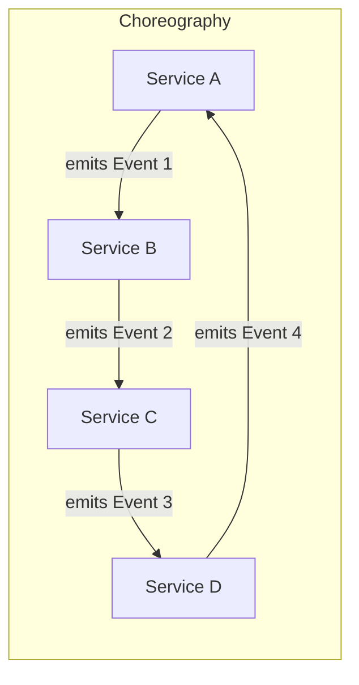
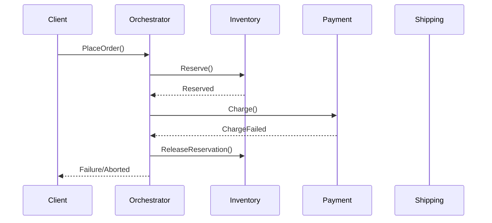
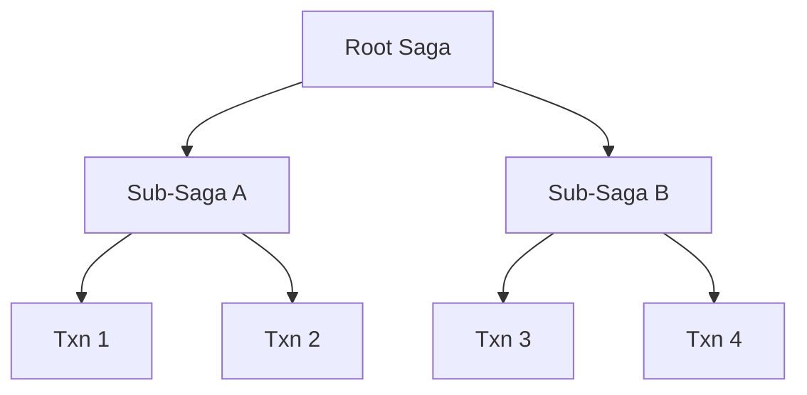
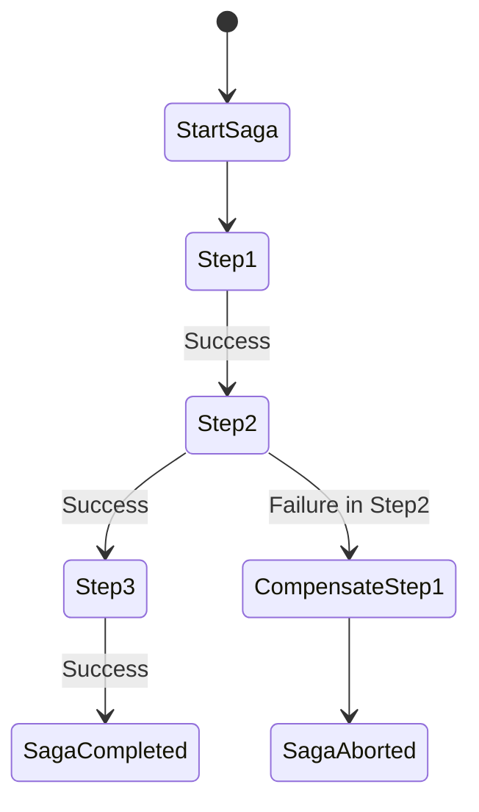

# The Saga Pattern: Distributed Transaction Orchestration

## Introduction

In distributed systems, especially those following a microservices architecture, traditional ACID-based distributed transactions are often impractical or infeasible. The Saga Pattern addresses this gap by providing a reliable mechanism for orchestrating long-running transactions that span multiple independent services or data stores. Sagas decompose a global transaction into a series of local transactions, coordinated in such a way that either all operations succeed or compensating (undo) actions are invoked to maintain consistency.

## Technical Context

Atomic transactions in classical database systems are managed using protocols like two-phase commit (2PC), which ensure all-or-nothing semantics across multiple resources. However, such protocols suffer from tight coupling, blocking behavior, limited fault tolerance, and scalability bottlenecks (**cf.** [ISO/IEC 10026](https://en.wikipedia.org/wiki/ISO/IEC_10026), [X/Open XA](https://pubs.opengroup.org/onlinepubs/009680699/toc.pdf)). Instead, microservices require an alternative: the Saga Pattern, first introduced in 1987 (H. Garcia-Molina & K. Salem, "Sagas", ACM SIGMOD 1987), facilitates distributed transaction management via coordinated local transactions and compensations.

## Fundamental Concepts

### Definition

A *saga* is a sequence of local transactions where each occurs on a single service and publishes an event or invokes the next step. If any transaction fails, the saga executes compensating transactions to invert the effects of all preceding successful operations.

### Core Properties

- **Long-Running:** Sagas accommodate business processes that cannot complete instantly, possibly requiring human intervention or asynchronous operations.
- **Distributed:** Each step executes in a separate service or context.
- **Eventual Consistency:** Sagas do not enforce strict (immediate) consistency but offer eventual consistency, reconciling system state via compensation as required.
- **Isolation Relaxation:** Sagas typically tolerate weaker isolation levels (e.g., avoiding global locks), prioritizing availability and resilience over strict atomicity.

### Key Components

- **Saga Orchestrator or Coordinator:** Responsible for managing the saga’s progression (centralized or decentralized).
- **Saga Participants:** Services that perform each step or transaction.
- **Compensating Transactions:** Activities that semantically undo effects of previous steps, thus reverting a partial saga if necessary.

---

## Architectural Overview

The Saga Pattern supports two primary implementation styles:

- **Orchestration-based Sagas:** A centralized coordinator directs each step and manages execution flow.
- **Choreography-based Sagas:** Each participant emits and reacts to events according to agreed logic; there is no central controller.

### High-Level Architecture

```mermaid
flowchart LR
  subgraph Orchestration
    O[Orchestrator]
    O --> T1[Service A\n(Txn 1)]
    T1 --> O
    O --> T2[Service B\n(Txn 2)]
    T2 --> O
    O --> T3[Service C\n(Txn 3)]
    T3 --> O
    O --> CF[Completed/Failed]
  end
```

#### Orchestration-based Saga Execution

- The orchestrator initiates the saga.
- Each step is invoked as a command or request.
- Success/failure responses dictate saga progression or rollback.

---



#### Choreography-based Saga Execution

- Each participant listens for events and publishes new ones as steps succeed.
- Control flow emerges based on event subscriptions and reactions.

---

## Saga Pattern in Practice

### Workflow Overview

A saga typically consists of:

1. **Transaction Steps:** Each step is a local transaction executed in a given service.
2. **Event Publication/Requests:** Each step emits an event or response on success or failure.
3. **Compensation Logic:** If any step fails, prior successful steps are undone using their compensation logic, executed in reverse order.

#### Example: E-commerce Order Processing

Suppose a workflow to place an order involves reserving inventory, charging payment, and arranging shipment. These operations occur in their respective services.

- Step 1: Reserve Inventory
- Step 2: Charge Payment
- Step 3: Arrange Shipment

If charging payment fails after inventory is reserved, a compensation undoes the reservation.



---

### Compensation

Compensation is not always a simple undo operation. It requires custom business logic proportional to each step’s semantics. For example, reversing payment may require issuing a refund, not simply deleting a transaction record.

#### Compensation Characteristics

- Must be *idempotent* and *reliable*, as it may be invoked multiple times.
- May themselves be long-running activities.
- Should be designed to recover gracefully from failures.

---

## Patterns, Constraints, and Variations

### Patterns

- **Sequence Sagas:** Steps occur strictly in order.
- **Parallel/Concurrent Sagas:** Multiple steps execute in parallel; compensations must handle interleaved effects.
- **Nested Sagas:** Sagas containing sub-sagas, useful for complex, hierarchical business logic.



---

### Constraints and Assumptions

- Services should provide both forward and compensating operations with clear semantics.
- Steps must be at least *eventually* idempotent and safe for retries.
- The system must tolerate periods of inconsistency and exposure of partially committed state.
- Timeouts, retries, and distributed failure are common; sagas must handle partial completion robustly.

---

## Integrations and Standards

Although the Saga Pattern itself is a conceptual approach (not formalized in a single protocol RFC), it is closely related to:

- **Event-Driven Architectures** ([Cf. Enterprise Integration Patterns, Hohpe & Woolf, 2003])
- **Idempotency** (globally unique message IDs, deduplication) for reliable state transitions
- Message Brokers and Event Buses (e.g., Apache Kafka, RabbitMQ, AWS SQS/SNS)
- **Domain-Driven Design (DDD)** for aligning compensation with invariants and aggregate consistency boundaries

Many workflow engines (e.g., [Camunda BPMN](https://camunda.com/), [AWS Step Functions](https://aws.amazon.com/step-functions/), [Temporal](https://temporal.io/)) provide saga management as part of orchestrated workflows.

---

## Error Handling and Recovery

### Failure Modes and Handling Strategies

- **Transient Faults:** Retry step after delay, possibly with exponential backoff.
- **Definite Failure:** Trigger compensating transactions for all completed prior steps.
- **Orchestrator Failure:** Persist saga state in durable storage; employ at-least-once semantics for step dispatch.



---

## Practical Engineering Considerations

### Integration Points

- Sagas require durable, reliable messaging or workflow storage to survive process failures.
- Participants must expose both business logic and compensation logic, ideally via well-defined APIs.
- Versioning of steps/compensations is necessary if business logic evolves.

### Performance and Latency

- Sagas trade off latency for availability and scalability; transactions may remain in progress for extended periods.
- Choreographed sagas can introduce eventual consistency delays, requiring careful monitoring.

### Implementation Challenges

- Ensuring compensation is safe, reliable, and does not introduce side effects (e.g., double refund).
- Maintaining clear audit trails and state for long-lived sagas.
- Handling user-visible inconsistencies (e.g., order shows as "placed," but payment later fails).

### Common Pitfalls

> **Warning**
> - Failing to plan for partial failures and exposed inconsistent intermediate states.
> - Relying on compensation to provide perfect reversibility—some operations (e.g., sending emails, shipping goods) are often not strictly compensatable.
> - Neglecting idempotency in compensation handling, leading to duplicate actions or inconsistent rollback.

### Engineering Decisions

- **Orchestration vs. Choreography:** Orchestration provides centralized control and monitoring, at the cost of a single coordination point. Choreography improves autonomy and decoupling but can be harder to trace and debug.
- **Workflow Engine Adoption:** Leveraging an existing engine may accelerate development but introduces dependency lock-in.
- **Compensation Complexity:** Balance implementation complexity against business criticality and real-world reversibility.

---

## Example: Orchestrated Saga Execution

The following high-level workflow illustrates saga orchestration:

```mermaid
sequenceDiagram
  participant SagaOrchestrator
  participant ServiceA[Service A]
  participant ServiceB[Service B]
  participant ServiceC[Service C]

  SagaOrchestrator->>ServiceA: Start Txn 1
  ServiceA-->>SagaOrchestrator: Success
  SagaOrchestrator->>ServiceB: Start Txn 2
  ServiceB-->>SagaOrchestrator: Success
  SagaOrchestrator->>ServiceC: Start Txn 3
  ServiceC-->>SagaOrchestrator: Failure
  SagaOrchestrator->>ServiceB: Compensate Txn 2
  ServiceB-->>SagaOrchestrator: Compensated
  SagaOrchestrator->>ServiceA: Compensate Txn 1
  ServiceA-->>SagaOrchestrator: Compensated
  SagaOrchestrator-->>Note: Saga Aborted
```

---

## Monitoring and Observability

Observability is critical due to the multi-step, asynchronous, long-lived nature of sagas:

- **State Management:** Store saga state in a transactional, durable store for progress tracking and recovery.
- **Tracing:** Correlate saga executions via unique IDs using distributed tracing systems ([OpenTelemetry](https://opentelemetry.io/), [Jaeger](https://www.jaegertracing.io/)).
- **Alerting:** Monitor for failed, stuck, or time-expired sagas.
- **Logging:** Persist audit trails for each forward and compensation step.

> **Tip**
> Incorporate distributed tracing and logging from saga initiation through all compensation steps to facilitate troubleshooting.

---

## Limitations and Design Tradeoffs

> **Caution**
> - Sagas guarantee eventual consistency, not strict atomicity or isolation. Clients may temporarily observe partial completion.
> - Not suitable for scenarios demanding immediate atomicity (e.g., financial transfers across banks).
> - Full compensation may require external/manual intervention for irrecoverable real-world side effects.

---

## Conclusion

The Saga Pattern is foundational for building reliable, fault-tolerant, and scalable distributed business processes in modern microservices architectures. By decomposing large, cross-system operations into manageable steps with compensations, sagas offer a practical method for orchestrating long-lived, distributed transactions. While introducing eventual consistency and rollback complexity, the pattern balances availability and resilience against the realities of distributed failures and heterogeneous data stores. Thorough engineering practice, robust compensation design, and comprehensive observability are essential for successful saga-based system implementation.