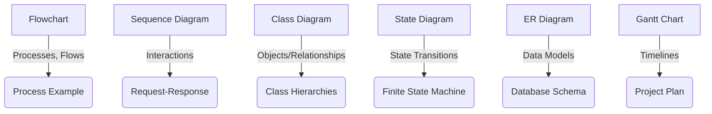
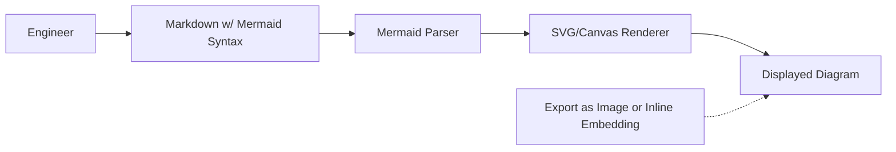
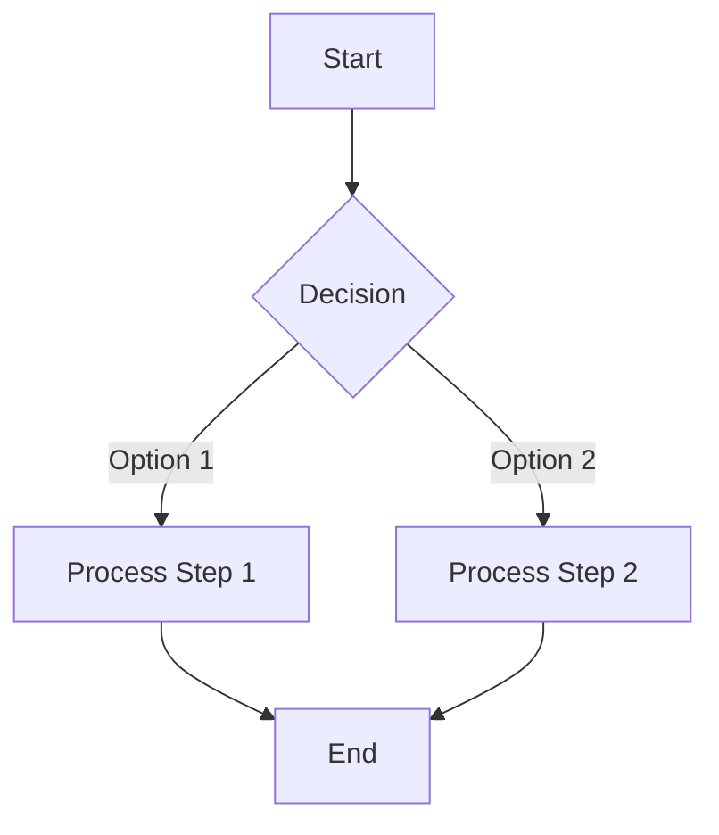
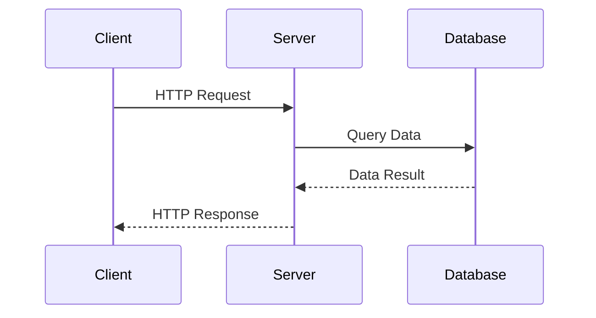
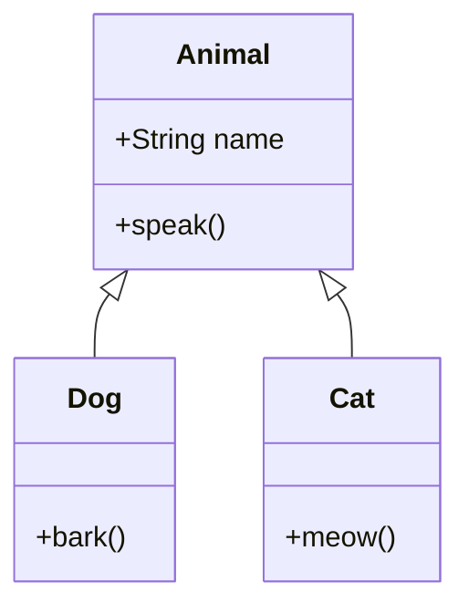
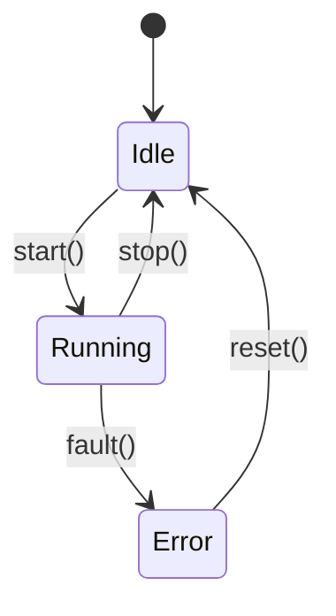
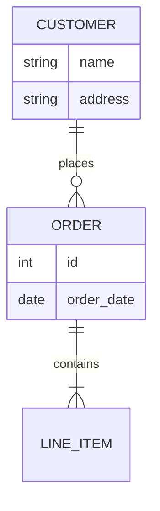
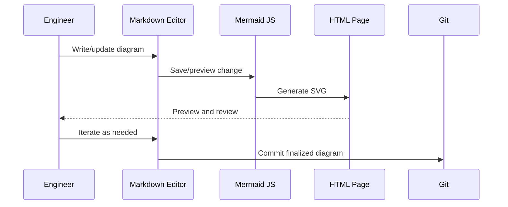
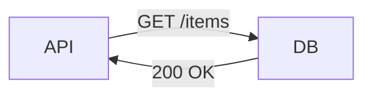
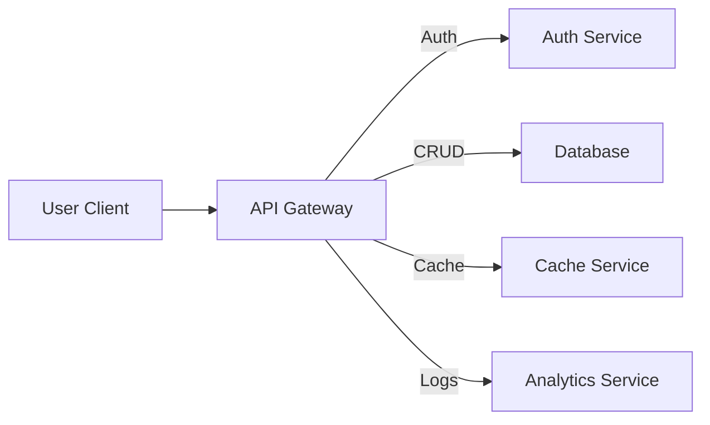

# Mermaid: Technical Primer

Mermaid is a domain-specific language (DSL) and related toolkit providing **diagram-as-code** capabilities to software engineering and documentation workflows. It facilitates the creation of diagrams using a concise textual syntax that can be embedded within documentation, version-controlled repositories, and literate programming environments. This primer provides engineers with a structured introduction to Mermaid, focusing on pragmatic usage, architecture, syntax, and integration patterns.

---

## Context and Motivation

Engineering workflows increasingly require diagrams—such as flowcharts, sequence diagrams, or architectural overviews—that are:

- _Version-controlled_ alongside code and documentation.
- _Human-readable and editable_ in plaintext form.
- _Composable_ with minimal tooling overhead.
- _Platform-independent and automatable._

**Diagram-as-code** addresses these requirements by allowing engineers to define diagrams in text, automating the rendering process into visual diagrams. This approach is similar to other Docs-as-Code paradigms and contrasts with traditional GUI-based drawing tools, which store diagrams in binary or opaque formats and complicate diff-based review workflows.

Mermaid is a primary and widely adopted solution in this space, comparable to PlantUML but tailored for ease-of-use, markdown integration, and web-rendering (notably via [mermaid-js](https://github.com/mermaid-js/mermaid)). Many documentation frameworks and static site generators (e.g. MkDocs, Docusaurus, GitHub Wiki) provide first-class support for Mermaid.

---

## Core Concepts

### 1. Diagram Types

Mermaid supports multiple classes of diagrams, each optimized for distinct kinds of information:

- **Flowcharts**: Process flows, decision trees.
- **Sequence diagrams**: Interactions and message passing over time.
- **Class diagrams**: Structures and relationships of object-oriented designs.
- **State diagrams**: Finite state machines and transitions.
- **Entity Relationship Diagrams (ERD)**: Data schema relationships.
- **Gantt charts**: Project scheduling and time-based planning.
- **Pie, Gitgraph, User Journey, Requirement diagrams**: Specialized forms for specific needs.

Core diagram types and their use cases:



---

### 2. Syntax Overview

Mermaid files begin with a **diagram declaration** indicating the diagram type, followed by a structured indentation and markup describing nodes, links, actors, or events.

**Example: Flowchart Declaration**
```
flowchart TD
    Start --> Decision
    Decision -->|Yes| End
    Decision -->|No| Start
```

- Diagram type: `flowchart`
- Direction: `TD` (top-down); others include `LR` (left to right), `RL`, etc.
- Nodes: e.g., `Start`, `Decision`, `End` (implicit definition by named references)
- Edges: Different arrow types and optional labels.

A complete syntax reference is provided at the [official Mermaid documentation](https://mermaid-js.github.io/mermaid) and is summarized in this primer where relevant.

---

## Architecture and Operation

### Processing Model

Mermaid consists of a **parser** for the DSL, a **renderer** (typically JavaScript-based), and the **integration hooks** that connect Mermaid diagrams to the display context (browser, static site generator, CI/CD pipeline).

- **Authoring**: Diagrams are written in plaintext, in `.md` files or standalone.
- **Rendering**: A JavaScript library (`mermaid.min.js`) parses the DSL and generates SVG diagrams in-browser.
- **Pre-rendering**: Some tools provide CLI or server-side rendering to generate static SVG/PNG images for non-JS environments.
- **Embedding**: Supported via markdown code blocks, e.g., <code> ```mermaid ... ```</code>.

**Mermaid Rendering Architecture**


#### Integration Points

- **Markdown renderers**: GitHub, GitLab, Notion, MkDocs Material, Docusaurus, Obsidian.
- **CI/CD pipelines**: Static rendering for PDF/HTML outputs.
- **APIs/Server rendering**: For toolchains without browser JS support.

---

## Detailed Syntax and Patterns

### A. Flowcharts

Flowcharts represent process flows, decision structures, and stepwise logic.



- **Nodes** are defined by name; square brackets `[Text]` indicate visual shapes, curly braces `{}` are decision/conditionals.
- **Arrows**: `-->` for standard flow; `-.->` for a dotted link (e.g., optional/path).
- **Labels** can annotate transitions.

#### Node Shapes

- Rectangle: `[Text]`
- Circle: `(Text)`
- Subroutine/Process: `[[Text]]`
- Diamond (Decision): `{Text}`
- Input/Output: `[/Text/]`

### B. Sequence Diagrams

Sequence diagrams express temporal interactions between actors/objects.



- **Participants**: Defined with `participant` or `actor`.
- **Arrows**: `->>` is synchronous call, `-->>` asynchronous.
- Notes, loops, and alt/else branches are supported.

**Supported Patterns**

- Messages, activations, destroy entity, return values.

### C. Class Diagrams

Represent class structures, interfaces, inheritance, and composition.



- `<|--` denotes inheritance.
- `: +method()` for class interface.
- Multiple relationships: aggregation, composition, dependency.

### D. State Diagrams

For modeling stateful systems and transitions:



- `[ * ]` is start or end.
- Arrow triggers represent events.

### E. Entity Relationship Diagrams (ERDs)

Useful for quick schema visualization.



---

## Engineering Workflows

### Authoring and Maintenance

1. **Editing**: Write diagrams as part of documentation (Markdown, AsciiDoc).
2. **Previewing**: Use IDE plugins, web editors, or local markdown preview to visualize.
3. **Versioning**: Diagrams are committed and diffed as plaintext.
4. **Integration**: Embed in project READMEs, design docs, API specifications, and wikis.
5. **Auto-generation**: For certain artifacts (e.g., code structure), auto-generate Mermaid code via scripts.

### Tooling and Ecosystem

- **Browser-based preview**: Most robust rendering; "live" diagram updating.
- **Build-time rendering**: Pre-render diagrams for publication (SVG export).
- **Linter/Validator**: Some plugins check Mermaid syntax as part of CI.
- **Third-party extensions**: For syntax highlighting, snippet expansion.

### Typical Workflow


---

## Constraints, Variations, and Engineering Considerations

### A. Constraints

- **Feature Delta**: Not all diagram types or features are fully supported across every rendering engine or hosting environment (e.g., GH support is more limited than full browser/local render).
- **Scale & Complexity**: Very large diagrams may hit browser or performance limits and become hard to read.
- **Syntax Tolerance**: Small syntax errors can prevent rendering (no partial parsing). Use live previews and linters.
- **Customization**: Styling and themeing are possible but constrained compared to hand-drawn diagrams.
- **Diagram Limitations**: Some architectural concepts (e.g., hypergraphs, advanced notations) may not be expressible.

### B. Variations

- **Extensions**: Some documentation generators expose additional scripting, embedding, or theming hooks.
- **Theming**: Mermaid supports light/dark modes and some degree of CSS variable theming.
- **Interoperation**: PlantUML, Graphviz, and other DSLs may be better suited for highly customized visualizations or UML strictness.
- **Export Formats**: SVG (default), PNG (via rendering/export), PDF (with conversion).

### C. Common Pitfalls

> [!CAUTION]
> - Indentation and whitespace do not define hierarchy in Mermaid syntax; structure is encoded purely by explicit arrows/relationships.
> - Invalid syntax or unsupported diagram types in a hosting environment (e.g., GitHub) will render as code blocks, not diagrams.
> - Browser-based rendering may not be suitable for high-security environments due to client-side script execution.
> - Upstream breaking changes in `mermaid-js` can affect render output or compatibility over time.

---

## Integration with Documentation Systems

Mermaid diagrams are supported **natively** or via plugins in a variety of docs-as-code environments:

- **GitHub Markdown**: Some diagram types rendered natively (2023+), but not all.
- **MkDocs Material**: Comprehensive Mermaid integration.
- **Docusaurus, VuePress, Hugo, Obsidian, Notion**: Varying Mermaid support; may require plugin activation.
- **Static Export**: Use CLI or Docker tools to export diagrams to static formats for inclusion in sites, PDFs, or non-JS environments.

**Example: Mermaid in Markdown**
<pre>

</pre>

---

## Advanced Patterns

### A. Breaking Down Complex Systems

#### Block Diagram (Service-Oriented Architecture Example)


### B. Incorporating Mermaid in CI/CD

- Scripts can lint diagrams, check that rendered diagrams are up-to-date, and fail builds on broken diagrams.
- Generated diagrams can become build artifacts or be embedded into generated API documentation.

---

## Security and Compliance Considerations

> [!WARNING]
> Client-side rendering with mermaid.js involves dynamic script execution. When displaying user-supplied or externally editable diagrams, validate input to prevent injection attacks or resource utilization issues.

- SVG output is generally safer for final outputs.
- Configuration settings are available to restrict or sandbox rendering capabilities.

---

## Performance and Scalability

- **Rendering time** increases with graph size and visual complexity.
- **Memory usage**: Diagrams are rendered as SVG by default, with resource requirements correlating with node/edge counts.
- Pre-rendering diagrams for static distribution avoids runtime performance hits.

---

## Comparison with Related Tools

- **PlantUML**: More UML-complete, more formal; less accessible for non-engineers.
- **Graphviz/Dot**: Graph plotting, less expressive for interactions and workflows.
- **C4 Model**: Notation for software architecture (can be rendered via Mermaid, PlantUML, etc.).

The choice of tool depends on required notation, integration environment, and target audience.

---

## Engineering Best Practices

> [!TIP]
> - Use version control for all diagram source files.
> - Keep diagrams modular—prefer multiple focused diagrams over a monolithic one.
> - Annotate diagrams with comments for future maintainers.
> - Regularly update diagrams to mirror architecture and workflow changes.
> - Use pre-rendering or static image export for externally published or security-sensitive documentation.

---

## Summary

Mermaid offers a lightweight, flexible, and text-centric method for expressing diagrams in engineering documentation and workflows. Its syntax and extensibility suit most process, interaction, and structural diagram requirements, particularly where integration with markdown and version control is a priority. By adhering to best practices and understanding Mermaid’s operational profile, engineers can efficiently produce maintainable, auditable, and high-quality visual artifacts within their docs-as-code toolchain. 

---