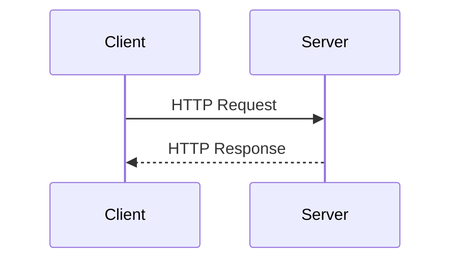
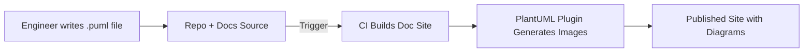
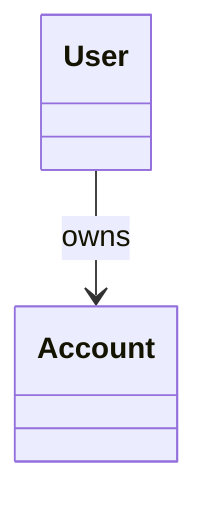
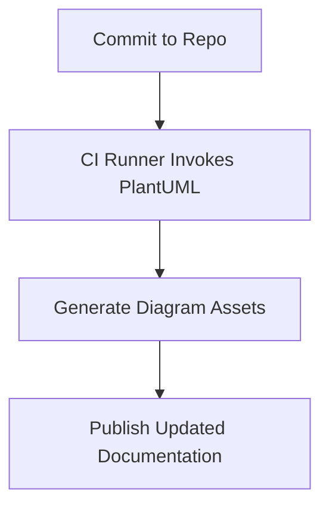
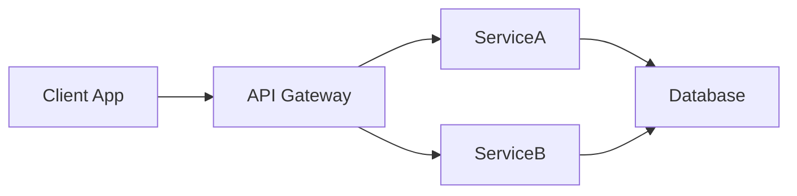

# PlantUML: A Technical Primer

## Introduction

PlantUML is an open-source tool that enables the creation of diagrams from plain text descriptions. Its primary use-cases are in software and systems engineering, where it streamlines the process of generating and maintaining sequence diagrams, class diagrams, component architecture views, and related UML representations directly from source files. PlantUML is widely adopted within "Docs as Code" practices, which emphasize treating documentation with the same rigor and workflow as source code, thus fostering greater maintainability, traceability, and collaboration.

## Technical Context

Diagramming and modeling are essential practices in engineering disciplines for representing system designs, identifying requirements, and communicating architectures. The Unified Modeling Language (UML) defines a set of standard diagram types for these purposes. Traditionally, UML diagrams are created with graphical tools (e.g., Visio, Enterprise Architect), but such tools can be cumbersome to automate, integrate with version control, or review in text-based workflows.

PlantUML solves these challenges by representing diagrams as simple text files using a prescribed markup syntax and generating images (e.g., SVG, PNG) or interactive diagrams on-the-fly, making it compatible with modern documentation platforms, CI/CD pipelines, and source repositories.

## Core Concepts and Architecture

### Text-Based Diagram Definition

At the heart of PlantUML is a domain-specific language (DSL) for expressing diagram structures. Simple syntactic conventions allow concise representations of elements, relationships, and diagram organization.

For example, a class diagram snippet might look like:

```
@startuml
class User
class Account
User -- Account
@enduml
```

### Supported Diagram Types

PlantUML supports several standard diagram types, including:

- **Sequence Diagrams**: Represent object interactions over time.
- **Class Diagrams**: Model class relationships, inheritance, and dependencies.
- **Component Diagrams**: Depict components and their connections.
- **Use Case Diagrams**: Visualize roles and interactions.
- **State Diagrams**: Illustrate state machines and transitions.
- **Activity Diagrams**: Map workflows or logic flows.
- **Deployment Diagrams**: Represent hardware and network topology.

### System Overview: PlantUML Workflow

PlantUML is typically run in one of three modes:

1. **Standalone CLI**: Rendering input text files and outputting image files.
2. **Integrated Plugin**: Embedded within IDEs (e.g., IntelliJ, VSCode) or documentation platforms (e.g., MkDocs, Docusaurus) to preview and update diagrams inline.
3. **Web-based Renderer**: Exposing an HTTP service or browser-based renderer via public PlantUML servers.

#### Typical PlantUML Workflow

```mermaid
flowchart TD
  A[Text Diagram Source (*.puml)] --> B[PlantUML Engine]
  B -->|Generates| C[SVG/PNG/Image/ASCII]
  C --> D[Inclusion in Docs, Wikis, or Code Repo]
  D --> E[Viewers/Reviewers/CI]
```

### PlantUML Engine and Rendering

The PlantUML engine is a Java application. It parses the input DSL, builds an internal diagram model, and renders the output graphically. Outputs can include raster images, SVG/vector graphics, or ASCII diagrams for CLI environments.

**Integration Considerations:**
- PlantUML can be executed locally or via a web service (e.g., [PlantUML.com](https://plantuml.com)).
- Many editors and static site generators provide plugins to compile or preview PlantUML diagrams natively or via remote services.
- The rendering process is stateless; each diagram is generated from its source independently.

## How PlantUML Works in Practice

### Workflow in Engineering Environments

Engineers typically follow these steps:

1. **Authoring**: Write diagram description in PlantUML syntax, usually in a `*.puml` or code-fenced block within Markdown or reStructuredText.
2. **Version Control**: Store and version text-based diagram files alongside source code.
3. **Rendering**: Use local or remote PlantUML engines to generate or preview visual output.
4. **Review and Collaboration**: Diagrams are code-reviewed as diffs, facilitating design discussions.
5. **Inclusion in Documentation**: Build documentation pipelines (e.g., MkDocs, Sphinx) to automatically render and embed diagram images.

### Example: Sequence Diagram

Below is a simple HTTP request-response sequence diagram expressed in Mermaid for illustrative purposes:



### Integration with Documentation Systems

**Docs-as-Code Platforms** such as MkDocs, Sphinx, or Docusaurus often support PlantUML via plugins/extensions. Diagrams are generated automatically at build time, enabling:

- Doc updates alongside code changes.
- Automated diagram refresh in CI/CD.
- Text-based change reviews with version control diff tooling.



## Syntax and Language Fundamentals

### General PlantUML Syntax

All diagrams begin with `@startuml` and end with `@enduml`. Elements and relationships are expressed using keywords, shapes, and simple arrows.

#### Key Language Constructs

| Syntax Example                      | Meaning                    |
|--------------------------------------|----------------------------|
| `Alice -> Bob : Hello`               | Alice sends "Hello" to Bob |
| `class User`                         | Defines a class            |
| `User -- Account`                    | Association between classes|
| `component API`                      | Defines a component        |
| `state Active`                       | Defines a state            |
| `Bob -->|Request| Server`            | Labeled arrow              |

#### Mermaid vs PlantUML Syntax

PlantUML and Mermaid share similar philosophies (text-to-diagram) but differ in syntax. For interoperability concerns, maintain consistent usage within documentation suites.

### Example: Class Diagram (Mermaid)



## Deployment and Integration Patterns

### Local vs Remote Rendering

- **Local Rendering:** Java-based CLI or desktop apps for local generation of diagrams. Preferred for confidential codebases.
- **Remote Rendering:** Offloads rendering to public PlantUML servers. Useful for quick previews, PR inspection, or when local Java is unavailable.
- **Security Considerations:** Transmitting source files to remote renderers may expose internal structures—be mindful with proprietary diagrams.

> **GitHub Alert: Caution**  
> When using remote PlantUML services, be aware that diagram source text may be transmitted and logged by third-party servers. Do not expose sensitive system details or authentication flows.

### Typical Toolchain Integrations

- **IDE Plugins:** Visual Studio Code, IntelliJ IDEA, Eclipse support inline previews or background rendering.
- **Static Site Generators:** Plugins for MkDocs (`mkdocs-plantuml`), Sphinx (`sphinxcontrib-plantuml`), Docusaurus, etc.
- **CI/CD Pipelines:** PlantUML can be invoked as a build step to render updated diagrams from source.

#### Example: PlantUML in CI Workflow



## Practical Engineering Considerations

### Advantages in Docs-as-Code

- **Versionable Diagrams:** Text source enables meaningful `git diff` for diagram changes.
- **Code Reviews:** Diagram updates undergo peer review with other documentation/code.
- **Automation:** Seamless integration into documentation builds and CI/CD.

### Limitations

- **Complex Layout Control**: PlantUML provides limited, layout-agnostic positioning; complex, precise layouts may be challenging.
- **Render Time**: Large diagrams can increase build time.
- **Feature Parity**: Some advanced UML features are only partially supported or require workarounds.
- **SVG Customization**: Fine-tuned output may need post-processing.

> **GitHub Alert: Tip**  
> For complex visualizations or when strict diagram control is required, consider breaking large diagrams into smaller subdiagrams for clarity and easier maintenance.

### Common Pitfalls

1. **Syntax Errors**: Unlike compiled code, PlantUML may not fail until attempted rendering. Automated linting can mitigate this.
2. **Diagram Drift**: Outdated diagrams if not regularly rebuilt; ensure automatic rendering in CI.
3. **Consistency**: Team alignment on diagram conventions, colors, styling, and stereotypes is essential in larger codebases.

## Standards and Specifications

While PlantUML is not an official UML tool, it maps closely to the OMG UML specification (e.g., `ISO/IEC 19505-1:2012`), enabling standard-compliant diagrams when used appropriately. For other diagram types (e.g., Archimate, Gantt charts, Wireframes), PlantUML implements compatible, but not always strictly standardized, visualizations.

## Comparing PlantUML to Other Diagramming Tools

| Feature              | PlantUML           | Mermaid              | Draw.io/Visio             |
|----------------------|--------------------|----------------------|---------------------------|
| Text-based input     | Yes                | Yes                  | No                        |
| Version Control      | Excellent          | Excellent            | Limited                   |
| UML Coverage         | Broad, not complete| Medium               | Varies (Draw.io: broad)   |
| Output Types         | SVG, PNG, ASCII    | SVG, PNG, HTML       | Raster, SVG, PDF          |
| Layout Control       | Limited            | Limited              | Extensive                 |
| CI Integration       | Native             | Native               | Possible, less common     |

> **GitHub Alert: Note**  
> For code-centric teams, prioritize PlantUML or Mermaid for integration into CI and collaborative workflows. For graphic-oriented outputs or marketing material, graphical tools like Draw.io may be more effective.

## Security and Compliance

- **Sandboxing**: Self-hosting PlantUML and running with Java's security manager reduces risk of code execution vulnerabilities.
- **Open Source**: Auditable and community-supported.
- **Data Leakage**: Caution with public renderers (see previous alerts).

## Future Directions

PlantUML's development continues to expand diagram types and syntax expressiveness, including collaborative editing and support for more DevOps-friendly workflows. Integration with code annotation (e.g., JavaDoc) and multi-diagram synthesis remain active areas.

## Typical Engineering Decisions

- **Diagram Scope**: Decide diagram granularity (system, component, sequence).
- **Integration**: Select between local vs. remote rendering and plugin ecosystems.
- **File Organization**: Structure `.puml` files by function (per component, per service).
- **Documentation Pipeline**: Incorporate PlantUML rendering into build/test/publish CI stages.

> **GitHub Alert: Tip**  
> Store diagram sources and rendered assets in separate directories. Treat diagram source files as first-class documentation assets.

## Example: Architecture Diagram (Mermaid)



## Conclusion

PlantUML enables engineers to define high-quality, version-controlled UML and architecture diagrams as text, making it a foundational tool in docs-as-code and modern DevOps documentation practices. Proper usage and integration increase consistency, collaboration, and documentation maintainability across software projects.

> **Note**  
> Diagram to be added later: A comparative state diagram illustrating PlantUML, user workflows, and diagram state transitions.