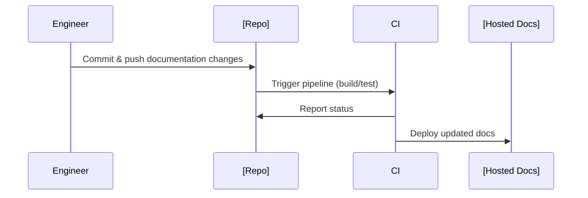
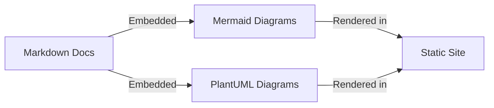

# Introduction to Docs-as-Code

Docs-as-Code is a methodology for writing, reviewing, and maintaining documentation using the same principles, workflows, and tools as software code. The approach treats documentation as a first-class component fully integrated into the software development lifecycle (SDLC), stored alongside code in version control repositories and maintained with developer-centric tools. This practice aligns documentation with the agile and collaborative ethos prevalent in modern software engineering.

## Definition and Context

Docs-as-Code encompasses the following key characteristics:

- **Documentation Source is Treated as Code:** Content is authored in plain-text markup languages (commonly Markdown, reStructuredText, or AsciiDoc), stored in the same or parallel git repositories as the software code.
- **Developer Tooling:** Authors leverage tools typical in code development, such as integrated development environments (IDEs), linters, formatters, and CI/CD automation.
- **Version Control:** All documentation changes are tracked with the same mechanisms (e.g., git) and processes (pull requests, reviews, branching strategies) as software changes.

This methodology emerged to address the fragmentation between documentation and source code in traditional development practices, where documentation was often an afterthought, outdated, or siloed from engineers. By embedding documentation in regular developer workflows, Docs-as-Code increases visibility, review quality, maintainability, and release control.

## Core Concepts

### Markup Languages

Docs-as-Code relies on machine-readable, plain-text markup that can be easily reviewed in diffs and rendered into accessible documentation. Typical formats include:

- **Markdown:** Widely adopted due to simplicity and readability. Supports extensions for diagrams (e.g., Mermaid), code blocks, and rich formatting.
- **AsciiDoc:** Richer semantic structure, often used for technical and architectural documents.
- **reStructuredText:** Popular in Python communities and Sphinx-driven documentation systems.

### Version Control Systems (VCS)

The most common system is git, providing decentralized, auditable, and collaborative workflows. Using pull requests or merge requests, teams ensure that documentation updates are peer-reviewed, tested, and versioned alongside code changes.

### Documentation Generators and Toolchains

Generator tools process plaintext documentation into consumable artifacts:

- **Static Site Generators:** (e.g., MkDocs, Hugo, Docusaurus, Sphinx) convert source markup into HTML, PDFs, or other formats.
- **Continuous Integration Pipelines:** Automate build, link-checking, spell-checking, linting, and deployment on merges and releases.

### Collaboration and Review Workflows

Docs-as-Code promotes the same collaboration expectations for docs as for source code:

- Branching for feature docs, fixes, or updates.
- Code reviews and approval processes.
- Change tracking and traceability via commit history.

### Diagram Integration

Documentation often integrates diagrams and visual representations using plain-text, scriptable sources such as Mermaid or PlantUML.

## Architecture Overview

The typical architecture of a Docs-as-Code setup is illustrated below.

```mermaid
flowchart TD
    A[Source Repository]
    B[Continuous Integration (CI)]
    C[Documentation Generator]
    D[Build Artifacts]
    E[Documentation Hosting]

    A --> B
    B --> C
    C --> D
    D --> E

    subgraph Authors
        F[Engineers]
        G[Technical Writers]
    end

    F --> A
    G --> A
```

**Figure:** End-to-end Docs-as-Code workflow: Authors update source, CI validates/generates, artifacts are hosted for consumers.

## Practical Workflows and Lifecycle

### Authoring

Documentation is authored directly in the source tree:

- **Location:** Typically in dedicated directories like `/docs` or `/documentation`.
- **File Naming:** Source files for features, references, and guides are clearly named for discoverability.
- **Code Integration:** Sample code can be extracted or embedded, with automation to synchronize with real codebases when feasible.

### Reviewing

- **Peer Review:** All documentation updates are subject to code review processes.
- **Automation:** Linters and spellcheckers in CI gates catch format and style issues automatically.

### Publishing and Deployment

- **Static Generation:** On merges, CI/CD systems render updated documentation.
- **Validation:** Automated checks ensure correctness, broken link detection, and consistency.
- **Hosting:** Final documentation is deployed to internal or external sites, often using GitHub Pages, Netlify, or similar platforms.



**Figure:** Sequence of events from documentation commit to publication.

## Key Components and Integration Points

### Typical Components

- **Source Control Repository:** Central location for documentation source.
- **CI/CD Platform:** Executes automated builds, tests, and deployments.
- **Static Site Generator:** Renders documentation for end users.
- **Review Tooling:** Pull request UI for comments, discussions, and approvals.
- **Third-party Integrations:** Link checkers, spell checkers, accessibility checkers, dependency updaters.

### Integration with Codebase

- **Close Coupling:** Docs-as-Code encourages embedding documentation within or adjacent to code repositories, improving traceability.
- **Automated Extraction:** Tools such as Sphinx autodoc or Javadoc can produce API docs directly from source code and docstrings, optionally aggregating this with hand-written guides.

### Diagram Support

Docs-as-Code supports "documentation as code" for diagrams as well, ensuring diagrams are versioned and reviewed just like prose.



**Figure:** Diagram source managed alongside documentation and rendered in published docs.

## Constraints, Assumptions, and Common Variations

### Constraints

- **Technical Literacy:** All contributors must be comfortable with developer tooling and workflows.
- **Plaintext Limitation:** Rich formatting is constrained by markup language syntax.
- **Build Process Overhead:** CI/CD complexity may increase as documentation grows and more checks are added.

### Assumptions

- **Version Control Ubiquity:** Assumes all contributors can interact with git or other VCS.
- **Collaborative Review Culture:** Places responsibility for quality on the entire engineering team, not just technical writers.

### Common Variations

- **Repo Organization:** 
  - Mono-repo (docs and code interleaved)
  - Split-repo (dedicated doc repositories)
- **Publishing Model:**
  - Auto-publishing on push/merge
  - Versioned manual releases to match software versions
- **Documentation Scope:** Full product docs, API references, internal runbooks, architecture decision records (ADRs).

## Relevant Standards and Related Practices

- **Version Control:** Git (see [RFC 2822](https://www.rfc-editor.org/rfc/rfc2822) for commit message standards)
- **Markup Language Specifications:** [CommonMark](https://spec.commonmark.org/), [reStructuredText](https://docutils.sourceforge.io/rst.html), [AsciiDoc](https://asciidoc.org/)
- **Diagram Languages:** [Mermaid.js Syntax Documentation](https://mermaid-js.github.io/), [PlantUML Language Reference](https://plantuml.com/)

## Engineering Considerations

> **GitHub Alert:**  
> **Caution:** Ensure the documentation build process does not slow down the main CI/CD pipeline; offload or parallelize doc builds as needed.

> **GitHub Alert:**  
> **Tip:** Enforce consistent documentation standards using linters (e.g., markdownlint, Vale) configured at the repository level.

> **GitHub Alert:**  
> **Warning:** Siloing documentation in a separate repository risks a drift between software and its documentation, especially if code and docs are released independently.

- **Integration:** Maintain up-to-date references and links to code samples in documentation through automation where possible.
- **Access Control:** Use branch protection and review requirements for doc directories just as for code.
- **Scalability:** As documentation grows, modularize by topic, feature, or team ownership. Monitor build times and complexity.

## Typical Engineering Decisions

- **Choice of Markup Format:** Driven by ecosystem (e.g., Markdown for JS, reStructuredText for Python).
- **Generator Selection:** Based on need for theming, integrations, multi-language support, and maintenance burden.
- **Repository Policy:** Determining doc/code co-location versus separation, aligned with team size and release cadence.
- **Automation Level:** Balancing comprehensiveness of CI checks with pipeline maintainability and run time.

## Common Pitfalls

- **Outdated Documentation:** Despite automation, documentation still becomes stale if not culturally prioritized.
- **Poor Integration:** Inefficient workflows arise if doc updates are cumbersome or if review processes are too rigid.
- **Overcomplicated Builds:** Excessive toolchain complexity can discourage contributions or cause build failures.

## Notes on Visuals

> **Note**  
> For advanced architectural variations (e.g., multi-repo, centralized publishing portals), consider adding system-overview and flow sequence diagrams to illustrate integration at scale.

# Conclusion

Docs-as-Code systematically embeds documentation into engineering processes, leveraging version control, developer tools, and automation to improve collaboration, reliability, and traceability. By treating documentation as an integral component of the codebase, teams can maintain current, trusted, and accessible documentation aligned with their software artifacts. The methodology is readily adaptable, supporting a range of tooling and workflows, but requires thoughtful process integration and tooling discipline.