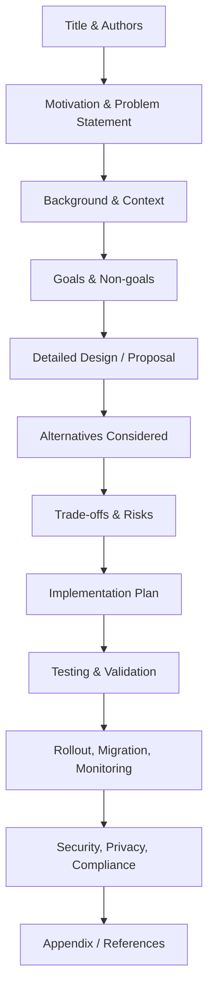
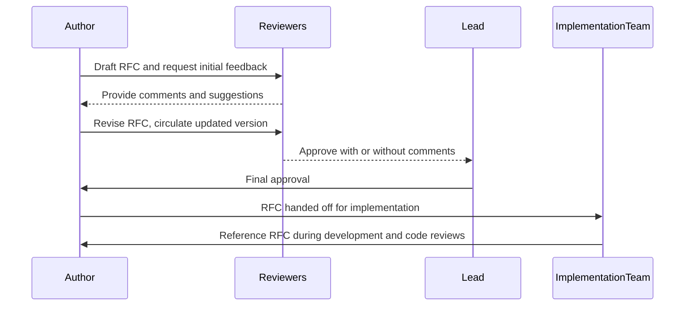

# Engineering RFCs (Google-style Design Docs)

## Introduction

Engineering RFCs (Request for Comments) and Google-style design documents are forms of structured, technical documentation used within software engineering organizations to formalize technical proposals, capture design decisions, evaluate technical alternatives, and facilitate team alignment during the engineering process. These documents, modeled after protocols such as the IETF RFCs and further exemplified by design documentation practices at organizations like Google, provide a common framework for discussing, reviewing, and approving significant engineering changes or new feature introductions.

This overview describes the standard practices, structures, workflows, and rationale behind engineering RFCs, with an emphasis on the Google-style approach to design documentation within internal team contexts.

---

## 1. Concept and Purpose

### 1.1 Defining Engineering RFCs

An Engineering RFC is an internal, living document that proposes a specific technical change, introduces a new system or feature, or alters the architecture of an existing solution within a software organization. Its primary purposes are:

- **Documenting proposals** for substantial engineering efforts.
- **Facilitating collaborative review** and feedback among engineers and stakeholders.
- **Capturing explicit technical decisions** and their justifications.
- **Guiding implementation** by serving as a binding reference.
- **Providing traceable historical context** for future readers and maintainers.

### 1.2 Google-style Design Docs

Google-style design docs build on the RFC tradition, providing a systematic and standardized methodology for capturing not just *what* should be built, but *why*, *how*, *with what trade-offs*, and *by whom*. This style is notable for its:

- Emphasis on concise but comprehensive explanation.
- Clear breakdown of problem statements, goals, non-goals, alternatives, and mitigation strategies.
- Expectation of collaborative authorship and frequent iteration.
- Use in both small- and large-scale engineering projects.

Google's internal process is widely considered a benchmark in the industry for rigorous, transparent, and scalable engineering collaboration.

---

## 2. Technical Context and Relationship to Related Concepts

Engineering RFCs are situated within the wider field of internal technical documentation and governance. Related concepts include:

- **Architecture Decision Records (ADRs):** Concise, granular documents describing discrete architectural choices; they often accompany RFCs but focus on single decisions.
- **Docs-as-Code:** The practice of maintaining documentation using the same workflows, tools, and rigor as source code (version control, pull requests, review cycles).
- **Code Review Practices:** Complementary to RFCs, with design docs typically preceding code review cycles and serving as their rationale.

---

## 3. Structure of an Engineering RFC / Design Doc

A Google-style engineering RFC typically comprises well-defined sections, each serving a distinct purpose. The following structure is widely adopted:

### Typical Sections in a Design Doc

1. **Title and Authors**
2. **Motivation / Problem Statement**
3. **Background and Context**
4. **Goals and Non-goals**
5. **Detailed Design / Proposal**
6. **Alternatives Considered**
7. **Trade-offs and Risks**
8. **Implementation Plan**
9. **Testing and Validation**
10. **Rollout, Migration, and Monitoring**
11. **Security, Privacy, and Compliance Considerations**
12. **Appendix / References**

#### Section Breakdown

- **Title and Authors:** Clearly state the intent; list accountable and contributing authors.
- **Motivation / Problem Statement:** Explain the issue to be solved, why it matters, and its impact.
- **Background and Context:** Summarize relevant existing systems, prior decisions, or domain knowledge.
- **Goals and Non-goals:** Set clear boundaries for the proposal.
- **Detailed Design / Proposal:** In-depth explanation of the proposed solution, including diagrams.
- **Alternatives Considered:** Discuss rejected approaches with rationale.
- **Trade-offs and Risks:** List known caveats, downsides, and risk mitigations.
- **Implementation Plan:** Outline steps, timeframes, dependencies, and responsibilities.
- **Testing and Validation:** Describe how correctness and performance will be ensured.
- **Rollout, Migration, Monitoring:** Plan for deployment, backward compatibility, observability.
- **Security, Privacy, Compliance:** Address regulatory implications as needed.
- **Appendix / References:** Supporting material, links to prior art or related ADRs.

#### Example Structure Diagram



---

## 4. Authoring and Review Workflow

The process of creating and stewarding an engineering RFC involves several iterative steps, integrating with existing software development life cycles and tooling.

### 4.1 Authoring

- **Drafting:** An engineer or small group drafts the RFC, focusing initially on motivation, context, and goals.
- **Refinement:** Feedback is solicited from key stakeholders and domain experts. Sections are iteratively improved.
- **Incorporation of Data and Diagrams:** Visual aids—such as architecture sketches, flowcharts, or state diagrams—are embedded to clarify complex aspects.

### 4.2 Review and Approval

- **Wide Circulation:** The draft is distributed to relevant engineers, leads, architects, and stakeholders for review.
- **Comment Resolution:** Editors track comments, requests for clarification, or objections, updating the RFC as needed.
- **Formal Approval:** Once consensus is reached, responsible parties formally “approve” the RFC, often via pull requests, signatures, or explicit acknowledgment.

### 4.3 Integration and Tracking

- **Linkage to Work Items:** Approved RFCs are linked to source code repositories, issue trackers, or project boards.
- **Implementation:** Teams use the RFC as a guiding contract as they implement the proposed changes.
- **Historical Record:** The RFC, along with commentary and approval history, is archived for future reference.

#### Workflow Diagram


---

## 5. Practical Considerations in Engineering RFCs

### 5.1 Integration Points

- **Version Control:** RFCs are typically stored in the same version control system as code (e.g., Git), enabling change tracking, branching, and pull-request-driven review.
- **Code Review Systems:** Same review infrastructure (e.g., GitHub PRs, Gerrit) allows for uniform commentary and approval processes.
- **Automated Workflows:** RFC templates, CI/CD triggers, and linter scripts can enforce standards, e.g., required sections or reviewer assignment.

### 5.2 Performance Implications

While the RFC process itself imposes minimal performance overhead on software, it does add latency to project throughput due to deliberation and review cycles.

> **GitHub Alert: Tip**
>
> Early initiation of RFC discussions can prevent “rework” late in the project cycle, often improving overall delivery efficiency.

### 5.3 Implementation Challenges

- **Managing Scope:** Excessively broad RFCs can stall on review; scoping narrowly improves clarity and tractability.
- **Reviewer Fatigue:** Too many concurrent or verbose RFCs may overwhelm stakeholders, leading to shallow or delayed reviews.
- **Consensus Building:** Achieving alignment in cross-team RFCs may require formal mediation or escalation.

> **GitHub Alert: Important**
>
> RFCs should document points of *unresolved debate* and any *competing alternatives*, not just finalized decisions.

### 5.4 Common Pitfalls

- **Insufficient Context:** Omitting background or rationale impedes future comprehension.
- **Vague Goals:** Lack of clarity on what “success” looks like confuses reviewers and implementers.
- **Poor Maintenance:** RFCs not updated after significant design or implementation changes lose relevance as artifacts.

---

## 6. Variations and Adaptations

### 6.1 Lightweight vs. Fully Detailed RFCs

- **Lightweight RFCs (Mini-RFC, Design Memos):** Useful for smaller changes; consist of a subset of full sections.
- **Full RFCs:** Required for major architectural modifications or initiatives affecting multiple teams or systems.

### 6.2 Living Documents vs. Immutable Records

- **Living RFCs:** Updated as the project evolves, recording live discussions, evolving trade-offs, and emergent risks.
- **Versioned/Immutable RFCs:** “Frozen” post-approval; retrospective addenda may be added via follow-up RFCs or ADRs.

### 6.3 Organizational Differences

- **Team-specific Templates:** Each org or team may adapt the standard template to local practices, inserting custom sections for regulatory, user experience, or business alignment.
- **Approval Authority:** Some organizations require explicit sign-off from engineering leadership, while others accept consensus-based “merge on review”.

---

## 7. Engineering RFCs in Practice

### 7.1 Example: Introducing an Internal API

#### Scenario Flow



### 7.2 RFCs and Docs-as-Code

RFCs fit naturally with Docs-as-Code by leveraging:

- **Markdown/AsciiDoc:** RFCs written as text files in repository format.
- **Version Control Integration:** Every modification is recorded, diffable, and revertible alongside the codebase.
- **Automated Review & Linting:** Bots and CI systems can validate structure and enforce organizational policies on RFC submission.

### 7.3 Mapping RFCs to Architecture Decision Records (ADRs)

> **GitHub Alert: Note**
>
> An RFC may result in the registration of multiple ADRs, each capturing finalized discrete decisions described during the design process.

---

## 8. Security, Privacy, and Regulatory Considerations

Engineering RFCs should include explicit sections (or at least a checklist) addressing:

- **Security:** New threat vectors, authentication models, permissions, data integrity.
- **Privacy:** Data handling, PII exposure, consent models.
- **Compliance:** Alignment with internal/external regulatory standards (e.g., GDPR, HIPAA).

Neglecting these factors during design documentation often results in late-stage rework and risk.

---

## 9. Summary

Engineering RFCs—particularly in the structured, Google-style design document format—are a foundational mechanism for disciplined, transparent software engineering at scale. They enable organizations to:

- Evaluate proposals with shared understanding of context and alternatives.
- Document rationale, trade-offs, and decisions for posterity.
- Coordinate implementation across teams and time zones.
- Foster a culture of rigor, accountability, and learning.

By mastering the creation and stewardship of Engineering RFCs, engineers significantly improve collaboration efficiency, architectural quality, and the resilience of software projects.

---

## 10. Appendix: Template Outline

> **GitHub Alert: Tip**
>
> This section provides a high-level blueprint useful for bootstrapping organization-specific RFC templates.

```
# Title

## Authors

## Date

## Status

## Motivation / Problem Statement

## Background / Context

## Goals

## Non-goals

## Proposal / Design

## Alternatives Considered

## Trade-offs

## Implementation Plan

## Testing & Validation

## Rollout & Migration

## Security, Privacy, Compliance

## Appendix / References
```

---

**Note:** [Diagram to be added later: Example of RFC Lifecycle State Machine]

---

End of document.