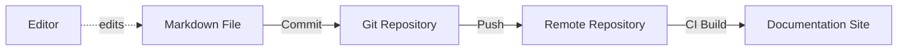
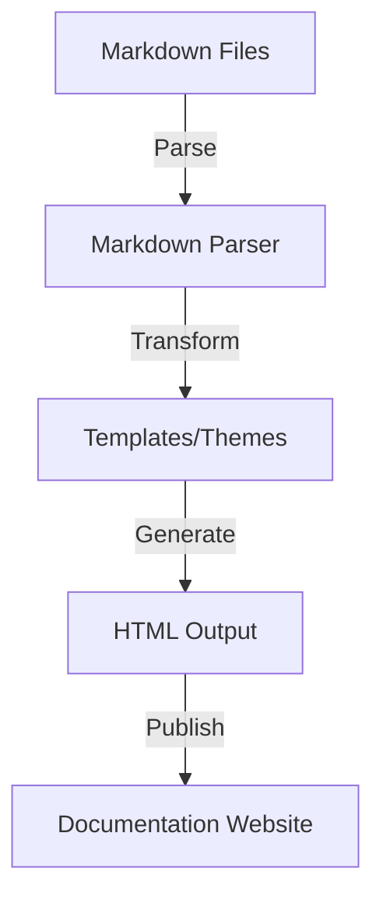
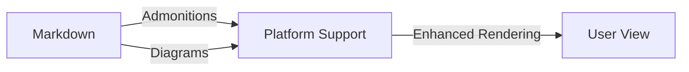

# Introduction

Technical documentation is an essential component of modern engineering workflows, ensuring that knowledge, process, and implementation details are consistently captured, maintained, and communicated. Among the various formats and tools available, **Markdown** has established itself as a lightweight, accessible, and maintainable syntax for authoring technical documentation. This document introduces Markdown in the context of technical documentation, examining its syntax, conventions, ecosystem integration, and best practices relevant to engineers.

---

## 1. Definition and Context

**Markdown** is a lightweight markup language for creating formatted text using a plain-text editor. Originally developed by John Gruber in collaboration with Aaron Swartz in 2004, it was designed to be easy to read and write, reflecting the most common formatting conventions found in email and plain text documentation.

Markdown is widely adopted in software engineering, open-source projects, and technical documentation due to its simplicity, human readability, and compatibility with version control systems. It enables engineers to focus on content without sacrificing formatting or portability, making it ideal for “Docs-as-Code” approaches where documentation is maintained alongside code.

### Location in the Technical Landscape

Markdown operates at the intersection of content creation, version control, and publication tooling. It is supported by major documentation generators (such as MkDocs, Docusaurus, and Sphinx with recommonmark), code repositories (such as GitHub, GitLab, and Bitbucket), and CI/CD pipelines.

---

## 2. Core Concepts and Syntax

### 2.1 Markup Elements

Markdown provides a set of simple syntactic rules to represent various document structures:

| Function        | Markdown Syntax                | Example Output                   |
|-----------------|-------------------------------|----------------------------------|
| Heading         | `#`, `##`, `###`, ...         | `# Heading 1`                    |
| Bold            | `**bold**` or `__bold__`      | **bold**                         |
| Italic          | `*italic*` or `_italic_`      | *italic*                         |
| List (unordered)| `* item` or `- item`          | • item                           |
| List (ordered)  | `1. item`                     | 1. item                          |
| Code (inline)   | `` `code` ``                  | `code`                           |
| Code block      | <code>```lang ... ```</code>  | (syntax highlighted block)        |
| Link            | `[label](url)`                | [label](url)                     |
| Image           | ``      |            |
| Blockquote      | `> quote`                     | > quote                          |

Markdown’s design intentionally omits features like advanced table formatting or footnotes, although extensions (such as GitHub-Flavored Markdown, GFM) add such capabilities.

#### Example: Basic Markdown Document

```markdown
# Project Overview

Welcome to **Project Alpha**.

## Features

* Easy to use
* Fast
* Reliable

## Usage

Run the following command:

```sh
./run-alpha
```
```

### 2.2 Markdown “Flavors” and Extensions

There is no single, formal Markdown specification. Multiple “flavors” have emerged:

- **Original Markdown:** The initial syntax as defined by Gruber.
- **CommonMark:** An open standard specification aiming to harmonize Markdown’s dialects.
- **GitHub-Flavored Markdown (GFM):** Adds tables, task lists, strikethrough, and autolinks.

Other tools and platforms may implement custom extensions (e.g., [^1] for footnotes, `:::note` blocks, embedded diagrams).

---

## 3. Markdown in Docs-as-Code Workflows

### 3.1 Integration into Version Control

Markdown’s plain text, line-oriented structure aligns well with distributed version control systems such as Git. This alignment enables effective change tracking, code reviews, branching, and merging of documentation alongside source code.


**Diagram:** Markdown-Based Docs-as-Code Workflow

### 3.2 Static Site Generators

Most modern documentation workflows rely on static site generators (SSGs) such as MkDocs, Hugo, or Jekyll to convert Markdown files into navigable HTML documentation.

- **Input:** Markdown files (*.md)
- **Processing:** SSG parses Markdown, applies templates/themes, resolves cross-references.
- **Output:** HTML/CSS/JS bundle, published to web servers or documentation portals.

SSGs typically support configuration for navigation structure, search, and linking.

### 3.3 Typical Engineering Workflow

1. Author or update Markdown files within a version-controlled repository.
2. Open a merge request (MR) or pull request (PR) for documentation changes.
3. Peer review and automated validation (e.g., Markdown linting) occur in CI.
4. Upon approval and merge, documentation is rebuilt and redeployed automatically.

### 3.4 Constraints and Considerations

- **Line breaks:** Markdown’s handling of newlines can differ by flavor.
- **Content modularity:** Maintaining reusable content across files may require includes, supported variably.
- **Link management:** Relative links can break if files are moved; tooling may help track and rewrite.
- **Versioning:** Documentation versioning should align with code release cycles.

> **Note**
> For diagram-rich documentation, consider Markdown extensions or embed SVG assets as standard Markdown offers limited diagram support.

---

## 4. Architecture and Ecosystem Overview

### 4.1 Typical System Architecture


**Diagram:** High-Level Markdown Documentation Processing Architecture

### 4.2 Parsing and Rendering

Markdown content is parsed, transformed (optionally extended with plugins), and rendered as HTML or other output formats. Prominent open-source parsers include:

- **Python:** `markdown`, `mistune`
- **JavaScript:** `markdown-it`, `remark`
- **Go:** `blackfriday`

#### Standards and References

- **CommonMark Specification:** Defines parsing behavior for compatible Markdown implementations.
- **RFC 7763 (The text/markdown Media Type):** Defines a MIME type for Markdown.

---

## 5. Engineering Considerations

### 5.1 Maintainability

- Avoid complex constructs that impede readability.
- Opt for consistent style and file organization to reduce merge conflicts and cognitive load.

### 5.2 Automation and Linting

Tools such as `markdownlint`, `mdl`, and IDE plugins can:

- Enforce style consistency.
- Catch linking errors, heading structure issues, or common mistakes.
- Integrate into CI workflows for automatic validation.

> [!TIP]
> Incorporate Markdown linting in pre-commit hooks or CI pipelines to avoid style drift and reduce review overhead.

### 5.3 Extensibility

- Many platforms support embedding custom blocks (e.g., admonitions, callouts, diagrams) using fenced code or plugin syntaxes.
- Adhere to the most portable subset of Markdown where possible for broad compatibility.

### 5.4 Pitfalls

- **Ambiguity:** Varying interpretation of syntax (e.g., line breaks, nested lists) across renderers.
- **Feature Limitations:** Stock Markdown lacks complex table support, semantic annotations, or advanced cross-references.
- **Duplicate Content:** Lack of native include functionality can lead to content repetition.

> [!WARNING]
> Do not rely on non-standard Markdown extensions unless you fully control the publishing toolchain. Documentation may not render correctly outside your expected environment.

### 5.5 Integration Points

Markdown documentation may interact with:

- API documentation generators (e.g., Doxygen, Sphinx) for code/API references.
- Translation/localization pipelines.
- Knowledge bases or internal wikis.
- Continuous deployment tooling for seamless publishing.

---

## 6. Common Variations and Tooling

### 6.1 Enhanced Markdown (Admonitions, Diagrams, etc.)

Various documentation platforms support “enhanced” Markdown, adding:

- **Admonitions:** Special blocks for notes, warnings.
- **Table of Contents:** `[TOC]` or auto-generated structures.
- **Diagrams:** Embedded using fenced blocks, e.g., Mermaid, PlantUML.


**Diagram:** Markdown Extensions for Enhanced Documentation

### 6.2 Internationalization

Markdown by itself is encoding-agnostic (UTF-8 recommended); integration with translation workflows varies by platform.

### 6.3 Accessibility

Proper heading structure, lists, and link usage in Markdown facilitate accessible documentation sites after rendering to HTML.

> [!CAUTION]
> Ensure that embedded images, tables, and links include appropriate alternative text and descriptive labels for accessibility compliance.

---

## 7. Summary

Markdown has become a foundational technology for technical documentation. Its human-readable syntax, alignment with version control, and extensibility via static site generators enable maintainable, engineer-friendly documentation workflows.

Engineers adopting Markdown should be aware of flavor differences, renderer variability, and extensions supported by their documentation tooling. Careful application of best practices—including linting, clear structure, and compatibility—will foster sustainable, high-quality documentation suitable for engineering organizations of any scale.

---

[^1]: CommonMark and GFM provide support for footnotes as an extension.