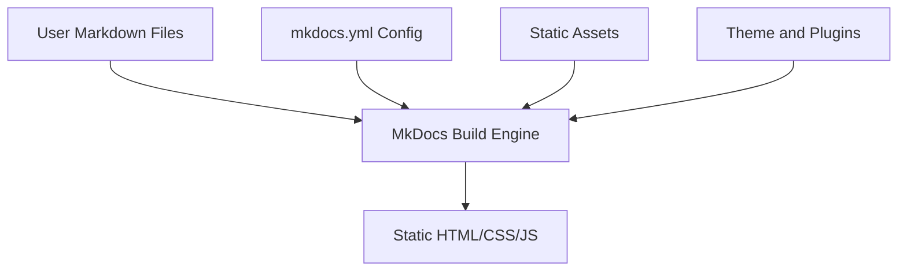
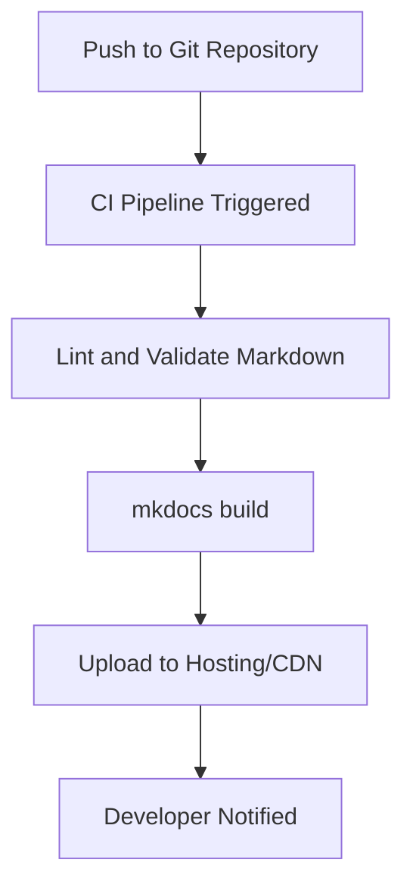

# MkDocs: A Technical Primer

## 1. Introduction

### 1.1 Definition and Context

**MkDocs** is an open-source static site generator (SSG) designed specifically for creating project documentation, using [Markdown](https://daringfireball.net/projects/markdown/) for content authoring and [YAML](https://yaml.org/) for configuration. As a core tool in the *Docs-as-Code* ecosystem, MkDocs bridges modern software development workflows with the requirements of comprehensive, maintainable technical documentation.

### 1.2 Purpose and Scope

MkDocs enables engineering teams to author documentation alongside source code, integrate documentation into version control, and deploy static documentation sites efficiently. Its focus on simplicity, developer ergonomics, and native Markdown support makes it a widely adopted choice for documentation websites, project wikis, and internal knowledge bases.

## 2. Core Concepts

### 2.1 Static Site Generation

**Static Site Generators** convert source files (often Markdown) and configuration into static HTML, CSS, and JavaScript files. The resulting site can be hosted on any static web server, requiring no specialized backend.

Key characteristics of static sites:
- **Performance**: Serving pre-rendered HTML is efficient and scales trivially via CDNs.
- **Security**: No dynamic content means reduced attack surface.
- **Simplicity**: Easy deployment and minimal maintenance overhead.

### 2.2 The Docs-as-Code Paradigm

*Docs-as-Code* treats documentation with the same rigor as source code:
- Documentation is stored in version control alongside code.
- Docs benefit from code review, CI/CD automation, and collaborative workflows.
- Toolchains integrate with developer practices (e.g., `git`, GitHub Actions).

### 2.3 Markdown for Content Authoring

MkDocs is *opinionated* about using Markdown. This reflects a strategy to minimize complexity for technical writers and engineers familiar with lightweight markup.

**Key Markdown attributes:**
- Human-readable plain text.
- Extensive ecosystem of editors and preview tools.
- Support for code blocks, hyperlinks, images, and basic formatting.

## 3. Architecture and Workflow

### 3.1 High-Level Architecture

MkDocs follows a straightforward architecture. The primary components are:

- **Markdown Source Files (`.md`)**
- **Configuration File (`mkdocs.yml`)**
- **Static Assets (e.g., images, CSS, JS)**
- **Themes and Plugins**
- **Build Engine (the MkDocs Python package)**

#### Mermaid Diagram: MkDocs Site Generation Pipeline



### 3.2 Configuration: `mkdocs.yml`

The central configuration file, `mkdocs.yml`, defines:
- Site name, navigation structure.
- Theme and plugin choices.
- Markdown extensions.
- Deployment parameters.

#### Example snippet

```yaml
site_name: "Example Project Documentation"
theme:
  name: "material"
nav:
  - Home: index.md
  - Getting Started: getting-started.md
  - Reference:
      - API: api.md
```

### 3.3 Themes and Extensions

**Theme system:**  
- Built-in themes (e.g., `mkdocs`, `readthedocs`).
- Third-party themes (e.g., `mkdocs-material`).
- Supports custom templates and overrides (Jinja2 templating).

**Markdown extensions:**  
- Standard (e.g., Table of Contents, Admonitions).
- Configurable via `mkdocs.yml`.

**Plugin architecture:**  
- Enables extensibility for search, versioning, macros, diagram support, and more.
- Plugins are Python packages that hook into MkDocs build steps.

### 3.4 Content Organization

- Markdown files arranged in a directory structure, mirrored in site navigation.
- Images and other assets referenced relative to Markdown sources.
- Navigation controlled via the `nav:` section in `mkdocs.yml`.

### 3.5 Build and Serve

MkDocs provides:
- `mkdocs build`: Generates the static site under the `site/` directory.
- `mkdocs serve`: Runs a local dev server with live preview and hot reload.

This local build–serve workflow aligns with coding practices, enabling testable, previewable documentation before deployment.

#### Mermaid Diagram: MkDocs Build and Serve Workflow

```mermaid
flowchart LR
    Start[Author Documentation]
    Edit[Edit Markdown/YAML]
    Review[Preview Locally (mkdocs serve)]
    Validate[Fix Formatting/Errors]
    Build1[mkdocs build]
    Output[Static Site (site/)]
    Deploy[Deploy to Web Server]
    Start --> Edit --> Review
    Review --> Validate
    Validate -->|Iterate| Edit
    Validate --> Build1
    Build1 --> Output --> Deploy
```

## 4. Key Features and Components

### 4.1 Navigation and Structure

- **Explicit navigation**: Defined in `mkdocs.yml`.
- **Automatic sectioning**: Directory-based organization for nested documentation.
- **Table of Contents**: Generated automatically from Markdown headings.

### 4.2 Theming and Customization

- **Flexible themes**: Style guides align with corporate branding.
- **Custom CSS/JS**: Additional per-project assets supported.
- **Template overrides**: Fine-grained control over page rendering.

### 4.3 Plugins

- **Search (mkdocs-search, lunr.js):** Full-text client-side search.
- **Versioning (mkdocs-versioning):** Document multiple releases.
- **Diagramming (mkdocs-mermaid2-plugin):** Native embedding for technical diagrams.

### 4.4 Markdown Extensions

- **Admonitions**: Info boxes for notes, tips, warnings.
- **CodeHilite**: Syntax highlighting for code blocks.
- **AutoStructify**: Autogenerates section anchors.
- **Math support**: e.g., via `pymdownx.arithmatex`.

### 4.5 Preview and Hot Reload

- **Live preview**: `mkdocs serve` reflects changes instantly.
- **Error reporting**: Syntax errors in configuration or source files surfaced in CLI output.

### 4.6 Deployment Integrations

- **GitHub Pages**: Powerful `gh-deploy` command for deploying directly via Git.
- **Custom servers/CDNs**: Simply upload `site/` output directory.
- **CI/CD workflows**: Pipelined builds via GitHub Actions, GitLab CI, Bamboo, Jenkins, etc.

## 5. Practical Implementation

### 5.1 Typical Project Structure

```
project-root/
├── docs/
│   ├── index.md
│   ├── getting-started.md
│   ├── reference/
│   │   └── api.md
│   └── img/
├── mkdocs.yml
└── requirements.txt
```

### 5.2 Developing Documentation

- Documentation development can occur on isolated feature branches.
- Peer review via pull requests is facilitated as all docs are plain text.
- Static asset changes are easily tracked via source control.

### 5.3 Build & Deployment

1. Author or modify Markdown files.
2. Preview using `mkdocs serve`.
3. On branch merge, CI pipeline runs `mkdocs build`, generating the static site.
4. Push `site/` contents to hosting platform (e.g., S3, GitHub Pages).

### 5.4 Tooling and Automation

- **Pre-commit hooks** for Markdown linting (e.g., `markdownlint`).
- **Continuous integration** for validating and deploying docs.
- **Automated version bumping or changelogs** via other tools.

#### Mermaid Diagram: CI/CD Pipeline for MkDocs



## 6. Engineering Considerations

### 6.1 Integration Points

- **Source control integration**: Designed for seamless use within Git repositories, branches, and tags.
- **Automation and scripting**: Python-based, easily scriptable for custom builds.
- **Plugin system** allows for custom content transformations and build-time hooks.

### 6.2 Performance Implications

- **Build time**: Scales linearly with documentation volume; rarely a bottleneck unless site is very large (>1000 pages).
- **Site performance**: Static HTML loads rapidly; use of images/media should be optimized.
- **Search indexing**: Client-side search engines (Lunr.js) may increase bundle size for very large sites.

### 6.3 Common Issues and Pitfalls

> **Warning**
>
> Large static sites (>10,000 pages) may hit browser/local search index performance limits or result in long build times. Consider splitting documentation or disabling client search in extreme cases.

> **Note**
>
> Theme/plugin updates may break compatibility. Pin versions in `requirements.txt` and test regularly.

> **Tip**
>
> For multilingual docs, use plugins or separate builds rather than complex single-source trees.

- **YAML syntax errors**: Indentation and data structure issues are a frequent source of build failures.
- **Broken links**: Not detected at build time by default; use plugins to validate.
- **Asset management**: Large or binary assets should be stored externally and referenced via links.

### 6.4 Security

- Serving static files minimizes security footprint.
- If embedding dynamic content (e.g., commenting systems), review and control external scripts.

### 6.5 Extensibility and Customization

- The plugin API enables pre- and post-processing of Markdown.
- Custom themes can be developed to comply with unique branding or accessibility standards.

## 7. Standards, Protocols, and Specifications

- **Markdown**: [CommonMark](https://commonmark.org/), [GitHub Flavored Markdown Specification](https://github.github.com/gfm/)
- **YAML**: YAML 1.2 Specification
- **HTML, CSS, JS**: Output adheres to standard W3C specifications.
- **Jinja2 Templating**: For theme overrides.

## 8. Common Variations

- **Material for MkDocs**: A popular third-party theme with extensive options ("Material Design" styling, dark mode, built-in diagram, and search extensions).
- **Custom build hooks**: Integration with other build systems (Make, Task, Nix, etc.).
- **Hybrid workflows**: Embedding MkDocs-generated docs in larger static sites or micro-frontends.
- **Containerization**: Distribution of MkDocs and themes in Docker containers for consistency across teams.

## 9. Constraints and Assumptions

- Not suitable for websites requiring dynamic content generation at runtime (e.g., user logins, personalized data).
- Markdown-based: limited to features expressible in Markdown (custom plugins can increase capability, but at the cost of complexity).
- Generally stateless; no backend integration unless using external APIs via client-side JavaScript.

## 10. Summary

MkDocs is an efficient, markdown-centric static site generator tailored for technical documentation in the context of "Docs-as-Code." Its architecture is simple and modular, leveraging Markdown, YAML, and the Python ecosystem. With extensive theming, plugin support, and robust local and CI/CD workflows, it enables cohesive engineering documentation practices.

While there are constraints regarding scale and dynamic content, MkDocs excels in maintainability, developer adoption, and cost-effective hosting, making it a standard choice for modern engineering teams seeking to document their systems alongside their source code.