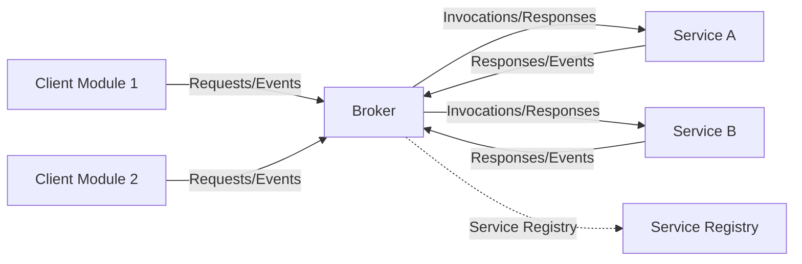
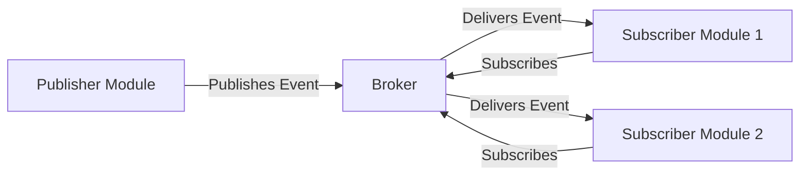
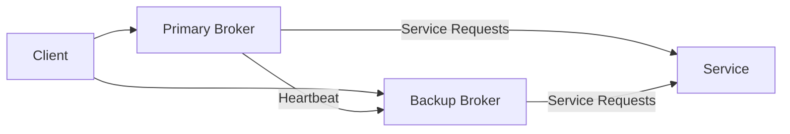

# Broker Pattern (Embedded)

## 1. Introduction

The Broker Pattern is an architectural paradigm that facilitates communication between distributed or modular components (clients and services) by decoupling the sender of a request from its receiver using a message broker. In embedded systems, this pattern is essential for scalability, maintainability, and manageability, especially in complex or resource-constrained environments where components must remain loosely coupled.

Borrowed from distributed systems and enterprise architectures (e.g., Message-Oriented Middleware), the Broker Pattern adapts well to embedded contexts by providing a flexible foundation for message routing, service discovery, and dynamic composition of applications. Protocols such as MQTT, DDS, AMQP, and in-house lightweight variants are often used in industrial embedded contexts, though the pattern itself is technology-agnostic.

## 2. Conceptual Overview

The core idea of the Broker Pattern is to interpose a broker component between clients (service requesters) and services (service providers). The broker manages all communications, routing messages or service invocations between decoupled components without requiring direct references.

This design ensures that component modules (e.g., sensor management, control loops, communication stacks) do not require knowledge of each other's identities or interfaces, thereby minimizing compile-time and run-time dependencies.

### Key Characteristics

- **Loose Coupling:** Clients and services interact solely through the broker, facilitating independent development and updates.
- **Centralized Message Routing:** The broker manages message delivery, optionally ensuring serialization, queuing, prioritization, and filtering.
- **Service Abstraction:** Functions and resources are abstracted as services registered with the broker; clients invoke services by requesting them from the broker.
- **Flexibility:** New services or clients can be integrated without refactoring core logic in existing modules.
- **Dynamic Configuration:** Service registration and discovery can happen at initialization or at runtime, supporting reconfigurable systems.

## 3. Core Components

The canonical Broker Pattern architecture in embedded systems typically comprises the following constituents:

- **Broker:** Acts as the message mediator, responsible for registration, message routing, and sometimes arbitration or transformation.
- **Clients:** Components that send requests or consume services.
- **Services:** Components or modules that provide functionality to clients via the broker.
- **Service Registry:** An (optional or implicit) catalog within the broker where available services are registered and discovered.
- **Communication Bus:** The underlying medium for delivering messages; can be software (function calls, IPC) or hardware (CAN, SPI, UART).

### Mermaid Block Diagram: Broker Pattern (Embedded)



## 4. Operational Workflow

### a. Service Registration

On initialization, each service module registers itself with the broker, typically providing:

- Service identifier (e.g., string, numeric ID)
- Service descriptor (metadata, protocol, message types, capabilities)
- Service invocation handler (function pointer, callback, object reference)

Registration may be static (compile-time tables) or dynamic (run-time discovery/advertisement).

### b. Message Routing

Clients issue requests (or events) to the broker, which determines the appropriate recipient(s) using the registry.

- **Request Handling:** The broker matches a client's request to the corresponding service handler.
- **Invocation and Response:** Depending on the interaction paradigm (synchronous, asynchronous), the broker forwards requests and delivers responses.
- **Event Distribution:** For event-driven designs, the broker may broadcast, multicast, or unicast events based on subscription patterns.

### c. Decoupled Composition

By mediating interactions, the broker facilitates substitution and composition:

- Services can be added, replaced, or removed with minimal impact.
- Multiple clients can consume the same service simultaneously (or vice versa).
- Communication protocols can be changed without altering business logic.

### d. Variation: Publish/Subscribe via Broker

A common variation, especially in event-driven or real-time embedded systems, is the broker serving as a pub/sub mediator. Subscribers register interest in message types; the broker ensures delivery.



## 5. Architecture Variants

While the broker can be a simple, centralized component, there are notable variants:

- **Centralized Broker:** Singular broker instance manages all communication (simplifies design but introduces a single point of failure and performance bottlenecks).
- **Hierarchical Brokers:** Brokers networked in a tree/hierarchy (e.g., domain segmentation for scalability).
- **Distributed Brokers:** Peer brokers collaborating to route messages, improving reliability and scalability at the cost of more complex discovery and routing.
- **Brokerless Modes:** Some systems allow for direct peer-to-peer fallback if the broker is unavailable.

Selection depends on system requirements, real-time constraints, fault tolerance, and resource budgets.

## 6. Relevant Protocols and Standards

While the pattern is architectural, several protocols embody brokered designs for embedded and IoT systems:

- **MQTT (ISO/IEC PRF 20922):** Lightweight pub/sub brokered messaging suitable for resource-limited devices.
- **DDS (Data Distribution Service, OMG standard):** Real-time, scalable pub/sub with brokers and peer-to-peer options.
- **AMQP (Advanced Message Queuing Protocol):** Enterprise-grade pub/sub and queued messaging, applicable to larger embedded systems.
- **CANopen and DeviceNet:** Fieldbus protocols incorporating broker-like network management.

Each protocol may impose additional constraints or structural details on how the broker is implemented.

## 7. Engineering Considerations

### a. Performance Implications

- **Latency/Messaging Overhead:** Introducing a broker adds indirection, potentially increasing latency or reducing throughput. Lightweight implementations and optimized IPC are essential in real-time contexts.
- **Resource Utilization:** Brokers consume CPU, memory, and potentially bus bandwidth; in microcontroller-based systems, footprint must be minimized.
- **Scalability:** Centralized brokers may limit scale as workloads or number of participants grow.

### b. Fault Tolerance and Reliability

A broker may represent a single point of failure. To mitigate:

- Use failover brokers or redundancy.
- Implement keep-alive and heartbeat monitoring.
- Isolate critical services from broker failure where necessary.



### c. Real-Time Constraints

For systems with strict real-time guarantees:

- Ensure deterministic broker scheduling/processing.
- Avoid dynamic memory allocation where possible.
- Limit or bound message queues.

> ⚠️ **Caution:**  
> In hard real-time embedded systems, brokered messaging architectures may violate temporal guarantees if not carefully engineered for determinism.

### d. Implementation Pitfalls

- **Improper Service Registration:** Race conditions or memory leaks in dynamic registration.
- **Unbounded Queues:** Risk of resource exhaustion under bursty loads.
- **Opaque Error Propagation:** Broker abstraction can obscure fault localization and reporting.
- **Lock Contention/Concurrency:** Improper synchronization in broker internals can degrade system behavior.

### e. Security Concerns

- Brokers can be attractive attack vectors; incorporate authentication, authorization, and isolation as appropriate—even in embedded domains.

## 8. Use Cases

Common embedded system scenarios that benefit from the Broker Pattern:

- **IoT Gateways:** Managing diverse sensors/actuators across protocols (e.g., Zigbee, BLE, Wi-Fi).
- **Industrial Automation:** Route commands between control logic, operator interfaces, and field devices.
- **Automotive ECUs:** Message brokering between different vehicle subsystems across CAN or automotive Ethernet.
- **Robotics:** Decoupling high-level planners from motor controllers, sensor managers, and teleoperation clients.

## 9. Example: Minimal Broker Implementation Sketch

A minimal static broker (C-like pseudocode) for synchronous service invocation:

```c
#define MAX_SERVICES 8

typedef int (*service_handler_t)(void *req, void *resp);

typedef struct {
    uint16_t service_id;
    service_handler_t handler;
} service_registry_entry_t;

static service_registry_entry_t registry[MAX_SERVICES];

int broker_register_service(uint16_t id, service_handler_t handler) {
    for (int i = 0; i < MAX_SERVICES; ++i) {
        if (registry[i].handler == NULL) {
            registry[i].service_id = id;
            registry[i].handler = handler;
            return 0;
        }
    }
    return -1; // Registry full
}

int broker_invoke_service(uint16_t id, void *req, void *resp) {
    for (int i = 0; i < MAX_SERVICES; ++i) {
        if (registry[i].service_id == id && registry[i].handler != NULL) {
            return registry[i].handler(req, resp);
        }
    }
    return -1; // Service not found
}
```

*Note: For asynchronous/event-driven patterns, use event queues or pub/sub mechanisms.*

## 10. Common Variations and Enhancements

- **Typed Message APIs:** Strong typing for service requests/responses.
- **Priority Queuing:** Real-time priority-based message handling.
- **Dynamic Service Discovery:** Using service announcement and query at runtime.
- **Message Transformation/Filtering:** Broker performs pre-processing or security checks.
- **Acknowledgement Protocols:** Ensures message delivery or service invocation success.

## 11. Integration with Other Patterns

The Broker Pattern often integrates with:

- **Event-Driven Architecture:** Broker as an event bus.
- **Client-Server Model:** Complementary to tightly coupled request/reply designs.
- **State Machines:** Decouple business logic transitions from external message reception.

## 12. Summary Table: Broker Pattern Attributes

| Attribute        | Description                                            |
|------------------|-------------------------------------------------------|
| Decoupling       | Strong, via indirect communication                    |
| Interaction      | Synchronous/Asynchronous, Request/Reply or Pub/Sub    |
| Overhead         | Broker introduces computational/message indirection   |
| Scalability      | Limited by broker implementation and resource budget  |
| Modularity       | High, supports plug-and-play composition              |
| Real-Time Suitability | Requires careful design and implementation      |
| Security         | Centralization may aid or hinder, depends on controls |

## 13. Conclusion

The Broker Pattern is a foundational architectural strategy in the design of complex embedded systems, delivering strong decoupling and flexibility through centralized message routing and service abstraction. Effective use of the pattern enables scalable, modular, and maintainable system architectures but demands careful engineering to manage performance, real-time, and reliability requirements.

Engineers should carefully assess broker design choices, select appropriate protocols, and rigorously evaluate broker impacts on system constraints before adoption. In safety- and real-time-critical embedded domains, extra scrutiny must be applied to ensure that the benefits of decoupling do not come at the expense of predictability, resource control, or fault isolation.